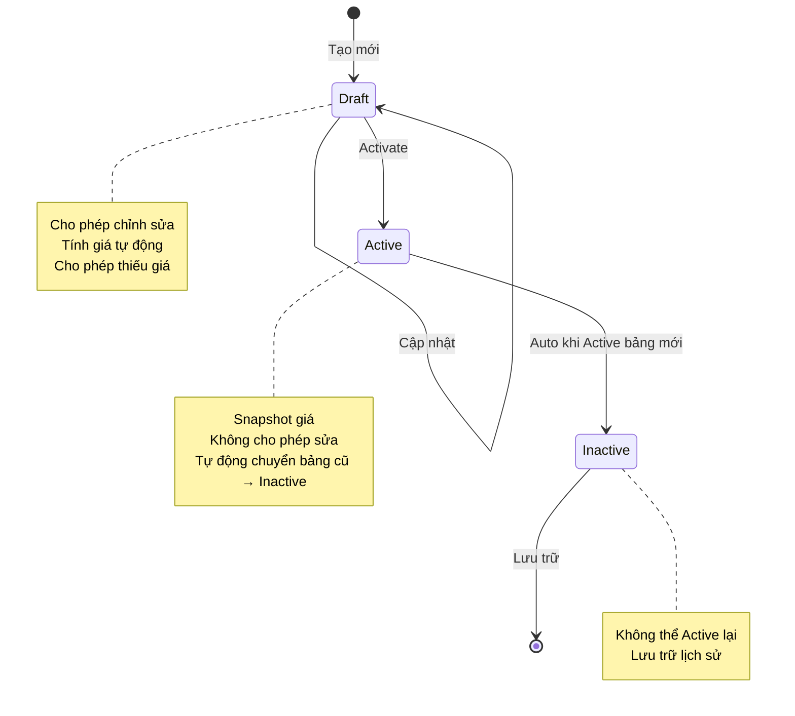
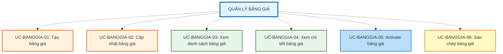

# QUẢN LÝ BẢNG GIÁ (PRICE LIST MANAGEMENT)

## Tổng quan Module

Chức năng "Quản lý Bảng Giá" cung cấp khả năng thiết lập và quản lý các bảng giá nguyên liệu - tập hợp giá mua vào và bán ra áp dụng tại một thời điểm cụ thể cho từng loại hàng hóa (Vàng ta, Vàng tây, Bạc, v.v.) trong hệ thống POS.

---

## 1. MÔ TẢ CHỨC NĂNG

### 1.1. Mục tiêu
- **Quản lý giá theo thời điểm**: Tạo lập và lưu trữ bảng giá cho từng thời điểm kinh doanh cụ thể
- **Tính toán giá tự động**: Hệ thống tự động tính giá cho mã giá kế thừa dựa trên hệ số và giá gốc
- **Đảm bảo tính toàn vẹn**: Snapshot giá tại thời điểm Active, không bị ảnh hưởng bởi thay đổi hệ số sau này
- **Kiểm soát trạng thái**: Quản lý vòng đời bảng giá qua các trạng thái Draft → Active → Inactive
- **Duy trì tính nhất quán**: Đảm bảo mỗi loại bảng giá chỉ có duy nhất 1 bảng Active tại một thời điểm

### 1.2. Phạm vi áp dụng
- **Đối tượng quản lý**: Bảng giá nguyên liệu cho các loại hàng hóa (Vàng ta, Vàng tây, Bạc, v.v.)
- **Ràng buộc nghiệp vụ**: Sử dụng Mã giá (Price Code) đã được thiết lập trong module Quản lý Mã giá
- **Phạm vi tác động**: Ảnh hưởng trực tiếp đến giá mua/bán trong các giao dịch nghiệp vụ

### 1.3. Định nghĩa
**Bảng giá nguyên liệu** là tập hợp giá mua vào và bán ra áp dụng tại một thời điểm cho một loại hàng hóa cụ thể.

**Cấu trúc Bảng giá** bao gồm:
- Tên bảng giá
- Loại bảng giá (Vàng ta, Vàng tây, Bạc, v.v.)
- Thời gian áp dụng (ngày giờ)
- Danh sách giá cho từng Mã giá:
  - Mã giá (Price Code)
  - Giá mua vào
  - Giá bán ra
- Trạng thái (Draft / Active / Inactive)

**Cơ chế tính giá:**
- **Mã giá độc lập**: Nhập giá trực tiếp
- **Mã giá kế thừa**: Tự động tính theo công thức
  ```
  Giá mua vào = Giá mua vào Base × Hệ số mua
  Giá bán ra = Giá bán ra Base × Hệ số bán
  ```

**Snapshot mechanism:**
- Khi Activate: Hệ thống snapshot toàn bộ giá tại thời điểm Activate
- Sau khi Active: Bảng giá không thể chỉnh sửa, không phụ thuộc vào thay đổi hệ số trong tương lai

---

## 2. TRẠNG THÁI BẢNG GIÁ

### 2.1. Luồng trạng thái



### 2.2. Ràng buộc trạng thái

| Trạng thái | Mô tả | Thao tác cho phép |
|------------|-------|-------------------|
| **Draft** | Bảng giá đang soạn thảo | - Cập nhật giá<br>- Tính toán giá tự động<br>- Activate (nếu đủ điều kiện)<br>- Xóa |
| **Active** | Bảng giá đang áp dụng | - Xem chi tiết<br>- Sao chép<br>- Hệ thống tự chuyển → Inactive khi Active bảng mới |
| **Inactive** | Bảng giá đã lưu trữ | - Xem chi tiết<br>- Sao chép<br>- **Không thể** Active lại |

**Quy tắc quan trọng:**
- ❌ **Không được phép** chuyển từ Inactive về Active
- ✅ Một loại bảng giá chỉ có **duy nhất 1 bảng Active** tại một thời điểm
- ⚡ Khi Activate bảng giá mới → Hệ thống **tự động** chuyển bảng Active cũ sang Inactive

---

## 3. TÁC NHÂN (ACTORS)

| Tác nhân | Vai trò | Quyền hạn |
|----------|---------|-----------|
| **Admin** | Người quản lý toàn bộ hệ thống bảng giá | - Tạo, cập nhật bảng giá Draft<br>- Nhập giá cho mã giá độc lập<br>- Activate bảng giá<br>- Xem danh sách và chi tiết bảng giá<br>- Sao chép bảng giá |
| **Nhân viên** | Người xem và sử dụng bảng giá | - Xem danh sách bảng giá Active<br>- Xem chi tiết bảng giá<br>- Sử dụng bảng giá trong giao dịch |
### 3.1. Ma trận Phân quyền Actor

| Use Case | Admin | Nhân viên | Ghi chú |
|----------|-----|---------|---------|
| **UC-BANGGIA-01: Tạo bảng giá** | ✅ | ❌ | Chỉ Admin có quyền tạo bảng giá mới |
| **UC-BANGGIA-02: Cập nhật bảng giá** | ✅ | ❌ | Chỉ Admin có quyền nhập/cập nhật giá |
| **UC-BANGGIA-03: Xem danh sách bảng giá** | ✅ | ✅* | *Nhân viên chỉ xem được bảng giá Active |
| **UC-BANGGIA-04: Xem chi tiết bảng giá** | ✅ | ✅ | Cả hai có quyền xem chi tiết |
| **UC-BANGGIA-05: Activate bảng giá** | ✅ | ❌ | Chỉ Admin có quyền kích hoạt bảng giá |
| **UC-BANGGIA-06: Sao chép bảng giá** | ✅ | ❌ | Chỉ Admin có quyền sao chép |

**Chú thích:**
- ✅ = Có quyền thực hiện
- ❌ = Không có quyền thực hiện
- ✅* = Có quyền với giới hạn (xem ghi chú)
---

## 4. DANH SÁCH USE CASE

### 4.1. Tổng quan Use Case



---

## 5. CẤU TRÚC TÀI LIỆU

### Use Cases (Tính năng nghiệp vụ)
- **UC-BANGGIA-01: Tạo bảng giá** - Tạo bảng giá mới ở trạng thái Draft
- **UC-BANGGIA-02: Cập nhật bảng giá** - Nhập/cập nhật giá cho các mã giá (chỉ Draft)
- **UC-BANGGIA-03: Xem danh sách bảng giá** - Lọc, tìm kiếm và hiển thị danh sách bảng giá
- **UC-BANGGIA-04: Xem chi tiết bảng giá** - Xem thông tin đầy đủ của một bảng giá
- **UC-BANGGIA-05: Activate bảng giá** - Kích hoạt bảng giá để áp dụng (tự động chuyển bảng cũ → Inactive)
- **UC-BANGGIA-06: Sao chép bảng giá** - Tạo bảng giá mới từ bảng giá có sẵn

---

## 6. BUSINESS RULE (Quy tắc nghiệp vụ)

### ⭐ Tính năng nổi bật
- ✅ **Tính giá tự động**: Mã giá kế thừa được tính tự động theo công thức từ mã giá gốc
- ✅ **Snapshot mechanism**: Giá được snapshot khi Activate, không bị ảnh hưởng bởi thay đổi hệ số sau này
- ✅ **Auto-transition**: Tự động chuyển bảng Active cũ → Inactive khi Activate bảng mới
- ✅ **Cho phép thiếu giá**: Lưu được bảng giá chưa đủ giá (có cảnh báo), nhưng phải đủ giá mới Activate
- ✅ **Tính giá theo chuỗi kế thừa**: Hỗ trợ nhiều cấp kế thừa (A → B → C)
- ✅ **Sao chép thông minh**: Giá kế thừa được tính lại theo hệ số hiện tại khi sao chép

### 🔒 Ràng buộc quan trọng
- ❌ **Không thể Active lại** bảng giá Inactive
- ❌ **Chỉ 1 bảng Active** cho mỗi loại bảng giá tại một thời điểm
- ❌ **Không thể sửa** bảng giá đã Active
- ⚠️ **Phải đủ giá** mới được Activate (tùy cấu hình doanh nghiệp)
- ⚠️ Bảng giá Active cũ **tự động chuyển Inactive** khi Activate bảng mới
- ⚠️ Giá của mã giá kế thừa **tự động tính lại** khi giá mã giá gốc thay đổi (chỉ Draft)

### 📋 Cảnh báo Hệ thống

**Khi lưu bảng giá thiếu giá:**
> "Bảng giá đang thiếu giá cho các mã giá sau:  
> - PC-001 (Nhẫn vàng 24K): Thiếu giá mua vào  
> - PC-003 (Dây chuyền SJC): Thiếu giá bán ra  
> 
> Bạn có muốn tiếp tục lưu?"

**Khi Activate mà chưa đủ giá:**
> "Không thể Activate bảng giá.  
> Vui lòng nhập đầy đủ giá mua vào và bán ra cho tất cả mã giá."

**Khi Activate bảng giá mới:**
> "Activate bảng giá này sẽ tự động chuyển bảng giá Active hiện tại '[Tên bảng cũ]' sang trạng thái Inactive.  
> Bạn có chắc chắn muốn tiếp tục?"

---

## 7. CƠ CHẾ TÍNH GIÁ

### 7.1. Trong trạng thái Draft

**Khi nhập/thay đổi giá của Mã Giá gốc:**
```
Mã giá PC-001 (gốc):
  Giá mua vào = 70,000,000 VND
  Giá bán ra = 71,000,000 VND

Mã giá PC-002 (kế thừa PC-001):
  Hệ số mua = 0.98
  Hệ số bán = 1.02
  
  → Giá mua vào = 70,000,000 × 0.98 = 68,600,000 VND (tự động)
  → Giá bán ra = 71,000,000 × 1.02 = 72,420,000 VND (tự động)
```

**Kế thừa nhiều cấp:**
```
PC-001 (gốc):
  Giá mua = 70,000,000
  Giá bán = 71,000,000

PC-002 (kế thừa PC-001, hệ số mua = 0.98, hệ số bán = 1.02):
  Giá mua = 68,600,000
  Giá bán = 72,420,000

PC-003 (kế thừa PC-002, hệ số mua = 0.99, hệ số bán = 1.01):
  Giá mua = 68,600,000 × 0.99 = 67,914,000 (tự động)
  Giá bán = 72,420,000 × 1.01 = 73,144,200 (tự động)
```

### 7.2. Khi sao chép bảng giá

Giá của Mã Giá kế thừa được **tính lại** theo hệ số hiện tại, **không giữ snapshot** của bảng giá cũ.

**Ví dụ:**
```
Bảng giá cũ (được sao chép):
  PC-001: Giá mua = 70,000,000
  PC-002 (kế thừa PC-001): Giá mua = 68,600,000

Sau khi sao chép, nếu hệ số PC-002 đã thay đổi thành 0.97:
  PC-001: Giá mua = 70,000,000 (giữ nguyên)
  PC-002: Giá mua = 70,000,000 × 0.97 = 67,900,000 (tính lại theo hệ số mới)
```

### 7.3. Tại thời điểm Activate

- Hệ thống **snapshot** toàn bộ giá tại thời điểm Activate
- Sau khi Active:
  - **Không được chỉnh sửa**
  - **Không phụ thuộc** vào thay đổi hệ số trong tương lai
  - Bảng giá trở thành immutable (không thể thay đổi)

---

## 8. LIÊN HỆ & HỖ TRỢ

**Phiên bản:** v1.0  
**Cập nhật:** 04/03/2026  
**Nguồn:** BA-NOI.md  
**Module liên quan:** Quản lý Mã giá (Price Code Management)
