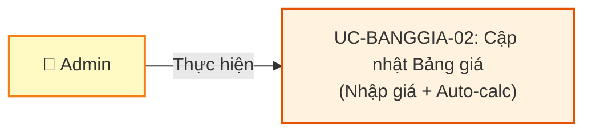
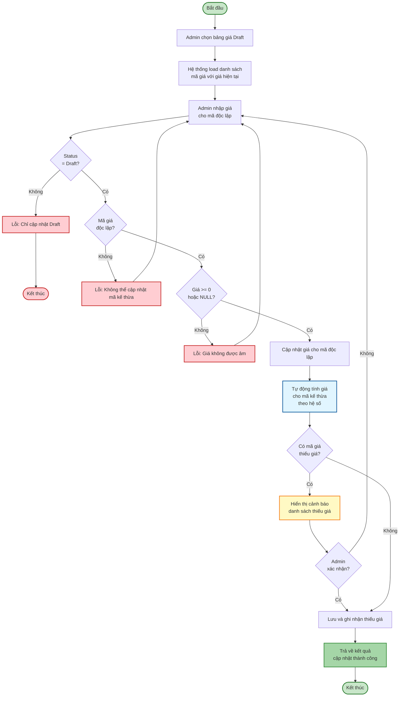
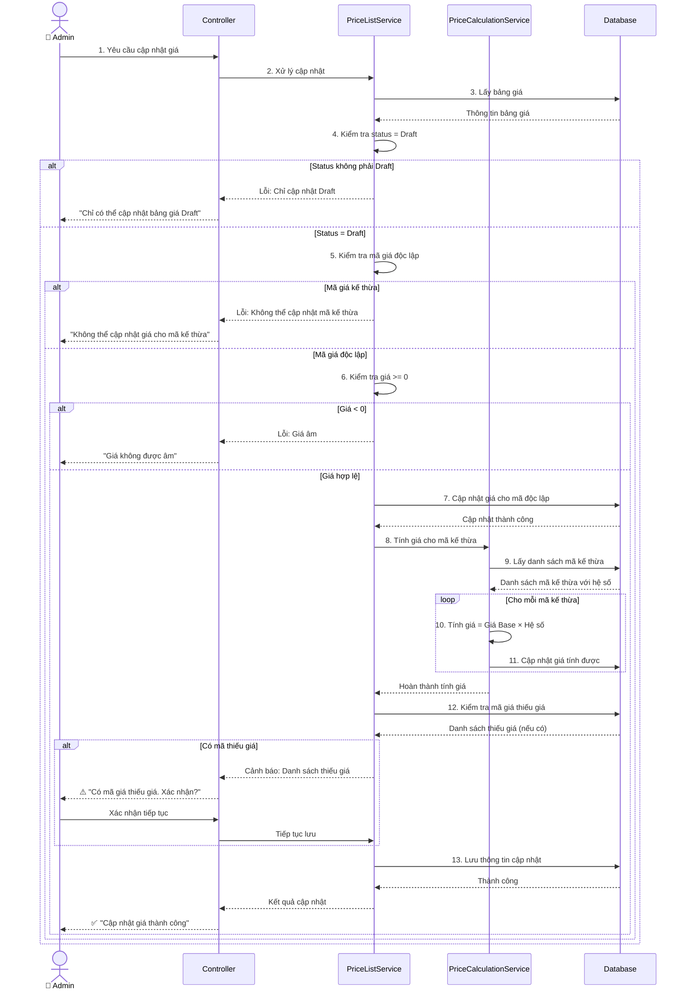
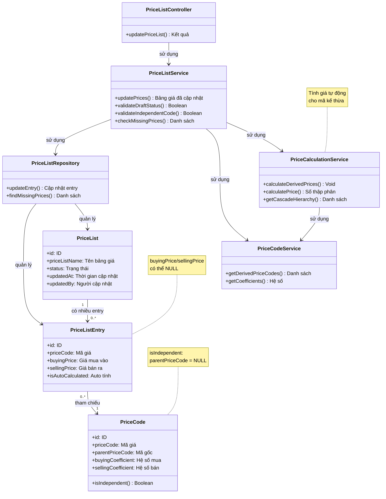

# Use Case UC-BANGGIA-02: Cập nhật Bảng giá

---

| **Use Case ID** | **UC-BANGGIA-02** |
|-----------------|------------------||
| **Use Case Name** | Cập nhật Bảng giá |
| **Description** | Use Case "Cập nhật Bảng giá" cho phép Admin nhập và chỉnh sửa giá cho các mã giá trong bảng giá ở trạng thái Draft. Hệ thống tự động tính giá cho các mã giá kế thừa dựa trên hệ số và giá gốc. |
| **Actor(s)** | Admin |
| **Priority** | Must Have |
| **Trigger** | Admin yêu cầu cập nhật giá trong bảng giá Draft |

---

## Input

| Tên trường | Loại | Bắt buộc | Mô tả | Ràng buộc |
|------------|------|----------|-------|-----------|
| `priceListId` | Số | Có | ID bảng giá cần cập nhật | Phải tồn tại, status = Draft |
| `priceEntries` | Danh sách | Có | Danh sách giá cần cập nhật | Ít nhất 1 entry |

**Cấu trúc mỗi entry trong `priceEntries`:**

| Tên trường | Loại | Bắt buộc | Mô tả | Ràng buộc |
|------------|------|----------|-------|-----------|
| `priceCode` | Văn bản | Có | Mã giá | Phải là mã giá độc lập (không kế thừa) |
| `buyingPrice` | Số thập phân | Không | Giá mua vào | >= 0, có thể NULL |
| `sellingPrice` | Số thập phân | Không | Giá bán ra | >= 0, có thể NULL |

---

## Output

### Trường hợp thành công:

| Tên trường | Loại | Mô tả |
|------------|------|-------|
| `id` | Số | ID bảng giá đã cập nhật |
| `priceListName` | Văn bản | Tên bảng giá |
| `updatedEntries` | Danh sách | Danh sách các entry đã cập nhật (bao gồm cả entry được tính tự động) |
| `updatedAt` | Ngày giờ | Thời gian cập nhật |
| `updatedBy` | Văn bản | Người cập nhật |
| `missingPrices` | Danh sách | Danh sách mã giá còn thiếu giá (nếu có) |

**Cấu trúc mỗi entry trong `updatedEntries`:**

| Tên trường | Loại | Mô tả |
|------------|------|-------|
| `priceCode` | Văn bản | Mã giá |
| `parentPriceCode` | Văn bản | Mã giá gốc (nếu có kế thừa) |
| `buyingCoefficient` | Số thập phân | Hệ số mua vào |
| `sellingCoefficient` | Số thập phân | Hệ số bán ra |
| `buyingPrice` | Số thập phân | Giá mua vào (có thể NULL) |
| `sellingPrice` | Số thập phân | Giá bán ra (có thể NULL) |
| `isAutoCalculated` | Boolean | true nếu giá được tính tự động |

**Cấu trúc mỗi item trong `missingPrices`:**

| Tên trường | Loại | Mô tả |
|------------|------|-------|
| `priceCode` | Văn bản | Mã giá thiếu giá |
| `missingBuyingPrice` | Boolean | true nếu thiếu giá mua |
| `missingSellingPrice` | Boolean | true nếu thiếu giá bán |

### Trường hợp lỗi:

| Mã lỗi | Thông báo | Mô tả |
|--------|-----------|-------|
| `PRICE_LIST_NOT_FOUND` | "Không tìm thấy bảng giá" | Bảng giá không tồn tại |
| `INVALID_STATUS` | "Chỉ có thể cập nhật bảng giá Draft" | Bảng giá không ở trạng thái Draft |
| `INVALID_PRICE_CODE` | "Mã giá không hợp lệ hoặc không thuộc bảng giá này" | Mã giá không tồn tại trong bảng |
| `CANNOT_UPDATE_DERIVED` | "Không thể cập nhật giá cho mã giá kế thừa" | Cố gắng nhập giá cho mã kế thừa |
| `NEGATIVE_PRICE` | "Giá không được âm" | Giá < 0 |

---

## Pre-Condition(s)

- Admin đã đăng nhập và có quyền cập nhật bảng giá
- Bảng giá tồn tại và có trạng thái Draft
- Mã giá cần cập nhật là mã giá độc lập (không kế thừa)

---

## Post-Condition(s)

- Giá của các mã giá độc lập được cập nhật theo input
- Giá của các mã giá kế thừa được tính lại tự động theo hệ số
- Hệ thống ghi nhận thông tin người cập nhật và thời gian cập nhật
- Nếu có mã giá thiếu giá, hệ thống trả về danh sách cảnh báo

---

## Basic Flow

1. Admin yêu cầu cập nhật giá cho bảng giá Draft
2. Admin chọn bảng giá cần cập nhật
3. Hệ thống hiển thị danh sách mã giá với thông tin:
   - Mã giá, Mã gốc (nếu có)
   - Hệ số mua vào, Hệ số bán ra
   - Thương hiệu, Loại vàng, Hàm lượng
   - Giá mua vào hiện tại
   - Giá bán ra hiện tại
4. Admin nhập/chỉnh sửa giá cho các mã giá độc lập
5. Hệ thống kiểm tra:
   - Bảng giá có status = Draft
   - Giá >= 0 (nếu nhập)
   - Chỉ cập nhật cho mã giá độc lập
6. Hệ thống cập nhật giá:
   - Lưu giá cho các mã giá độc lập
   - Tự động tính lại giá cho các mã giá kế thừa theo công thức:
     ```
     Giá mua vào Derived = Giá mua vào Base × Hệ số mua
     Giá bán ra Derived = Giá bán ra Base × Hệ số bán
     ```
   - Xử lý chuỗi kế thừa nhiều cấp (nếu có)
7. Hệ thống kiểm tra mã giá còn thiếu giá
8. Hệ thống trả về kết quả cập nhật với:
   - Danh sách entry đã cập nhật (kể cả auto-calculated)
   - Danh sách mã giá còn thiếu giá (nếu có)

Use case kết thúc.

---

## Alternative Flow

### 7a. Có mã giá thiếu giá

7a. Hệ thống phát hiện có mã giá chưa có đủ giá mua/bán

7a1. Hệ thống hiển thị cảnh báo với danh sách mã giá thiếu giá cụ thể

7a2. Admin xác nhận tiếp tục lưu hoặc quay lại chỉnh sửa

7a3. Nếu xác nhận tiếp tục → Hệ thống lưu và ghi nhận danh sách thiếu giá

7a4. Use case quay lại bước 8

---

## Exception Flow

### 5a. Bảng giá không ở trạng thái Draft

5a. Hệ thống phát hiện bảng giá có status khác Draft

5a1. Hệ thống trả về lỗi: "Chỉ có thể cập nhật bảng giá Draft. Bảng giá này đang ở trạng thái [Status]."

5a2. Use case kết thúc

### 5b. Cố gắng cập nhật mã giá kế thừa

5b. Hệ thống phát hiện Admin cố gắng nhập giá cho mã giá kế thừa

5b1. Hệ thống trả về lỗi: "Mã giá '[Mã giá]' kế thừa từ '[Mã gốc]'. Giá sẽ được tính tự động. Vui lòng cập nhật giá tại mã gốc."

5b2. Use case quay lại bước 4

### 5c. Giá âm

5c. Hệ thống phát hiện giá < 0

5c1. Hệ thống trả về lỗi: "Giá không được âm. Vui lòng nhập giá >= 0."

5c2. Use case quay lại bước 4

---

## Business Rules

### BR-BANGGIA-010: Chỉ cập nhật Draft

- Chỉ có thể cập nhật giá cho bảng giá ở trạng thái **Draft**
- Bảng giá **Active** và **Inactive** không thể chỉnh sửa
- Mục đích: Đảm bảo tính toàn vẹn của bảng giá đã áp dụng

### BR-BANGGIA-011: Chỉ nhập giá cho mã độc lập

- Admin chỉ được phép nhập giá cho **mã giá độc lập** (không kế thừa)
- Mã giá kế thừa có giá được **tính tự động** dựa trên hệ số
- Nếu cố gắng nhập giá cho mã kế thừa → Hệ thống từ chối

**Ví dụ:**
```
NHANVRTL (độc lập):
  ✅ Cho phép nhập: Giá mua = 85,000,000, Giá bán = 87,000,000

QTVRTL (kế thừa từ NHANVRTL):
  ❌ Không cho phép nhập giá trực tiếp
  ✅ Tự động tính: Giá mua = 85,000,000 × 1 = 85,000,000
```

### BR-BANGGIA-012: Tính giá tự động cho mã kế thừa

Khi cập nhật giá cho mã giá độc lập, hệ thống tự động tính lại giá cho tất cả mã giá kế thừa theo công thức:

```
Giá mua vào Derived = Giá mua vào Base × Hệ số mua
Giá bán ra Derived = Giá bán ra Base × Hệ số bán
```

**Ví dụ - Kế thừa 1 cấp:**
```
NHANVRTL (gốc):
  Giá mua: 85,000,000
  Giá bán: 87,000,000

QTVRTL kế thừa NHANVRTL (Hệ số mua = 1, Hệ số bán = 1):
  → Giá mua = 85,000,000 × 1 = 85,000,000
  → Giá bán = 87,000,000 × 1 = 87,000,000

MVRTL kế thừa NHANVRTL (Hệ số mua = 1, Hệ số bán = 1):
  → Giá mua = 85,000,000 × 1 = 85,000,000
  → Giá bán = 87,000,000 × 1 = 87,000,000
```

**Ví dụ - Kế thừa nhiều cấp:**
```
NHANVRTL (gốc):
  Giá mua: 85,000,000
  Giá bán: 87,000,000

MNVT9999 kế thừa NHANVRTL (Hệ số = 0.994):
  → Giá mua = 85,000,000 × 0.994 = 84,490,000
  → Giá bán = 87,000,000 × 0.994 = 86,478,000

Nếu có mã X kế thừa MNVT9999 (Hệ số = 0.99):
  → Giá mua = 84,490,000 × 0.99 = 83,645,100
  → Giá bán = 86,478,000 × 0.99 = 85,613,220
```

### BR-BANGGIA-013: Cho phép giá NULL

- Cho phép lưu giá = NULL (chưa nhập)
- Khi lưu với giá thiếu:
  - Hệ thống hiển thị danh sách mã giá thiếu giá mua hoặc giá bán
  - Admin phải xác nhận tiếp tục lưu
- Giá NULL sẽ không tính được giá cho mã kế thừa

**Ví dụ:**
```
NHANVRTL:
  Giá mua: 85,000,000
  Giá bán: NULL (chưa nhập)

QTVRTL kế thừa NHANVRTL:
  Giá mua: 85,000,000 × 1 = 85,000,000 ✅
  Giá bán: NULL × 1 = NULL ❌ (không tính được)

→ Cảnh báo: "QTVRTL thiếu giá bán"
```

### BR-BANGGIA-014: Cascade update

- Khi cập nhật giá của mã gốc → Tất cả mã kế thừa tính lại
- Cascade theo chuỗi kế thừa nhiều cấp
- Update ngay lập tức (real-time calculation)

**Ví dụ:**
```
Trước update:
  NHANVRTL: 85,000,000 / 87,000,000
  ├─ QTVRTL (×1): 85,000,000 / 87,000,000
  └─ MVRTL (×1): 85,000,000 / 87,000,000

Admin cập nhật NHANVRTL → 86,000,000 / 88,000,000

Sau update (tự động):
  NHANVRTL: 86,000,000 / 88,000,000
  ├─ QTVRTL (×1): 86,000,000 / 88,000,000 ✅ Auto
  └─ MVRTL (×1): 86,000,000 / 88,000,000 ✅ Auto
```

### BR-BANGGIA-015: Validate giá hợp lệ

- Giá phải >= 0 (không được âm)
- Giá có thể = 0 (trường hợp đặc biệt)
- Giá có thể = NULL (chưa nhập)

**Ví dụ:**
```
Hợp lệ:
  - 85,000,000 ✅
  - 0 ✅ (miễn phí)
  - NULL ✅ (chưa nhập)

Không hợp lệ:
  - -1,000 ❌ (âm)
  - -100,000 ❌ (âm)
```

---

## Diagrams

### 1. Use Case Diagram - UC-BANGGIA-02: Cập nhật Bảng giá



### 2. Activity Diagram - Luồng cập nhật giá



### 3. Sequence Diagram - Cập nhật giá với auto-calculation



**Giải thích Sequence Diagram:**

**Kiểm tra điều kiện (Bước 4-6):**
- Kiểm tra bảng giá ở trạng thái Draft
- Kiểm tra mã giá là độc lập (không kế thừa)
- Kiểm tra giá hợp lệ (>= 0 hoặc NULL)

**Cập nhật và tính toán (Bước 7-11):**
- Cập nhật giá cho mã độc lập
- PriceCalculationService tính giá cho mã kế thừa
- Cascade update theo chuỗi kế thừa

**Xử lý thiếu giá (Bước 12-13):**
- Kiểm tra mã giá còn thiếu giá
- Hiển thị cảnh báo và yêu cầu xác nhận
- Lưu kết quả

---

### 4. Class Diagram



Danh sách mã giá:
  1. NHANVRTL (độc lập): NULL / NULL
  2. QTVRTL (kế thừa NHANVRTL, Hệ số 1/1): NULL / NULL
  3. MVRTL (kế thừa NHANVRTL, Hệ số 1/1): NULL / NULL
  4. MNVT9999 (kế thừa NHANVRTL, Hệ số 0.994/0.994): NULL / NULL

Admin thực hiện:
1. Chọn bảng giá "Bảng giá vàng - 04/03/2026"
2. Nhập giá cho NHANVRTL:
   - Giá mua vào: 85,000,000
   - Giá bán ra: 87,000,000
3. Lưu

Hệ thống xử lý:
1. Cập nhật NHANVRTL: 85,000,000 / 87,000,000
2. Tự động tính giá cho mã kế thừa:
   
   QTVRTL (Hệ số 1/1):
     Giá mua: 85,000,000 × 1 = 85,000,000
     Giá bán: 87,000,000 × 1 = 87,000,000
   
   MVRTL (Hệ số 1/1):
     Giá mua: 85,000,000 × 1 = 85,000,000
     Giá bán: 87,000,000 × 1 = 87,000,000
   
   MNVT9999 (Hệ số 0.994/0.994):
     Giá mua: 85,000,000 × 0.994 = 84,490,000
     Giá bán: 87,000,000 × 0.994 = 86,478,000

Kết quả:
✅ Cập nhật thành công
  - 1 mã giá nhập trực tiếp
  - 3 mã giá tính tự động
  - Tất cả mã giá đã có đủ giá
```

### Scenario 2: Cập nhật giá và cascade update

```
Trạng thái hiện tại:
  NHANVRTL: 85,000,000 / 87,000,000
  ├─ QTVRTL (×1): 85,000,000 / 87,000,000
  ├─ MVRTL (×1): 85,000,000 / 87,000,000
  └─ MNVT9999 (×0.994): 84,490,000 / 86,478,000

Admin thực hiện:
1. Chỉnh sửa giá NHANVRTL:
   - Giá mua vào: 86,000,000 (tăng 1 triệu)
   - Giá bán ra: 88,000,000 (tăng 1 triệu)
2. Lưu

Hệ thống tự động tính lại:
  NHANVRTL: 86,000,000 / 88,000,000 ✅ (cập nhật)
  ├─ QTVRTL (×1): 86,000,000 / 88,000,000 ✅ (auto)
  ├─ MVRTL (×1): 86,000,000 / 88,000,000 ✅ (auto)
  └─ MNVT9999 (×0.994): 85,484,000 / 87,472,000 ✅ (auto)

Kết quả:
✅ Cập nhật giá thành công
  - Cập nhật trực tiếp: 1 mã giá
  - Tính lại tự động: 3 mã giá
```

### Scenario 3: Lưu với giá thiếu

```
Bảng giá: "Bảng giá vàng - 04/03/2026"
Status: Draft

Admin thực hiện:
1. Nhập giá cho NHANVRTL:
   - Giá mua vào: 85,000,000
   - Giá bán ra: NULL (chưa nhập)
2. Lưu

Hệ thống xử lý:
1. Cập nhật NHANVRTL: 85,000,000 / NULL
2. Tính giá cho mã kế thừa:
   - QTVRTL: 85,000,000 / NULL (giá bán không tính được)
   - MVRTL: 85,000,000 / NULL (giá bán không tính được)
   - MNVT9999: 84,490,000 / NULL (giá bán không tính được)

3. Phát hiện thiếu giá → Hiển thị cảnh báo:

⚠️ Cảnh báo: Các mã giá sau chưa có đủ giá:
  - NHANVRTL: Thiếu giá bán ra
  - QTVRTL: Thiếu giá bán ra
  - MVRTL: Thiếu giá bán ra
  - MNVT9999: Thiếu giá bán ra

Admin xác nhận: Tiếp tục lưu

Kết quả:
✅ Lưu thành công (với cảnh báo)
  - Ghi nhận: 4 mã giá thiếu giá bán
  - Trạng thái: Vẫn là Draft
  - Không thể Activate cho đến khi nhập đủ giá
```

### Scenario 4: Không thể cập nhật mã kế thừa

```
Admin thực hiện:
1. Chọn bảng giá Draft
2. Cố gắng nhập giá trực tiếp cho QTVRTL (mã kế thừa):
   - Giá mua vào: 86,000,000

Hệ thống kiểm tra:
  - QTVRTL kế thừa từ NHANVRTL
  - Không cho phép nhập giá trực tiếp

Kết quả:
❌ Lỗi: "Mã giá 'QTVRTL' kế thừa từ 'NHANVRTL'. 
         Giá sẽ được tính tự động theo hệ số. 
         Vui lòng cập nhật giá tại mã gốc 'NHANVRTL'."

Hướng dẫn:
→ Admin cần cập nhật giá tại NHANVRTL
→ Hệ thống sẽ tự động tính giá cho QTVRTL
```

### Scenario 5: Không thể cập nhật bảng giá Active

```
Bảng giá: "Bảng giá vàng - 03/03/2026"
Status: Active

Admin thực hiện:
1. Chọn bảng giá "Bảng giá vàng - 03/03/2026"
2. Cố gắng cập nhật giá

Hệ thống kiểm tra:
  - Bảng giá có status = Active
  - Không cho phép chỉnh sửa

Kết quả:
❌ Lỗi: "Chỉ có thể cập nhật bảng giá Draft. 
         Bảng giá này đang ở trạng thái Active."

Giải pháp:
→ Sử dụng UC-BANGGIA-06: Sao chép bảng giá → Tạo Draft mới
→ Cập nhật giá trong bảng Draft mới
→ Activate bảng mới (bảng cũ tự động chuyển Inactive)
```

---
