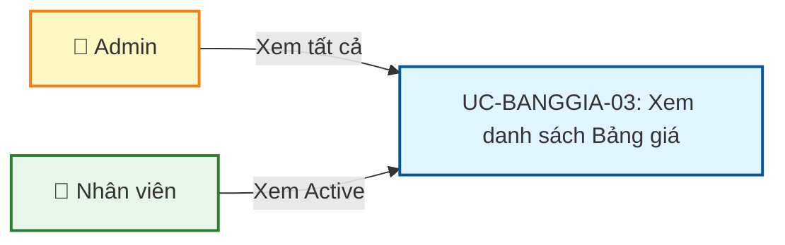
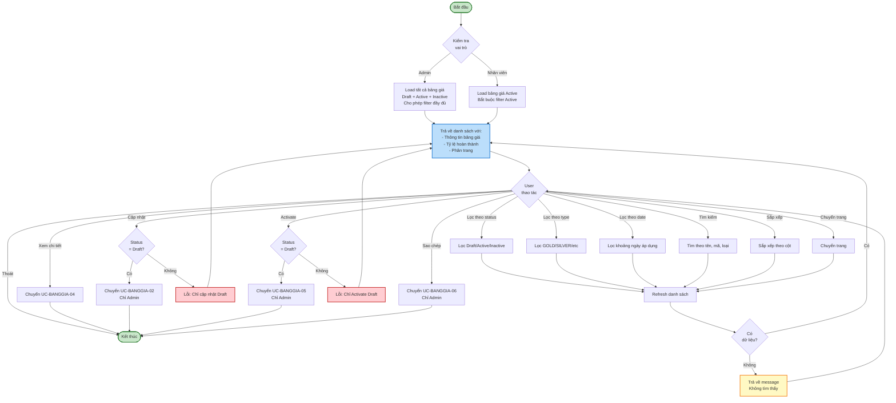
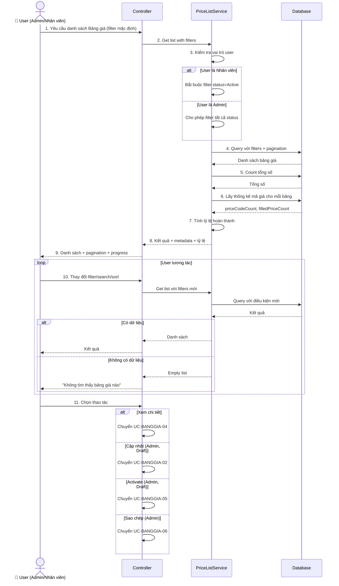
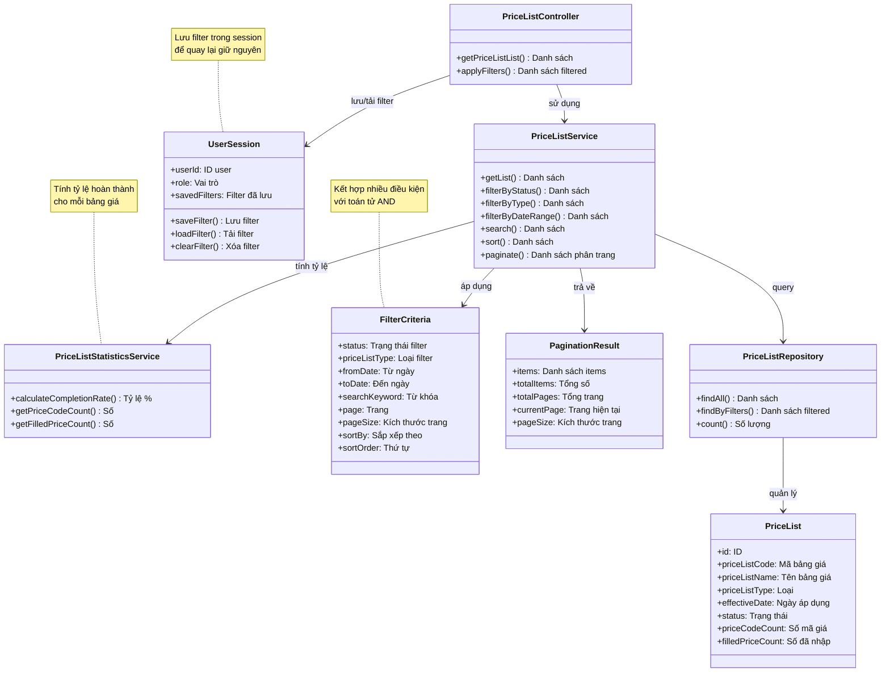

# Use Case UC-BANGGIA-03: Xem danh sách Bảng giá

---

| **Use Case ID** | **UC-BANGGIA-03** |
|-----------------|------------------||
| **Use Case Name** | Xem danh sách Bảng giá |
| **Description** | Use Case "Xem danh sách Bảng giá" cho phép Admin và Nhân viên xem danh sách các bảng giá trong hệ thống với khả năng lọc, tìm kiếm và phân trang. |
| **Actor(s)** | Admin, Nhân viên |
| **Priority** | Must Have |
| **Trigger** | User yêu cầu xem danh sách Bảng giá |

---

## Input

| Tên trường | Loại | Bắt buộc | Mô tả | Ràng buộc |
|------------|------|----------|-------|-----------|
| `status` | Văn bản | Không | Lọc theo trạng thái | "Draft", "Active", "Inactive", hoặc "All" (mặc định) |
| `priceListType` | Văn bản | Không | Lọc theo loại bảng giá | "GOLD", "SILVER", v.v. |
| `fromDate` | Ngày | Không | Lọc từ ngày áp dụng | Ngày bắt đầu |
| `toDate` | Ngày | Không | Lọc đến ngày áp dụng | Ngày kết thúc |
| `searchKeyword` | Văn bản | Không | Tìm kiếm | Tìm theo tên bảng giá, loại |
| `page` | Số | Không | Trang hiện tại | >= 1, mặc định = 1 |
| `pageSize` | Số | Không | Số bản ghi mỗi trang | 10, 20, 50, 100 (mặc định = 20) |
| `sortBy` | Văn bản | Không | Sắp xếp theo trường | "effectiveDate", "createdAt", "updatedAt" |
| `sortOrder` | Văn bản | Không | Thứ tự sắp xếp | "asc" hoặc "desc" (mặc định) |

**Lưu ý:**
- **Admin**: Có thể xem tất cả bảng giá (Draft, Active và Inactive)
- **Nhân viên**: Chỉ xem được bảng giá Active

---

## Output

### Trường hợp thành công:

| Tên trường | Loại | Mô tả |
|------------|------|-------|
| `items` | Danh sách | Danh sách bảng giá theo điều kiện lọc |
| `totalItems` | Số | Tổng số bảng giá |
| `totalPages` | Số | Tổng số trang |
| `currentPage` | Số | Trang hiện tại |
| `pageSize` | Số | Số bản ghi mỗi trang |

**Cấu trúc mỗi item trong danh sách:**

| Tên trường | Loại | Mô tả |
|------------|------|-------|
| `id` | Số | ID bảng giá |
| `priceListCode` | Văn bản | Mã bảng giá |
| `priceListName` | Văn bản | Tên bảng giá |
| `priceListType` | Văn bản | Loại bảng giá |
| `effectiveDate` | Ngày | Ngày áp dụng |
| `effectiveTime` | Giờ | Giờ áp dụng |
| `scope` | Văn bản | Phạm vi áp dụng |
| `usdExchangeRate` | Số thập phân | Tỷ giá USD |
| `status` | Văn bản | Trạng thái: "Draft", "Active", "Inactive" |
| `priceCodeCount` | Số | Số lượng mã giá trong bảng |
| `filledPriceCount` | Số | Số lượng mã giá đã có đủ giá |
| `createdAt` | Ngày giờ | Thời gian tạo |
| `createdBy` | Văn bản | Người tạo |
| `updatedAt` | Ngày giờ | Thời gian cập nhật lần cuối |

### Trường hợp không có dữ liệu:

| Tên trường | Loại | Mô tả |
|------------|------|-------|
| `items` | Danh sách | Danh sách rỗng [] |
| `totalItems` | Số | 0 |
| `message` | Văn bản | "Không tìm thấy bảng giá nào" |

---

## Pre-Condition(s)

- User đã đăng nhập vào hệ thống
- **Admin**: Có quyền xem tất cả bảng giá
- **Nhân viên**: Có quyền xem bảng giá Active

---

## Post-Condition(s)

- Danh sách bảng giá được hiển thị theo điều kiện lọc
- Trạng thái filter và search được lưu trong session (để quay lại giữ nguyên)
- Hệ thống ghi nhận lịch sử truy cập (optional - cho audit)

---

## Basic Flow

1. User yêu cầu xem danh sách Bảng giá
2. Hệ thống trả về danh sách bảng giá với các thông tin:
   - Danh sách bảng giá theo điều kiện lọc
   - Thông tin phân trang (tổng số, trang hiện tại)
   - Các trường dữ liệu: Mã bảng giá, Tên, Loại, Ngày áp dụng, Phạm vi, Trạng thái, Số lượng mã giá, Tỷ lệ đã nhập giá
3. User có thể:
   - **Lọc** theo trạng thái, loại bảng giá, khoảng thời gian
   - **Tìm kiếm** theo tên bảng giá, loại
   - **Sắp xếp** theo các trường (ngày áp dụng, ngày tạo, ngày cập nhật)
   - **Chuyển trang**
   - **Thay đổi số bản ghi mỗi trang** (10, 20, 50, 100)
4. Khi User thay đổi bộ lọc hoặc tìm kiếm:
   - Hệ thống áp dụng điều kiện mới
   - Hệ thống trả về danh sách bảng giá phù hợp
   - Cập nhật thông tin phân trang
5. User có thể chọn các thao tác trên từng bảng giá:
   - **Xem chi tiết** → Chuyển sang UC-BANGGIA-04
   - **Cập nhật** → Chuyển sang UC-BANGGIA-02 (chỉ Draft, chỉ Admin)
   - **Activate** → Chuyển sang UC-BANGGIA-05 (chỉ Draft, chỉ Admin)
   - **Sao chép** → Chuyển sang UC-BANGGIA-06 (chỉ Admin)

Use case tiếp tục (không kết thúc cho đến khi User kết thúc phiên làm việc).

---

## Alternative Flow

### 2a. Nhân viên chỉ xem được bảng giá Active

2a. Nếu User là Nhân viên (không phải Admin)

2a1. Hệ thống tự động:
- Bắt buộc lọc trạng thái Active
- Không cho phép thao tác Cập nhật, Activate, Sao chép
- Chỉ cho phép Xem chi tiết

2a2. Nhân viên chỉ có thể:
- Xem danh sách bảng giá Active
- Lọc theo loại bảng giá, khoảng thời gian
- Tìm kiếm
- Xem chi tiết

Use case quay lại bước 3

---

## Exception Flow

### 4a. Không tìm thấy bảng giá nào

4a. Hệ thống không tìm thấy bảng giá nào phù hợp với điều kiện lọc

4a1. Hệ thống trả về:
- Danh sách rỗng
- Message: "Không tìm thấy bảng giá nào phù hợp với điều kiện lọc"

4a2. User có thể:
- Thay đổi điều kiện lọc
- Xóa bộ lọc (Reset)
- Kết thúc

### 4b. Lỗi kết nối hoặc server

4b. Hệ thống gặp lỗi khi tải dữ liệu

4b1. Hệ thống trả về thông báo lỗi: "Không thể tải danh sách bảng giá. Vui lòng thử lại."

4b2. User có thể thử lại

4b3. Nếu User thử lại → Hệ thống thực hiện lại request

---

## Business Rules

### BR-BANGGIA-016: Phân quyền xem danh sách

**Admin:**
- Xem được tất cả bảng giá (Draft, Active và Inactive)
- Có thể lọc theo trạng thái
- Có thể thực hiện các thao tác: Xem, Cập nhật, Activate, Sao chép

**Nhân viên:**
- Chỉ xem được bảng giá Active
- Không có filter trạng thái
- Chỉ có thể Xem chi tiết (không sửa, không activate, không sao chép)

**Ví dụ:**
```
Admin:
  ✅ Xem Draft, Active, Inactive
  ✅ Cập nhật bảng giá Draft
  ✅ Activate bảng giá Draft
  ✅ Sao chép bất kỳ bảng giá nào

Nhân viên:
  ✅ Xem chỉ bảng giá Active
  ❌ Không xem Draft, Inactive
  ❌ Không cập nhật
  ❌ Không activate
  ❌ Không sao chép
```

### BR-BANGGIA-017: Mặc định

Khi lần đầu thực hiện:
- **Admin**: Trả về tất cả bảng giá (Draft + Active + Inactive)
- **Nhân viên**: Trả về chỉ bảng giá Active
- Sắp xếp theo thời gian áp dụng mới nhất (effectiveDate DESC)
- 20 bản ghi mỗi trang
- Trang đầu tiên (page = 1)

**Ví dụ:**
```
Admin lần đầu truy cập:
  → Load tất cả bảng giá (Draft, Active, Inactive)
  → Sắp xếp theo effectiveDate DESC
  → Trang 1, 20 bản ghi

Nhân viên lần đầu truy cập:
  → Load chỉ bảng giá Active
  → Sắp xếp theo effectiveDate DESC
  → Trang 1, 20 bản ghi
```

### BR-BANGGIA-018: Tìm kiếm

Tìm kiếm theo từ khóa (case-insensitive) trong các trường:
- Mã bảng giá (`priceListCode`)
- Tên bảng giá (`priceListName`)
- Loại bảng giá (`priceListType`)

**Ví dụ:**
```
Từ khóa: "vàng"
→ Tìm thấy:
  - "Bảng giá vàng - 04/03/2026"
  - "Nhập tên bảng giá vàng"
  - Loại: "GOLD"

Từ khóa: "PL-20260304"
→ Tìm thấy:
  - Mã: "PL-20260304-001"
  - Mã: "PL-20260304-002"
```

### BR-BANGGIA-019: Lọc kết hợp

User có thể lọc đồng thời nhiều điều kiện:
- Trạng thái = Active
- Loại = GOLD
- Từ ngày = 01/03/2026
- Đến ngày = 31/03/2026
- Tìm kiếm = "buổi sáng"

→ Hệ thống áp dụng **AND** cho tất cả điều kiện

**Ví dụ:**
```
Filter:
  - Status: Active
  - Type: GOLD
  - Date range: 01/03/2026 - 31/03/2026

→ Kết quả: Chỉ các bảng giá GOLD, Active, có ngày áp dụng từ 01/03 đến 31/03
```

### BR-BANGGIA-020: Phân trang

- Mặc định: 20 bản ghi/trang
- Các lựa chọn: 10, 20, 50, 100
- Nếu tổng số < pageSize → Trả về tất cả trong 1 trang
- Khi thay đổi pageSize → Quay về trang 1

**Ví dụ:**
```
Tổng số: 47 bảng giá
PageSize: 20
→ Trang 1: 20 bản ghi
→ Trang 2: 20 bản ghi
→ Trang 3: 7 bản ghi

User thay đổi PageSize từ 20 → 50:
→ Quay về Trang 1
→ Hiển thị 47 bản ghi (tất cả trong 1 trang)
```

### BR-BANGGIA-021: Sắp xếp

**Các trường có thể sắp xếp:**
- Ngày áp dụng (effectiveDate): Mới nhất hoặc Cũ nhất
- Thời gian tạo (createdAt): Mới nhất hoặc Cũ nhất
- Thời gian cập nhật (updatedAt): Mới nhất hoặc Cũ nhất

**Mặc định:** Sắp xếp theo `effectiveDate DESC` (ngày áp dụng mới nhất lên đầu)

**Ví dụ:**
```
Sắp xếp theo effectiveDate DESC:
  1. Bảng giá 10/03/2026
  2. Bảng giá 09/03/2026
  3. Bảng giá 08/03/2026

Sắp xếp theo createdAt ASC:
  1. Bảng giá tạo ngày 01/03/2026
  2. Bảng giá tạo ngày 02/03/2026
  3. Bảng giá tạo ngày 03/03/2026
```

### BR-BANGGIA-022: Lưu trạng thái filter

Hệ thống lưu trạng thái filter/search trong session của user:
- Khi User chuyển sang UC-BANGGIA-04 (Xem chi tiết) rồi quay lại → Giữ nguyên filter
- Khi User kết thúc phiên làm việc → Xóa filter (reset về mặc định)

Mục đích: User không phải lọc lại nhiều lần

**Ví dụ:**
```
User filter:
  - Status: Draft
  - Type: GOLD
  - Date: 01/03 - 31/03

User xem chi tiết bảng giá → Quay lại
→ Filter vẫn giữ nguyên (Draft, GOLD, 01/03-31/03)

User thoát → Đăng nhập lại
→ Filter reset về mặc định
```

### BR-BANGGIA-023: Hiển thị tỷ lệ hoàn thành

Mỗi bảng giá hiển thị:
- **priceCodeCount**: Tổng số mã giá trong bảng
- **filledPriceCount**: Số mã giá đã nhập đủ giá (mua + bán)
- **Tỷ lệ %**: `(filledPriceCount / priceCodeCount) × 100%`

**Ví dụ:**
```
Bảng giá có 7 mã giá:
  - 4 mã đã nhập đủ giá
  - 3 mã còn thiếu giá

→ Hiển thị: "4/7 mã giá (57%)"

Màu sắc:
  - 100%: Xanh lá (đã đủ)
  - 50-99%: Vàng (đang nhập)
  - 0-49%: Đỏ (mới bắt đầu)
```

### BR-BANGGIA-024: Lọc theo khoảng thời gian

- Cho phép lọc bảng giá theo khoảng ngày áp dụng
- Có thể lọc chỉ `fromDate` (từ ngày X đến hiện tại)
- Có thể lọc chỉ `toDate` (từ trước đến ngày X)
- Có thể lọc cả 2 (từ ngày X đến ngày Y)

**Ví dụ:**
```
fromDate = 01/03/2026, toDate = NULL:
→ Bảng giá có ngày áp dụng >= 01/03/2026

fromDate = NULL, toDate = 31/03/2026:
→ Bảng giá có ngày áp dụng <= 31/03/2026

fromDate = 01/03/2026, toDate = 31/03/2026:
→ Bảng giá có ngày áp dụng từ 01/03 đến 31/03
```

---

## Diagrams

### 1. Use Case Diagram - UC-BANGGIA-03: Xem danh sách Bảng giá



### 2. Activity Diagram - Luồng xem danh sách Bảng giá



### 3. Sequence Diagram - Xem danh sách Bảng giá



**Khởi tạo (Bước 1-9):**
- Kiểm tra vai trò user (Admin/Nhân viên)
- Load danh sách với filter mặc định
- Nhân viên: Bắt buộc lọc Active
- Admin: Cho phép lọc tất cả
- Tính tỷ lệ hoàn thành cho mỗi bảng giá

**Loop tương tác (Bước 10):**
- User thay đổi filter, search, sort, pagination
- Hệ thống query lại database
- Trả về kết quả hoặc message "Không tìm thấy"

**Chuyển UC (Bước 11):**
- User chọn thao tác → Chuyển sang UC tương ứng
- Kiểm tra quyền và điều kiện (Draft/Active/Inactive)
- Lưu trạng thái filter để quay lại

---

### 4. Class Diagram

