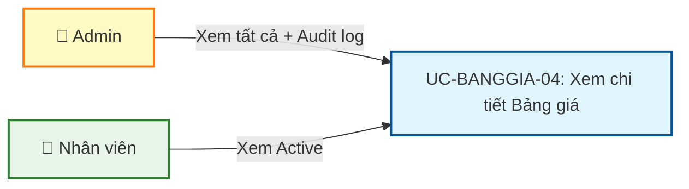
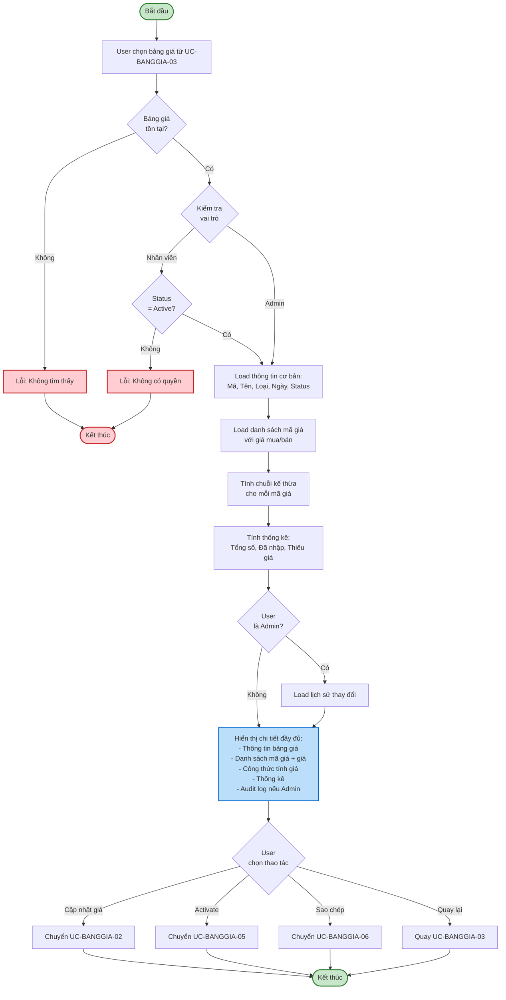
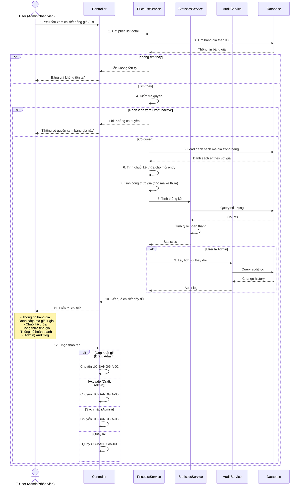
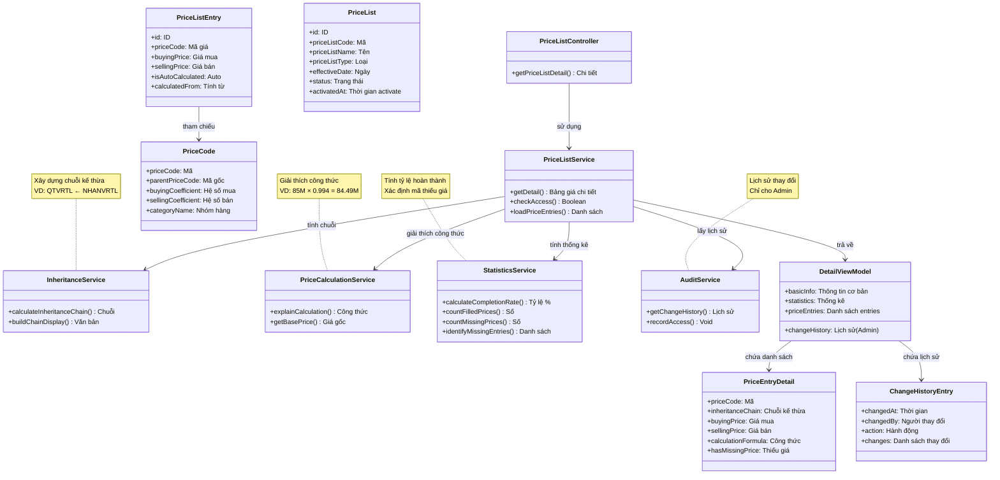

# Use Case UC-BANGGIA-04: Xem chi tiết Bảng giá

---

| **Use Case ID** | **UC-BANGGIA-04** |
|-----------------|------------------||
| **Use Case Name** | Xem chi tiết Bảng giá |
| **Description** | Use Case "Xem chi tiết Bảng giá" cho phép Admin và Nhân viên xem thông tin đầy đủ của một bảng giá, bao gồm danh sách mã giá với giá mua/bán, chuỗi kế thừa, và lịch sử thay đổi. |
| **Actor(s)** | Admin, Nhân viên |
| **Priority** | Must Have |
| **Trigger** | User yêu cầu xem chi tiết một Bảng giá cụ thể |

---

## Input

| Tên trường | Loại | Bắt buộc | Mô tả | Ràng buộc |
|------------|------|----------|-------|-----------|
| `priceListId` | Số | Có | ID bảng giá cần xem | Bảng giá phải tồn tại |

**Lưu ý:**
- **Admin**: Có thể xem chi tiết tất cả bảng giá (Draft, Active, Inactive)
- **Nhân viên**: Chỉ xem được chi tiết bảng giá Active

---

## Output

### Trường hợp thành công:

**Thông tin cơ bản:**

| Tên trường | Loại | Mô tả |
|------------|------|-------|
| `id` | Số | ID bảng giá |
| `priceListCode` | Văn bản | Mã bảng giá |
| `priceListName` | Văn bản | Tên bảng giá |
| `priceListType` | Văn bản | Loại bảng giá |
| `effectiveDate` | Ngày | Ngày áp dụng |
| `effectiveTime` | Giờ | Giờ áp dụng |
| `scope` | Văn bản | Phạm vi áp dụng |
| `usdExchangeRate` | Số thập phân | Tỷ giá USD |
| `status` | Văn bản | Trạng thái: "Draft", "Active", "Inactive" |
| `createdAt` | Ngày giờ | Thời gian tạo |
| `createdBy` | Văn bản | Người tạo |
| `updatedAt` | Ngày giờ | Thời gian cập nhật lần cuối |
| `updatedBy` | Văn bản | Người cập nhật lần cuối |
| `activatedAt` | Ngày giờ | Thời gian activate (nếu Active/Inactive) |
| `activatedBy` | Văn bản | Người activate (nếu Active/Inactive) |

**Thống kê:**

| Tên trường | Loại | Mô tả |
|------------|------|-------|
| `priceCodeCount` | Số | Tổng số mã giá trong bảng |
| `filledPriceCount` | Số | Số mã giá đã nhập đủ giá |
| `missingBuyingPriceCount` | Số | Số mã giá thiếu giá mua |
| `missingSellingPriceCount` | Số | Số mã giá thiếu giá bán |
| `completionRate` | Số thập phân | Tỷ lệ hoàn thành (%) |

**Danh sách mã giá:**

| Tên trường | Loại | Mô tả |
|------------|------|-------|
| `priceEntries` | Danh sách | Danh sách các mã giá trong bảng |

**Cấu trúc mỗi entry trong `priceEntries`:**

| Tên trường | Loại | Mô tả |
|------------|------|-------|
| `priceCode` | Văn bản | Mã giá |
| `categoryName` | Văn bản | Tên nhóm hàng |
| `parentPriceCode` | Văn bản | Mã giá gốc (nếu có kế thừa) |
| `inheritanceChain` | Văn bản | Chuỗi kế thừa (VD: "QTVRTL ← NHANVRTL") |
| `goldContent` | Văn bản | Hàm lượng vàng |
| `brand` | Văn bản | Thương hiệu |
| `buyingCoefficient` | Số thập phân | Hệ số mua vào |
| `sellingCoefficient` | Số thập phân | Hệ số bán ra |
| `buyingPrice` | Số thập phân | Giá mua vào (có thể NULL) |
| `sellingPrice` | Số thập phân | Giá bán ra (có thể NULL) |
| `isAutoCalculated` | Boolean | Giá được tính tự động (true cho mã kế thừa) |
| `calculatedFrom` | Văn bản | Tính từ mã giá nào (nếu auto-calculated) |
| `hasMissingPrice` | Boolean | true nếu thiếu giá mua hoặc bán |

**Lịch sử thay đổi (chỉ Admin):**

| Tên trường | Loại | Mô tả |
|------------|------|-------|
| `changeHistory` | Danh sách | Lịch sử các lần thay đổi |
| `changeHistory[].changedAt` | Ngày giờ | Thời gian thay đổi |
| `changeHistory[].changedBy` | Văn bản | Người thay đổi |
| `changeHistory[].action` | Văn bản | Hành động: CREATE, UPDATE_PRICES, ACTIVATE, DEACTIVATE |
| `changeHistory[].changes` | Danh sách | Danh sách các trường đã thay đổi |

### Trường hợp lỗi:

| Mã lỗi | Thông báo | Mô tả |
|--------|-----------|-------|
| `PRICE_LIST_NOT_FOUND` | "Bảng giá không tồn tại" | Không tìm thấy bảng giá |
| `ACCESS_DENIED` | "Không có quyền xem bảng giá này" | Nhân viên cố xem bảng giá không phải Active |

---

## Pre-Condition(s)

- Bảng giá đã tồn tại trong hệ thống
- User đã đăng nhập
- **Admin**: Có quyền xem tất cả bảng giá
- **Nhân viên**: Có quyền xem bảng giá Active

---

## Post-Condition(s)

- Thông tin chi tiết bảng giá được trả về
- Hệ thống ghi nhận lịch sử truy cập (optional - cho audit)
- Không có thay đổi dữ liệu (read-only operation)

---

## Basic Flow

1. User yêu cầu xem chi tiết một bảng giá cụ thể (từ danh sách UC-BANGGIA-03)
2. Hệ thống kiểm tra quyền truy cập:
   - Admin: Cho phép xem tất cả
   - Nhân viên: Chỉ cho phép xem bảng giá Active
3. Hệ thống lấy thông tin chi tiết bảng giá:
   - Thông tin cơ bản (mã, tên, loại, ngày áp dụng, trạng thái, v.v.)
   - Danh sách mã giá trong bảng với giá mua/bán
   - Chuỗi kế thừa cho mỗi mã giá
   - Tính toán thống kê (số mã giá, tỷ lệ hoàn thành)
4. Hệ thống hiển thị thông tin kế thừa:
   - Với mã giá kế thừa: Hiển thị giá được tính từ mã nào
   - Hiển thị công thức tính giá: `Giá = Giá Base × Hệ số`
5. Nếu User là Admin:
   - Hệ thống lấy thêm lịch sử thay đổi (audit log)
6. Hệ thống trả về thông tin chi tiết đầy đủ:
   - Thông tin cơ bản và thống kê
   - Danh sách mã giá với giá và chuỗi kế thừa
   - (Admin only) Lịch sử thay đổi
7. User có thể thực hiện các thao tác:
   - **Cập nhật giá** → Chuyển sang UC-BANGGIA-02 (chỉ Draft, chỉ Admin)
   - **Activate** → Chuyển sang UC-BANGGIA-05 (chỉ Draft, chỉ Admin)
   - **Sao chép** → Chuyển sang UC-BANGGIA-06 (chỉ Admin)
   - **Quay lại danh sách** → Quay lại UC-BANGGIA-03

Use case kết thúc.

---

## Alternative Flow

*Không có luồng thay thế*

---

## Exception Flow

### 2a. Bảng giá không tồn tại

2a. Hệ thống không tìm thấy bảng giá với ID được cung cấp

2a1. Hệ thống trả về lỗi: "Bảng giá không tồn tại hoặc đã bị xóa."

2a2. Use case kết thúc

### 2b. Nhân viên cố xem bảng giá không phải Active

2b. Nhân viên cố gắng xem chi tiết bảng giá có trạng thái Draft hoặc Inactive

2b1. Hệ thống trả về lỗi: "Không có quyền xem bảng giá này."

2b2. Use case kết thúc

---

## Business Rules

### BR-BANGGIA-025: Phân quyền xem chi tiết

**Admin:**
- Xem được chi tiết tất cả bảng giá (Draft, Active, Inactive)
- Xem được lịch sử thay đổi (audit log)
- Có thể thực hiện thao tác: Cập nhật giá, Activate, Sao chép

**Nhân viên:**
- Chỉ xem được chi tiết bảng giá Active
- Không xem được lịch sử thay đổi
- Chỉ có thể Quay lại danh sách (không sửa, không activate, không sao chép)

**Ví dụ:**
```
Admin:
  ✅ Xem chi tiết bảng Draft, Active, Inactive
  ✅ Xem audit log
  ✅ Cập nhật giá (nếu Draft)
  ✅ Activate (nếu Draft)

Nhân viên:
  ✅ Xem chi tiết bảng Active
  ❌ Không xem Draft, Inactive
  ❌ Không xem audit log
  ❌ Không cập nhật, activate
```

### BR-BANGGIA-026: Hiển thị chuỗi kế thừa

Đối với mã giá có kế thừa trong bảng:
- Hiển thị chuỗi kế thừa đầy đủ theo format: `PC-C ← PC-B ← PC-A`
- Hiển thị mã giá gốc được dùng để tính giá
- Link tới mã giá trong chuỗi (để xem thông tin mã giá)

**Ví dụ:**
```
Entry: QTVRTL (Quỳ tống Vàng Rồng)
Chuỗi kế thừa: QTVRTL ← NHANVRTL
  - NHANVRTL: Mã giá gốc (Nhẫn Vàng rồng)
  - QTVRTL: Kế thừa từ NHANVRTL

Entry: MNVT9999 (Vàng trang sức Bảo Tín)
Chuỗi kế thừa: MNVT9999 ← NHANVRTL
  - NHANVRTL: Mã giá gốc
  - MNVT9999: Kế thừa từ NHANVRTL với hệ số 0.994
```

### BR-BANGGIA-027: Hiển thị giá và công thức tính

Hệ thống hiển thị chi tiết giá và cách tính:

**Mã giá độc lập:**
- Giá mua vào: Nhập trực tiếp
- Giá bán ra: Nhập trực tiếp
- Không có công thức tính

**Mã giá kế thừa:**
- Giá mua vào: Tự động tính = `Giá mua Base × Hệ số mua`
- Giá bán ra: Tự động tính = `Giá bán Base × Hệ số bán`
- Hiển thị công thức chi tiết

**Ví dụ:**
```
NHANVRTL (độc lập):
  Giá mua: 85,000,000 (Nhập trực tiếp)
  Giá bán: 87,000,000 (Nhập trực tiếp)

QTVRTL (kế thừa từ NHANVRTL):
  Giá mua: 85,000,000 (Tự động)
  Công thức: 85,000,000 × 1 = 85,000,000
  
  Giá bán: 87,000,000 (Tự động)
  Công thức: 87,000,000 × 1 = 87,000,000

MNVT9999 (kế thừa từ NHANVRTL):
  Giá mua: 84,490,000 (Tự động)
  Công thức: 85,000,000 × 0.994 = 84,490,000
  
  Giá bán: 86,478,000 (Tự động)
  Công thức: 87,000,000 × 0.994 = 86,478,000
```

### BR-BANGGIA-028: Thống kê hoàn thành

Hiển thị thống kê chi tiết về tình trạng nhập giá:
- **Tổng số mã giá**: Số lượng mã giá trong bảng
- **Đã nhập đủ giá**: Số mã giá có đủ giá mua VÀ giá bán
- **Thiếu giá mua**: Số mã giá chưa có giá mua (NULL)
- **Thiếu giá bán**: Số mã giá chưa có giá bán (NULL)
- **Tỷ lệ hoàn thành**: `(Đã nhập đủ / Tổng số) × 100%`

**Ví dụ:**
```
Bảng giá có 7 mã giá:
  - 5 mã đã nhập đủ giá (mua + bán)
  - 2 mã thiếu giá:
    * 1 mã thiếu giá mua
    * 1 mã thiếu giá bán

Thống kê:
  Tổng số mã giá: 7
  Đã nhập đủ: 5
  Thiếu giá mua: 1
  Thiếu giá bán: 1
  Tỷ lệ hoàn thành: 71%
```

### BR-BANGGIA-029: Lịch sử thay đổi (Audit Log)

Chỉ Admin mới xem được lịch sử thay đổi:

**Các loại hành động được ghi nhận:**
- `CREATE`: Tạo bảng giá mới
- `UPDATE_PRICES`: Cập nhật giá cho mã giá
- `ACTIVATE`: Kích hoạt bảng giá
- `DEACTIVATE`: Chuyển sang Inactive (do activate bảng mới)

**Thông tin mỗi lần thay đổi:**
- Thời gian thay đổi
- Người thay đổi
- Hành động
- Danh sách các trường đã thay đổi (old value → new value)

**Sắp xếp:** Thời gian mới nhất lên đầu

**Ví dụ:**
```
Lịch sử thay đổi:

1. 04/03/2026 16:00 - Admin A - ACTIVATE
   - Status: Draft → Active
   - Snapshot: 7 mã giá với giá đầy đủ

2. 04/03/2026 15:50 - Admin A - UPDATE_PRICES
   - NHANVRTL: Giá mua 85M → 86M
   - QTVRTL: Tự động tính lại 85M → 86M
   - MNVT9999: Tự động tính lại 84.49M → 85.48M

3. 04/03/2026 15:46 - Admin A - CREATE
   - Tạo bảng giá Draft với 7 mã giá
```

### BR-BANGGIA-030: Highlight giá thiếu

Hệ thống highlight các mã giá còn thiếu giá:
- Màu đỏ: Thiếu cả giá mua và giá bán
- Màu cam: Thiếu một trong hai giá
- Icon warning cho các mã giá thiếu giá

Mục đích: Dễ dàng nhận biết mã giá nào cần nhập giá

**Ví dụ:**
```
Entry 1 - NHANVRTL:
  Giá mua: 85,000,000 ✅
  Giá bán: 87,000,000 ✅
  
Entry 2 - QTVRTL:
  Giá mua: 85,000,000 ✅ (auto)
  Giá bán: NULL ⚠️ (thiếu)
  
Entry 3 - MVRTL:
  Giá mua: NULL ⚠️ (thiếu)
  Giá bán: NULL ⚠️ (thiếu)
```

### BR-BANGGIA-031: Snapshot cho bảng Active/Inactive

Bảng giá Active và Inactive hiển thị giá **snapshot** tại thời điểm activate:
- Giá không thay đổi dù hệ số mã giá thay đổi sau này
- Hiển thị thông tin "Giá được snapshot tại [thời gian activate]"
- Giải thích: Bảng giá đã áp dụng, không bị ảnh hưởng bởi thay đổi tương lai

**Ví dụ:**
```
Bảng giá: "Bảng giá vàng - 03/03/2026"
Status: Active
Activated: 03/03/2026 09:00 by Admin A

⚠️ Lưu ý: Giá trong bảng này đã được snapshot tại 03/03/2026 09:00.
Các thay đổi hệ số mã giá sau thời điểm này không ảnh hưởng đến bảng giá này.

NHANVRTL:
  Giá mua: 85,000,000 (snapshot)
  Giá bán: 87,000,000 (snapshot)

Ngày 04/03/2026, Admin cập nhật hệ số NHANVRTL → 1.05
→ Bảng giá này vẫn giữ nguyên 85M và 87M (không thay đổi)
```

### BR-BANGGIA-032: Ghi nhận truy cập (Optional)

Hệ thống có thể ghi nhận lịch sử truy cập để audit:
- User nào đã xem bảng giá nào
- Thời gian xem
- Mục đích: Theo dõi hoạt động, phát hiện truy cập bất thường

---

## Diagrams

### 1. Use Case Diagram - UC-BANGGIA-04: Xem chi tiết Bảng giá



### 2. Activity Diagram - Luồng xem chi tiết Bảng giá



### 3. Sequence Diagram - Xem chi tiết Bảng giá



**Giải thích Sequence Diagram:**

**Kiểm tra quyền (Bước 3-4):**
- Tìm bảng giá theo ID
- Kiểm tra User có quyền xem không
- Nhân viên chỉ xem Active

**Load dữ liệu (Bước 5-7):**
- Load danh sách mã giá trong bảng
- Tính chuỗi kế thừa cho mỗi mã
- Tính công thức giá cho mã kế thừa

**Tính thống kê (Bước 8):**
- StatisticsService tính số lượng
- Tính tỷ lệ hoàn thành
- Xác định mã giá nào thiếu giá

**Audit log (Bước 9 - Admin only):**
- Chỉ Admin mới lấy audit log
- Hiển thị lịch sử CREATE, UPDATE_PRICES, ACTIVATE

**Hiển thị và thao tác (Bước 10-12):**
- Hiển thị chi tiết đầy đủ
- User chọn thao tác tiếp theo

---

### 4. Class Diagram

