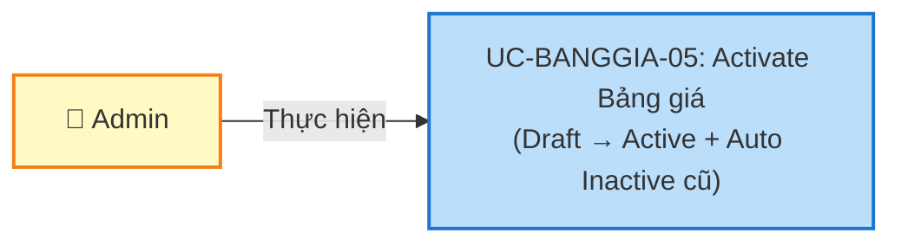
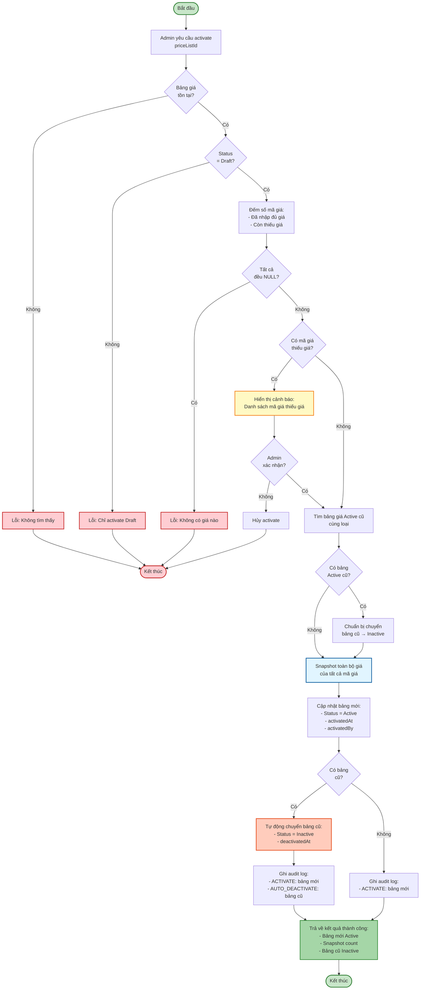
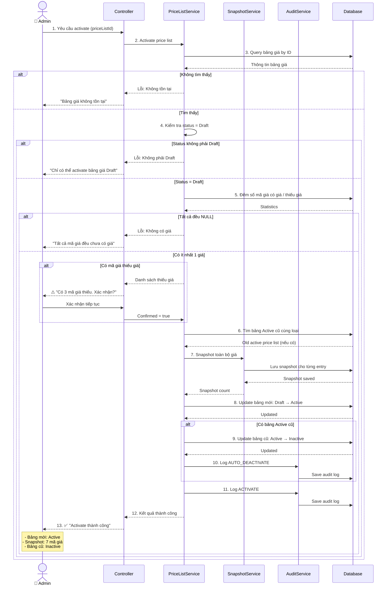
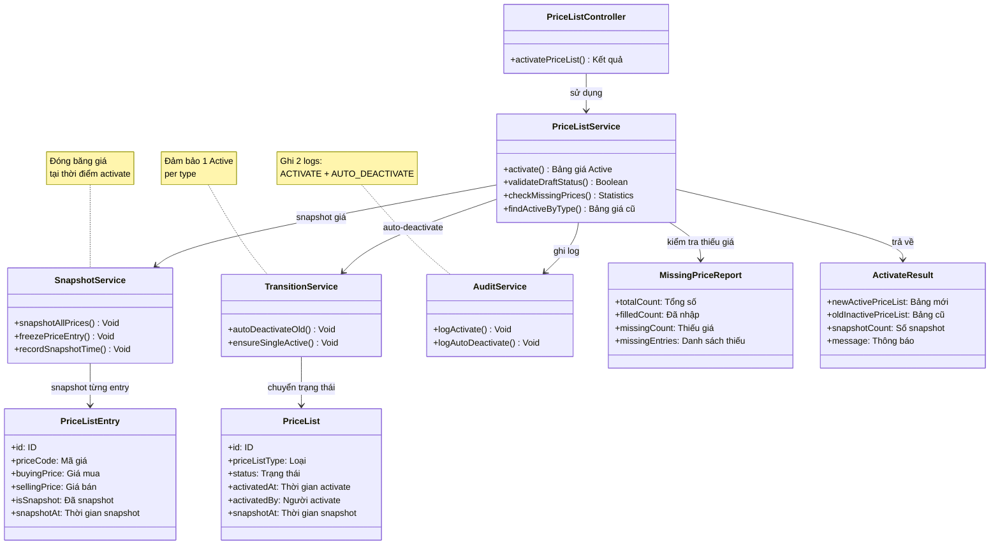

# Use Case UC-BANGGIA-05: Activate Bảng giá

---

| **Use Case ID** | **UC-BANGGIA-05** |
|-----------------|------------------||
| **Use Case Name** | Activate Bảng giá |
| **Description** | Use Case "Activate Bảng giá" cho phép Admin kích hoạt bảng giá từ trạng thái Draft sang Active để áp dụng trong hệ thống. Hệ thống tự động chuyển bảng giá Active cũ (cùng loại) sang Inactive và snapshot toàn bộ giá tại thời điểm activate. |
| **Actor(s)** | Admin |
| **Priority** | Must Have |
| **Trigger** | Admin yêu cầu activate một Bảng giá đang Draft |

---

## Input

| Tên trường | Loại | Bắt buộc | Mô tả | Ràng buộc |
|------------|------|----------|-------|-----------|
| `priceListId` | Số | Có | ID bảng giá cần activate | Bảng giá phải tồn tại và đang Draft |
| `confirmMissingPrices` | Boolean | Không | Xác nhận activate dù thiếu giá | Bắt buộc = true nếu có giá thiếu |

---

## Output

### Trường hợp thành công:

| Tên trường | Loại | Mô tả |
|------------|------|-------|
| `id` | Số | ID bảng giá đã activate |
| `priceListCode` | Văn bản | Mã bảng giá |
| `priceListName` | Văn bản | Tên bảng giá |
| `status` | Văn bản | Trạng thái mới = "Active" |
| `activatedAt` | Ngày giờ | Thời gian activate |
| `activatedBy` | Văn bản | Người activate |
| `snapshotCount` | Số | Số mã giá đã snapshot |
| `previousActivePriceList` | Thông tin | Bảng giá Active cũ (đã chuyển Inactive) - nếu có |
| `message` | Văn bản | "Activate bảng giá thành công" |

### Trường hợp lỗi:

| Mã lỗi | Thông báo | Mô tả |
|--------|-----------|-------|
| `PRICE_LIST_NOT_FOUND` | "Bảng giá không tồn tại" | Không tìm thấy bảng giá |
| `INVALID_STATUS` | "Chỉ có thể activate bảng giá Draft" | Bảng giá không phải Draft |
| `MISSING_PRICES` | "Bảng giá còn thiếu giá" | Có mã giá chưa nhập đủ giá |
| `MISSING_PRICES_NOT_CONFIRMED` | "Vui lòng xác nhận activate với giá thiếu" | Thiếu giá nhưng chưa confirm |
| `ALL_PRICES_NULL` | "Không thể activate. Tất cả mã giá đều chưa có giá" | Không có mã giá nào có giá |

---

## Pre-Condition(s)

- Bảng giá đã tồn tại trong hệ thống
- Bảng giá đang có trạng thái Draft
- Admin đã đăng nhập và có quyền activate bảng giá
- (Optional) Bảng giá đã nhập đủ giá cho tất cả mã giá

---

## Post-Condition(s)

- Bảng giá chuyển sang trạng thái Active
- Hệ thống snapshot toàn bộ giá tại thời điểm activate
- Bảng giá Active cũ (cùng loại) tự động chuyển sang Inactive
- Bảng giá Active mới được áp dụng trong hệ thống
- Hệ thống ghi nhận thông tin người activate và thời gian activate
- Audit log ghi nhận hành động ACTIVATE và AUTO_DEACTIVATE

---

## Basic Flow

1. Admin yêu cầu activate một bảng giá đang Draft
2. Hệ thống kiểm tra tính hợp lệ:
   - Bảng giá tồn tại
   - Bảng giá đang Draft
3. Hệ thống kiểm tra giá:
   - Đếm số mã giá đã nhập đủ giá (mua VÀ bán)
   - Đếm số mã giá còn thiếu giá
4. Nếu có mã giá thiếu giá:
   - Hệ thống hiển thị danh sách mã giá thiếu giá chi tiết
   - Yêu cầu Admin xác nhận: "Activate dù thiếu giá?"
   - Nếu Admin không xác nhận → Use case kết thúc
5. Hệ thống kiểm tra bảng giá Active cũ:
   - Tìm bảng giá Active cùng loại (priceListType)
   - Nếu tìm thấy → Chuẩn bị chuyển sang Inactive
6. Hệ thống thực hiện activate:
   - **Snapshot** toàn bộ giá của tất cả mã giá (lưu giá tại thời điểm này)
   - Chuyển status từ Draft → Active
   - Ghi nhận thời gian activate (activatedAt)
   - Ghi nhận người activate (activatedBy)
7. Nếu có bảng giá Active cũ:
   - Hệ thống tự động chuyển bảng cũ từ Active → Inactive
   - Ghi nhận thời gian deactivate
   - Ghi audit log: AUTO_DEACTIVATE
8. Hệ thống ghi audit log:
   - Bảng giá mới: Action = ACTIVATE
   - Bảng giá cũ: Action = AUTO_DEACTIVATE (nếu có)
9. Hệ thống trả về kết quả thành công với thông tin:
   - Bảng giá mới đã Active
   - Số mã giá đã snapshot
   - Thông tin bảng giá cũ (nếu có)

Use case kết thúc.

---

## Alternative Flow

### 4a. Có mã giá thiếu giá, Admin xác nhận tiếp tục

4a. Hệ thống phát hiện có mã giá thiếu giá (mua hoặc bán = NULL)

4a1. Hệ thống hiển thị cảnh báo:
```
⚠️ CẢNH BÁO: Bảng giá còn thiếu giá

Tổng số mã giá: 7
Đã nhập đủ giá: 4 (57%)
Còn thiếu giá: 3 (43%)

Chi tiết mã giá thiếu:
  1. NHANVRTL - Thiếu giá bán
  2. MVRTL - Thiếu cả giá mua và bán
  3. BANVI - Thiếu giá mua

Bạn có chắc chắn muốn Activate bảng giá này?
```

4a2. Admin xác nhận: "Tiếp tục Activate"

4a3. Use case quay lại bước 5 (tiếp tục activate)

---

## Exception Flow

### 2a. Bảng giá không tồn tại

2a. Hệ thống không tìm thấy bảng giá với ID được cung cấp

2a1. Hệ thống trả về lỗi: "Bảng giá không tồn tại hoặc đã bị xóa."

2a2. Use case kết thúc

### 2b. Bảng giá không phải Draft

2b. Hệ thống phát hiện bảng giá đang ở trạng thái Active hoặc Inactive

2b1. Hệ thống trả về lỗi: "Chỉ có thể activate bảng giá Draft. Bảng giá này đang ở trạng thái [Status]."

2b2. Use case kết thúc

### 4b. Tất cả mã giá đều chưa có giá

4b. Hệ thống phát hiện **tất cả** mã giá đều chưa nhập giá (NULL/NULL)

4b1. Hệ thống trả về lỗi: "Không thể activate. Tất cả mã giá đều chưa có giá. Vui lòng nhập giá trước khi activate."

4b2. Use case kết thúc

### 4c. Admin không xác nhận activate với giá thiếu

4c. Admin từ chối activate khi có giá thiếu

4c1. Hệ thống hủy thao tác

4c2. Admin quay lại UC-BANGGIA-02 để nhập giá

4c3. Use case kết thúc

---

## Business Rules

### BR-BANGGIA-033: Chỉ Admin được activate

- Chỉ Admin mới có quyền activate bảng giá
- Nhân viên không có quyền này
- Lý do: Activate bảng giá ảnh hưởng toàn hệ thống (giá mua/bán)

### BR-BANGGIA-034: Chỉ activate bảng giá Draft

- Chỉ có thể activate bảng giá đang ở trạng thái **Draft**
- Bảng giá **Active**: Đã được activate, không cần activate lại
- Bảng giá **Inactive**: Không thể activate lại (one-way transition)
- Mục đích: Đảm bảo luồng trạng thái Draft → Active → Inactive

**Ví dụ:**
```
Bảng giá Draft:
  ✅ Có thể Activate

Bảng giá Active:
  ❌ Không thể Activate (đã Active rồi)

Bảng giá Inactive:
  ❌ Không thể Activate lại
  → Phải tạo bảng giá mới hoặc Sao chép (UC-BANGGIA-06)
```

### BR-BANGGIA-035: Kiểm tra giá đầy đủ

Hệ thống kiểm tra giá trước khi activate:

**Cấp độ 1: Bắt buộc**
- Ít nhất **một mã giá** phải có giá (không phải tất cả NULL)
- Nếu tất cả mã giá đều NULL → Từ chối activate

**Cấp độ 2: Cảnh báo (tùy cấu hình)**
- Nếu có mã giá thiếu giá (mua hoặc bán = NULL)
- Hệ thống hiển thị cảnh báo chi tiết
- Yêu cầu Admin xác nhận
- Nếu không xác nhận → Hủy activate

**Ví dụ:**
```
Bảng giá có 7 mã giá:
  - 0/7 có giá → ❌ Từ chối (tất cả NULL)
  - 1/7 có giá → ⚠️ Cảnh báo (yêu cầu xác nhận)
  - 7/7 có giá → ✅ Cho phép (không cảnh báo)
```

### BR-BANGGIA-036: Auto-transition bảng giá cũ

Khi activate bảng giá mới:
- Hệ thống **tự động** tìm bảng giá Active cũ **cùng loại** (priceListType)
- **Tự động** chuyển bảng cũ từ Active → Inactive
- Ghi audit log: AUTO_DEACTIVATE
- Đảm bảo: **Chỉ 1 bảng Active** cho mỗi loại tại một thời điểm

**Ví dụ:**
```
Trước activate:
  - "Bảng giá vàng - 03/03/2026" (GOLD): Active
  - "Bảng giá vàng - 04/03/2026" (GOLD): Draft

Admin activate "Bảng giá vàng - 04/03/2026":
→ Hệ thống tự động:
  1. "Bảng giá vàng - 04/03/2026": Draft → Active ✅
  2. "Bảng giá vàng - 03/03/2026": Active → Inactive ⚡ (auto)

Sau activate:
  - "Bảng giá vàng - 03/03/2026" (GOLD): Inactive
  - "Bảng giá vàng - 04/03/2026" (GOLD): Active
  
→ Chỉ 1 bảng GOLD Active tại một thời điểm
```

### BR-BANGGIA-037: Snapshot mechanism

Tại thời điểm activate, hệ thống **snapshot** toàn bộ giá:
- Lưu giá của **tất cả mã giá** tại thời điểm activate
- Giá được "đóng băng" (frozen), không thay đổi trong tương lai
- Dù hệ số mã giá thay đổi sau này → Bảng giá Active **không** bị ảnh hưởng

**Ví dụ:**
```
04/03/2026 15:46 - Activate bảng giá:
  NHANVRTL: 85M / 87M
  QTVRTL (Hệ số 1): 85M / 87M (tính từ NHANVRTL)
  MNVT9999 (Hệ số 0.994): 84.49M / 86.48M

→ Snapshot: Lưu giá 85M, 87M, 84.49M, 86.48M

05/03/2026 - Admin cập nhật hệ số QTVRTL từ 1 → 1.05:
→ Bảng giá 04/03 vẫn giữ nguyên:
  QTVRTL: 85M / 87M (không đổi, đã snapshot)

→ Bảng giá mới tạo sau 05/03:
  QTVRTL: 85M × 1.05 = 89.25M (hệ số mới)
```

### BR-BANGGIA-038: Một loại - Một Active

- Mỗi loại bảng giá (priceListType) chỉ có **duy nhất 1 bảng Active**
- Không thể có 2 bảng GOLD Active cùng lúc
- Có thể có nhiều bảng Draft cùng loại
- Có thể có nhiều bảng Inactive cùng loại
- Khi activate bảng mới → Bảng Active cũ **tự động** chuyển Inactive

**Ví dụ:**
```
Loại GOLD:
  - Bảng A: Draft ✅
  - Bảng B: Draft ✅
  - Bảng C: Active ✅ (chỉ 1)
  - Bảng D: Inactive ✅
  - Bảng E: Inactive ✅

Activate Bảng A:
→ Bảng A: Active ✅
→ Bảng C: Inactive ⚡ (auto)

Loại SILVER:
  - Bảng F: Active ✅ (SILVER khác GOLD)
→ Không ảnh hưởng
```

### BR-BANGGIA-039: Ghi nhận audit log

Mỗi lần activate, hệ thống ghi nhận đầy đủ:

**Bảng giá mới được activate:**
- Action: ACTIVATE
- Thời gian activate (activatedAt)
- Người activate (activatedBy)
- Trạng thái trước: Draft
- Trạng thái sau: Active
- Snapshot count: Số mã giá đã snapshot

**Bảng giá cũ bị auto-deactivate:**
- Action: AUTO_DEACTIVATE
- Thời gian deactivate
- Triggered by: Activate bảng giá mới
- Trạng thái trước: Active
- Trạng thái sau: Inactive

### BR-BANGGIA-040: Không ảnh hưởng bảng giá khác loại

Việc activate bảng giá **chỉ ảnh hưởng** bảng giá **cùng loại**:
- Activate bảng GOLD → Chỉ ảnh hưởng bảng GOLD Active cũ
- Không ảnh hưởng bảng SILVER, PLATINUM, v.v.
- Mỗi loại độc lập về trạng thái Active

**Ví dụ:**
```
Trước:
  - Bảng GOLD-A: Active
  - Bảng GOLD-B: Draft
  - Bảng SILVER-C: Active
  - Bảng SILVER-D: Draft

Activate GOLD-B:
→ GOLD-A: Inactive ⚡
→ GOLD-B: Active ✅
→ SILVER-C: Active ✅ (không đổi)
→ SILVER-D: Draft (không đổi)
```

---

## Diagrams

### 1. Use Case Diagram - UC-BANGGIA-05: Activate Bảng giá



### 2. Activity Diagram - Luồng Activate Bảng giá



### 3. Sequence Diagram - Activate Bảng giá với Auto-transition



**Giải thích Sequence Diagram:**

**Kiểm tra điều kiện (Bước 3-5):**
- Tìm bảng giá theo ID
- Kiểm tra status = Draft
- Đếm số mã giá có giá và thiếu giá
- Nếu tất cả NULL → Từ chối

**Xác nhận thiếu giá (Bước 5 - conditional):**
- Nếu có mã giá thiếu giá
- Hiển thị cảnh báo chi tiết
- Admin xác nhận tiếp tục

**Snapshot và Activate (Bước 6-8):**
- Tìm bảng Active cũ (cùng loại)
- SnapshotService snapshot toàn bộ giá
- Update bảng mới: Draft → Active

**Auto-transition (Bước 9-11):**
- Nếu có bảng cũ: Active → Inactive
- AuditService ghi 2 logs:
  * AUTO_DEACTIVATE (bảng cũ)
  * ACTIVATE (bảng mới)

---

### 4. Class Diagram

