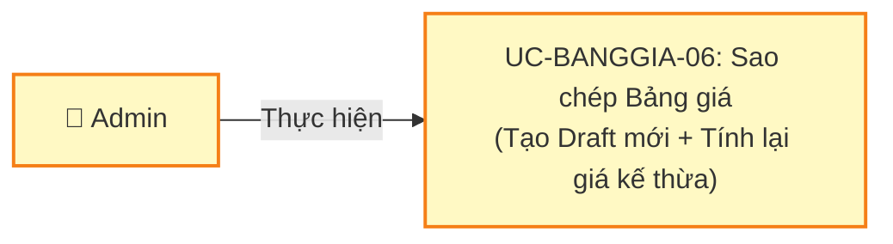
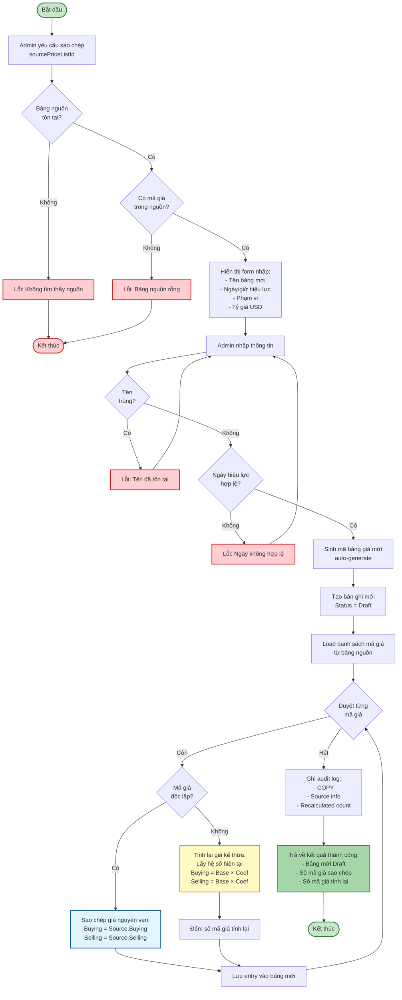
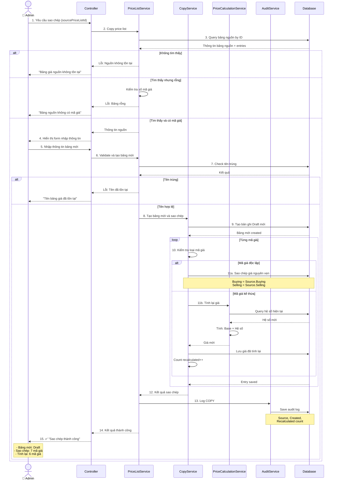
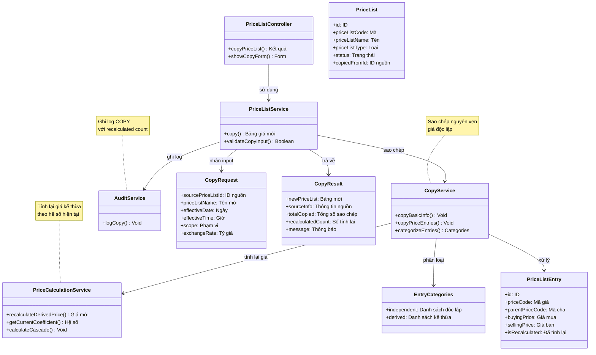

# Use Case UC-BANGGIA-06: Sao chép Bảng giá

---

| **Use Case ID** | **UC-BANGGIA-06** |
|-----------------|------------------||
| **Use Case Name** | Sao chép Bảng giá |
| **Description** | Use Case "Sao chép Bảng giá" cho phép Admin tạo bảng giá mới từ bảng giá có sẵn. Bảng giá mới được tạo ở trạng thái Draft với giá độc lập được sao chép nguyên vẹn, còn giá kế thừa được tính lại theo hệ số hiện tại. |
| **Actor(s)** | Admin |
| **Priority** | Must Have |
| **Trigger** | Admin yêu cầu sao chép một Bảng giá để tạo bảng giá mới |

---

## Input

| Tên trường | Loại | Bắt buộc | Mô tả | Ràng buộc |
|------------|------|----------|-------|-----------|
| `sourcePriceListId` | Số | Có | ID bảng giá nguồn cần sao chép | Bảng giá phải tồn tại |
| `priceListName` | Văn bản | Có | Tên bảng giá mới | Không trùng với bảng giá khác |
| `effectiveDate` | Ngày | Có | Ngày hiệu lực | >= Ngày hiện tại |
| `effectiveTime` | Giờ | Có | Giờ hiệu lực | Định dạng HH:mm |
| `scope` | Văn bản | Có | Phạm vi áp dụng | Chi nhánh hoặc Toàn hệ thống |
| `exchangeRate` | Số | Không | Tỷ giá USD (nếu có) | >= 0 |

---

## Output

### Trường hợp thành công:

| Tên trường | Loại | Mô tả |
|------------|------|-------|
| `id` | Số | ID bảng giá mới |
| `priceListCode` | Văn bản | Mã bảng giá mới (auto-generate) |
| `priceListName` | Văn bản | Tên bảng giá mới |
| `priceListType` | Văn bản | Loại bảng giá (sao chép từ nguồn) |
| `status` | Văn bản | "Draft" |
| `effectiveDate` | Ngày | Ngày hiệu lực |
| `effectiveTime` | Giờ | Giờ hiệu lực |
| `scope` | Văn bản | Phạm vi áp dụng |
| `exchangeRate` | Số | Tỷ giá USD |
| `priceCodeCount` | Số | Số mã giá được sao chép |
| `copiedFrom` | Thông tin | Thông tin bảng giá nguồn |
| `recalculatedCount` | Số | Số mã giá kế thừa được tính lại |
| `priceEntries` | Mảng | Danh sách mã giá với giá đã sao chép/tính lại |
| `message` | Văn bản | "Sao chép bảng giá thành công" |

### Trường hợp lỗi:

| Mã lỗi | Thông báo | Mô tả |
|--------|-----------|-------|
| `SOURCE_NOT_FOUND` | "Bảng giá nguồn không tồn tại" | Không tìm thấy bảng giá nguồn |
| `DUPLICATE_NAME` | "Tên bảng giá đã tồn tại" | Tên trùng với bảng giá khác |
| `INVALID_DATE` | "Ngày hiệu lực không hợp lệ" | Ngày hiệu lực < Ngày hiện tại |
| `NO_PRICE_CODES` | "Bảng giá nguồn không có mã giá" | Bảng nguồn rỗng |

---

## Pre-Condition(s)

- Bảng giá nguồn đã tồn tại trong hệ thống (Active hoặc Inactive)
- Admin đã đăng nhập và có quyền sao chép bảng giá
- Bảng giá nguồn có ít nhất 1 mã giá

---

## Post-Condition(s)

- Bảng giá mới được tạo với trạng thái Draft
- Hệ thống tự động sinh mã bảng giá mới
- Giá độc lập được sao chép nguyên vẹn từ bảng nguồn
- Giá kế thừa được tính lại theo hệ số hiện tại
- Bảng giá mới sẵn sàng để chỉnh sửa giá
- Audit log ghi nhận hành động COPY với thông tin nguồn

---

## Basic Flow

1. Admin yêu cầu sao chép một bảng giá
2. Hệ thống kiểm tra tính hợp lệ:
   - Bảng giá nguồn tồn tại
   - Bảng giá nguồn có mã giá
3. Hệ thống hiển thị form nhập thông tin bảng giá mới:
   - Tên bảng giá (để trống, yêu cầu nhập)
   - Ngày hiệu lực (mặc định: ngày mai)
   - Giờ hiệu lực (mặc định: giờ từ bảng nguồn)
   - Phạm vi (mặc định: từ bảng nguồn)
   - Tỷ giá USD (mặc định: từ bảng nguồn)
   - Loại bảng giá (copy từ nguồn, không cho sửa)
4. Admin nhập thông tin và xác nhận sao chép
5. Hệ thống kiểm tra:
   - Tên không trùng
   - Ngày hiệu lực hợp lệ
6. Hệ thống tạo bảng giá mới:
   - Sinh mã bảng giá mới (auto-generate)
   - Tạo bản ghi với status = Draft
   - Sao chép thông tin cơ bản
7. Hệ thống sao chép các mã giá:
   - Với **mã giá độc lập**: Sao chép giá nguyên vẹn
   - Với **mã giá kế thừa**: Tính lại giá theo hệ số hiện tại
8. Hệ thống ghi audit log:
   - Action: COPY
   - Source: Thông tin bảng nguồn
   - Recalculated: Số mã giá được tính lại
9. Hệ thống trả về kết quả thành công với:
   - Thông tin bảng giá mới
   - Số mã giá được sao chép
   - Số mã giá được tính lại
   - Danh sách chi tiết các mã giá

Use case kết thúc.

---

## Alternative Flow

### 7a. Hệ số mã giá đã thay đổi so với bảng nguồn

7a. Hệ thống phát hiện hệ số của mã giá kế thừa đã thay đổi

7a1. Hệ thống tính lại giá theo hệ số hiện tại

7a2. Hệ thống ghi nhận thông tin tính lại:
```
Mã giá: QTVRTL
Bảng nguồn (04/03/2026):
  - Giá mua: 85,000,000 (snapshot, hệ số cũ 1.0)
  - Giá bán: 87,000,000

Hệ số hiện tại (05/03/2026):
  - Hệ số mua: 1.05
  - Hệ số bán: 1.05

Bảng mới (sau sao chép):
  - Giá mua: 85,000,000 × 1.05 = 89,250,000 (tính lại)
  - Giá bán: 87,000,000 × 1.05 = 91,350,000 (tính lại)
```

7a3. Use case tiếp tục bước 8

---

## Exception Flow

### 2a. Bảng giá nguồn không tồn tại

2a. Hệ thống không tìm thấy bảng giá nguồn

2a1. Hệ thống trả về lỗi: "Bảng giá nguồn không tồn tại hoặc đã bị xóa."

2a2. Use case kết thúc

### 2b. Bảng giá nguồn không có mã giá

2b. Hệ thống phát hiện bảng nguồn rỗng (không có entry)

2b1. Hệ thống trả về lỗi: "Bảng giá nguồn không có mã giá. Không thể sao chép."

2b2. Use case kết thúc

### 5a. Tên bảng giá trùng lặp

5a. Hệ thống phát hiện tên bảng giá đã tồn tại

5a1. Hệ thống trả về lỗi: "Tên bảng giá đã tồn tại. Vui lòng chọn tên khác."

5a2. Admin nhập lại tên mới

5a3. Use case quay lại bước 5

### 5b. Ngày hiệu lực không hợp lệ

5b. Admin nhập ngày hiệu lực < Ngày hiện tại

5b1. Hệ thống trả về lỗi: "Ngày hiệu lực phải >= ngày hiện tại."

5b2. Admin nhập lại ngày

5b3. Use case quay lại bước 5

---

## Business Rules

### BR-BANGGIA-041: Chỉ Admin được sao chép

- Chỉ Admin mới có quyền sao chép bảng giá
- Nhân viên không có quyền này
- Lý do: Sao chép tạo bảng giá mới, ảnh hưởng đến quy trình quản lý

### BR-BANGGIA-042: Sao chép từ mọi trạng thái

Admin có thể sao chép từ bảng giá ở **bất kỳ trạng thái** nào:
- **Draft**: Sao chép bảng giá đang soạn thảo
- **Active**: Sao chép bảng giá đang áp dụng
- **Inactive**: Sao chép bảng giá đã lưu trữ

**Ví dụ:**
```
Bảng giá Draft:
  ✅ Có thể sao chép

Bảng giá Active:
  ✅ Có thể sao chép (trường hợp phổ biến)

Bảng giá Inactive:
  ✅ Có thể sao chép (tái sử dụng bảng giá cũ)
```

### BR-BANGGIA-043: Bảng mới luôn là Draft

- Bảng giá mới **luôn** được tạo với trạng thái **Draft**
- Dù sao chép từ Active hay Inactive → Bảng mới vẫn là Draft
- Admin cần Activate thủ công sau khi kiểm tra
- Mục đích: Đảm bảo Admin kiểm tra và điều chỉnh trước khi áp dụng

**Ví dụ:**
```
Sao chép từ Active:
  Nguồn: "Bảng giá vàng - 03/03/2026" (Active)
  → Bảng mới: "Bảng giá vàng - 05/03/2026" (Draft)

Sao chép từ Inactive:
  Nguồn: "Bảng giá vàng - 01/03/2026" (Inactive)
  → Bảng mới: "Bảng giá vàng - 05/03/2026" (Draft)
```

### BR-BANGGIA-044: Tính lại giá kế thừa

Khi sao chép, hệ thống xử lý **2 loại giá** khác nhau:

**Giá độc lập (không kế thừa):**
- Sao chép **nguyên vẹn** từ bảng nguồn
- Giá mua, giá bán không thay đổi

**Giá kế thừa (có parentPriceCode):**
- **Tính lại** theo hệ số hiện tại
- **KHÔNG** giữ snapshot của bảng nguồn
- Công thức: `Giá = Giá base × Hệ số hiện tại`

**Ví dụ:**
```
Bảng nguồn (03/03/2026 - Active):
  NHANVRTL (độc lập): 85M / 87M
  QTVRTL (Hệ số 1.0): 85M / 87M (snapshot)

Ngày 04/03/2026 - Admin cập nhật hệ số QTVRTL:
  Hệ số mới: 1.05 / 1.05

Ngày 05/03/2026 - Admin sao chép bảng 03/03:
→ Bảng mới (Draft):
  NHANVRTL: 85M / 87M (sao chép nguyên vẹn)
  QTVRTL: 85M × 1.05 = 89.25M / 91.35M (tính lại hệ số mới)
```

### BR-BANGGIA-045: Tự động sinh mã bảng giá mới

- Hệ thống **tự động** sinh mã bảng giá mới (không dùng mã cũ)
- Định dạng: `BG-{Type}-{YYMMDD}-{Seq}`
- Mỗi bảng giá mới có mã riêng biệt

**Ví dụ:**
```
Nguồn: BG-GOLD-260303-001
→ Sao chép ngày 05/03/2026
→ Bảng mới: BG-GOLD-260305-001 (mã mới)
```

### BR-BANGGIA-046: Giữ nguyên loại bảng giá

- Loại bảng giá (priceListType) **không thể thay đổi** khi sao chép
- Bảng mới **luôn cùng loại** với bảng nguồn
- GOLD → GOLD, SILVER → SILVER
- Mục đích: Đảm bảo tính nhất quán của loại bảng giá

**Ví dụ:**
```
Nguồn: Bảng giá GOLD
→ Bảng mới: GOLD (không cho đổi sang SILVER)

Muốn tạo bảng SILVER:
→ Phải dùng UC-BANGGIA-01: Tạo mới (không sao chép từ GOLD)
```

### BR-BANGGIA-047: Cho phép sửa thông tin cơ bản

Admin có thể điều chỉnh thông tin cơ bản của bảng mới:
- ✅ **Có thể sửa**: Tên, ngày/giờ hiệu lực, phạm vi, tỷ giá USD
- ❌ **Không thể sửa**: Loại bảng giá (cùng loại với nguồn)

**Ví dụ:**
```
Bảng nguồn:
  - Tên: "Bảng giá vàng - 03/03/2026"
  - Ngày: 03/03/2026 15:00
  - Phạm vi: Toàn hệ thống

Bảng mới (có thể sửa):
  - Tên: "Bảng giá vàng - 05/03/2026" ✅
  - Ngày: 05/03/2026 08:00 ✅
  - Phạm vi: Chi nhánh A ✅
  - Loại: GOLD ❌ (không đổi được)
```

### BR-BANGGIA-048: Tính lại chuỗi kế thừa nhiều cấp

Với chuỗi kế thừa nhiều cấp (A ← B ← C):
- Tính từ **gốc** đến **lá**
- Sử dụng hệ số hiện tại của từng cấp
- Đảm bảo giá chính xác qua nhiều cấp

**Ví dụ:**
```
Bảng nguồn (snapshot):
  NHANVRTL: 85M (độc lập)
  MNVT9999 (hệ số 0.994): 84.49M
  MNVT999 (hệ số cũ 0.999): 84.39M

Hệ số hiện tại đã thay đổi:
  MNVT9999: 0.994 (không đổi)
  MNVT999: 0.999 → 0.995 (đã đổi)

Bảng mới (sau sao chép):
  NHANVRTL: 85M (sao chép)
  MNVT9999: 85M × 0.994 = 84.49M (tính lại hệ số hiện)
  MNVT999: 84.49M × 0.995 = 84.07M (tính lại hệ số mới)
```

### BR-BANGGIA-049: Ghi nhận audit log chi tiết

Mỗi lần sao chép, hệ thống ghi nhận đầy đủ:
- Action: COPY
- Source: ID và tên bảng nguồn
- Source status: Trạng thái bảng nguồn
- Created: Thông tin bảng mới
- Price count: Tổng số mã giá
- Recalculated count: Số mã giá được tính lại
- Người thực hiện và thời gian

**Ví dụ audit log:**
```
Action: COPY
Performed by: Admin A
Time: 05/03/2026 10:30

Source:
  - ID: 123
  - Name: "Bảng giá vàng - 03/03/2026"
  - Status: Active
  - Type: GOLD

Created:
  - ID: 456
  - Name: "Bảng giá vàng - 05/03/2026"
  - Status: Draft
  - Type: GOLD

Details:
  - Total price codes: 7
  - Independent (copied): 1
  - Derived (recalculated): 6
```

---

## Diagrams

### 1. Use Case Diagram - UC-BANGGIA-06: Sao chép Bảng giá



### 2. Activity Diagram - Luồng Sao chép Bảng giá



### 3. Sequence Diagram - Sao chép Bảng giá với Tính lại Giá



**Kiểm tra nguồn (Bước 3):**
- Tìm bảng nguồn theo ID
- Kiểm tra có mã giá hay không
- Nếu rỗng → Từ chối

**Nhập thông tin (Bước 4-6):**
- Hiển thị form với giá trị mặc định từ nguồn
- Admin nhập thông tin bảng mới
- Validate tên không trùng, ngày hợp lệ

**Sao chép entries (Bước 10-11):**
- Loop qua từng mã giá
- Nếu độc lập: Sao chép nguyên vẹn
- Nếu kế thừa:
  * CalcService query hệ số hiện tại
  * Tính lại: Giá = Base × Hệ số mới
  * Đếm số mã giá được tính lại

**Audit log (Bước 13):**
- Ghi nhận nguồn, bảng mới
- Ghi số mã giá được tính lại

---

### 4. Class Diagram

