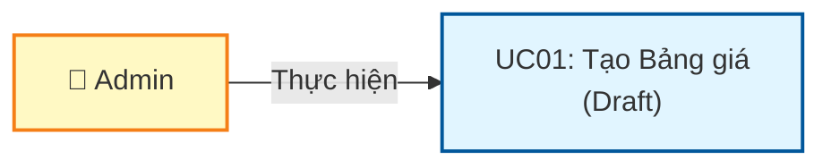
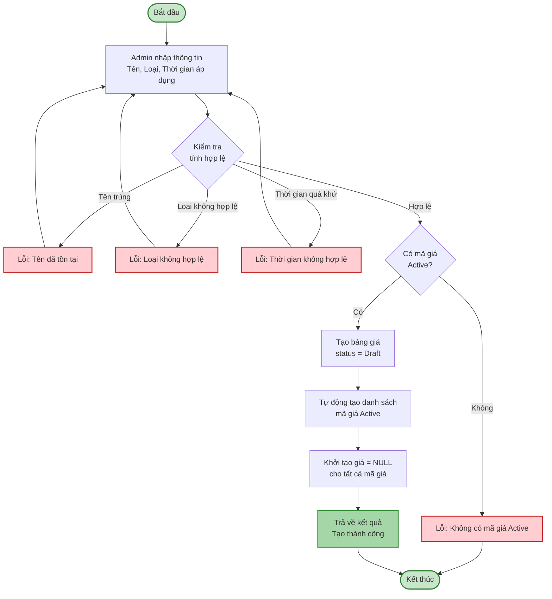
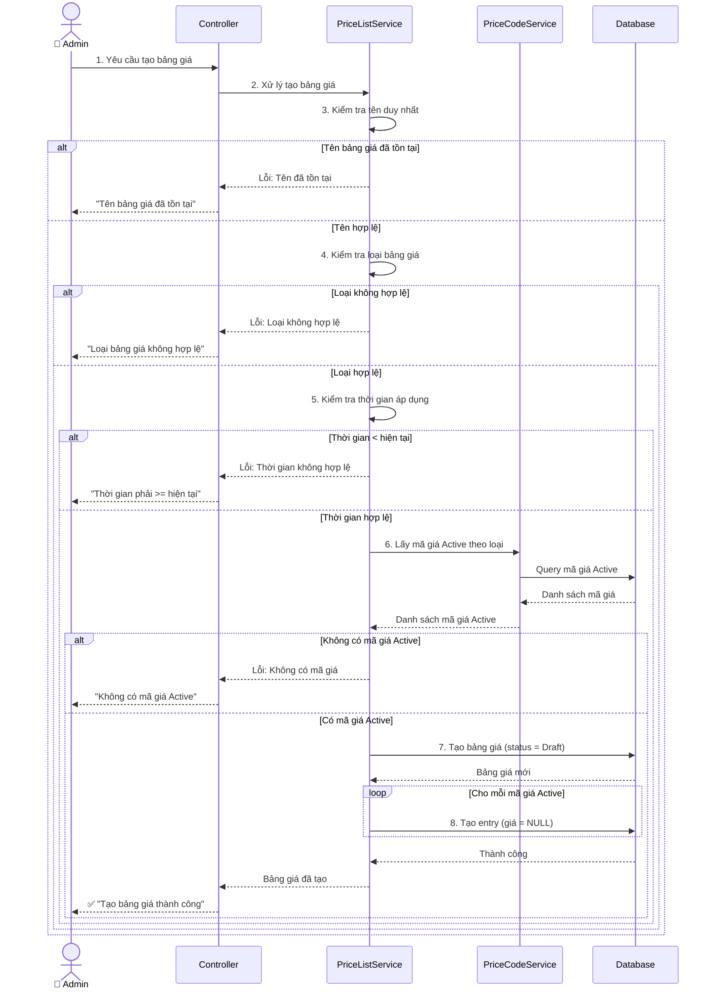
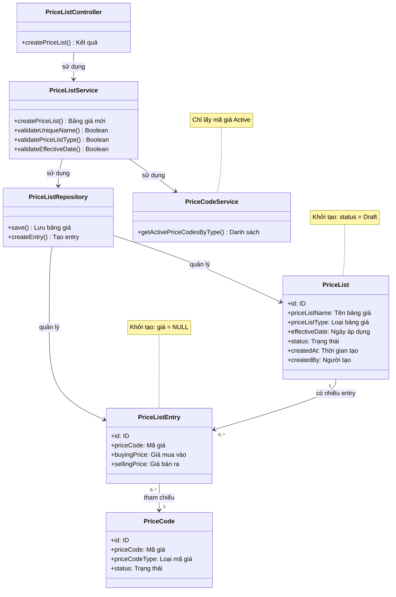

# Use Case UC-1: Tạo Bảng giá

---

| **Use Case ID** | **UC-1** |
|-----------------|----------|
| **Use Case Name** | Tạo Bảng giá |
| **Description** | Use Case "Tạo Bảng giá" cho phép Admin tạo mới bảng giá nguyên liệu ở trạng thái Draft để chuẩn bị nhập giá cho các mã giá. |
| **Actor(s)** | Admin |
| **Priority** | Must Have |
| **Trigger** | Admin yêu cầu tạo bảng giá mới |

---

## Input

| Tên trường | Loại | Bắt buộc | Mô tả | Ràng buộc |
|------------|------|----------|-------|-----------|
| `priceListCode` | Văn bản | Không | Mã bảng giá | Tự động sinh nếu để trống |
| `priceListName` | Văn bản | Có | Tên bảng giá | Max 100 ký tự, duy nhất |
| `priceListType` | Văn bản | Có | Loại bảng giá | "GOLD", "SILVER", v.v. |
| `effectiveDate` | Ngày | Có | Ngày bảng giá | >= ngày hiện tại |
| `effectiveTime` | Giờ | Có | Giờ bảng giá | Định dạng HH:mm:ss |
| `scope` | Văn bản | Có | Phạm vi áp dụng | "Toàn bộ hệ thống" hoặc chi nhánh cụ thể |
| `usdExchangeRate` | Số thập phân | Có | Tỷ giá USD | > 0 |
| `isActive` | Boolean | Không | Trạng thái kích hoạt | true/false, mặc định = false |

---

## Output

### Trường hợp thành công:

| Tên trường | Loại | Mô tả |
|------------|------|-------|
| `id` | Số | ID bảng giá mới được tạo |
| `priceListCode` | Văn bản | Mã bảng giá (tự động sinh) |
| `priceListName` | Văn bản | Tên bảng giá |
| `priceListType` | Văn bản | Loại bảng giá |
| `effectiveDate` | Ngày | Ngày bảng giá |
| `effectiveTime` | Giờ | Giờ bảng giá |
| `scope` | Văn bản | Phạm vi áp dụng |
| `usdExchangeRate` | Số thập phân | Tỷ giá USD |
| `status` | Văn bản | Trạng thái = "Draft" |
| `priceCodeCount` | Số | Số lượng mã giá trong bảng |
| `priceEntries` | Danh sách | Danh sách các mã giá với thông tin chi tiết |
| `createdAt` | Ngày giờ | Thời gian tạo |
| `createdBy` | Văn bản | Người tạo |

**Cấu trúc mỗi entry trong `priceEntries`:**

| Tên trường | Loại | Mô tả |
|------------|------|-------|
| `priceCode` | Văn bản | Mã giá (từ Price Code) |
| `parentPriceCode` | Văn bản | Mã giá gốc (nếu có kế thừa) |
| `buyingCoefficient` | Số thập phân | Hệ số mua vào |
| `sellingCoefficient` | Số thập phân | Hệ số bán ra |
| `brand` | Văn bản | Thương hiệu |
| `categoryName` | Văn bản | Loại vàng/Nhóm hàng |
| `goldContent` | Văn bản | Hàm lượng vàng |
| `buyingPrice` | Số thập phân | Giá mua vào (có thể NULL) |
| `sellingPrice` | Số thập phân | Giá bán ra (có thể NULL) |

### Trường hợp lỗi:

| Mã lỗi | Thông báo | Mô tả |
|--------|-----------|-------|
| `DUPLICATE_NAME` | "Tên bảng giá đã tồn tại" | Tên bảng giá bị trùng |
| `DUPLICATE_CODE` | "Mã bảng giá đã tồn tại" | Mã bảng giá bị trùng |
| `INVALID_DATE` | "Ngày bảng giá phải lớn hơn hoặc bằng ngày hiện tại" | Ngày áp dụng không hợp lệ |
| `INVALID_TYPE` | "Loại bảng giá không hợp lệ" | Loại bảng giá không có trong danh mục |
| `INVALID_USD_RATE` | "Tỷ giá USD phải lớn hơn 0" | Tỷ giá USD không hợp lệ |
| `NO_ACTIVE_PRICE_CODES` | "Không có mã giá Active nào cho loại này" | Chưa có mã giá Active |

---

## Pre-Condition(s)

- Admin đã đăng nhập và có quyền tạo bảng giá
- Hệ thống đã có ít nhất một mã giá Active cho loại bảng giá cần tạo
- Danh mục loại bảng giá đã được cấu hình

---

## Post-Condition(s)

- Bảng giá mới được tạo với trạng thái Draft
- Hệ thống tự động tạo danh sách các mã giá Active tương ứng với loại bảng giá
- Các mã giá trong bảng chưa có giá (NULL)
- Hệ thống ghi nhận thông tin người tạo và thời gian tạo

---

## Basic Flow

1. Admin yêu cầu tạo bảng giá mới
2. Hệ thống yêu cầu Admin cung cấp thông tin:
   - Mã bảng giá (tùy chọn, hệ thống tự sinh nếu để trống)
   - Tên bảng giá (bắt buộc, duy nhất)
   - Loại bảng giá (bắt buộc: GOLD, SILVER, v.v.)
   - Ngày bảng giá (bắt buộc, >= ngày hiện tại)
   - Giờ bảng giá (bắt buộc)
   - Phạm vi áp dụng (bắt buộc: Toàn bộ hệ thống hoặc chi nhánh cụ thể)
   - Tỷ giá USD (bắt buộc, > 0)
   - Trạng thái kích hoạt (tùy chọn, mặc định = false)
3. Admin cung cấp đầy đủ thông tin
4. Hệ thống kiểm tra tính hợp lệ:
   - Mã bảng giá chưa tồn tại (nếu nhập)
   - Tên bảng giá chưa tồn tại
   - Loại bảng giá hợp lệ
   - Ngày áp dụng >= ngày hiện tại
   - Tỷ giá USD > 0
   - Có ít nhất một mã giá Active cho loại bảng giá này
5. Hệ thống tạo bảng giá mới:
   - Sinh mã bảng giá tự động (nếu chưa nhập)
   - Lưu thông tin cơ bản với status = Draft
   - Tự động load danh sách các mã giá Active tương ứng với loại bảng giá
   - Hiển thị thông tin chi tiết của mỗi mã giá: Mã gốc, Hệ số mua/bán, Thương hiệu, Loại vàng, Hàm lượng
   - Khởi tạo giá mua vào = NULL, giá bán ra = NULL cho tất cả mã giá
6. Hệ thống trả về bảng giá Draft với danh sách mã giá đầy đủ thông tin
7. Admin có thể nhập giá ngay hoặc lưu để nhập sau (UC02)

Use case kết thúc.

---

## Alternative Flow

*Không có luồng thay thế*

---

## Exception Flow

### 4a. Tên bảng giá đã tồn tại

4a. Hệ thống phát hiện tên bảng giá đã tồn tại trong hệ thống

4a1. Hệ thống trả về lỗi: "Tên bảng giá '[Tên bảng giá]' đã tồn tại. Vui lòng chọn tên khác."

4a2. Use case quay lại bước 3

### 4b. Loại bảng giá không hợp lệ

4b. Hệ thống phát hiện loại bảng giá không có trong danh mục

4b1. Hệ thống trả về lỗi: "Loại bảng giá không hợp lệ. Vui lòng chọn từ danh sách: [Danh sách loại]"

4b2. Use case quay lại bước 3

### 4c. Thời gian áp dụng không hợp lệ

4c. Hệ thống phát hiện thời gian áp dụng < thời gian hiện tại

4c1. Hệ thống trả về lỗi: "Thời gian áp dụng phải lớn hơn hoặc bằng thời gian hiện tại."

4c2. Use case quay lại bước 3

### 4d. Không có mã giá Active

4d. Hệ thống phát hiện không có mã giá Active nào cho loại bảng giá này

4d1. Hệ thống trả về lỗi: "Không có mã giá Active nào cho loại '[Loại bảng giá]'. Vui lòng tạo mã giá trước khi tạo bảng giá."

4d2. Use case kết thúc

---

## Business Rules

### BR-UC01-001: Trạng thái khởi tạo

- Bảng giá mới luôn được tạo với status = **Draft**
- Mục đích: Cho phép Admin nhập giá trước khi Active
- Không thể tạo bảng giá với status = Active ngay từ đầu

### BR-UC01-002: Tên bảng giá duy nhất

- Tên bảng giá phải là duy nhất trong toàn hệ thống
- Không phân biệt hoa thường khi kiểm tra trùng lặp
- Mục đích: Dễ dàng nhận biết và quản lý bảng giá

### BR-UC01-003: Ngày và Giờ áp dụng

- Ngày bảng giá phải >= ngày hiện tại
- Giờ bảng giá được nhập riêng (HH:mm:ss)
- Cho phép tạo bảng giá cho tương lai
- Mục đích: Chuẩn bị trước bảng giá cho các thời điểm cụ thể

**Ví dụ:**
```
Ngày hiện tại: 04/03/2026
Ngày áp dụng hợp lệ:
  - 04/03/2026 ✅ (hôm nay)
  - 05/03/2026 ✅ (ngày mai)

Ngày áp dụng không hợp lệ:
  - 03/03/2026 ❌ (quá khứ)

Giờ bảng giá:
  - 09:00:00 (buổi sáng)
  - 15:46:10 (buổi chiều)
```

### BR-UC01-003A: Tỷ giá USD

- Tỷ giá USD là bắt buộc và phải > 0
- Được sử dụng trong tính toán giá (nếu có)
- Có thể cập nhật sau trong UC02

**Ví dụ:**
```
Tỷ giá USD hợp lệ:
  - 26,000 ✅
  - 25,500 ✅

Tỷ giá USD không hợp lệ:
  - 0 ❌
  - -1000 ❌
```

### BR-UC01-003B: Phạm vi áp dụng

- Bảng giá có thể áp dụng cho:
  - **Toàn bộ hệ thống**: Áp dụng cho tất cả chi nhánh
  - **Chi nhánh cụ thể**: Chỉ áp dụng cho chi nhánh được chọn
- Một loại bảng giá chỉ có 1 bảng Active cho mỗi phạm vi tại một thời điểm

### BR-UC01-003C: Mã bảng giá tự động

- Nếu Admin không nhập mã bảng giá → Hệ thống tự động sinh
- Quy tắc sinh mã (ví dụ): `PL-YYYYMMDD-XXX`
  - PL: Price List
  - YYYYMMDD: Ngày tạo
  - XXX: Số thứ tự trong ngày
- Nếu Admin nhập mã → Kiểm tra duy nhất

### BR-UC01-004: Tự động load danh sách mã giá với thông tin chi tiết

Khi tạo bảng giá, hệ thống tự động:
- Lấy tất cả **mã giá Active** tương ứng với loại bảng giá
- Tạo các entry trong bảng giá cho từng mã giá
- Hiển thị thông tin chi tiết từ Mã giá:
  - Mã giá (Price Code)
  - Mã giá gốc (Parent Price Code) - nếu có kế thừa
  - Hệ số mua vào
  - Hệ số bán ra
  - Thương hiệu
  - Loại vàng/Nhóm hàng
  - Hàm lượng vàng
- Khởi tạo giá mua vào = NULL, giá bán ra = NULL

**Ví dụ:**
```
Tạo bảng giá loại "GOLD"
→ Hệ thống load 7 mã giá Active:

Entry 1: NHANVRTL
  - Mã gốc: NHANVRTL
  - Hệ số mua: 1, Hệ số bán: 1
  - Thương hiệu: Vàng rồng Thăng Long
  - Loại vàng: Nhẫn Vàng rồng
  - Hàm lượng: 24k
  - Giá mua: NULL (chờ nhập)
  - Giá bán: NULL (chờ nhập)

Entry 2: QTVRTL
  - Mã gốc: NHANVRTL (kế thừa)
  - Hệ số mua: 1, Hệ số bán: 1
  - Thương hiệu: Vàng rồng Thăng Long
  - Loại vàng: Quỳ tống Vàng Rồng
  - Hàm lượng: 24k
  - Giá mua: NULL
  - Giá bán: NULL

... và 5 entry khác
```

### BR-UC01-005: Phân loại theo loại bảng giá

- Mỗi bảng giá thuộc một **loại cụ thể** (Vàng ta, Vàng tây, Bạc, v.v.)
- Loại bảng giá quyết định mã giá nào được đưa vào bảng
- Không thể thay đổi loại bảng giá sau khi tạo

### BR-UC01-006: Liên kết với Mã giá

- Bảng giá **phụ thuộc** vào module Quản lý Mã giá
- Chỉ mã giá **Active** mới được đưa vào bảng giá mới
- Nếu không có mã giá Active → Không thể tạo bảng giá

---

## Diagrams

### 1. Use Case Diagram - UC01: Tạo Bảng giá



### 2. Activity Diagram - Luồng tạo Bảng giá



### 3. Sequence Diagram - Tạo Bảng giá



**Giải thích Sequence Diagram:**

**Kiểm tra tính hợp lệ (Bước 3-5):**
- Kiểm tra tên bảng giá duy nhất
- Kiểm tra loại bảng giá hợp lệ
- Kiểm tra thời gian áp dụng >= thời gian hiện tại

**Lấy mã giá (Bước 6):**
- Lấy danh sách mã giá Active theo loại bảng giá
- Nếu không có mã giá → Từ chối tạo

**Tạo bảng giá (Bước 7-8):**
- Tạo bảng giá với status = Draft
- Tạo entry cho mỗi mã giá Active (giá = NULL)
- Trả về thành công

---

### 4. Class Diagram



---

## Business Scenario

### Scenario 1: Tạo bảng giá vàng thành công

```
Thời điểm: 04/03/2026 15:46

Admin thực hiện:
1. Yêu cầu tạo bảng giá
2. Nhập thông tin:
   - Mã bảng giá: (để trống - tự sinh)
   - Tên: "Nhập tên bảng giá vàng"
   - Loại: GOLD
   - Ngày: 04/03/2026
   - Giờ: 15:46:10
   - Phạm vi: Toàn bộ hệ thống
   - Tỷ giá USD: 26,000
   - Trạng thái: false (chưa kích hoạt)

Hệ thống có 7 mã giá Active loại "GOLD":
  - NHANVRTL: Nhẫn Vàng rồng (24k)
  - QTVRTL: Quỳ tống Vàng Rồng (24k)
  - MVRTL: Miếng Vàng Rồng (24k)
  - MNVT9999: Vàng trang sức Bảo Tín (24k)
  - MNVT999: Vàng trang sức 999 (24k)
  - BANVI: Vàng bản vỉ (24k)
  - VHT99.99: Vàng hệ thống 99.99% (24k)

Kết quả:
✅ Tạo thành công bảng giá Draft
  - Mã: PL-20260304-001 (tự sinh)
  - Status: Draft
  - Có 7 entry với thông tin chi tiết:
    
    Entry 1 - NHANVRTL:
      Mã gốc: NHANVRTL, Hệ số: 1/1
      Thương hiệu: Vàng rồng Thăng Long
      Loại: Nhẫn Vàng rồng, Hàm lượng: 24k
      Giá mua: NULL, Giá bán: NULL
    
    Entry 2 - QTVRTL (kế thừa NHANVRTL):
      Mã gốc: NHANVRTL, Hệ số: 1/1
      Thương hiệu: Vàng rồng Thăng Long
      Loại: Quỳ tống Vàng Rồng, Hàm lượng: 24k
      Giá mua: NULL, Giá bán: NULL
      
    ... và 5 entry khác
    
→ Admin có thể:
  - Nhập giá ngay tại màn hình này
  - Hoặc lưu Draft và nhập sau (UC02)
```

### Scenario 2: Không thể tạo vì chưa có mã giá

```
Admin thực hiện:
1. Yêu cầu tạo bảng giá loại "SILVER"
2. Nhập thông tin đầy đủ

Hệ thống kiểm tra:
  - Không có mã giá Active nào cho loại "SILVER"

Kết quả:
❌ Lỗi: "Không có mã giá Active nào cho loại 'SILVER'. 
         Vui lòng tạo mã giá trước khi tạo bảng giá."

Giải pháp:
→ Admin cần chuyển sang module Quản lý Mã giá
→ Tạo mã giá Active cho loại "SILVER"
→ Sau đó mới quay lại tạo bảng giá
```

### Scenario 3: Tạo bảng giá và nhập giá ngay

```
Admin thực hiện:
1. Tạo bảng giá GOLD với thông tin đầy đủ
2. Hệ thống load 7 mã giá với thông tin chi tiết
3. Admin nhập giá ngay cho entry đầu tiên (NHANVRTL):
   - Giá mua vào: 1 (giá cơ sở)
   - Giá bán ra: 1 (giá cơ sở)
4. Các entry kế thừa từ NHANVRTL sẽ tự động tính giá (UC02)

Kết quả:
✅ Bảng giá Draft có 1/7 mã giá đã nhập giá
→ Admin có thể tiếp tục nhập giá cho các mã giá còn lại
→ Hoặc lưu Draft để nhập sau
```

---
