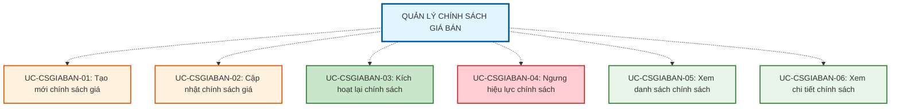

# QUẢN LÝ CHÍNH SÁCH GIÁ BÁN (PRICING POLICY MANAGEMENT)

## Tổng quan Module

Chức năng "Quản lý Chính sách Giá bán" cung cấp khả năng thiết lập và quản lý các quy tắc tính giá bán tự động dựa trên các tham số như dòng sản phẩm, mảng kinh doanh và phạm vi áp dụng. Đây là nơi kết nối giữa Mã quy tắc/Mã giá và Hệ thống cửa hàng thực tế.

---

## 1. MÔ TẢ CHỨC NĂNG

### 1.1. Mục tiêu
- **Tự động hóa định giá bán**: Thiết lập quy tắc tính giá bán tự động dựa trên mã giá và các tham số nghiệp vụ
- **Quản lý phạm vi áp dụng**: Hỗ trợ áp dụng chính sách cho toàn hệ thống hoặc từng chi nhánh/khu vực cụ thể
- **Kiểm soát xung đột chính sách**: Đảm bảo một dòng sản phẩm tại một thời điểm chỉ áp dụng duy nhất một chính sách
- **Quản lý vòng đời chính sách**: Theo dõi thời gian hiệu lực và trạng thái hoạt động của chính sách

### 1.2. Phạm vi áp dụng
- **Đối tượng quản lý**: Chính sách giá bán cho các dòng sản phẩm trong hệ thống POS
- **Ràng buộc nghiệp vụ**: Sử dụng Mã giá (Price Code) đã được thiết lập trong module Quản lý Mã giá và Bảng giá
- **Phạm vi tác động**: Ảnh hưởng trực tiếp đến giá bán sản phẩm tại các cửa hàng/chi nhánh

### 1.3. Định nghĩa
**Chính sách giá bán** là tập hợp các quy tắc xác định cách tính giá bán cho một dòng sản phẩm cụ thể, áp dụng tại một phạm vi nhất định (toàn hệ thống hoặc cửa hàng cụ thể) từ một thời điểm xác định.

**Cấu trúc Chính sách giá bán** bao gồm:
- Mã quy tắc (tự động sinh)
- Ngày có hiệu lực
- Mảng kinh doanh (VD: Vàng trang sức, Vàng miếng)
- Phạm vi áp dụng (Toàn hệ thống / Chi nhánh / Khu vực cụ thể)
- Dòng sản phẩm
- QTTG bán (Quy tắc tính giá - liên kết với Price Code)
- Công thức tính giá (Hiển thị logic tính toán)
- Trạng thái (Active / Inactive)

**Cơ chế ưu tiên chính sách:**
- **Chính sách cụ thể**: Áp dụng cho cửa hàng/chi nhánh cụ thể có ưu tiên cao hơn
- **Chính sách chung**: Áp dụng cho toàn hệ thống có ưu tiên thấp hơn
- Tại một thời điểm, một dòng sản phẩm tại một cửa hàng chỉ có duy nhất một chính sách hoạt động

---

## 2. TÁC NHÂN (ACTORS)

| Tác nhân | Vai trò | Quyền hạn |
|----------|---------|-----------|
| **Admin** | Người quản lý toàn bộ hệ thống chính sách giá | - Tạo, cập nhật chính sách giá - Thiết lập quy tắc tính giá - Quản lý phạm vi áp dụng - Ngưng hiệu lực chính sách - Xem danh sách và chi tiết chính sách |
| **Nhân viên** | Người xem và áp dụng chính sách giá | - Xem danh sách chính sách Active - Xem chi tiết chính sách - Sử dụng chính sách trong giao dịch bán hàng |

### 2.1. Ma trận Phân quyền Actor

| Use Case | Admin | Nhân viên | Ghi chú |
|----------|:-----:|:---------:|---------|
| **UC-CSGIABAN-01: Tạo mới chính sách giá** | ✅ | ❌ | Chỉ Admin có quyền tạo chính sách mới |
| **UC-CSGIABAN-02: Cập nhật chính sách giá** | ✅ | ❌ | Chỉ Admin có quyền cập nhật, có audit log |
| **UC-CSGIABAN-03: Kích hoạt lại chính sách** | ✅ | ❌ | Chỉ Admin có quyền kích hoạt lại chính sách Inactive |
| **UC-CSGIABAN-04: Ngưng hiệu lực chính sách** | ✅ | ❌ | Chỉ Admin có quyền ngưng hiệu lực |
| **UC-CSGIABAN-05: Xem danh sách chính sách** | ✅ | ✅* | *Nhân viên chỉ xem được chính sách Active |
| **UC-CSGIABAN-06: Xem chi tiết chính sách** | ✅ | ✅ | Cả hai có quyền xem chi tiết |

**Chú thích:**
- ✅ = Có quyền thực hiện
- ❌ = Không có quyền thực hiện
- ✅* = Có quyền với giới hạn (xem ghi chú)

---

## 3. DANH SÁCH USE CASE

### 3.1. Tổng quan Use Case

---

## 4. CẤU TRÚC TÀI LIỆU

### Use Cases (Tính năng nghiệp vụ)
- **UC-CSGIABAN-01: Tạo mới chính sách giá** - Thiết lập các thông số chính sách giá mới
- **UC-CSGIABAN-02: Cập nhật chính sách giá** - Chỉnh sửa thông tin chính sách (có audit log)
- **UC-CSGIABAN-03: Kích hoạt lại chính sách** - Kích hoạt lại chính sách đã ngưng hiệu lực (Inactive → Active)
- **UC-CSGIABAN-04: Ngưng hiệu lực chính sách** - Chuyển trạng thái sang "Không hoạt động" (Active → Inactive)
- **UC-CSGIABAN-05: Xem danh sách chính sách** - Lọc, tìm kiếm và hiển thị danh sách chính sách
- **UC-CSGIABAN-06: Xem chi tiết chính sách** - Xem thông tin đầy đủ của một chính sách

**Lưu ý:** 
- Kiểm tra xung đột chính sách là chức năng tự động được bao gồm (include) trong UC-01, UC-02 và UC-03, không phải use case độc lập.
- Trạng thái chính sách có thể chuyển đổi hai chiều: Active ⇄ Inactive (reversible).

---

## 5. BUSINESS RULE (Quy tắc nghiệp vụ)

### ⭐ Cơ chế hỗ trợ nghiệp vụ
- ✅ **Chọn lọc chính sách theo thời gian**: Hệ thống tự động áp dụng chính sách đang có hiệu lực tại thời điểm hiện tại
- ✅ **Ưu tiên phạm vi tự động**: Chính sách cụ thể ưu tiên cao hơn chính sách toàn hệ thống
- ✅ **Snapshot công thức**: Hiển thị công thức tính giá tương ứng để xác nhận trước khi lưu
- ✅ **Audit log đầy đủ**: Theo dõi toàn bộ lịch sử thay đổi chính sách đã có hiệu lực
- ✅ **Lọc dữ liệu thông minh**: Tự động lọc Dòng sản phẩm theo Mảng kinh doanh đã chọn

### 🔒 Ràng buộc quan trọng

**BR-CSGIABAN-01: Thời gian hiệu lực**
- ❌ Ngày có hiệu lực **không được nhỏ hơn** ngày hiện tại (trừ trường hợp backdate có quyền đặc biệt)

**BR-CSGIABAN-02: Ưu tiên phạm vi**
- ⚠️ Chính sách áp dụng cho **Cửa hàng cụ thể** có ưu tiên cao hơn chính sách **Toàn hệ thống** nếu có xung đột trên cùng một dòng sản phẩm

**BR-CSGIABAN-03: Chính sách duy nhất**
- ❌ Tại một thời điểm, một Dòng sản phẩm tại một Cửa hàng chỉ được áp dụng **duy nhất một quy tắc tính giá** đang hoạt động

**BR-CSGIABAN-04: Snapshot Công thức**
- ✅ Khi cập nhật, hệ thống phải hiển thị công thức tương ứng của QTTG được chọn để User xác nhận trước khi lưu

**BR-CSGIABAN-05: Kiểm tra dữ liệu bắt buộc**
- ❌ Các trường bắt buộc phải được **kiểm tra và xác thực** đầy đủ
- ❌ Mã quy tắc được **sinh tự động**, không cho phép nhập thủ công

### 📋 Cảnh báo Hệ thống

**Khi tạo/cập nhật chính sách có xung đột:**
> "Dòng sản phẩm '[Tên dòng SP]' đã được áp dụng chính sách giá khác tại [Phạm vi] từ ngày [Ngày hiệu lực].  
> Vui lòng ngưng hiệu lực chính sách cũ hoặc chọn dòng sản phẩm khác."

**Khi chỉnh sửa chính sách đã có hiệu lực:**
> "Chính sách này đã có hiệu lực từ [Ngày]. Việc thay đổi sẽ ảnh hưởng đến giá bán hiện tại.  
> Bạn có chắc chắn muốn tiếp tục?  
> Lưu ý: Tất cả thay đổi sẽ được ghi log."

**Khi backdate (nếu có quyền):**
> "Bạn đang thiết lập ngày hiệu lực trong quá khứ.  
> Điều này có thể ảnh hưởng đến các giao dịch đã xảy ra.  
> Vui lòng xác nhận với phòng Kế toán trước khi lưu."

Hệ thống sẽ **không cho phép lưu** nếu vi phạm các ràng buộc BR-CSGIABAN-01, BR-CSGIABAN-03.

---

## 6. LIÊN HỆ & HỖ TRỢ

**Phiên bản:** v1.0  
**Cập nhật:** 05/03/2026  
**Nguồn:** DEMO.MD  
**Module liên quan:** 
- Quản lý Mã giá (Price Code Management)
- Quản lý Bảng giá (Price List Management)
