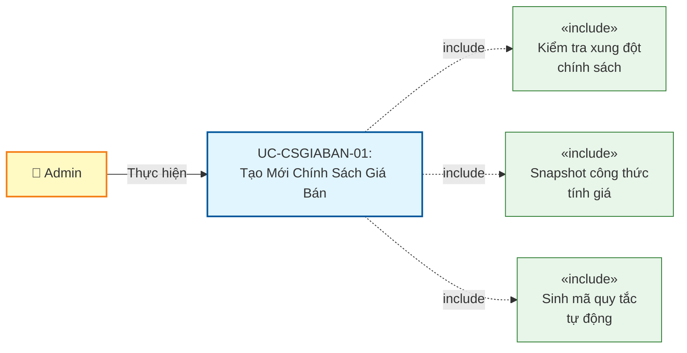
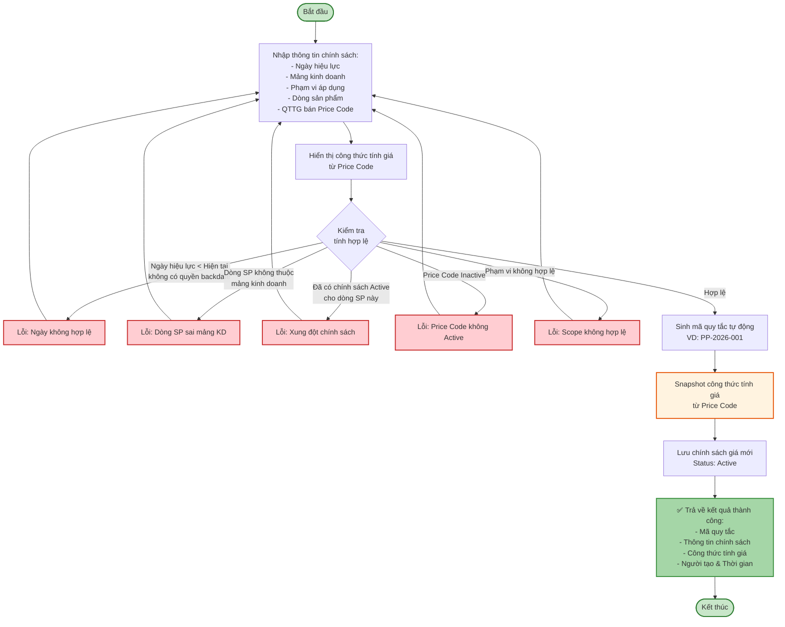
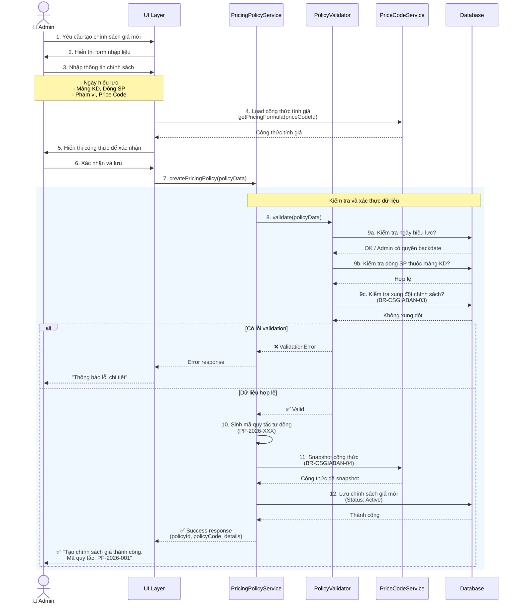
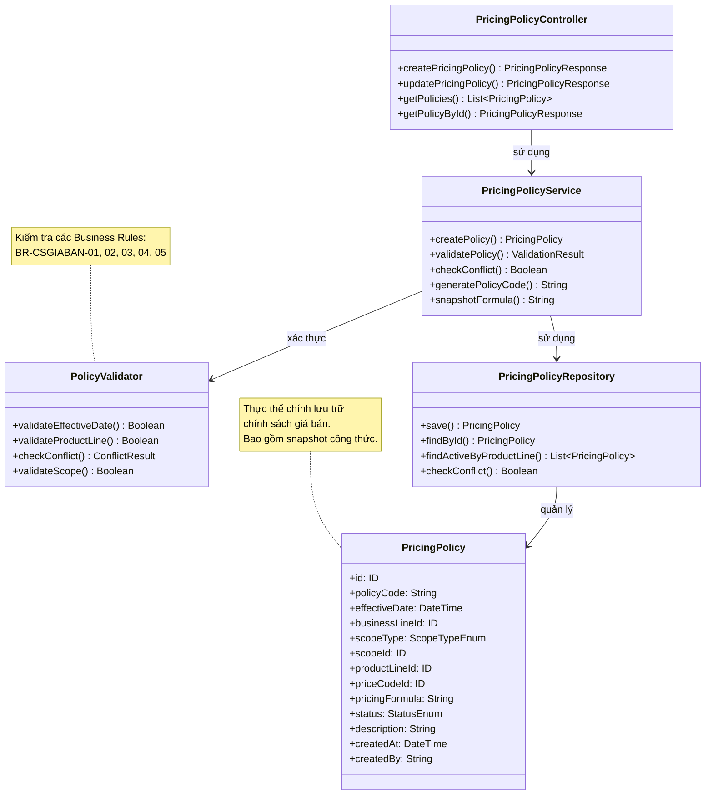

# Use Case UC-CSGIABAN-01: Tạo Mới Chính Sách Giá Bán

---

| **Use Case ID** | **UC-CSGIABAN-01** |
|-----------------|---------------------|
| **Use Case Name** | Tạo Mới Chính Sách Giá Bán |
| **Description** | Use Case "Tạo Mới Chính Sách Giá Bán" cho phép Admin thiết lập quy tắc tính giá bán tự động cho một dòng sản phẩm cụ thể, áp dụng tại một phạm vi nhất định (toàn hệ thống hoặc cửa hàng cụ thể) từ một thời điểm xác định. |
| **Actor(s)** | Admin |
| **Priority** | Must Have |
| **Trigger** | Admin chọn chức năng "Tạo chính sách giá mới" |

---

## Input

| Tên trường | Loại | Bắt buộc | Mô tả | Ràng buộc |
|------------|------|----------|-------|-----------|
| `effectiveDate` | Ngày giờ | Có | Ngày có hiệu lực | Không được nhỏ hơn ngày hiện tại (trừ trường hợp backdate với quyền đặc biệt) |
| `businessLineId` | Số | Có | Mảng kinh doanh | Phải là mảng kinh doanh hợp lệ (VD: Vàng trang sức, Vàng miếng, Bạc) |
| `scopeType` | Enum | Có | Loại phạm vi áp dụng | `ALL_SYSTEM` hoặc `SPECIFIC_STORE` hoặc `SPECIFIC_REGION` |
| `scopeId` | Số | Có (nếu scope cụ thể) | ID cửa hàng/khu vực | Bắt buộc khi scopeType không phải ALL_SYSTEM |
| `productLineId` | Số | Có | Dòng sản phẩm | Phải thuộc mảng kinh doanh đã chọn |
| `priceCodeId` | Số | Có | QTTG bán (Price Code) | Phải là mã giá Active, phù hợp với dòng sản phẩm |
| `description` | Văn bản | Không | Ghi chú/Mô tả | Max 500 ký tự |

**Quy tắc đầu vào:**
- Ngày có hiệu lực không được là ngày trong quá khứ (trừ Admin có quyền backdate)
- Dòng sản phẩm phải thuộc mảng kinh doanh đã chọn
- Khi chọn phạm vi cụ thể (cửa hàng/khu vực), phải cung cấp scopeId tương ứng
- Mã quy tắc được sinh tự động bởi hệ thống

---

## Output

### Trường hợp thành công:

| Tên trường | Loại | Mô tả |
|------------|------|-------|
| `id` | Số | ID chính sách giá mới được tạo |
| `policyCode` | Văn bản | Mã quy tắc (sinh tự động, VD: "PP-2026-001") |
| `effectiveDate` | Ngày giờ | Ngày có hiệu lực |
| `businessLine` | Thông tin | Thông tin mảng kinh doanh (id, name) |
| `scopeType` | Văn bản | Loại phạm vi áp dụng |
| `scopeName` | Văn bản | Tên phạm vi (Toàn hệ thống / Tên cửa hàng / Tên khu vực) |
| `productLine` | Thông tin | Thông tin dòng sản phẩm (id, code, name) |
| `priceCode` | Thông tin | Thông tin QTTG bán (id, code, name) |
| `pricingFormula` | Văn bản | Công thức tính giá (hiển thị từ Price Code) |
| `status` | Văn bản | Trạng thái = "Active" |
| `description` | Văn bản | Ghi chú/Mô tả |
| `createdAt` | Ngày giờ | Thời gian tạo |
| `createdBy` | Văn bản | Người tạo |

### Trường hợp lỗi:

| Mã lỗi | Thông báo | Mô tả |
|--------|-----------|-------|
| `INVALID_EFFECTIVE_DATE` | "Ngày có hiệu lực không được nhỏ hơn ngày hiện tại" | Ngày hiệu lực trong quá khứ (không có quyền backdate) |
| `PRODUCT_LINE_MISMATCH` | "Dòng sản phẩm không thuộc mảng kinh doanh đã chọn" | Dòng sản phẩm không khớp với mảng kinh doanh |
| `POLICY_CONFLICT` | "Dòng sản phẩm đã có chính sách giá khác đang áp dụng" | Vi phạm BR-CSGIABAN-03 (đã có chính sách Active) |
| `INACTIVE_PRICE_CODE` | "Mã giá đã bị vô hiệu hóa" | Price Code không ở trạng thái Active |
| `SCOPE_REQUIRED` | "Vui lòng chọn cửa hàng/khu vực áp dụng" | Không cung cấp scopeId khi chọn phạm vi cụ thể |
| `INVALID_SCOPE` | "Cửa hàng/Khu vực không tồn tại" | scopeId không hợp lệ |

---

## Pre-Condition(s)

- Mảng kinh doanh đã được cấu hình trong hệ thống
- Dòng sản phẩm đã tồn tại và thuộc mảng kinh doanh
- Mã giá (Price Code) đã được tạo và ở trạng thái Active
- (Nếu chọn phạm vi cụ thể) Cửa hàng/Khu vực đã tồn tại trong hệ thống
- Admin đã đăng nhập và có quyền tạo chính sách giá

---

## Post-Condition(s)

- Chính sách giá mới được tạo thành công với trạng thái Active
- Chính sách được liên kết với dòng sản phẩm, phạm vi áp dụng và mã giá
- Hệ thống ghi nhận thông tin người tạo và thời gian tạo
- Công thức tính giá được snapshot từ Price Code tại thời điểm tạo
- Chính sách sẽ tự động được áp dụng khi đến ngày hiệu lực

---

## Basic Flow

1. Admin yêu cầu tạo chính sách giá mới
2. Hệ thống yêu cầu Admin cung cấp thông tin:
   - Ngày có hiệu lực (bắt buộc, >= ngày hiện tại)
   - Mảng kinh doanh (bắt buộc)
   - Phạm vi áp dụng (bắt buộc: Toàn hệ thống / Cửa hàng cụ thể / Khu vực cụ thể)
   - Dòng sản phẩm (bắt buộc, lọc theo mảng kinh doanh đã chọn)
   - QTTG bán - Price Code (bắt buộc, phải Active)
   - Ghi chú/Mô tả (tùy chọn, max 500 ký tự)
3. Admin cung cấp đầy đủ thông tin
4. Hệ thống load và hiển thị công thức tính giá tương ứng với QTTG bán đã chọn để Admin xác nhận
5. Admin xác nhận công thức tính giá
6. Hệ thống kiểm tra tính hợp lệ của dữ liệu:
   - Ngày có hiệu lực >= ngày hiện tại (hoặc có quyền backdate)
   - Dòng sản phẩm thuộc mảng kinh doanh đã chọn
   - Price Code đang ở trạng thái Active
   - Không có chính sách giá Active khác cho cùng dòng sản phẩm tại cùng phạm vi
7. Hệ thống sinh mã quy tắc tự động (VD: PP-2026-001)
8. Hệ thống snapshot công thức tính giá từ Price Code
9. Hệ thống lưu chính sách giá mới với trạng thái Active và thông tin người tạo
10. Hệ thống trả về kết quả thành công với thông tin:
    - Mã quy tắc (sinh tự động)
    - Ngày có hiệu lực
    - Mảng kinh doanh và Dòng sản phẩm
    - Phạm vi áp dụng
    - QTTG bán và Công thức tính giá
    - Trạng thái: Active
    - Thời gian tạo và Người tạo

Use case kết thúc.

---

## Alternative Flow

### A1. Admin chọn backdate (có quyền đặc biệt)

2a. Admin có quyền backdate và muốn thiết lập ngày hiệu lực trong quá khứ

2a1. Admin nhập ngày hiệu lực < ngày hiện tại

2a2. Hệ thống hiển thị cảnh báo:
> "Bạn đang thiết lập ngày hiệu lực trong quá khứ.  
> Điều này có thể ảnh hưởng đến các giao dịch đã xảy ra.  
> Vui lòng xác nhận với phòng Kế toán trước khi lưu."

2a3. Admin xác nhận tiếp tục

2a4. Use case tiếp tục tại bước 3

---

## Exception Flow

**Lưu ý:** Các exception flows được mô tả chi tiết trong **Sequence Diagram** (các nhánh `alt` cho error cases)

### 6a. Ngày hiệu lực không hợp lệ

6a. Hệ thống phát hiện ngày có hiệu lực < ngày hiện tại và Admin không có quyền backdate

6a1. Hệ thống trả về lỗi: "Ngày có hiệu lực không được nhỏ hơn ngày hiện tại. Ngày hiện tại: [DD/MM/YYYY]"

6a2. Use case quay lại bước 3

### 6b. Dòng sản phẩm không thuộc mảng kinh doanh

6b. Hệ thống phát hiện dòng sản phẩm được chọn không thuộc mảng kinh doanh đã chọn

6b1. Hệ thống trả về lỗi: "Dòng sản phẩm '[Tên dòng SP]' không thuộc mảng kinh doanh '[Tên mảng KD]'. Vui lòng chọn lại."

6b2. Use case quay lại bước 3

### 6c. Xung đột chính sách giá

6c. Hệ thống phát hiện đã có chính sách giá Active khác cho cùng dòng sản phẩm tại cùng phạm vi

6c1. Hệ thống kiểm tra:
- Cùng dòng sản phẩm
- Cùng phạm vi (hoặc có chính sách Toàn hệ thống)
- Trạng thái = Active
- EffectiveDate <= Ngày hiệu lực của chính sách đang tạo

6c2. Hệ thống trả về lỗi: 
> "Dòng sản phẩm '[Tên dòng SP]' đã được áp dụng chính sách giá '[Mã chính sách cũ]' tại [Phạm vi] từ ngày [Ngày hiệu lực].  
> Vui lòng ngưng hiệu lực chính sách cũ hoặc chọn dòng sản phẩm khác."

6c3. Use case quay lại bước 3

### 6d. Price Code không Active

6d. Hệ thống phát hiện Price Code được chọn đã bị vô hiệu hóa (status = Inactive)

6d1. Hệ thống trả về lỗi: "Mã giá '[Mã Price Code]' đã bị vô hiệu hóa. Vui lòng chọn mã giá Active khác."

6d2. Use case quay lại bước 3

### 6e. Phạm vi áp dụng không hợp lệ

6e. Hệ thống phát hiện phạm vi áp dụng không hợp lệ:
- Chọn phạm vi cụ thể nhưng không cung cấp scopeId
- scopeId không tồn tại trong hệ thống

6e1. Hệ thống trả về lỗi: 
- Nếu thiếu scopeId: "Vui lòng chọn cửa hàng/khu vực áp dụng"
- Nếu scopeId không tồn tại: "Cửa hàng/Khu vực không tồn tại trong hệ thống"

6e2. Use case quay lại bước 3

---

## Business Rules

### BR-CSGIABAN-01: Thời gian hiệu lực

- Ngày có hiệu lực **không được nhỏ hơn** ngày hiện tại
- **Ngoại lệ**: Admin có quyền đặc biệt có thể backdate (thiết lập ngày trong quá khứ)
- Khi backdate, hệ thống phải hiển thị cảnh báo rõ ràng về tác động
- Mục đích: Tránh tác động ngược lại đến các giao dịch đã xảy ra

**Ví dụ:**
```
Ngày hiện tại: 05/03/2026
- Ngày hiệu lực: 05/03/2026 ✅ Hợp lệ
- Ngày hiệu lực: 06/03/2026 ✅ Hợp lệ
- Ngày hiệu lực: 04/03/2026 ❌ Không hợp lệ (trừ khi có quyền backdate)
```

### BR-CSGIABAN-02: Ưu tiên phạm vi

Khi có nhiều chính sách giá cùng áp dụng cho một dòng sản phẩm, hệ thống ưu tiên theo thứ tự:

1. **Chính sách cụ thể** (Cửa hàng/Khu vực cụ thể) - Ưu tiên cao nhất
2. **Chính sách toàn hệ thống** (ALL_SYSTEM) - Ưu tiên thấp hơn

**Logic áp dụng:**
- Nếu có chính sách cho cửa hàng cụ thể → Áp dụng chính sách đó
- Nếu không có chính sách cụ thể → Tìm chính sách toàn hệ thống
- Nếu không có chính sách nào → Báo lỗi không tìm thấy giá

**Ví dụ:**
```
Dòng sản phẩm: "Nhẫn vàng 24K"
Cửa hàng: "Chi nhánh Hà Nội"

Chính sách 1: PP-001 - Toàn hệ thống - Active
Chính sách 2: PP-002 - Chi nhánh Hà Nội - Active

→ Hệ thống áp dụng PP-002 (ưu tiên cao hơn)
```

### BR-CSGIABAN-03: Chính sách duy nhất

- Tại một thời điểm, một Dòng sản phẩm tại một Phạm vi chỉ được áp dụng **duy nhất một chính sách giá** đang Active
- Hệ thống phải kiểm tra xung đột khi tạo mới hoặc cập nhật chính sách
- Nếu muốn thay đổi chính sách, phải ngưng hiệu lực chính sách cũ trước

**Điều kiện xung đột:**
```
Có chính sách khác thỏa mãn:
- Cùng Dòng sản phẩm
- Cùng Phạm vi (hoặc chính sách Toàn hệ thống)
- Trạng thái = Active
- EffectiveDate <= Ngày hiệu lực của chính sách đang tạo
```

### BR-CSGIABAN-04: Snapshot Công thức

- Khi tạo chính sách, hệ thống phải **snapshot** công thức tính giá từ Price Code
- Công thức được lưu trữ cùng với chính sách để tham khảo và audit
- Hiển thị công thức cho Admin xác nhận trước khi lưu
- Mục đích: Đảm bảo tính minh bạch và có thể kiểm tra công thức đã áp dụng

**Ví dụ công thức:**
```
Price Code: PC-001 (Nhẫn vàng 24K)
Công thức: Giá bán = Giá vàng SJC × Trọng lượng × Hệ số 1.15 + Phí gia công
```

### BR-CSGIABAN-05: Kiểm tra dữ liệu bắt buộc

- Các trường bắt buộc phải được kiểm tra và xác thực đầy đủ
- Mã quy tắc được sinh tự động, không cho phép nhập thủ công
- Format mã quy tắc: `PP-[YYYY]-[SEQ]` (VD: PP-2026-001)
- Dòng sản phẩm phải thuộc mảng kinh doanh đã chọn (cascade filter)

---

## Diagrams

### 1. Use Case Diagram - UC-CSGIABAN-01: Tạo Mới Chính Sách Giá Bán



### 2. Activity Diagram - Luồng Tạo Mới Chính Sách Giá Bán



### 3. Sequence Diagram - Tạo Mới Chính Sách Giá Bán



**Giải thích Sequence Diagram:**

Diagram tập trung vào **business logic** và **luồng xử lý nghiệp vụ**:

**Xử lý nghiệp vụ:**
- Load và hiển thị công thức tính giá từ Price Code để Admin xác nhận trước khi lưu
- Kiểm tra các ràng buộc nghiệp vụ: ngày hiệu lực, xung đột chính sách
- Sinh mã quy tắc tự động theo format chuẩn
- Snapshot công thức tính giá từ Price Code

**Nhánh xử lý:**
- **Validation thành công**: Tiến hành tạo chính sách, snapshot công thức, lưu database
- **Validation thất bại**: Trả về lỗi cụ thể cho Admin để sửa

**Xử lý lỗi:**
- Ngày hiệu lực không hợp lệ
- Dòng sản phẩm không thuộc mảng kinh doanh
- Xung đột với chính sách đã tồn tại
- Price Code không Active

---

### 4. Class Diagram



---

## Notes

**Quan hệ với các module khác:**
- Module **Quản lý Mã giá (Price Code)**: Cung cấp QTTG bán và công thức tính giá
- Module **Quản lý Bảng giá (Price List)**: Cung cấp giá cơ sở để tính toán
- Module **Quản lý Cửa hàng**: Cung cấp thông tin phạm vi áp dụng

**Lưu ý kỹ thuật:**
- Mã quy tắc được sinh tự động theo format: `PP-[YYYY]-[SEQ]`
- Công thức tính giá được snapshot tại thời điểm tạo chính sách
- Hệ thống phải kiểm tra xung đột chính sách theo logic ưu tiên phạm vi (BR-CSGIABAN-02)
- Audit log phải ghi nhận đầy đủ thông tin người tạo, thời gian tạo

**Tham chiếu:**
- TONG-QUAN.md - Section 5: Business Rules
- DEMO.MD - Các quy tắc nghiệp vụ chi tiết
