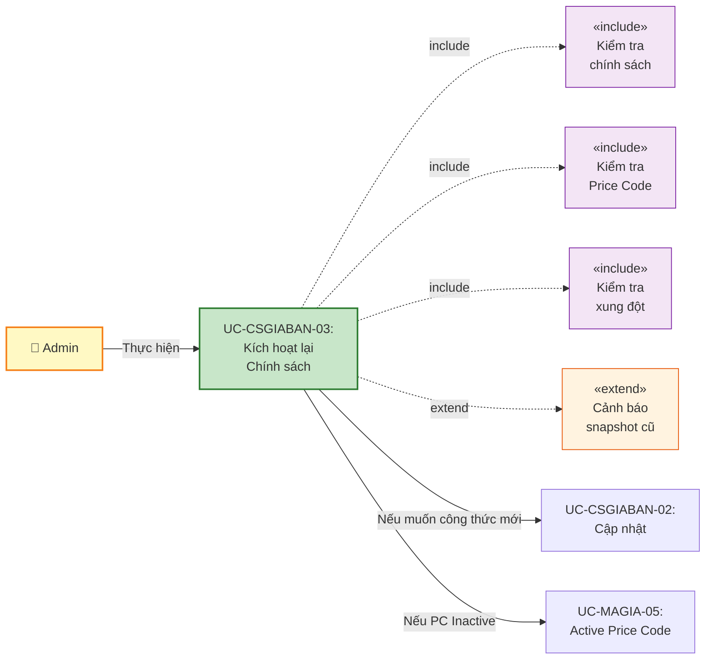
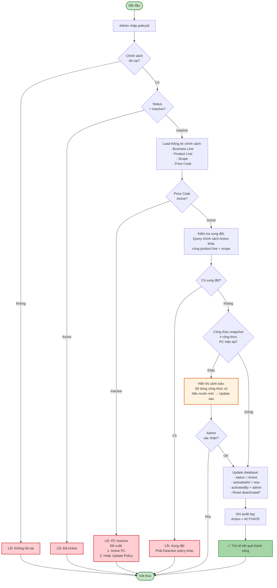
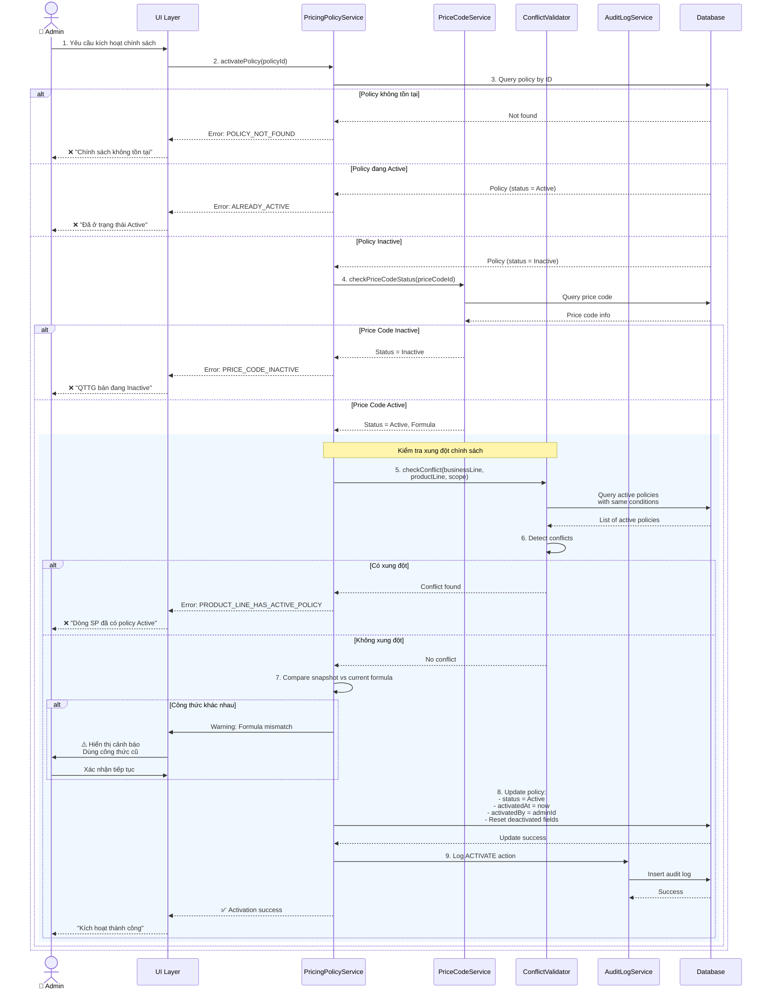
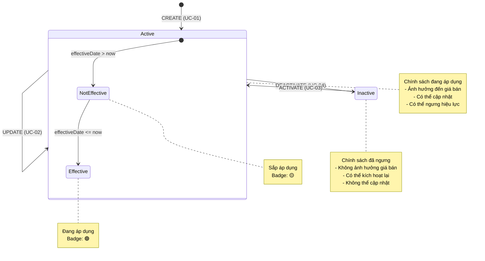
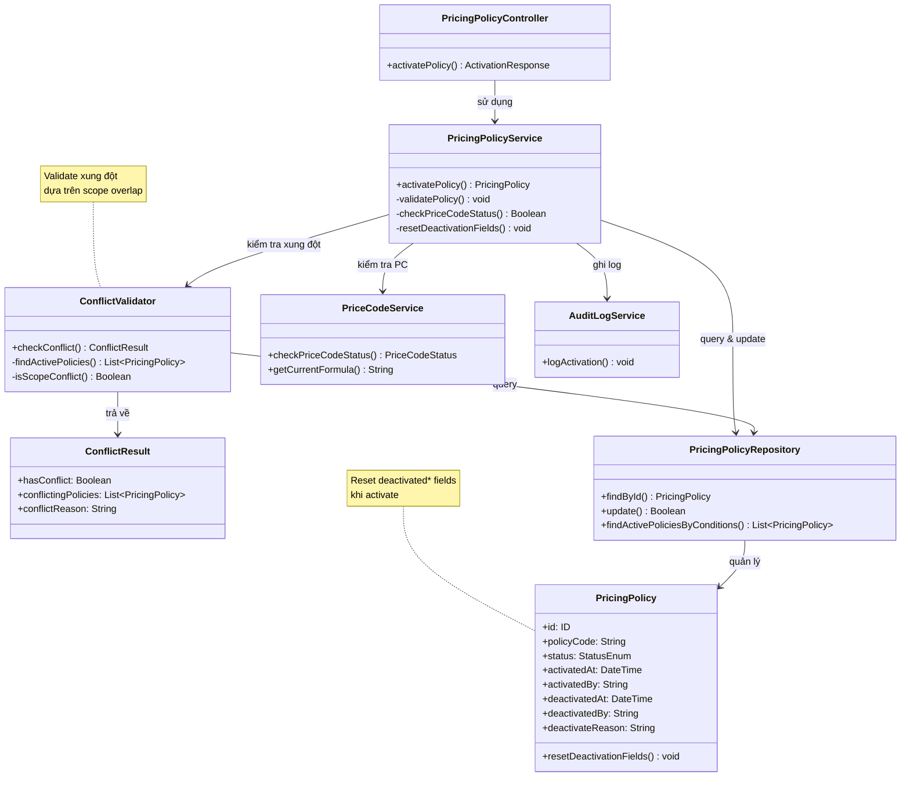

# Use Case UC-CSGIABAN-03: Kích Hoạt Lại Chính Sách Giá Bán (Activate)

---

| **Use Case ID** | **UC-CSGIABAN-03** |
|-----------------|---------------------|
| **Use Case Name** | Kích hoạt lại Chính sách Giá bán (Activate) |
| **Description** | Use Case "Kích hoạt lại Chính sách Giá bán" cho phép Admin kích hoạt lại chính sách đã bị ngưng hiệu lực (Inactive) để có thể áp dụng lại trong hệ thống. |
| **Actor(s)** | Admin |
| **Priority** | Must Have |
| **Trigger** | Admin yêu cầu kích hoạt lại một chính sách giá đang Inactive |

---

## Input

| Tên trường | Loại | Bắt buộc | Mô tả | Ràng buộc |
|------------|------|----------|-------|-----------|
| `policyId` | Số | Có | ID chính sách cần kích hoạt | Chính sách phải tồn tại và đang Inactive |

---

## Output

### Trường hợp thành công:

| Tên trường | Loại | Mô tả |
|------------|------|-------|
| `id` | Số | ID chính sách đã kích hoạt |
| `policyCode` | Văn bản | Mã quy tắc |
| `status` | Văn bản | Trạng thái mới = "Active" |
| `activatedAt` | Ngày giờ | Thời gian kích hoạt lại |
| `activatedBy` | Văn bản | Người kích hoạt |
| `message` | Văn bản | "Kích hoạt lại chính sách giá thành công" |

### Trường hợp lỗi:

| Mã lỗi | Thông báo | Mô tả |
|--------|-----------|-------|
| `POLICY_NOT_FOUND` | "Chính sách không tồn tại" | Không tìm thấy chính sách |
| `ALREADY_ACTIVE` | "Chính sách đã ở trạng thái Active" | Chính sách đang Active |
| `PRICE_CODE_INACTIVE` | "Không thể kích hoạt. QTTG bán đang Inactive" | Price Code tham chiếu đã bị ngưng hiệu lực |
| `PRODUCT_LINE_HAS_ACTIVE_POLICY` | "Dòng sản phẩm đã có chính sách Active khác" | Xung đột với chính sách khác cùng scope |

---

## Pre-Condition(s)

- Chính sách giá đã tồn tại trong hệ thống
- Chính sách đang có trạng thái Inactive
- Admin đã đăng nhập và có quyền kích hoạt chính sách
- QTTG bán (Price Code) được tham chiếu phải đang Active

---

## Post-Condition(s)

- Chính sách chuyển sang trạng thái Active
- Chính sách có thể được áp dụng trong hệ thống
- Hệ thống ghi nhận thông tin người kích hoạt và thời gian kích hoạt
- Audit log ghi nhận hành động ACTIVATE
- Các cửa hàng/khu vực trong phạm vi áp dụng sử dụng lại chính sách này

---

## Basic Flow

1. Admin yêu cầu kích hoạt lại một chính sách giá đang Inactive
2. Hệ thống kiểm tra tính hợp lệ:
   - Chính sách tồn tại
   - Chính sách đang Inactive
   - QTTG bán (Price Code) tham chiếu đang Active
3. Hệ thống kiểm tra xung đột chính sách:
   - Với cùng dòng sản phẩm, mảng kinh doanh, và phạm vi áp dụng
   - Không có chính sách Active khác đang áp dụng
4. Hệ thống cập nhật:
   - Chuyển status từ Inactive → Active
   - Ghi nhận thời gian kích hoạt (activatedAt)
   - Ghi nhận người kích hoạt (activatedBy)
   - Xóa deactivatedAt, deactivatedBy, deactivateReason (reset)
5. Hệ thống ghi audit log với action = ACTIVATE
6. Hệ thống trả về kết quả thành công

Use case kết thúc.

---

## Alternative Flow

*Không có luồng thay thế*

---

## Exception Flow

### 2a. Chính sách không tồn tại

2a. Hệ thống không tìm thấy chính sách với ID được cung cấp

2a1. Hệ thống trả về lỗi: "Chính sách không tồn tại hoặc đã bị xóa."

2a2. Use case kết thúc

### 2b. Chính sách đã ở trạng thái Active

2b. Hệ thống phát hiện chính sách đang ở trạng thái Active

2b1. Hệ thống trả về lỗi: "Chính sách đã ở trạng thái Active. Không cần kích hoạt lại."

2b2. Use case kết thúc

### 2c. QTTG bán (Price Code) đang Inactive

2c. Hệ thống phát hiện Price Code được tham chiếu trong chính sách đang Inactive

2c1. Hệ thống trả về lỗi: "Không thể kích hoạt chính sách này. QTTG bán '[Mã Price Code]' đang Inactive. Vui lòng kích hoạt QTTG bán trước hoặc cập nhật chính sách với QTTG bán Active khác."

2c2. Use case kết thúc

### 3a. Dòng sản phẩm đã có chính sách Active khác

3a. Hệ thống phát hiện đã có chính sách Active khác cho cùng dòng sản phẩm, mảng kinh doanh, và phạm vi áp dụng

3a1. Hệ thống trả về lỗi: "Không thể kích hoạt. Dòng sản phẩm '[Tên dòng SP]' tại '[Tên phạm vi]' đã có chính sách Active '[Mã chính sách khác]'. Vui lòng ngưng hiệu lực chính sách đó trước."

3a2. Use case kết thúc

---

## Business Rules

### BR-CSGIABAN-11: Chỉ Admin được kích hoạt

- Chỉ Admin mới có quyền kích hoạt lại chính sách giá
- Nhân viên không có quyền này
- Lý do: Tránh thay đổi không kiểm soát ảnh hưởng đến giá bán toàn hệ thống

### BR-CSGIABAN-12: Chỉ kích hoạt chính sách Inactive

- Chỉ có thể kích hoạt chính sách đang ở trạng thái **Inactive**
- Nếu chính sách đã Active → Từ chối thao tác
- Mục đích: Tránh thao tác không cần thiết, đảm bảo tính nhất quán

### BR-CSGIABAN-13: Kiểm tra QTTG bán (Price Code)

**QTTG bán phải đang Active:**
- Chính sách tham chiếu đến một Price Code cụ thể
- Trước khi kích hoạt chính sách → Hệ thống kiểm tra Price Code đó có đang Active không
- Nếu Price Code Inactive → Từ chối kích hoạt chính sách
- Lý do: Không thể áp dụng chính sách với Price Code đã ngưng hoạt động

**Giải pháp khi Price Code Inactive:**

**Option 1**: Kích hoạt lại Price Code (nếu phù hợp)
- Navigate sang module MA-GIA → UC-MAGIA-05: Active Price Code
- Sau đó quay lại kích hoạt chính sách này

**Option 2**: Cập nhật chính sách với Price Code Active khác
- Navigate sang UC-CSGIABAN-02: Cập nhật chính sách
- Chọn Price Code Active khác
- Sau đó kích hoạt lại chính sách

**Ví dụ:**
```
Chính sách: PP-2026-001 (Inactive)
QTTG bán: PC-100 (Inactive)

→ Không thể Active PP-2026-001 khi PC-100 còn Inactive
→ Phải Active PC-100 hoặc cập nhật PP-2026-001 dùng PC-200 (Active)
```

### BR-CSGIABAN-14: Ràng buộc một chính sách Active mỗi dòng sản phẩm tại một phạm vi

**Quy tắc chống xung đột:**
- Mỗi dòng sản phẩm tại một phạm vi cụ thể chỉ có thể có **duy nhất một chính sách Active** tại một thời điểm
- Trước khi kích hoạt chính sách → Hệ thống kiểm tra xung đột với các chính sách Active khác
- Nếu đã có chính sách Active cùng điều kiện → Từ chối kích hoạt

**Điều kiện xung đột:**

Hai chính sách xung đột khi:
1. Cùng mảng kinh doanh (businessLine)
2. Cùng dòng sản phẩm (productLine)
3. Cùng phạm vi áp dụng hoặc giao nhau:
   - ALL_SYSTEM xung đột với mọi phạm vi khác (cùng product line)
   - SPECIFIC_STORE xung đột với ALL_SYSTEM và cùng storeId
   - SPECIFIC_REGION xung đột với ALL_SYSTEM và cùng regionId

**Ví dụ xung đột:**

```
Chính sách hiện có: PP-2026-005 (Active)
- Business Line: Vàng trang sức
- Product Line: Nhẫn vàng 24K
- Scope: Toàn hệ thống

Chính sách muốn kích hoạt: PP-2026-010 (Inactive)
- Business Line: Vàng trang sức
- Product Line: Nhẫn vàng 24K
- Scope: Chi nhánh Hà Nội

→ XUNG ĐỘT vì PP-2026-005 áp dụng toàn hệ thống (bao gồm cả HN)
→ Phải Deactive PP-2026-005 trước hoặc tạo PP-2026-005 chỉ áp dụng cho khu vực khác
```

**Ví dụ không xung đột:**

```
Chính sách 1: PP-2026-005 (Active)
- Business Line: Vàng trang sức
- Product Line: Nhẫn vàng 24K
- Scope: Chi nhánh Hà Nội

Chính sách 2: PP-2026-010 (Inactive)
- Business Line: Vàng trang sức
- Product Line: Nhẫn vàng 24K
- Scope: Chi nhánh Hồ Chí Minh

→ KHÔNG XUNG ĐỘT vì khác scope (2 chi nhánh khác nhau)
→ Có thể Active PP-2026-010
```

### BR-CSGIABAN-15: Ghi nhận audit log

Mỗi lần kích hoạt lại chính sách, hệ thống ghi nhận đầy đủ:
- Action: ACTIVATE
- Thời gian kích hoạt (activatedAt)
- Người kích hoạt (activatedBy)
- Trạng thái trước: Inactive
- Trạng thái sau: Active
- Metadata: Reset deactivatedAt, deactivatedBy, deactivateReason

Mục đích: Theo dõi lịch sử thay đổi trạng thái, hỗ trợ audit

### BR-CSGIABAN-16: Chính sách kích hoạt với dữ liệu cũ

**Snapshot được giữ nguyên:**
- Khi kích hoạt lại chính sách, công thức tính giá vẫn là snapshot cũ (tại thời điểm tạo)
- Không tự động cập nhật công thức từ Price Code hiện tại
- Đảm bảo tính nhất quán với quyết định ban đầu

**Nếu muốn dùng công thức mới:**
- Sau khi Active → Navigate UC-CSGIABAN-02: Cập nhật chính sách
- Chọn lại Price Code (có thể là cùng hoặc khác)
- Hệ thống sẽ snapshot công thức mới

**Cảnh báo khi Active:**
```
⚠️ LƯU Ý:

Chính sách này sẽ được kích hoạt với công thức tính giá đã snapshot từ [Ngày tạo].

Công thức hiện tại của QTTG bán '[Mã PC]':
  [Công thức mới từ Price Code]

Công thức sẽ áp dụng (snapshot cũ):
  [Công thức trong chính sách]

Nếu bạn muốn dùng công thức mới, vui lòng:
1. Kích hoạt chính sách này
2. Cập nhật chính sách (chọn lại cùng Price Code)
3. Công thức sẽ được snapshot lại
```

---

## Diagrams

### 1. Use Case Diagram - UC-CSGIABAN-03: Kích hoạt lại



### 2. Activity Diagram - Luồng Kích hoạt lại



### 3. Sequence Diagram - Kích hoạt lại Chính sách



### 4. State Transition Diagram



### 5. Class Diagram



---

## Notes

**UI/UX Recommendations:**

1. **Confirmation Dialog:**
   - Hiển thị rõ thông tin chính sách sẽ kích hoạt:
     - Mã quy tắc
     - Dòng sản phẩm
     - Phạm vi áp dụng
     - Ngày có hiệu lực
   - Cảnh báo nếu công thức snapshot khác với công thức hiện tại của Price Code
   - Button: "Xác nhận kích hoạt" / "Hủy"

2. **Error Handling:**
   - **Price Code Inactive**: Cung cấp link trực tiếp đến UC-MAGIA-05 để kích hoạt PC
   - **Conflict**: Hiển thị danh sách chính sách xung đột, link đến UC-CSGIABAN-04 để ngưng hiệu lực
   - **Already Active**: Disable button "Kích hoạt" nếu đã Active

3. **Post-Activation Actions:**
   - Hiển thị thông báo thành công
   - Cung cấp quick actions:
     - "Xem chi tiết" → UC-CSGIABAN-06
     - "Cập nhật" → UC-CSGIABAN-02 (nếu muốn snapshot công thức mới)
     - "Quay lại danh sách" → UC-CSGIABAN-05

4. **Formula Warning Display:**
   ```
   ⚠️ CẢNH BÁO VỀ CÔNG THỨC TÍNH GIÁ
   
   Công thức trong chính sách (snapshot 01/02/2026):
   ┌─────────────────────────────────────────┐
   │ Giá = Vàng SJC × Trọng lượng × 1.15     │
   └─────────────────────────────────────────┘
   
   Công thức hiện tại của PC-100 (cập nhật 01/03/2026):
   ┌─────────────────────────────────────────┐
   │ Giá = Vàng SJC × Trọng lượng × 1.20     │
   └─────────────────────────────────────────┘
   
   Bạn có muốn:
   [ ] Kích hoạt với công thức cũ (1.15)
   [ ] Kích hoạt rồi cập nhật công thức mới (1.20)
   ```

**Performance:**
- Cache danh sách Active policies để kiểm tra xung đột nhanh
- Index trên (businessLine, productLine, scopeType, scopeId, status)
- Eager load Price Code info trong 1 query

**Quan hệ với các use case khác:**
- UC-CSGIABAN-02: Cập nhật → Nếu muốn snapshot công thức mới
- UC-CSGIABAN-04: Ngưng hiệu lực → Ngược lại của use case này
- UC-CSGIABAN-05: Xem danh sách → Navigate từ đây
- UC-MAGIA-05: Active Price Code → Nếu PC đang Inactive

**Tham chiếu:**
- TONG-QUAN.md - Section 5: BR-CSGIABAN-01 (Kiểm tra xung đột)
- UC-CSGIABAN-01-TAO-MOI.md - Snapshot mechanism
- UC-CSGIABAN-04-NGUNG-HIEU-LUC.md - Deactivation logic (reverse)
