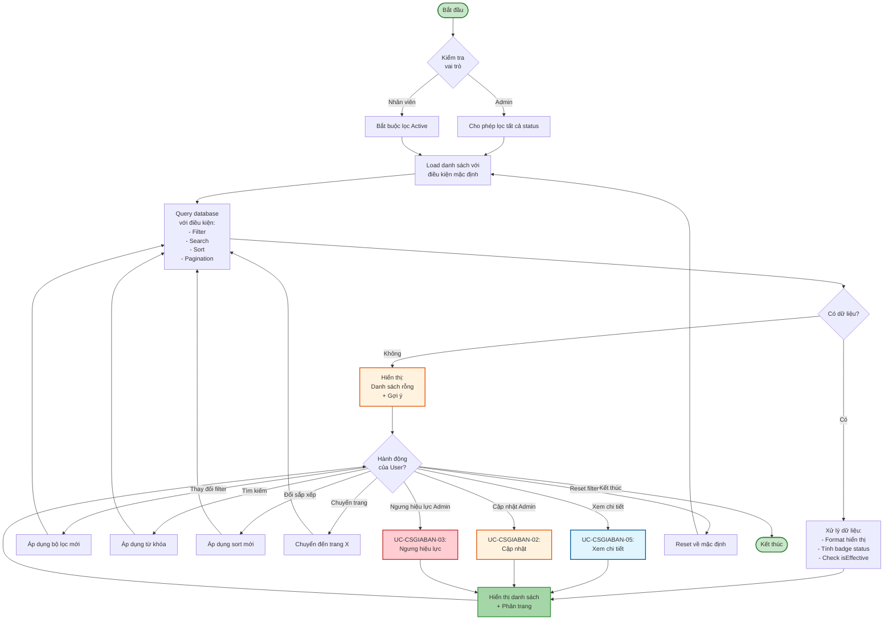
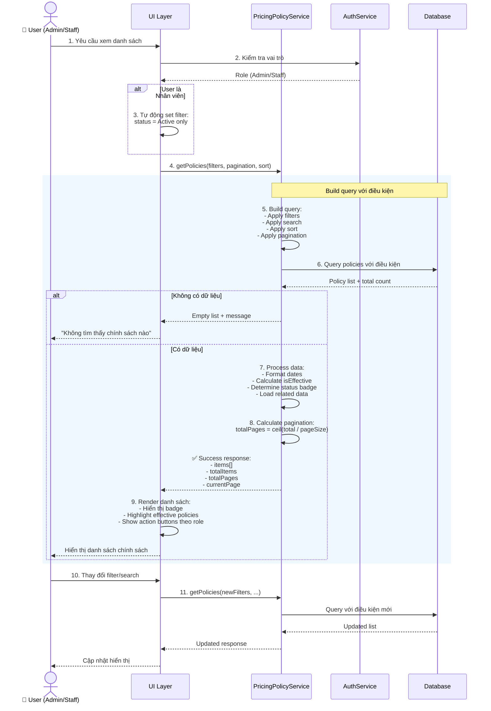
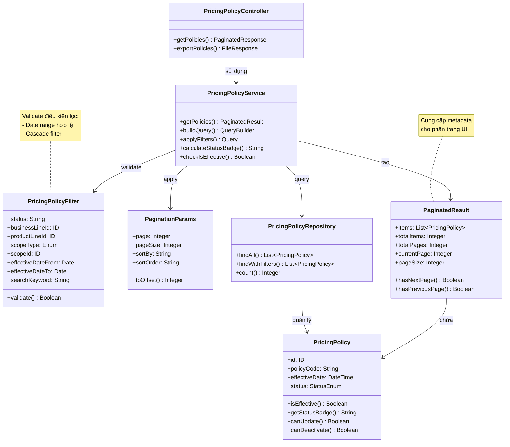

# Use Case UC-CSGIABAN-04: Xem Danh Sách Chính Sách Giá Bán

---

| **Use Case ID** | **UC-CSGIABAN-04** |
|-----------------|---------------------|
| **Use Case Name** | Xem Danh Sách Chính Sách Giá Bán |
| **Description** | Use Case "Xem Danh Sách Chính Sách Giá Bán" cho phép Admin và Nhân viên xem danh sách các chính sách giá trong hệ thống với khả năng lọc, tìm kiếm và phân trang. |
| **Actor(s)** | Admin, Nhân viên |
| **Priority** | Must Have |
| **Trigger** | User yêu cầu xem danh sách Chính sách giá |

---

## Input

| Tên trường | Loại | Bắt buộc | Mô tả | Ràng buộc |
|------------|------|----------|-------|-----------|
| `status` | Văn bản | Không | Lọc theo trạng thái | "Active", "Inactive", hoặc "All" (mặc định) |
| `businessLineId` | Số | Không | Lọc theo mảng kinh doanh | ID mảng kinh doanh hợp lệ |
| `productLineId` | Số | Không | Lọc theo dòng sản phẩm | ID dòng sản phẩm hợp lệ |
| `scopeType` | Enum | Không | Lọc theo phạm vi | "ALL_SYSTEM", "SPECIFIC_STORE", "SPECIFIC_REGION" |
| `scopeId` | Số | Không | Lọc theo cửa hàng/khu vực cụ thể | ID hợp lệ khi có scopeType |
| `effectiveDateFrom` | Ngày | Không | Lọc từ ngày hiệu lực | Format: DD/MM/YYYY |
| `effectiveDateTo` | Ngày | Không | Lọc đến ngày hiệu lực | Format: DD/MM/YYYY, phải >= effectiveDateFrom |
| `searchKeyword` | Văn bản | Không | Tìm kiếm | Tìm theo mã quy tắc, tên dòng sản phẩm, mô tả |
| `page` | Số | Không | Trang hiện tại | >= 1, mặc định = 1 |
| `pageSize` | Số | Không | Số bản ghi mỗi trang | 10, 20, 50, 100 (mặc định = 20) |
| `sortBy` | Văn bản | Không | Sắp xếp theo trường | "policyCode", "effectiveDate", "createdAt" |
| `sortOrder` | Văn bản | Không | Thứ tự sắp xếp | "asc" hoặc "desc" (mặc định) |

**Lưu ý:**
- **Admin**: Có thể xem tất cả chính sách (Active và Inactive)
- **Nhân viên**: Chỉ xem được chính sách Active

---

## Output

### Trường hợp thành công:

| Tên trường | Loại | Mô tả |
|------------|------|-------|
| `items` | Danh sách | Danh sách chính sách giá theo điều kiện lọc |
| `totalItems` | Số | Tổng số chính sách |
| `totalPages` | Số | Tổng số trang |
| `currentPage` | Số | Trang hiện tại |
| `pageSize` | Số | Số bản ghi mỗi trang |

**Cấu trúc mỗi item trong danh sách:**

| Tên trường | Loại | Mô tả |
|------------|------|-------|
| `id` | Số | ID chính sách |
| `policyCode` | Văn bản | Mã quy tắc (VD: PP-2026-001) |
| `effectiveDate` | Ngày giờ | Ngày có hiệu lực |
| `businessLineName` | Văn bản | Tên mảng kinh doanh |
| `productLineCode` | Văn bản | Mã dòng sản phẩm |
| `productLineName` | Văn bản | Tên dòng sản phẩm |
| `scopeType` | Văn bản | Loại phạm vi (ALL_SYSTEM, SPECIFIC_STORE, SPECIFIC_REGION) |
| `scopeName` | Văn bản | Tên phạm vi (Toàn hệ thống / Tên cửa hàng / Tên khu vực) |
| `priceCodeName` | Văn bản | Tên QTTG bán (Price Code) |
| `status` | Văn bản | Trạng thái: "Active" hoặc "Inactive" |
| `statusBadge` | Văn bản | Badge hiển thị (Active: màu xanh, Inactive: màu xám) |
| `isEffective` | Boolean | Đã có hiệu lực chưa (effectiveDate <= now) |
| `createdAt` | Ngày giờ | Thời gian tạo |
| `createdBy` | Văn bản | Người tạo |
| `deactivatedAt` | Ngày giờ | Thời gian ngưng hiệu lực (nếu Inactive) |

### Trường hợp không có dữ liệu:

| Tên trường | Loại | Mô tả |
|------------|------|-------|
| `items` | Danh sách | Danh sách rỗng [] |
| `totalItems` | Số | 0 |
| `message` | Văn bản | "Không tìm thấy chính sách giá nào" |

---

## Pre-Condition(s)

- User đã đăng nhập vào hệ thống
- **Admin**: Có quyền xem tất cả chính sách giá
- **Nhân viên**: Có quyền xem chính sách Active

---

## Post-Condition(s)

- Danh sách chính sách giá được hiển thị theo điều kiện lọc
- Trạng thái filter và search được lưu trong session (để quay lại giữ nguyên)
- Hệ thống ghi nhận lịch sử truy cập (optional - cho audit)

---

## Basic Flow

1. User yêu cầu xem danh sách Chính sách giá
2. Hệ thống trả về danh sách chính sách giá với các thông tin:
   - Danh sách chính sách theo điều kiện lọc
   - Thông tin phân trang (tổng số, trang hiện tại)
   - Các trường dữ liệu: Mã quy tắc, Ngày hiệu lực, Mảng KD, Dòng sản phẩm, Phạm vi, QTTG bán, Trạng thái
3. User có thể:
   - **Lọc** theo trạng thái, mảng kinh doanh, dòng sản phẩm, phạm vi, khoảng thời gian hiệu lực
   - **Tìm kiếm** theo từ khóa (mã quy tắc, tên dòng SP, mô tả)
   - **Sắp xếp** theo các trường (mã quy tắc, ngày hiệu lực, ngày tạo)
   - **Chuyển trang**
   - **Thay đổi số bản ghi mỗi trang** (10, 20, 50, 100)
4. Khi User thay đổi bộ lọc hoặc tìm kiếm:
   - Hệ thống áp dụng điều kiện mới
   - Hệ thống trả về danh sách chính sách phù hợp
   - Cập nhật thông tin phân trang
   - Highlight các chính sách đã có hiệu lực
5. User có thể chọn các thao tác trên từng chính sách:
   - **Xem chi tiết** → Chuyển sang UC-CSGIABAN-05 (tất cả)
   - **Cập nhật** → Chuyển sang UC-CSGIABAN-02 (chỉ Admin, chỉ Active)
   - **Ngưng hiệu lực** → Chuyển sang UC-CSGIABAN-03 (chỉ Admin, chỉ Active)

Use case tiếp tục (không kết thúc cho đến khi User kết thúc phiên làm việc).

---

## Alternative Flow

### 2a. Nhân viên chỉ xem được chính sách Active

2a. Nếu User là Nhân viên (không phải Admin)

2a1. Hệ thống tự động:
- Bắt buộc lọc trạng thái Active
- Ẩn cột "Thao tác" (Cập nhật, Ngưng hiệu lực)
- Chỉ hiển thị nút "Xem chi tiết"

2a2. Nhân viên chỉ có thể:
- Xem danh sách chính sách Active
- Lọc theo mảng kinh doanh, dòng sản phẩm, phạm vi, thời gian
- Tìm kiếm
- Xem chi tiết

Use case quay lại bước 3

### 3a. Lọc theo cửa hàng của Nhân viên

3a. Nếu User là Nhân viên tại một cửa hàng cụ thể

3a1. Hệ thống tự động:
- Ưu tiên hiển thị chính sách áp dụng cho cửa hàng của Nhân viên
- Hiển thị cả chính sách Toàn hệ thống
- Đánh dấu rõ chính sách nào đang áp dụng cho cửa hàng hiện tại

Use case tiếp tục bước 4

---

## Exception Flow

### 4a. Không tìm thấy chính sách nào

4a. Hệ thống không tìm thấy chính sách nào phù hợp với điều kiện lọc

4a1. Hệ thống trả về:
- Danh sách rỗng
- Message: "Không tìm thấy chính sách giá nào phù hợp với điều kiện lọc"
- Gợi ý: "Thử xóa bộ lọc hoặc thay đổi điều kiện tìm kiếm"

4a2. User có thể:
- Thay đổi điều kiện lọc
- Xóa bộ lọc (Reset về mặc định)
- Tạo chính sách mới (nếu là Admin) → UC-CSGIABAN-01
- Kết thúc

### 4b. Khoảng thời gian không hợp lệ

4b. User nhập effectiveDateFrom > effectiveDateTo

4b1. Hệ thống trả về lỗi: "Ngày bắt đầu không được lớn hơn ngày kết thúc"

4b2. Hệ thống reset filter thời gian về giá trị trước đó hoặc mặc định

4b3. Use case quay lại bước 3

### 4c. Lỗi kết nối hoặc server

4c. Hệ thống gặp lỗi khi tải dữ liệu

4c1. Hệ thống trả về thông báo lỗi: "Không thể tải danh sách chính sách giá. Vui lòng thử lại."

4c2. User có thể thử lại (Retry)

4c3. Nếu User thử lại → Hệ thống thực hiện lại request

---

## Business Rules

### BR-CSGIABAN-14: Phân quyền xem danh sách

**Admin:**
- Xem được tất cả chính sách (Active và Inactive)
- Có thể lọc theo trạng thái
- Có thể thực hiện các thao tác: Xem chi tiết, Cập nhật (Active), Ngưng hiệu lực (Active)

**Nhân viên:**
- Chỉ xem được chính sách Active
- Không có filter trạng thái
- Chỉ có thể Xem chi tiết (không sửa, không ngưng hiệu lực)
- Ưu tiên hiển thị chính sách của cửa hàng mình

### BR-CSGIABAN-15: Mặc định khi lần đầu xem

Khi lần đầu thực hiện:
- Trả về tất cả chính sách Active (cho cả Admin và Nhân viên)
- Sắp xếp theo ngày hiệu lực gần nhất (effectiveDate DESC)
- 20 bản ghi mỗi trang
- Trang đầu tiên (page = 1)
- Không lọc theo mảng kinh doanh, dòng sản phẩm, phạm vi

### BR-CSGIABAN-16: Tìm kiếm

Tìm kiếm theo từ khóa (case-insensitive) trong các trường:
- Mã quy tắc (`policyCode`)
- Mã dòng sản phẩm (`productLineCode`)
- Tên dòng sản phẩm (`productLineName`)
- Mô tả (`description`)

**Ví dụ:**
```
Từ khóa: "vàng"
→ Tìm thấy:
  - Mã: "PP-2026-001" - Dòng SP: "Nhẫn vàng 24K"
  - Mã: "PP-2026-005" - Dòng SP: "Dây chuyền vàng tây"
  - Mả: "PP-2026-010" - Mô tả: "Chính sách mới cho vàng SJC"
```

### BR-CSGIABAN-17: Lọc kết hợp

Hệ thống hỗ trợ lọc kết hợp nhiều điều kiện (AND logic):

**Ví dụ:**
```
Lọc:
- Status: Active
- Mảng kinh doanh: "Vàng trang sức"
- Phạm vi: "Chi nhánh Hà Nội"
- Ngày hiệu lực: Từ 01/03/2026 đến 31/03/2026

→ Chỉ trả về các chính sách thỏa mãn TẤT CẢ điều kiện trên
```

### BR-CSGIABAN-18: Hiển thị trạng thái và badge

**Status Badge:**

| Trạng thái | Badge | Màu sắc | Mô tả |
|------------|-------|---------|-------|
| Active + Chưa hiệu lực | 🟡 Sắp áp dụng | Vàng | effectiveDate > now |
| Active + Đã hiệu lực | 🟢 Đang áp dụng | Xanh | effectiveDate <= now |
| Inactive | 🔴 Đã ngưng | Đỏ/Xám | status = Inactive |

**Hiển thị thông tin bổ sung:**
- Chính sách đã có hiệu lực: Hiển thị số ngày đã áp dụng
- Chính sách sắp có hiệu lực: Hiển thị "Hiệu lực từ [Ngày]"
- Chính sách Inactive: Hiển thị "Ngưng từ [Ngày]"

### BR-CSGIABAN-19: Sắp xếp và ưu tiên hiển thị

**Thứ tự sắp xếp mặc định:**
1. Chính sách Active đang áp dụng (effectiveDate <= now) - Ưu tiên cao nhất
2. Chính sách Active sắp áp dụng (effectiveDate > now)
3. Chính sách Inactive (nếu Admin xem tất cả)

Trong mỗi nhóm, sắp xếp theo effectiveDate DESC (gần nhất lên đầu)

**Mục đích:**
- Người dùng dễ dàng tìm thấy chính sách đang hoạt động
- Ưu tiên hiển thị thông tin quan trọng nhất

### BR-CSGIABAN-20: Cascade filter (Lọc theo cấp)

Khi chọn **Mảng kinh doanh**:
- Dropdown **Dòng sản phẩm** chỉ hiển thị các dòng thuộc mảng đã chọn
- Tự động filter danh sách chính sách

**Ví dụ:**
```
1. User chọn Mảng KD: "Vàng trang sức"
2. Dropdown Dòng SP chỉ hiển thị:
   - Nhẫn vàng 24K
   - Dây chuyền vàng
   - Lắc tay vàng
   (Không hiển thị: "Vàng miếng SJC" - thuộc mảng khác)
```

---

## Diagrams

### 1. Use Case Diagram - UC-CSGIABAN-04: Xem Danh Sách

```mermaid
graph LR
    Admin["👤 Admin"]
    Staff["👤 Nhân viên"]
    
    UC["UC-CSGIABAN-04:<br/>Xem Danh Sách<br/>Chính Sách Giá Bán"]
    
    Include1["«include»<br/>Lọc & Tìm kiếm<br/>chính sách"]
    Include2["«include»<br/>Phân trang<br/>danh sách"]
    Include3["«include»<br/>Sắp xếp<br/>theo tiêu chí"]
    
    Extend1["«extend»<br/>Xem tất cả status<br/>(chỉ Admin)"]
    Extend2["«extend»<br/>Thao tác cập nhật<br/>(chỉ Admin)"]
    
    UC01["UC-CSGIABAN-05:<br/>Xem chi tiết"]
    UC02["UC-CSGIABAN-02:<br/>Cập nhật"]
    UC03["UC-CSGIABAN-03:<br/>Ngưng hiệu lực"]
    
    Admin -->|Thực hiện| UC
    Staff -->|Thực hiện| UC
    
    UC -.->|include| Include1
    UC -.->|include| Include2
    UC -.->|include| Include3
    UC -.->|extend| Extend1
    UC -.->|extend| Extend2
    
    UC -->|Chọn item| UC01
    UC -->|Cập nhật<br/>(Admin)| UC02
    UC -->|Ngưng hiệu lực<br/>(Admin)| UC03
    
    style UC fill:#e8f5e9,stroke:#2e7d32,stroke-width:2px
    style Admin fill:#fff9c4,stroke:#f57f17,stroke-width:2px
    style Staff fill:#e1f5ff,stroke:#01579b,stroke-width:2px
    style Include1 fill:#f3e5f5,stroke:#7b1fa2,stroke-width:1px
    style Include2 fill:#f3e5f5,stroke:#7b1fa2,stroke-width:1px
    style Include3 fill:#f3e5f5,stroke:#7b1fa2,stroke-width:1px
    style Extend1 fill:#fff3e0,stroke:#e65100,stroke-width:1px
    style Extend2 fill:#fff3e0,stroke:#e65100,stroke-width:1px
```

### 2. Activity Diagram - Luồng Xem Danh Sách



### 3. Sequence Diagram - Xem Danh Sách với Filter



**Giải thích Sequence Diagram:**

**Xử lý nghiệp vụ:**
- Kiểm tra vai trò để xác định quyền lọc
- Build query động dựa trên filters, search, sort
- Xử lý dữ liệu: format, calculate status, load related entities
- Tính toán phân trang

**Nhánh xử lý:**
- **Nhân viên**: Tự động bắt buộc filter Active
- **Không có dữ liệu**: Trả về empty list với message gợi ý
- **Có dữ liệu**: Process và hiển thị với badge, highlight

**Optimization:**
- Eager loading related data (ProductLine, PriceCode) để tránh N+1 query
- Count total một lần cho pagination

---

### 4. Class Diagram



---

## Notes

**UI/UX Recommendations:**

1. **Filter Panel:**
   - Collapse/Expand để tiết kiệm không gian
   - Hiển thị số lượng filter đang áp dụng
   - Nút "Reset" rõ ràng

2. **Table Display:**
   - Sticky header khi scroll
   - Row action buttons (Xem, Sửa, Ngưng) phụ thuộc role
   - Highlight row khi hover
   - Badge màu sắc rõ ràng cho status

3. **Search:**
   - Debounce 300ms khi gõ
   - Hiển thị loading indicator
   - Clear button trong search box

4. **Pagination:**
   - Hiển thị: "Showing 1-20 of 150 items"
   - Quick jump to page (input số trang)
   - Page size selector

**Performance Considerations:**

- Index trên: `status`, `effectiveDate`, `productLineId`, `scopeType`, `createdAt`
- Eager load related entities: ProductLine, PriceCode, BusinessLine
- Cache filter options (dropdown values)
- Limit maximum page size = 100

**Quan hệ với các use case khác:**
- UC-CSGIABAN-01: Tạo mới → Thêm item vào list
- UC-CSGIABAN-02: Cập nhật → Refresh item trong list
- UC-CSGIABAN-03: Ngưng hiệu lực → Update status badge của item
- UC-CSGIABAN-05: Xem chi tiết → Navigate từ list

**Tham chiếu:**
- TONG-QUAN.md - Section 2: Tác nhân (phân quyền)
- TONG-QUAN.md - Section 5: Business Rules
