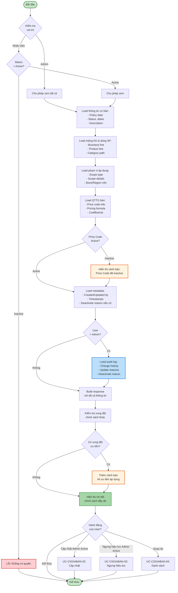
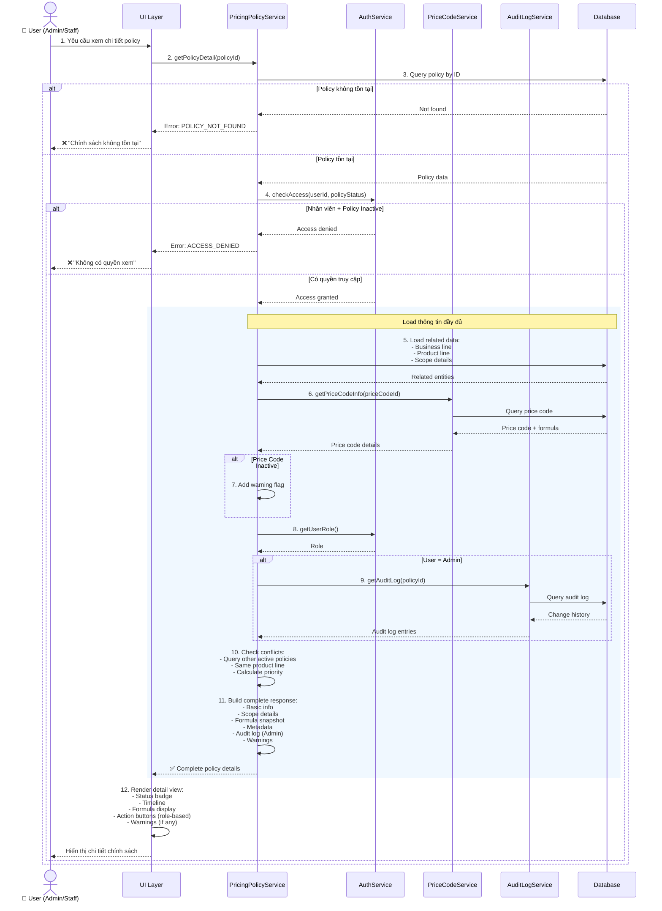
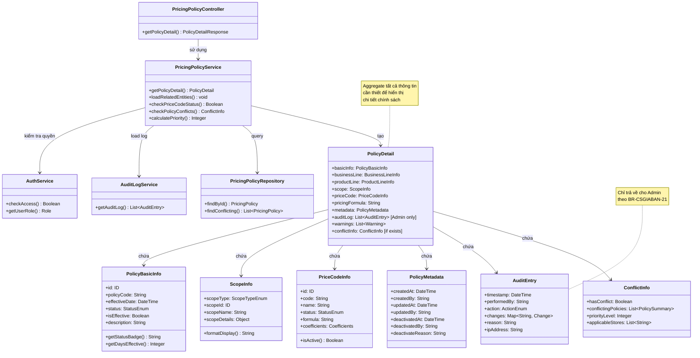

# Use Case UC-CSGIABAN-05: Xem Chi Tiết Chính Sách Giá Bán

---

| **Use Case ID** | **UC-CSGIABAN-05** |
|-----------------|---------------------|
| **Use Case Name** | Xem Chi Tiết Chính Sách Giá Bán |
| **Description** | Use Case "Xem Chi Tiết Chính Sách Giá Bán" cho phép Admin và Nhân viên xem thông tin đầy đủ của một chính sách giá, bao gồm công thức tính giá, lịch sử áp dụng và audit log (Admin only). |
| **Actor(s)** | Admin, Nhân viên |
| **Priority** | Must Have |
| **Trigger** | User yêu cầu xem chi tiết một Chính sách giá cụ thể |

---

## Input

| Tên trường | Loại | Bắt buộc | Mô tả | Ràng buộc |
|------------|------|----------|-------|-----------|
| `policyId` | Số | Có | ID chính sách cần xem | Chính sách phải tồn tại |

**Lưu ý:**
- **Admin**: Có thể xem chi tiết tất cả chính sách (Active và Inactive)
- **Nhân viên**: Chỉ xem được chi tiết chính sách Active

---

## Output

### Trường hợp thành công:

**Thông tin cơ bản:**

| Tên trường | Loại | Mô tả |
|------------|------|-------|
| `id` | Số | ID chính sách |
| `policyCode` | Văn bản | Mã quy tắc (VD: PP-2026-001) |
| `effectiveDate` | Ngày giờ | Ngày có hiệu lực |
| `status` | Văn bản | Trạng thái: "Active" hoặc "Inactive" |
| `isEffective` | Boolean | Đã có hiệu lực chưa (effectiveDate <= now) |
| `description` | Văn bản | Ghi chú/Mô tả |

**Thông tin mảng kinh doanh và dòng sản phẩm:**

| Tên trường | Loại | Mô tả |
|------------|------|-------|
| `businessLine` | Thông tin | Thông tin mảng kinh doanh (id, code, name) |
| `productLine` | Thông tin | Thông tin dòng sản phẩm (id, code, name, description) |
| `categoryPath` | Văn bản | Đường dẫn phân cấp dòng sản phẩm (VD: "Vàng > Nhẫn > Nhẫn 24K") |

**Thông tin phạm vi áp dụng:**

| Tên trường | Loại | Mô tả |
|------------|------|-------|
| `scopeType` | Văn bản | Loại phạm vi: ALL_SYSTEM, SPECIFIC_STORE, SPECIFIC_REGION |
| `scopeId` | Số | ID cửa hàng/khu vực (nếu áp dụng) |
| `scopeName` | Văn bản | Tên phạm vi áp dụng |
| `scopeDetails` | Thông tin | Chi tiết cửa hàng/khu vực (địa chỉ, mã, v.v.) |

**Thông tin QTTG bán và công thức:**

| Tên trường | Loại | Mô tả |
|------------|------|-------|
| `priceCode` | Thông tin | Thông tin QTTG bán (id, code, name) |
| `priceCodeStatus` | Văn bản | Trạng thái hiện tại của Price Code |
| `pricingFormula` | Văn bản | Công thức tính giá đã snapshot |
| `basePrice` | Thông tin | Thông tin giá cơ sở (nếu có) |
| `coefficients` | Thông tin | Hệ số mua/bán từ Price Code |

**Metadata:**

| Tên trường | Loại | Mô tả |
|------------|------|-------|
| `createdAt` | Ngày giờ | Thời gian tạo |
| `createdBy` | Văn bản | Người tạo |
| `updatedAt` | Ngày giờ | Thời gian cập nhật lần cuối (nếu có) |
| `updatedBy` | Văn bản | Người cập nhật lần cuối (nếu có) |
| `deactivatedAt` | Ngày giờ | Thời gian ngưng hiệu lực (nếu Inactive) |
| `deactivatedBy` | Văn bản | Người ngưng hiệu lực (nếu Inactive) |
| `deactivateReason` | Văn bản | Lý do ngưng hiệu lực (nếu Inactive) |

**Lịch sử thay đổi (chỉ Admin):**

| Tên trường | Loại | Mô tả |
|------------|------|-------|
| `auditLog` | Danh sách | Lịch sử các lần thay đổi |
| `auditLog[].timestamp` | Ngày giờ | Thời gian thay đổi |
| `auditLog[].performedBy` | Văn bản | Người thực hiện |
| `auditLog[].action` | Văn bản | Hành động: CREATE, UPDATE, DEACTIVATE |
| `auditLog[].changes` | Danh sách | Danh sách các trường đã thay đổi (old → new) |
| `auditLog[].reason` | Văn bản | Lý do thay đổi (nếu có) |

### Trường hợp lỗi:

| Mã lỗi | Thông báo | Mô tả |
|--------|-----------|-------|
| `POLICY_NOT_FOUND` | "Chính sách không tồn tại" | Không tìm thấy chính sách |
| `ACCESS_DENIED` | "Không có quyền xem chính sách này" | Nhân viên cố xem chính sách Inactive |

---

## Pre-Condition(s)

- Chính sách giá đã tồn tại trong hệ thống
- User đã đăng nhập
- **Admin**: Có quyền xem tất cả chính sách
- **Nhân viên**: Có quyền xem chính sách Active

---

## Post-Condition(s)

- Thông tin chi tiết chính sách được trả về đầy đủ
- Hệ thống ghi nhận lịch sử truy cập (optional - cho audit)
- Không có thay đổi dữ liệu (read-only operation)

---

## Basic Flow

1. User yêu cầu xem chi tiết một chính sách giá cụ thể (từ danh sách hoặc tìm kiếm)
2. Hệ thống kiểm tra quyền truy cập:
   - Admin: Cho phép xem tất cả chính sách
   - Nhân viên: Chỉ cho phép xem chính sách Active
3. Hệ thống lấy thông tin chi tiết chính sách:
   - Thông tin cơ bản của chính sách (ID, mã, ngày hiệu lực, trạng thái)
   - Thông tin mảng kinh doanh và dòng sản phẩm (bao gồm category path)
   - Thông tin phạm vi áp dụng (type, name, details)
   - Thông tin QTTG bán và công thức tính giá đã snapshot
   - Metadata (người tạo, cập nhật, ngưng hiệu lực)
4. Hệ thống kiểm tra trạng thái hiện tại của Price Code được tham chiếu:
   - Nếu Price Code đã Inactive → Hiển thị cảnh báo
5. Nếu User là Admin:
   - Hệ thống lấy thêm audit log (lịch sử thay đổi)
   - Hiển thị đầy đủ lý do cập nhật/ngưng hiệu lực
6. Hệ thống trả về thông tin chi tiết đầy đủ:
   - Thông tin cơ bản và phạm vi
   - Công thức tính giá
   - Metadata đầy đủ
   - (Admin only) Audit log
7. User có thể thực hiện các thao tác:
   - **Cập nhật** → Chuyển sang UC-CSGIABAN-02 (chỉ Admin, chỉ khi Active)
   - **Ngưng hiệu lực** → Chuyển sang UC-CSGIABAN-03 (chỉ Admin, chỉ khi Active)
   - **Quay lại danh sách** → Quay lại UC-CSGIABAN-04

Use case kết thúc.

---

## Alternative Flow

### 4a. Price Code đã bị Inactive

4a. Price Code tham chiếu trong chính sách đã bị ngưng hiệu lực

4a1. Hệ thống hiển thị cảnh báo:
> "⚠️ LƯU Ý: QTTG bán '[Mã Price Code]' đã bị ngưng hiệu lực từ [Ngày].  
> Công thức tính giá hiển thị dưới đây là phiên bản đã snapshot tại thời điểm tạo chính sách."

4a2. Use case tiếp tục bước 5

---

## Exception Flow

### 2a. Chính sách không tồn tại

2a. Hệ thống không tìm thấy chính sách với ID được cung cấp

2a1. Hệ thống trả về lỗi: "Chính sách không tồn tại hoặc đã bị xóa."

2a2. Use case kết thúc

### 2b. Nhân viên cố xem chính sách Inactive

2b. Nhân viên cố gắng xem chi tiết chính sách có trạng thái Inactive

2b1. Hệ thống trả về lỗi: "Không có quyền xem chính sách này."

2b2. Use case kết thúc

---

## Business Rules

### BR-CSGIABAN-21: Phân quyền xem chi tiết

**Admin:**
- Xem được chi tiết tất cả chính sách (Active và Inactive)
- Xem được audit log đầy đủ (lịch sử thay đổi)
- Xem được lý do cập nhật và lý do ngưng hiệu lực
- Có thể thực hiện thao tác: Cập nhật (Active only), Ngưng hiệu lực (Active only)

**Nhân viên:**
- Chỉ xem được chi tiết chính sách Active
- Không xem được audit log
- Không xem được lý do cập nhật nội bộ
- Chỉ có thể Quay lại danh sách (không sửa, không ngưng hiệu lực)

### BR-CSGIABAN-22: Hiển thị công thức tính giá

**Snapshot của công thức:**
- Công thức tính giá được **snapshot** tại thời điểm tạo chính sách
- Công thức không thay đổi ngay cả khi Price Code bị cập nhật sau đó
- Đảm bảo tính nhất quán: Giá tính ra theo chính sách luôn đúng với quyết định ban đầu

**Hiển thị:**
- Công thức đầy đủ với giải thích từng thành phần
- Hệ số mua/bán tại thời điểm snapshot
- Link tới Price Code (để xem thông tin hiện tại)
- Cảnh báo nếu Price Code đã Inactive

**Ví dụ:**
```
QTTG bán: PC-001 (Nhẫn vàng 24K)
Công thức tính giá (snapshot 01/03/2026):
  Giá bán = Giá vàng SJC × Trọng lượng × Hệ số bán (1.15) + Phí gia công

Hệ số:
  - Hệ số mua vào: 0.98
  - Hệ số bán ra: 1.15

⚠️ Lưu ý: Price Code này đã bị ngưng hiệu lực từ 03/03/2026
```

### BR-CSGIABAN-23: Hiển thị phạm vi áp dụng chi tiết

**Phạm vi Toàn hệ thống:**
```
Phạm vi áp dụng: Toàn hệ thống
Áp dụng cho: Tất cả cửa hàng và khu vực
```

**Phạm vi Cửa hàng cụ thể:**
```
Phạm vi áp dụng: Cửa hàng cụ thể
Cửa hàng: CN Hà Nội (Mã: HN-001)
Địa chỉ: 123 Đường ABC, Quận XYZ, Hà Nội
Số điện thoại: 024-xxx-xxxx
Quản lý: Nguyễn Văn A
```

**Phạm vi Khu vực:**
```
Phạm vi áp dụng: Khu vực cụ thể
Khu vực: Miền Bắc (Mã: MB)
Bao gồm: 15 cửa hàng tại Hà Nội, Hải Phòng, Quảng Ninh
```

### BR-CSGIABAN-24: Audit Log (Lịch sử thay đổi)

**Chỉ hiển thị cho Admin:**

Audit log ghi nhận đầy đủ:
- Thời gian thực hiện
- Người thực hiện (username + full name)
- Hành động (CREATE, UPDATE, DEACTIVATE)
- Các trường đã thay đổi (old value → new value)
- Lý do thay đổi (đối với UPDATE và DEACTIVATE)
- IP address (optional, cho security audit)

**Format hiển thị:**
```
[05/03/2026 14:30:00] - UPDATE - admin@company.com
Thay đổi:
  - effectiveDate: 05/03/2026 → 06/03/2026
  - priceCodeId: PC-001 → PC-002
  - pricingFormula: "Giá = X × 1.15" → "Giá = X × 1.20"
Lý do: "Điều chỉnh hệ số theo chính sách mới của công ty"

[01/03/2026 10:00:00] - CREATE - admin@company.com
Tạo mới chính sách PP-2026-001
```

### BR-CSGIABAN-25: Hiển thị trạng thái và thời gian

**Status Badge và Timeline:**

| Trạng thái | Timeline | Hiển thị |
|------------|----------|----------|
| Active + Chưa hiệu lực | effectiveDate > now | 🟡 Sắp áp dụng từ [Ngày]<br/>Còn [X] ngày nữa |
| Active + Đã hiệu lực | effectiveDate <= now | 🟢 Đang áp dụng<br/>Hiệu lực từ [Ngày] ([X] ngày trước) |
| Inactive | status = Inactive | 🔴 Đã ngưng hiệu lực<br/>Ngưng từ [Ngày]<br/>Lý do: [Reason] |

**Ví dụ:**
```
Status: 🟢 Đang áp dụng
Ngày có hiệu lực: 01/03/2026 (4 ngày trước)
Tạo bởi: admin@company.com vào 28/02/2026
Cập nhật lần cuối: manager@company.com vào 03/03/2026
```

### BR-CSGIABAN-26: Cảnh báo xung đột và ưu tiên

Nếu có nhiều chính sách cùng áp dụng cho dòng sản phẩm này:

**Hiển thị thông tin ưu tiên:**
```
⚠️ LƯU Ý VỀ ƯU TIÊN ÁP DỤNG

Chính sách này: PP-2026-005 - Toàn hệ thống
Ưu tiên: THẤP

Có chính sách khác với ưu tiên cao hơn:
  - PP-2026-010: Chi nhánh Hà Nội (Ưu tiên: CAO)
  → Tại Chi nhánh Hà Nội, PP-2026-010 sẽ được áp dụng thay vì PP-2026-005

Chính sách này áp dụng tại:
  - Tất cả cửa hàng NGOẠI TRỪ: Chi nhánh Hà Nội
```

---

## Diagrams

### 1. Use Case Diagram - UC-CSGIABAN-05: Xem Chi Tiết

```mermaid
graph LR
    Admin["👤 Admin"]
    Staff["👤 Nhân viên"]
    
    UC["UC-CSGIABAN-05:<br/>Xem Chi Tiết<br/>Chính Sách Giá Bán"]
    
    Include1["«include»<br/>Load thông tin<br/>chính sách"]
    Include2["«include»<br/>Load phạm vi<br/>áp dụng"]
    Include3["«include»<br/>Load công thức<br/>tính giá"]
    
    Extend1["«extend»<br/>Load audit log<br/>(chỉ Admin)"]
    Extend2["«extend»<br/>Cảnh báo Price Code<br/>Inactive"]
    
    UC01["UC-CSGIABAN-02:<br/>Cập nhật"]
    UC02["UC-CSGIABAN-03:<br/>Ngưng hiệu lực"]
    
    Admin -->|Thực hiện| UC
    Staff -->|Thực hiện| UC
    
    UC -.->|include| Include1
    UC -.->|include| Include2
    UC -.->|include| Include3
    UC -.->|extend| Extend1
    UC -.->|extend| Extend2
    
    UC -->|Cập nhật<br/>(Admin, Active)| UC01
    UC -->|Ngưng hiệu lực<br/>(Admin, Active)| UC02
    
    style UC fill:#e8f5e9,stroke:#2e7d32,stroke-width:2px
    style Admin fill:#fff9c4,stroke:#f57f17,stroke-width:2px
    style Staff fill:#e1f5ff,stroke:#01579b,stroke-width:2px
    style Include1 fill:#f3e5f5,stroke:#7b1fa2,stroke-width:1px
    style Include2 fill:#f3e5f5,stroke:#7b1fa2,stroke-width:1px
    style Include3 fill:#f3e5f5,stroke:#7b1fa2,stroke-width:1px
    style Extend1 fill:#fff3e0,stroke:#e65100,stroke-width:1px
    style Extend2 fill:#fff3e0,stroke:#e65100,stroke-width:1px
```

### 2. Activity Diagram - Luồng Xem Chi Tiết



### 3. Sequence Diagram - Xem Chi Tiết Chính Sách



**Giải thích Sequence Diagram:**

**Xử lý nghiệp vụ:**
- Kiểm tra quyền truy cập dựa trên role và policy status
- Eager load tất cả related entities để tránh N+1 queries
- Load Price Code và công thức đã snapshot
- Kiểm tra Price Code status để cảnh báo
- Load audit log chỉ khi user là Admin
- Kiểm tra xung đột với chính sách khác

**Nhánh xử lý:**
- **Policy không tồn tại**: Trả về lỗi
- **Nhân viên + Inactive**: Access denied
- **Price Code Inactive**: Thêm warning
- **Admin**: Load thêm audit log
- **Có xung đột ưu tiên**: Thêm priority warning

---

### 4. Class Diagram



---

## Notes

**UI/UX Recommendations:**

1. **Layout Structure:**
   - **Left Panel**: Thông tin cơ bản (mã, ngày, status, phạm vi)
   - **Center Panel**: Chi tiết dòng sản phẩm, công thức tính giá
   - **Right Panel**: Timeline, metadata
   - **Bottom Section** (Admin only): Audit log với filter/search

2. **Status Display:**
   - Badge lớn, rõ ràng ở đầu trang
   - Timeline trực quan (created → updated → deactivated)
   - Highlight thời gian quan trọng

3. **Formula Display:**
   - Syntax highlighting cho công thức
   - Expand/Collapse cho công thức phức tạp
   - Tooltip giải thích từng thành phần

4. **Action Buttons:**
   - Fixed bottom bar hoặc sticky header
   - Disable buttons phù hợp với role và status
   - Confirmation dialog trước khi action

5. **Warnings & Alerts:**
   - Dùng màu sắc phân biệt: Info (xanh), Warning (vàng), Error (đỏ)
   - Icon rõ ràng
   - Expandable để xem chi tiết

**Performance:**
- Eager load tất cả related entities trong 1 query phức tạp
- Cache Price Code info (ít thay đổi)
- Lazy load audit log (chỉ khi user click xem)

**Quan hệ với các use case khác:**
- UC-CSGIABAN-04: Danh sách → Click item → Navigate đến đây
- UC-CSGIABAN-02: Cập nhật → Từ đây navigate qua (nếu Admin + Active)
- UC-CSGIABAN-03: Ngưng hiệu lực → Từ đây trigger (nếu Admin + Active)

**Tham chiếu:**
- TONG-QUAN.md - Section 2: Tác nhân (phân quyền)
- TONG-QUAN.md - Section 5: Business Rules
- UC-CSGIABAN-01-TAO-MOI.md - Snapshot mechanism
- UC-CSGIABAN-02-CAP-NHAT.md - Audit log format
