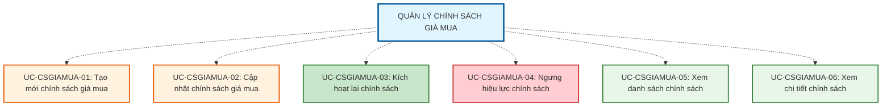

# QUẢN LÝ CHÍNH SÁCH GIÁ MUA (PURCHASE PRICING POLICY MANAGEMENT)

## Tổng quan Module

Chức năng "Quản lý Chính sách Giá mua" cung cấp khả năng thiết lập và quản lý các quy tắc tính giá thu mua hàng hóa từ khách hàng. Module này xác định mức giá hệ thống sẽ chi trả dựa trên Mã giá (Price Code), áp dụng cho từng dòng sản phẩm và mảng kinh doanh tại các chi nhánh cụ thể.

---

## 1. MÔ TẢ CHỨC NĂNG

### 1.1. Mục tiêu
- **Tự động hóa định giá mua**: Thiết lập quy tắc tính giá mua tự động dựa trên hệ số mua vào (Buy Factor) từ QTTG bán
- **Quản lý phạm vi thu mua**: Hỗ trợ áp dụng chính sách cho toàn hệ thống hoặc từng chi nhánh/khu vực cụ thể
- **Kiểm soát điều kiện mua lại**: Quản lý flag "Cho phép mua lại" để kiểm soát sản phẩm nào được phép thu mua
- **Quản lý vòng đời chính sách**: Theo dõi thời gian hiệu lực và trạng thái hoạt động của chính sách mua

### 1.2. Phạm vi áp dụng
- **Đối tượng quản lý**: Chính sách giá mua cho các dòng sản phẩm có flag "Cho phép mua lại" trong hệ thống POS
- **Ràng buộc nghiệp vụ**: Sử dụng hệ số mua vào (Buy Factor) từ Mã giá (Price Code) đã được thiết lập trong module Quản lý Mã giá
- **Phạm vi tác động**: Ảnh hưởng trực tiếp đến giá thu mua sản phẩm từ khách hàng tại các cửa hàng/chi nhánh

### 1.3. Định nghĩa
**Chính sách giá mua** là tập hợp các quy tắc xác định mức giá thu mua cho một dòng sản phẩm cụ thể, áp dụng tại một phạm vi nhất định (toàn hệ thống hoặc chi nhánh cụ thể) từ một thời điểm xác định.

**Cấu trúc Chính sách giá mua** bao gồm:
- Mã quy tắc (tự động sinh)
- Ngày có hiệu lực
- Mảng kinh doanh (VD: Vàng trang sức, Vàng miếng)
- Phạm vi áp dụng (Toàn hệ thống / Chi nhánh / Khu vực cụ thể)
- Dòng sản phẩm (phải có flag "Cho phép mua lại")
- QTTG bán (Quy tắc tính giá - liên kết với Price Code để lấy Buy Factor)
- Công thức tính giá mua (Hiển thị logic: Giá mua = Giá gốc × Hệ số mua)
- Trạng thái (Active / Inactive)

**Cơ chế ưu tiên chính sách:**
- **Chính sách cụ thể**: Áp dụng cho chi nhánh cụ thể có ưu tiên cao hơn
- **Chính sách chung**: Áp dụng cho toàn hệ thống có ưu tiên thấp hơn
- Tại một thời điểm, một dòng sản phẩm tại một chi nhánh chỉ có duy nhất một chính sách thu mua hoạt động

**Công thức tính giá mua:**
$$
\text{Giá mua} = \text{Giá gốc} \times \text{Hệ số mua vào (Buy Factor)}
$$

---

## 2. TÁC NHÂN (ACTORS)

| Tác nhân | Vai trò | Quyền hạn |
|----------|---------|-----------|
| **Admin** | Người quản lý toàn bộ hệ thống chính sách giá mua | - Tạo, cập nhật chính sách giá mua - Thiết lập quy tắc tính giá mua - Quản lý phạm vi áp dụng - Kích hoạt/ngưng hiệu lực chính sách - Xem danh sách và chi tiết chính sách |
| **Nhân viên** | Người xem và áp dụng chính sách giá mua | - Xem danh sách chính sách Active - Xem chi tiết chính sách và công thức tính giá - Tra cứu giá mua để giải thích cho khách hàng - Sử dụng chính sách trong giao dịch thu mua |

### 2.1. Ma trận Phân quyền Actor

| Use Case | Admin | Nhân viên | Ghi chú |
|----------|:-----:|:---------:|---------|
| **UC-CSGIAMUA-01: Tạo mới chính sách giá mua** | ✅ | ❌ | Chỉ Admin có quyền tạo chính sách mới |
| **UC-CSGIAMUA-02: Cập nhật chính sách giá mua** | ✅ | ❌ | Chỉ Admin có quyền cập nhật, có audit log |
| **UC-CSGIAMUA-03: Kích hoạt lại chính sách** | ✅ | ❌ | Chỉ Admin có quyền kích hoạt lại chính sách Inactive |
| **UC-CSGIAMUA-04: Ngưng hiệu lực chính sách** | ✅ | ❌ | Chỉ Admin có quyền ngưng hiệu lực |
| **UC-CSGIAMUA-05: Xem danh sách chính sách** | ✅ | ✅* | *Nhân viên chỉ xem được chính sách Active |
| **UC-CSGIAMUA-06: Xem chi tiết chính sách** | ✅ | ✅ | Cả hai có quyền xem chi tiết và công thức tính giá |

**Chú thích:**
- ✅ = Có quyền thực hiện
- ❌ = Không có quyền thực hiện
- ✅* = Có quyền với giới hạn (xem ghi chú)

---

## 3. DANH SÁCH USE CASE

### 3.1. Tổng quan Use Case

---

## 4. CẤU TRÚC TÀI LIỆU

### Use Cases (Tính năng nghiệp vụ)
- **UC-CSGIAMUA-01: Tạo mới chính sách giá mua** - Thiết lập các thông số chính sách giá mua mới
- **UC-CSGIAMUA-02: Cập nhật chính sách giá mua** - Chỉnh sửa thông tin chính sách (có audit log)
- **UC-CSGIAMUA-03: Kích hoạt lại chính sách** - Kích hoạt lại chính sách đã ngưng hiệu lực (Inactive → Active)
- **UC-CSGIAMUA-04: Ngưng hiệu lực chính sách** - Chuyển trạng thái sang "Không hoạt động" (Active → Inactive)
- **UC-CSGIAMUA-05: Xem danh sách chính sách** - Lọc, tìm kiếm và hiển thị danh sách chính sách
- **UC-CSGIAMUA-06: Xem chi tiết chính sách** - Xem thông tin đầy đủ, công thức tính giá mua của một chính sách

**Lưu ý:** 
- Kiểm tra xung đột chính sách là chức năng tự động được bao gồm (include) trong UC-01, UC-02 và UC-03, không phải use case độc lập.
- Kiểm tra flag "Cho phép mua lại" (IsBuybackEnabled) là điều kiện bắt buộc khi tạo/cập nhật chính sách.
- Trạng thái chính sách có thể chuyển đổi hai chiều: Active ⇄ Inactive (reversible).

---

## 5. BUSINESS RULE (Quy tắc nghiệp vụ)

### ⭐ Cơ chế hỗ trợ nghiệp vụ
- ✅ **Chọn lọc chính sách theo thời gian**: Hệ thống tự động áp dụng chính sách đang có hiệu lực tại thời điểm thu mua
- ✅ **Ưu tiên phạm vi tự động**: Chính sách chi nhánh cụ thể ưu tiên cao hơn chính sách toàn hệ thống
- ✅ **Snapshot hệ số mua**: Lưu trữ Buy Factor tại thời điểm lập phiếu để tránh thay đổi giá trị phiếu đã lập
- ✅ **Audit log đầy đủ**: Theo dõi toàn bộ lịch sử thay đổi chính sách đã có hiệu lực
- ✅ **Lọc dữ liệu thông minh**: Chỉ hiển thị dòng sản phẩm có flag "Cho phép mua lại" được bật
- ✅ **Tra cứu công thức giá mua**: Nhân viên có thể xem công thức tính giá để giải thích cho khách hàng tại quầy

### 🔒 Ràng buộc quan trọng

**BR-CSGIAMUA-01: Điều kiện mua lại (Buyback Flag)**
- ❌ Chỉ những dòng sản phẩm có **"Cho phép mua lại" = true** mới được phép tạo chính sách giá mua
- ⚠️ Flag này là "cửa chặn" (Gatekeeper) cho module Thu mua - nếu tắt, API sẽ trả về lỗi khi cố định giá sản phẩm đó
- ✅ Admin có thể bật/tắt flag này ở cấp Dòng sản phẩm để kiểm soát nghiệp vụ thu mua

**BR-CSGIAMUA-02: Nguồn giá mua**
- ✅ Hệ số mua vào (Buy Factor) được lấy từ **QTTG bán** (Price Code)
- 📐 Công thức: **Giá mua = Giá gốc × Hệ số mua vào**
- ⚠️ Nếu Price Code không có Buy Factor hoặc Buy Factor = 0 → Không thể tạo chính sách

**BR-CSGIAMUA-03: Ưu tiên thu mua**
- ⚠️ Chính sách áp dụng cho **Chi nhánh cụ thể** có ưu tiên cao hơn chính sách **Toàn hệ thống**
- 🎯 Khi có xung đột: Chi nhánh có chính sách riêng → Dùng hệ số của chi nhánh đó, bỏ qua chính sách toàn hệ thống

**BR-CSGIAMUA-04: Snapshot Giá mua**
- ✅ Tại thời điểm lập phiếu thu mua, hệ thống **"chốt" (snapshot)** hệ số mua để lưu vào phiếu
- 🔒 Sau khi lưu phiếu, ngay cả khi chính sách thay đổi, giá trị phiếu cũ vẫn **không thay đổi**
- 🎯 Mục đích: Tránh việc thay đổi chính sách làm sai lệch giá trị các phiếu đã lập

**BR-CSGIAMUA-05: Chính sách duy nhất**
- ❌ Tại một thời điểm, một Dòng sản phẩm tại một Chi nhánh chỉ được áp dụng **duy nhất một chính sách thu mua** đang hoạt động
- ⚠️ Khi tạo chính sách mới → Hệ thống kiểm tra xung đột và yêu cầu ngưng hiệu lực chính sách cũ

**BR-CSGIAMUA-06: Kiểm tra dữ liệu bắt buộc**
- ❌ Các trường bắt buộc phải được **kiểm tra và xác thực** đầy đủ
- ❌ Mã quy tắc được **sinh tự động**, không cho phép nhập thủ công
- ✅ Ngày có hiệu lực không được nhỏ hơn ngày hiện tại (trừ backdate có quyền đặc biệt)

**BR-CSGIAMUA-07: Mảng kinh doanh (Business Line)**
- ⚠️ Mảng kinh doanh quyết định các ràng buộc kế toán (VD: Vàng trang sức có thuế VAT khác Vàng miếng)
- ✅ Hệ thống tự động lọc Dòng sản phẩm theo Mảng kinh doanh đã chọn

### 📋 Cảnh báo Hệ thống

**Khi tạo/cập nhật chính sách có xung đột:**
> "⚠️ CẢNH BÁO XỬ ĐỘT CHÍNH SÁCH
> 
> Dòng sản phẩm '[Tên dòng SP]' đã được áp dụng chính sách giá mua khác tại [Phạm vi] từ ngày [Ngày hiệu lực].
> 
> Chính sách hiện tại: [Mã chính sách] - Hệ số mua: [Buy Factor]
> 
> Vui lòng ngưng hiệu lực chính sách cũ hoặc chọn dòng sản phẩm khác."

**Khi dòng sản phẩm không cho phép mua lại:**
> "❌ KHÔNG THỂ TẠO CHÍNH SÁCH
> 
> Dòng sản phẩm '[Tên dòng SP]' không có quyền thu mua.
> 
> Vui lòng bật flag 'Cho phép mua lại' (IsBuybackEnabled) ở module Quản lý Dòng sản phẩm trước khi tạo chính sách."

**Khi chỉnh sửa chính sách đã có hiệu lực:**
> "⚠️ CẢNH BÁO THAY ĐỔI GIÁ MUA
> 
> Chính sách này đã có hiệu lực từ [Ngày]. Việc thay đổi sẽ ảnh hưởng đến giá thu mua hiện tại.
> 
> ⚠️ LƯU Ý QUAN TRỌNG:
> - Các phiếu thu mua đã lập trước đây KHÔNG bị ảnh hưởng (đã snapshot)
> - Các giao dịch thu mua MỚI sẽ áp dụng hệ số mới
> 
> Bạn có chắc chắn muốn tiếp tục?
> Lưu ý: Tất cả thay đổi sẽ được ghi log."

**Khi Price Code không có Buy Factor:**
> "❌ KHÔNG THỂ TẠO CHÍNH SÁCH
> 
> QTTG bán '[Mã Price Code]' không có Hệ số mua vào (Buy Factor) hoặc Buy Factor = 0.
> 
> Vui lòng:
> 1. Chọn QTTG bán khác có Buy Factor hợp lệ, hoặc
> 2. Cập nhật Buy Factor cho QTTG bán này ở module Quản lý Mã giá"

**Khi backdate (nếu có quyền):**
> "⚠️ CẢNH BÁO BACKDATE
> 
> Bạn đang thiết lập ngày hiệu lực trong quá khứ: [Ngày]
> 
> Điều này có thể ảnh hưởng đến:
> - Các phiếu thu mua đã lập
> - Báo cáo kế toán
> 
> Vui lòng xác nhận với phòng Kế toán trước khi lưu."

Hệ thống sẽ **không cho phép lưu** nếu vi phạm các ràng buộc BR-CSGIAMUA-01, BR-CSGIAMUA-02, BR-CSGIAMUA-05, BR-CSGIAMUA-06.

---

## 6. LIÊN HỆ & HỖ TRỢ

**Phiên bản:** v1.0  
**Cập nhật:** 05/03/2026  
**Nguồn:** DEMO.MD  
**Module liên quan:** 
- Quản lý Mã giá (Price Code Management) - Cung cấp Buy Factor
- Quản lý Dòng sản phẩm (Product Line Management) - Flag "Cho phép mua lại"
- Module Thu mua (Purchase/Buyback Module) - Sử dụng chính sách để tính giá
