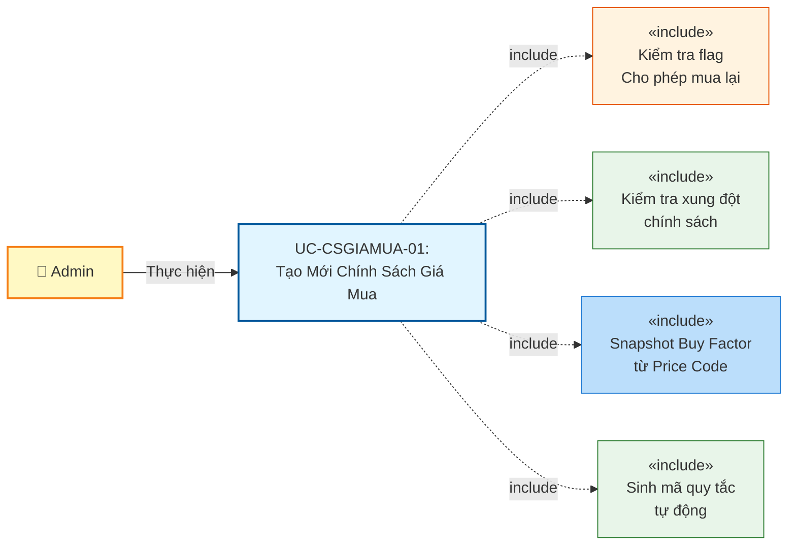
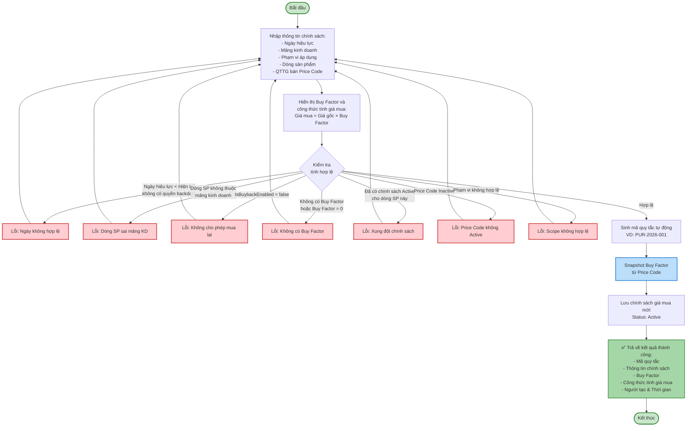
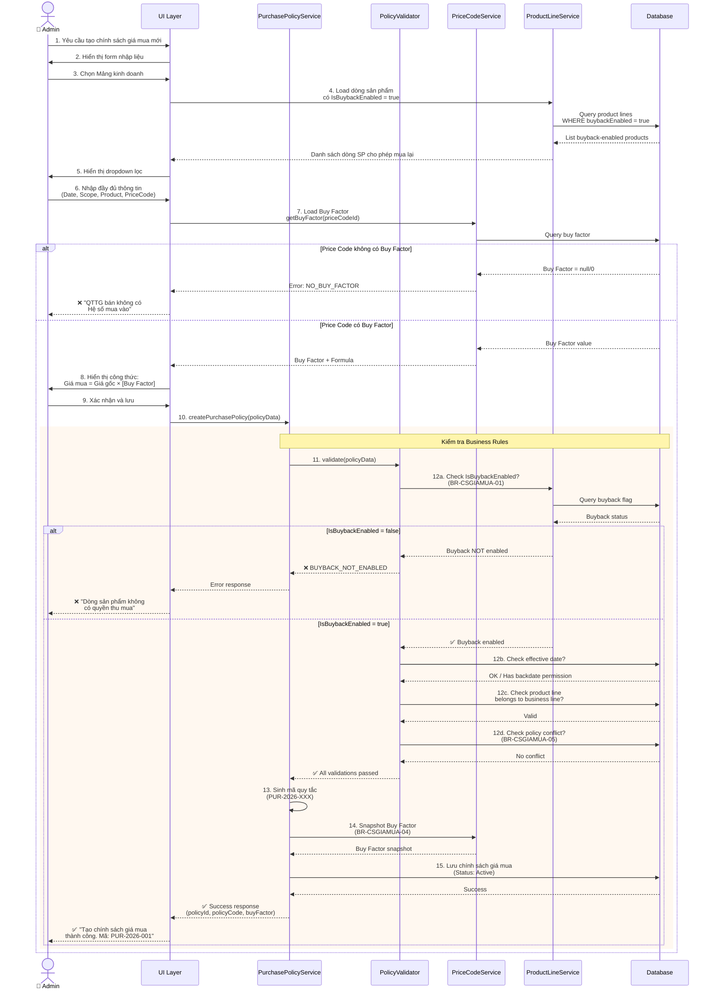
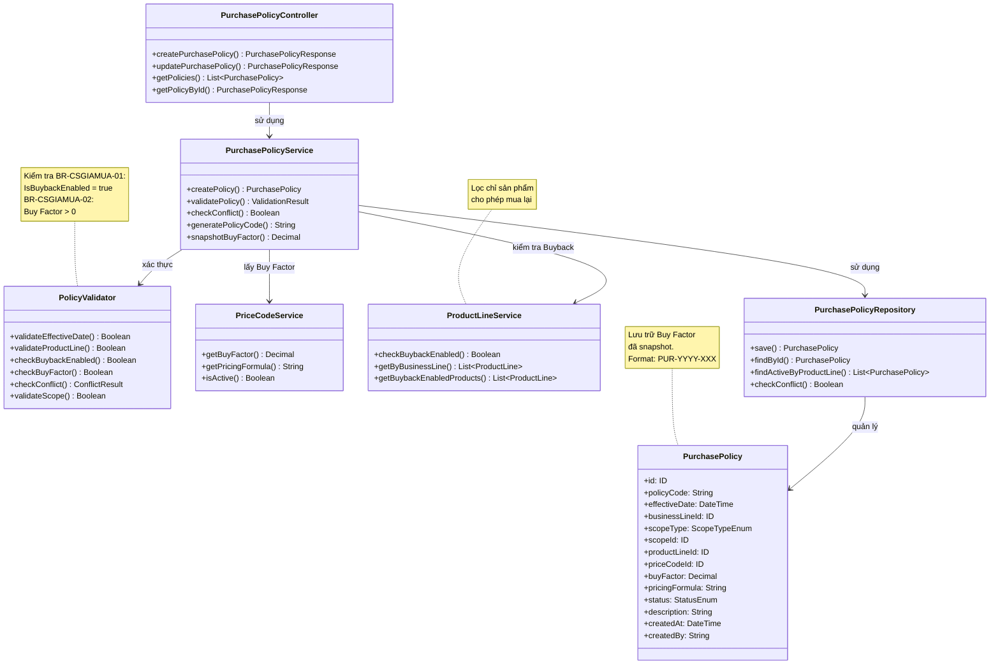

# Use Case UC-CSGIAMUA-01: Tạo Mới Chính Sách Giá Mua

---

| **Use Case ID** | **UC-CSGIAMUA-01** |
|-----------------|---------------------|
| **Use Case Name** | Tạo Mới Chính Sách Giá Mua |
| **Description** | Use Case "Tạo Mới Chính Sách Giá Mua" cho phép Admin thiết lập quy tắc tính giá thu mua hàng hóa từ khách hàng cho một dòng sản phẩm cụ thể (có flag "Cho phép mua lại"), áp dụng tại một phạm vi nhất định (toàn hệ thống hoặc chi nhánh cụ thể) từ một thời điểm xác định. |
| **Actor(s)** | Admin |
| **Priority** | Must Have |
| **Trigger** | Admin chọn chức năng "Tạo chính sách giá mua mới" |

---

## Input

| Tên trường | Loại | Bắt buộc | Mô tả | Ràng buộc |
|------------|------|----------|-------|-----------|
| `effectiveDate` | Ngày giờ | Có | Ngày có hiệu lực | Không được nhỏ hơn ngày hiện tại (trừ trường hợp backdate với quyền đặc biệt) |
| `businessLineId` | Số | Có | Mảng kinh doanh | Phải là mảng kinh doanh hợp lệ (VD: Vàng trang sức, Vàng miếng, Bạc) |
| `scopeType` | Enum | Có | Loại phạm vi áp dụng | `ALL_SYSTEM` hoặc `SPECIFIC_STORE` hoặc `SPECIFIC_REGION` |
| `scopeId` | Số | Có (nếu scope cụ thể) | ID chi nhánh/khu vực | Bắt buộc khi scopeType không phải ALL_SYSTEM |
| `productLineId` | Số | Có | Dòng sản phẩm | Phải thuộc mảng kinh doanh đã chọn và có flag "Cho phép mua lại" = true |
| `priceCodeId` | Số | Có | QTTG bán (Price Code) | Phải là mã giá Active, phải có Buy Factor > 0 |
| `description` | Văn bản | Không | Ghi chú/Mô tả | Max 500 ký tự |

**Quy tắc đầu vào:**
- Ngày có hiệu lực không được là ngày trong quá khứ (trừ Admin có quyền backdate)
- Dòng sản phẩm phải thuộc mảng kinh doanh đã chọn
- **Dòng sản phẩm phải có flag "Cho phép mua lại" (IsBuybackEnabled) = true** (BR-CSGIAMUA-01)
- Price Code phải có Hệ số mua vào (Buy Factor) và Buy Factor > 0 (BR-CSGIAMUA-02)
- Khi chọn phạm vi cụ thể (chi nhánh/khu vực), phải cung cấp scopeId tương ứng
- Mã quy tắc được sinh tự động bởi hệ thống

---

## Output

### Trường hợp thành công:

| Tên trường | Loại | Mô tả |
|------------|------|-------|
| `id` | Số | ID chính sách giá mua mới được tạo |
| `policyCode` | Văn bản | Mã quy tắc (sinh tự động, VD: "PUR-2026-001") |
| `effectiveDate` | Ngày giờ | Ngày có hiệu lực |
| `businessLine` | Thông tin | Thông tin mảng kinh doanh (id, name) |
| `scopeType` | Văn bản | Loại phạm vi áp dụng |
| `scopeName` | Văn bản | Tên phạm vi (Toàn hệ thống / Tên chi nhánh / Tên khu vực) |
| `productLine` | Thông tin | Thông tin dòng sản phẩm (id, code, name, isBuybackEnabled) |
| `priceCode` | Thông tin | Thông tin QTTG bán (id, code, name) |
| `buyFactor` | Số | Hệ số mua vào (Buy Factor) đã snapshot |
| `pricingFormula` | Văn bản | Công thức tính giá mua: Giá mua = Giá gốc × Buy Factor |
| `status` | Văn bản | Trạng thái = "Active" |
| `description` | Văn bản | Ghi chú/Mô tả |
| `createdAt` | Ngày giờ | Thời gian tạo |
| `createdBy` | Văn bản | Người tạo |

### Trường hợp lỗi:

| Mã lỗi | Thông báo | Mô tả |
|--------|-----------|-------|
| `INVALID_EFFECTIVE_DATE` | "Ngày có hiệu lực không được nhỏ hơn ngày hiện tại" | Ngày hiệu lực trong quá khứ (không có quyền backdate) |
| `PRODUCT_LINE_MISMATCH` | "Dòng sản phẩm không thuộc mảng kinh doanh đã chọn" | Dòng sản phẩm không khớp với mảng kinh doanh |
| `BUYBACK_NOT_ENABLED` | "Dòng sản phẩm không có quyền thu mua" | Flag "Cho phép mua lại" = false (BR-CSGIAMUA-01) |
| `NO_BUY_FACTOR` | "QTTG bán không có Hệ số mua vào" | Price Code không có Buy Factor (BR-CSGIAMUA-02) |
| `INVALID_BUY_FACTOR` | "Hệ số mua vào phải lớn hơn 0" | Buy Factor = 0 hoặc âm |
| `POLICY_CONFLICT` | "Dòng sản phẩm đã có chính sách giá mua khác đang áp dụng" | Vi phạm BR-CSGIAMUA-05 (đã có chính sách Active) |
| `INACTIVE_PRICE_CODE` | "Mã giá đã bị vô hiệu hóa" | Price Code không ở trạng thái Active |
| `SCOPE_REQUIRED` | "Vui lòng chọn chi nhánh/khu vực áp dụng" | Không cung cấp scopeId khi chọn phạm vi cụ thể |
| `INVALID_SCOPE` | "Chi nhánh/Khu vực không tồn tại" | scopeId không hợp lệ |

---

## Pre-Condition(s)

- Mảng kinh doanh đã được cấu hình trong hệ thống
- Dòng sản phẩm đã tồn tại, thuộc mảng kinh doanh, và có flag "Cho phép mua lại" = true
- Mã giá (Price Code) đã được tạo, ở trạng thái Active, và có Buy Factor > 0
- (Nếu chọn phạm vi cụ thể) Chi nhánh/Khu vực đã tồn tại trong hệ thống
- Admin đã đăng nhập và có quyền tạo chính sách giá mua

---

## Post-Condition(s)

- Chính sách giá mua mới được tạo thành công với trạng thái Active
- Chính sách được liên kết với dòng sản phẩm, phạm vi áp dụng và mã giá
- Hệ thống ghi nhận thông tin người tạo và thời gian tạo
- Hệ số mua vào (Buy Factor) được snapshot từ Price Code tại thời điểm tạo
- Công thức tính giá mua được lưu trữ: Giá mua = Giá gốc × Buy Factor
- Chính sách sẽ tự động được áp dụng khi đến ngày hiệu lực cho các giao dịch thu mua

---

## Basic Flow

1. Admin yêu cầu tạo chính sách giá mua mới
2. Hệ thống yêu cầu Admin cung cấp thông tin:
   - Ngày có hiệu lực (bắt buộc, >= ngày hiện tại)
   - Mảng kinh doanh (bắt buộc)
   - Phạm vi áp dụng (bắt buộc: Toàn hệ thống / Chi nhánh cụ thể / Khu vực cụ thể)
   - Dòng sản phẩm (bắt buộc, lọc theo mảng kinh doanh và chỉ hiển thị dòng có flag "Cho phép mua lại")
   - QTTG bán - Price Code (bắt buộc, phải Active và có Buy Factor > 0)
   - Ghi chú/Mô tả (tùy chọn, max 500 ký tự)
3. Admin cung cấp đầy đủ thông tin
4. Hệ thống load từ Price Code đã chọn và hiển thị:
   - Hệ số mua vào (Buy Factor)
   - Công thức tính giá mua: **Giá mua = Giá gốc × Buy Factor**
   - Ví dụ tính toán (nếu có)
5. Admin xác nhận công thức tính giá mua
6. Hệ thống kiểm tra tính hợp lệ của dữ liệu:
   - Ngày có hiệu lực >= ngày hiện tại (hoặc có quyền backdate)
   - Dòng sản phẩm thuộc mảng kinh doanh đã chọn
   - Dòng sản phẩm có flag "Cho phép mua lại" = true (BR-CSGIAMUA-01)
   - Price Code đang ở trạng thái Active
   - Price Code có Buy Factor và Buy Factor > 0 (BR-CSGIAMUA-02)
   - Không có chính sách giá mua Active khác cho cùng dòng sản phẩm tại cùng phạm vi (BR-CSGIAMUA-05)
7. Hệ thống sinh mã quy tắc tự động (VD: PUR-2026-001)
8. Hệ thống snapshot Buy Factor từ Price Code (BR-CSGIAMUA-04)
9. Hệ thống lưu chính sách giá mua mới với trạng thái Active và thông tin người tạo
10. Hệ thống trả về kết quả thành công với thông tin:
    - Mã quy tắc (sinh tự động)
    - Ngày có hiệu lực
    - Mảng kinh doanh và Dòng sản phẩm
    - Phạm vi áp dụng
    - QTTG bán và Hệ số mua vào (Buy Factor)
    - Công thức tính giá mua
    - Trạng thái: Active
    - Thời gian tạo và Người tạo

Use case kết thúc.

---

## Alternative Flow

### A1. Admin chọn backdate (có quyền đặc biệt)

2a. Admin có quyền backdate và muốn thiết lập ngày hiệu lực trong quá khứ

2a1. Admin nhập ngày hiệu lực < ngày hiện tại

2a2. Hệ thống hiển thị cảnh báo:
> "⚠️ CẢNH BÁO BACKDATE
> 
> Bạn đang thiết lập ngày hiệu lực trong quá khứ: [Ngày]
> 
> Điều này có thể ảnh hưởng đến:
> - Các phiếu thu mua đã lập
> - Báo cáo kế toán
> 
> Vui lòng xác nhận với phòng Kế toán trước khi lưu."

2a3. Admin xác nhận tiếp tục

2a4. Use case tiếp tục tại bước 3

---

## Exception Flow

**Lưu ý:** Các exception flows được mô tả chi tiết trong **Sequence Diagram** (các nhánh `alt` cho error cases)

### 6a. Ngày hiệu lực không hợp lệ

6a. Hệ thống phát hiện ngày có hiệu lực < ngày hiện tại và Admin không có quyền backdate

6a1. Hệ thống trả về lỗi: "Ngày có hiệu lực không được nhỏ hơn ngày hiện tại. Ngày hiện tại: [DD/MM/YYYY]"

6a2. Use case quay lại bước 3

### 6b. Dòng sản phẩm không thuộc mảng kinh doanh

6b. Hệ thống phát hiện dòng sản phẩm được chọn không thuộc mảng kinh doanh đã chọn

6b1. Hệ thống trả về lỗi: "Dòng sản phẩm '[Tên dòng SP]' không thuộc mảng kinh doanh '[Tên mảng KD]'. Vui lòng chọn lại."

6b2. Use case quay lại bước 3

### 6c. Dòng sản phẩm không cho phép mua lại

6c. Hệ thống phát hiện dòng sản phẩm có flag "Cho phép mua lại" (IsBuybackEnabled) = false

6c1. Hệ thống trả về lỗi: 
> "❌ KHÔNG THỂ TẠO CHÍNH SÁCH
> 
> Dòng sản phẩm '[Tên dòng SP]' không có quyền thu mua.
> 
> Vui lòng bật flag 'Cho phép mua lại' (IsBuybackEnabled) ở module Quản lý Dòng sản phẩm trước khi tạo chính sách."

6c2. Use case quay lại bước 3

### 6d. Price Code không có Buy Factor

6d. Hệ thống phát hiện Price Code được chọn không có Hệ số mua vào (Buy Factor) hoặc Buy Factor = 0

6d1. Hệ thống trả về lỗi:
> "❌ KHÔNG THỂ TẠO CHÍNH SÁCH
> 
> QTTG bán '[Mã Price Code]' không có Hệ số mua vào (Buy Factor) hoặc Buy Factor = 0.
> 
> Vui lòng:
> 1. Chọn QTTG bán khác có Buy Factor hợp lệ, hoặc
> 2. Cập nhật Buy Factor cho QTTG bán này ở module Quản lý Mã giá"

6d2. Use case quay lại bước 3

### 6e. Xung đột chính sách giá mua

6e. Hệ thống phát hiện đã có chính sách giá mua Active khác cho cùng dòng sản phẩm tại cùng phạm vi

6e1. Hệ thống kiểm tra:
- Cùng dòng sản phẩm
- Cùng phạm vi (hoặc có chính sách Toàn hệ thống)
- Trạng thái = Active
- EffectiveDate <= Ngày hiệu lực của chính sách đang tạo

6e2. Hệ thống trả về lỗi: 
> "⚠️ CẢNH BÁO XỬ ĐỘT CHÍNH SÁCH
> 
> Dòng sản phẩm '[Tên dòng SP]' đã được áp dụng chính sách giá mua '[Mã chính sách cũ]' tại [Phạm vi] từ ngày [Ngày hiệu lực].
> 
> Chính sách hiện tại: [Mã chính sách] - Hệ số mua: [Buy Factor]
> 
> Vui lòng ngưng hiệu lực chính sách cũ hoặc chọn dòng sản phẩm khác."

6e3. Use case quay lại bước 3

### 6f. Price Code không Active

6f. Hệ thống phát hiện Price Code được chọn đã bị vô hiệu hóa (status = Inactive)

6f1. Hệ thống trả về lỗi: "Mã giá '[Mã Price Code]' đã bị vô hiệu hóa. Vui lòng chọn mã giá Active khác."

6f2. Use case quay lại bước 3

### 6g. Phạm vi áp dụng không hợp lệ

6g. Hệ thống phát hiện phạm vi áp dụng không hợp lệ:
- Chọn phạm vi cụ thể nhưng không cung cấp scopeId
- scopeId không tồn tại trong hệ thống

6g1. Hệ thống trả về lỗi: 
- Nếu thiếu scopeId: "Vui lòng chọn chi nhánh/khu vực áp dụng"
- Nếu scopeId không tồn tại: "Chi nhánh/Khu vực không tồn tại trong hệ thống"

6g2. Use case quay lại bước 3

---

## Business Rules

### BR-CSGIAMUA-01: Điều kiện mua lại (Buyback Flag)

- Chỉ những dòng sản phẩm có **"Cho phép mua lại" (IsBuybackEnabled) = true** mới được phép tạo chính sách giá mua
- Flag này là **"cửa chặn" (Gatekeeper)** cho module Thu mua
- Nếu flag = false, API của module Mua hàng sẽ trả về lỗi khi cố gắng định giá sản phẩm đó
- Admin có thể bật/tắt flag này ở cấp Dòng sản phẩm để kiểm soát nghiệp vụ thu mua

**Lý do:**
- Không phải tất cả sản phẩm đều cho phép thu mua lại (VD: sản phẩm đặt làm theo yêu cầu)
- Kiểm soát rủi ro kinh doanh
- Tuân thủ chính sách công ty

**Ví dụ:**
```
Dòng sản phẩm: "Nhẫn vàng 24K"
IsBuybackEnabled: true
→ ✅ Có thể tạo chính sách giá mua

Dòng sản phẩm: "Nhẫn đặt làm theo yêu cầu"
IsBuybackEnabled: false
→ ❌ KHÔNG thể tạo chính sách giá mua
```

### BR-CSGIAMUA-02: Nguồn giá mua (Buy Factor)

- Hệ số mua vào (Buy Factor) được lấy từ **QTTG bán** (Price Code)
- Công thức tính giá mua:

$$
\text{Giá mua} = \text{Giá gốc} \times \text{Hệ số mua vào (Buy Factor)}
$$

- Price Code phải có Buy Factor và **Buy Factor > 0**
- Nếu Price Code không có Buy Factor hoặc Buy Factor = 0 → Không thể tạo chính sách

**Lý do:**
- Buy Factor phản ánh tỷ lệ giá thu mua so với giá gốc
- Thường < 1.0 để đảm bảo lợi nhuận khi bán lại
- VD: Buy Factor = 0.98 nghĩa là thu mua ở mức 98% giá gốc

**Ví dụ:**
```
Price Code: PC-001 (Nhẫn vàng 24K)
Buy Factor: 0.98
Giá gốc (Giá vàng SJC): 75,000,000 VND/lượng
Trọng lượng: 5 chỉ (0.1875 lượng)

Giá mua = 75,000,000 × 0.1875 × 0.98 = 13,781,250 VND
```

### BR-CSGIAMUA-03: Ưu tiên thu mua

Khi có nhiều chính sách giá mua cùng áp dụng cho một dòng sản phẩm, hệ thống ưu tiên theo thứ tự:

1. **Chính sách cụ thể** (Chi nhánh/Khu vực cụ thể) - Ưu tiên cao nhất
2. **Chính sách toàn hệ thống** (ALL_SYSTEM) - Ưu tiên thấp hơn

**Logic áp dụng:**
- Nếu có chính sách cho chi nhánh cụ thể → Áp dụng chính sách đó (dùng hệ số của chi nhánh)
- Nếu không có chính sách cụ thể → Tìm chính sách toàn hệ thống
- Nếu không có chính sách nào → Báo lỗi không thể thu mua sản phẩm này

**Ví dụ:**
```
Dòng sản phẩm: "Nhẫn vàng 24K"
Chi nhánh: "Chi nhánh Hà Nội"

Chính sách 1: PUR-001 - Toàn hệ thống - Buy Factor: 0.98 - Active
Chính sách 2: PUR-002 - Chi nhánh Hà Nội - Buy Factor: 0.99 - Active

→ Hệ thống áp dụng PUR-002 (ưu tiên cao hơn, Buy Factor 0.99)
→ Chi nhánh Hà Nội thu mua ở mức 99% giá gốc (cao hơn 98% toàn hệ thống)
```

### BR-CSGIAMUA-04: Snapshot Giá mua

- Tại thời điểm lập phiếu thu mua, hệ thống **"chốt" (snapshot)** hệ số mua để lưu vào phiếu
- Sau khi lưu phiếu, ngay cả khi chính sách thay đổi, giá trị phiếu cũ vẫn **không thay đổi**
- Đảm bảo tính bất biến của dữ liệu lịch sử

**Mục đích:**
- Tránh việc thay đổi chính sách làm sai lệch giá trị các phiếu đã lập
- Đảm bảo tính toàn vẹn của dữ liệu kế toán
- Hỗ trợ audit và kiểm tra

**Ví dụ:**
```
Ngày 01/03/2026:
- Tạo phiếu thu mua PTM-001
- Chính sách PUR-001: Buy Factor = 0.98
- Snapshot: Lưu Buy Factor = 0.98 vào PTM-001

Ngày 05/03/2026:
- Cập nhật chính sách PUR-001: Buy Factor → 0.99

Kết quả:
- PTM-001 vẫn giữ nguyên Buy Factor = 0.98 (đã snapshot)
- Phiếu mới từ 05/03 trở đi sẽ dùng Buy Factor = 0.99
```

### BR-CSGIAMUA-05: Chính sách duy nhất

- Tại một thời điểm, một Dòng sản phẩm tại một Phạm vi chỉ được áp dụng **duy nhất một chính sách giá mua** đang Active
- Hệ thống phải kiểm tra xung đột khi tạo mới hoặc cập nhật chính sách
- Nếu muốn thay đổi chính sách, phải ngưng hiệu lực chính sách cũ trước

**Điều kiện xung đột:**
```
Có chính sách khác thỏa mãn:
- Cùng Dòng sản phẩm
- Cùng Phạm vi (hoặc chính sách Toàn hệ thống)
- Trạng thái = Active
- EffectiveDate <= Ngày hiệu lực của chính sách đang tạo
```

**Ví dụ xung đột:**
```
Chính sách hiện có: PUR-001 (Active)
- Dòng sản phẩm: Nhẫn vàng 24K
- Phạm vi: Toàn hệ thống
- Hiệu lực từ: 01/03/2026

Chính sách muốn tạo: PUR-002
- Dòng sản phẩm: Nhẫn vàng 24K
- Phạm vi: Toàn hệ thống
- Hiệu lực từ: 05/03/2026

→ XUNG ĐỘT: Phải ngưng hiệu lực PUR-001 trước khi tạo PUR-002
```

### BR-CSGIAMUA-06: Kiểm tra dữ liệu bắt buộc

- Các trường bắt buộc phải được **kiểm tra và xác thực** đầy đủ
- Mã quy tắc được **sinh tự động**, không cho phép nhập thủ công
- Format mã quy tắc: `PUR-[YYYY]-[SEQ]` (VD: PUR-2026-001)
- Dòng sản phẩm phải thuộc mảng kinh doanh đã chọn (cascade filter)
- Ngày có hiệu lực không được nhỏ hơn ngày hiện tại (trừ backdate có quyền đặc biệt)

### BR-CSGIAMUA-07: Mảng kinh doanh (Business Line)

- Mảng kinh doanh quyết định các ràng buộc kế toán
- VD: Vàng trang sức có thuế VAT khác với Vàng miếng
- Hệ thống tự động lọc Dòng sản phẩm theo Mảng kinh doanh đã chọn
- Không cho phép chọn dòng sản phẩm ngoài mảng kinh doanh đã chọn

**Ví dụ:**
```
Mảng kinh doanh: "Vàng trang sức"
↓
Chỉ hiển thị các dòng sản phẩm:
- Nhẫn vàng 24K
- Dây chuyền vàng
- Lắc tay vàng
- ...

KHÔNG hiển thị:
- Vàng miếng SJC (thuộc mảng "Vàng miếng")
- Bạc đá quý (thuộc mảng "Bạc")
```

---

## Diagrams

### 1. Use Case Diagram - UC-CSGIAMUA-01: Tạo Mới Chính Sách Giá Mua



### 2. Activity Diagram - Luồng Tạo Mới Chính Sách Giá Mua



### 3. Sequence Diagram - Tạo Mới Chính Sách Giá Mua



**Giải thích Sequence Diagram:**

Diagram tập trung vào **business logic đặc thù** của module Giá mua:

**Xử lý nghiệp vụ:**
- Load chỉ các dòng sản phẩm có flag "Cho phép mua lại" = true (BR-CSGIAMUA-01)
- Kiểm tra Buy Factor từ Price Code trước khi cho phép tạo chính sách (BR-CSGIAMUA-02)
- Hiển thị công thức tính giá mua cho Admin xác nhận
- Snapshot Buy Factor từ Price Code khi lưu (BR-CSGIAMUA-04)

**Nhánh xử lý:**
- **Price Code không có Buy Factor**: Từ chối ngay, yêu cầu chọn Price Code khác
- **IsBuybackEnabled = false**: Từ chối tạo chính sách, yêu cầu bật flag
- **Validation thành công**: Tiến hành tạo chính sách, snapshot Buy Factor, lưu database

**Xử lý lỗi đặc thù:**
- BUYBACK_NOT_ENABLED: Sản phẩm không cho phép mua lại
- NO_BUY_FACTOR: Price Code không có hệ số mua
- Các lỗi chung: ngày hiệu lực, xung đột, phạm vi, v.v.

---

### 4. Class Diagram



---

## Notes

**Quan hệ với các module khác:**
- Module **Quản lý Mã giá (Price Code)**: Cung cấp Buy Factor để tính giá mua
- Module **Quản lý Dòng sản phẩm (Product Line)**: Cung cấp flag "Cho phép mua lại" (IsBuybackEnabled)
- Module **Thu mua (Purchase/Buyback)**: Sử dụng chính sách để tính giá thu mua từ khách hàng
- Module **Quản lý Chi nhánh**: Cung cấp thông tin phạm vi áp dụng

**Lưu ý kỹ thuật:**
- Mã quy tắc được sinh tự động theo format: `PUR-[YYYY]-[SEQ]` (VD: PUR-2026-001)
- Buy Factor được snapshot tại thời điểm tạo chính sách (immutable sau khi lưu vào phiếu)
- Hệ thống phải lọc chỉ hiển thị dòng sản phẩm có IsBuybackEnabled = true
- Kiểm tra xung đột chính sách theo logic ưu tiên phạm vi (BR-CSGIAMUA-03)
- Audit log phải ghi nhận đầy đủ thông tin người tạo, thời gian tạo

**Điểm khác biệt với module Giá bán:**
| Khía cạnh | Giá bán | Giá mua |
|-----------|---------|---------|
| **Hệ số** | Sell Factor | Buy Factor |
| **Flag điều kiện** | Không có | IsBuybackEnabled = true |
| **Công thức** | Giá bán | Giá mua = Giá gốc × Buy Factor |
| **Mã policy** | PP-YYYY-XXX | PUR-YYYY-XXX |
| **Người dùng** | Bán cho khách | Mua từ khách |
| **Hệ số thường** | > 1.0 | < 1.0 |

**Tham chiếu:**
- TONG-QUAN.md - Section 5: Business Rules
- DEMO.MD - Các quy tắc nghiệp vụ chi tiết về thu mua
