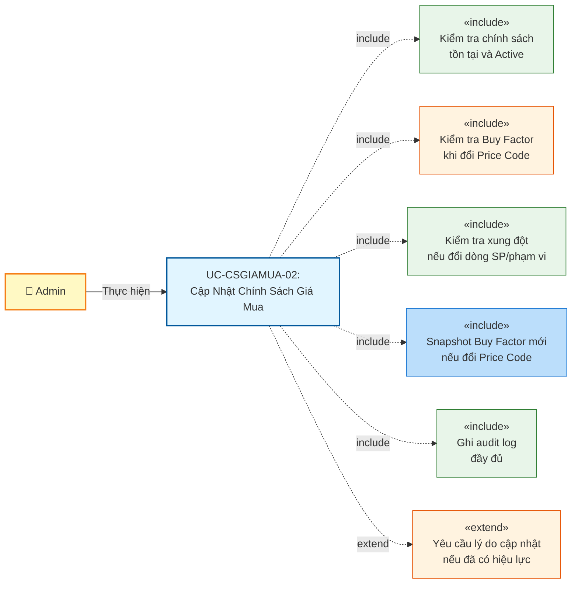
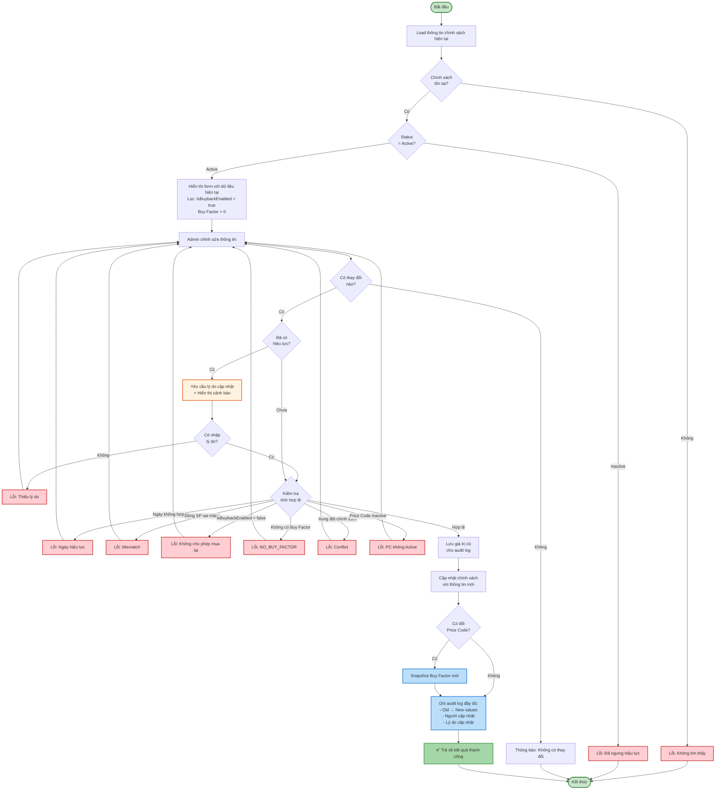
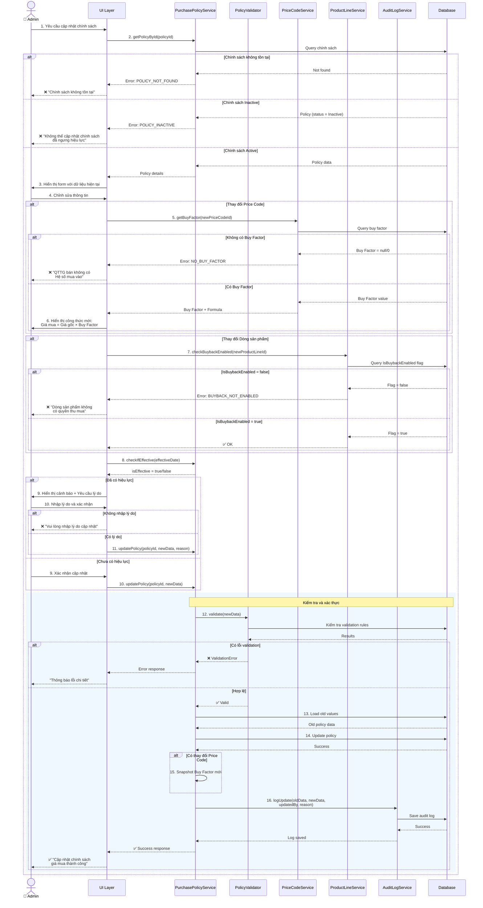
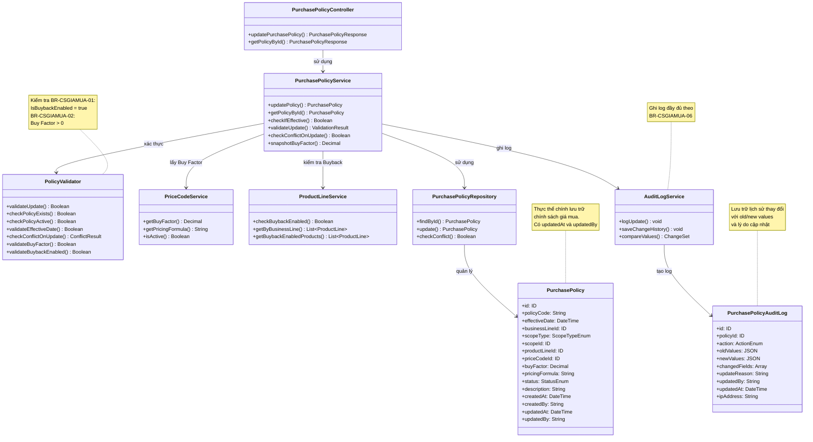

# Use Case UC-CSGIAMUA-02: Cập Nhật Chính Sách Giá Mua

---

| **Use Case ID** | **UC-CSGIAMUA-02** |
|-----------------|---------------------|
| **Use Case Name** | Cập Nhật Chính Sách Giá Mua |
| **Description** | Use Case "Cập Nhật Chính Sách Giá Mua" cho phép Admin chỉnh sửa thông tin chính sách giá mua đã tồn tại. Việc cập nhật chính sách đã có hiệu lực sẽ được ghi log đầy đủ và yêu cầu xác nhận từ Admin do có thể ảnh hưởng đến giá thu mua hiện tại. |
| **Actor(s)** | Admin |
| **Priority** | Must Have |
| **Trigger** | Admin chọn chức năng "Cập nhật chính sách giá mua" từ danh sách hoặc chi tiết chính sách |

---

## Input

| Tên trường | Loại | Bắt buộc | Mô tả | Ràng buộc |
|------------|------|----------|-------|-----------|
| `policyId` | Số | Có | ID chính sách cần cập nhật | Phải tồn tại trong hệ thống |
| `effectiveDate` | Ngày giờ | Có | Ngày có hiệu lực mới | Không được nhỏ hơn ngày hiện tại (trừ trường hợp backdate với quyền đặc biệt) |
| `businessLineId` | Số | Có | Mảng kinh doanh | Phải là mảng kinh doanh hợp lệ |
| `scopeType` | Enum | Có | Loại phạm vi áp dụng | `ALL_SYSTEM` hoặc `SPECIFIC_STORE` hoặc `SPECIFIC_REGION` |
| `scopeId` | Số | Có (nếu scope cụ thể) | ID chi nhánh/khu vực | Bắt buộc khi scopeType không phải ALL_SYSTEM |
| `productLineId` | Số | Có | Dòng sản phẩm | Phải thuộc mảng kinh doanh đã chọn và có flag "Cho phép mua lại" = true |
| `priceCodeId` | Số | Có | QTTG bán (Price Code) | Phải là mã giá Active, phải có Buy Factor > 0 |
| `description` | Văn bản | Không | Ghi chú/Mô tả | Max 500 ký tự |
| `updateReason` | Văn bản | Có (nếu đã có hiệu lực) | Lý do cập nhật | Bắt buộc khi cập nhật chính sách đã Active, max 200 ký tự |

**Quy tắc đầu vào:**
- Chính sách phải tồn tại và ở trạng thái Active
- Khi cập nhật chính sách đã có hiệu lực (effectiveDate <= ngày hiện tại), phải cung cấp lý do cập nhật
- Khi thay đổi dòng sản phẩm, phải đảm bảo dòng sản phẩm mới có flag "Cho phép mua lại" = true
- Khi thay đổi Price Code, phải đảm bảo Price Code mới có Buy Factor > 0
- Nếu thay đổi dòng sản phẩm hoặc phạm vi, phải kiểm tra xung đột tương tự như tạo mới
- Không cho phép cập nhật chính sách đã bị ngưng hiệu lực (Inactive)

---

## Output

### Trường hợp thành công:

| Tên trường | Loại | Mô tả |
|------------|------|-------|
| `id` | Số | ID chính sách đã cập nhật |
| `policyCode` | Văn bản | Mã quy tắc (không thay đổi) |
| `effectiveDate` | Ngày giờ | Ngày có hiệu lực mới |
| `businessLine` | Thông tin | Thông tin mảng kinh doanh (id, name) |
| `scopeType` | Văn bản | Loại phạm vi áp dụng |
| `scopeName` | Văn bản | Tên phạm vi (Toàn hệ thống / Tên chi nhánh / Tên khu vực) |
| `productLine` | Thông tin | Thông tin dòng sản phẩm (id, code, name, isBuybackEnabled) |
| `priceCode` | Thông tin | Thông tin QTTG bán (id, code, name) |
| `buyFactor` | Số | Hệ số mua vào (Buy Factor) đã snapshot |
| `pricingFormula` | Văn bản | Công thức tính giá mua: Giá mua = Giá gốc × Buy Factor |
| `status` | Văn bản | Trạng thái (Active) |
| `description` | Văn bản | Ghi chú/Mô tả |
| `updatedAt` | Ngày giờ | Thời gian cập nhật |
| `updatedBy` | Văn bản | Người cập nhật |
| `updateReason` | Văn bản | Lý do cập nhật (nếu có) |

### Trường hợp lỗi:

| Mã lỗi | Thông báo | Mô tả |
|--------|-----------|-------|
| `POLICY_NOT_FOUND` | "Chính sách không tồn tại" | Không tìm thấy chính sách với ID đã cho |
| `POLICY_INACTIVE` | "Không thể cập nhật chính sách đã ngưng hiệu lực" | Chính sách có status = Inactive |
| `INVALID_EFFECTIVE_DATE` | "Ngày có hiệu lực không được nhỏ hơn ngày hiện tại" | Ngày hiệu lực trong quá khứ (không có quyền backdate) |
| `PRODUCT_LINE_MISMATCH` | "Dòng sản phẩm không thuộc mảng kinh doanh đã chọn" | Dòng sản phẩm không khớp với mảng kinh doanh |
| `BUYBACK_NOT_ENABLED` | "Dòng sản phẩm không có quyền thu mua" | Flag "Cho phép mua lại" = false (BR-CSGIAMUA-01) |
| `NO_BUY_FACTOR` | "QTTG bán không có Hệ số mua vào" | Price Code không có Buy Factor (BR-CSGIAMUA-02) |
| `INVALID_BUY_FACTOR` | "Hệ số mua vào phải lớn hơn 0" | Buy Factor = 0 hoặc âm |
| `POLICY_CONFLICT` | "Dòng sản phẩm đã có chính sách giá mua khác đang áp dụng" | Vi phạm BR-CSGIAMUA-05 khi thay đổi dòng sản phẩm/phạm vi |
| `INACTIVE_PRICE_CODE` | "Mã giá đã bị vô hiệu hóa" | Price Code không ở trạng thái Active |
| `UPDATE_REASON_REQUIRED` | "Vui lòng nhập lý do cập nhật" | Thiếu lý do khi cập nhật chính sách đã có hiệu lực |
| `INVALID_SCOPE` | "Chi nhánh/Khu vực không tồn tại" | scopeId không hợp lệ |

---

## Pre-Condition(s)

- Chính sách giá mua đã tồn tại trong hệ thống
- Chính sách đang ở trạng thái Active
- Mảng kinh doanh và dòng sản phẩm đã được cấu hình
- Mã giá (Price Code) mới (nếu thay đổi) đang ở trạng thái Active và có Buy Factor > 0
- Admin đã đăng nhập và có quyền cập nhật chính sách giá mua

---

## Post-Condition(s)

- Chính sách giá mua được cập nhật thành công với thông tin mới
- Hệ thống ghi nhận thông tin người cập nhật và thời gian cập nhật
- Audit log ghi nhận đầy đủ thông tin thay đổi (old values → new values)
- (Nếu thay đổi Price Code) Buy Factor mới được snapshot
- (Nếu chính sách đã có hiệu lực) Lý do cập nhật được lưu trữ trong audit log

---

## Basic Flow

1. Admin yêu cầu cập nhật chính sách giá mua (từ danh sách hoặc chi tiết)
2. Hệ thống kiểm tra chính sách tồn tại và đang Active
3. Hệ thống hiển thị form cập nhật với thông tin hiện tại:
   - Mã quy tắc (chỉ xem, không sửa được)
   - Ngày có hiệu lực
   - Mảng kinh doanh
   - Phạm vi áp dụng
   - Dòng sản phẩm (lọc theo mảng kinh doanh và chỉ hiển thị dòng có IsBuybackEnabled = true)
   - QTTG bán - Price Code (chỉ hiển thị mã có Buy Factor > 0)
   - Buy Factor và Công thức tính giá mua
   - Ghi chú/Mô tả
4. Admin chỉnh sửa các thông tin cần thiết
5. Hệ thống load và hiển thị Buy Factor + công thức tính giá mua tương ứng (nếu thay đổi Price Code)
6. Hệ thống kiểm tra xem chính sách đã có hiệu lực chưa (effectiveDate <= ngày hiện tại)
7. Nếu chính sách đã có hiệu lực:
   - Hệ thống yêu cầu Admin nhập lý do cập nhật (bắt buộc)
   - Hiển thị cảnh báo về tác động của việc thay đổi
8. Admin xác nhận cập nhật và cung cấp lý do (nếu cần)
9. Hệ thống kiểm tra tính hợp lệ của dữ liệu:
   - Ngày có hiệu lực >= ngày hiện tại (hoặc có quyền backdate)
   - Dòng sản phẩm thuộc mảng kinh doanh đã chọn
   - Dòng sản phẩm có flag "Cho phép mua lại" = true (BR-CSGIAMUA-01)
   - Price Code đang ở trạng thái Active
   - Price Code có Buy Factor và Buy Factor > 0 (BR-CSGIAMUA-02)
   - (Nếu thay đổi dòng sản phẩm/phạm vi) Không có chính sách Active khác xung đột (BR-CSGIAMUA-05)
10. Hệ thống lưu lại giá trị cũ cho audit log
11. Hệ thống cập nhật chính sách với thông tin mới
12. (Nếu thay đổi Price Code) Hệ thống snapshot Buy Factor mới (BR-CSGIAMUA-04)
13. Hệ thống ghi audit log với đầy đủ thông tin:
    - Các trường đã thay đổi (old value → new value)
    - Người cập nhật và thời gian
    - Lý do cập nhật (nếu có)
14. Hệ thống trả về kết quả thành công với thông tin đã cập nhật

Use case kết thúc.

---

## Alternative Flow

### A1. Admin hủy bỏ cập nhật

4a. Admin không muốn tiếp tục cập nhật

4a1. Admin chọn "Hủy bỏ"

4a2. Hệ thống hỏi xác nhận: "Các thay đổi chưa được lưu sẽ bị mất. Bạn có chắc chắn muốn hủy?"

4a3. Nếu Admin xác nhận → Quay lại màn hình trước đó, không lưu thay đổi

Use case kết thúc.

### A2. Không có thay đổi nào

4b. Admin không thay đổi bất kỳ thông tin nào và nhấn lưu

4b1. Hệ thống phát hiện không có thay đổi

4b2. Hệ thống thông báo: "Không có thay đổi nào để lưu"

4b3. Use case kết thúc

---

## Exception Flow

**Lưu ý:** Các exception flows được mô tả chi tiết trong **Sequence Diagram** (các nhánh `alt` cho error cases)

### 2a. Chính sách không tồn tại

2a. Hệ thống không tìm thấy chính sách với ID đã cho

2a1. Hệ thống trả về lỗi: "Chính sách không tồn tại hoặc đã bị xóa"

2a2. Use case kết thúc

### 2b. Chính sách đã bị ngưng hiệu lực

2b. Hệ thống phát hiện chính sách có status = Inactive

2b1. Hệ thống trả về lỗi: "Không thể cập nhật chính sách đã ngưng hiệu lực. Chính sách này đã bị vô hiệu hóa vào [Ngày]."

2b2. Use case kết thúc

### 8a. Thiếu lý do cập nhật

8a. Admin không cung cấp lý do cập nhật khi chính sách đã có hiệu lực

8a1. Hệ thống trả về lỗi: "Vui lòng nhập lý do cập nhật. Đây là chính sách đã có hiệu lực và đang ảnh hưởng đến giá thu mua hiện tại."

8a2. Use case quay lại bước 7

### 9a. Ngày hiệu lực không hợp lệ

9a. Hệ thống phát hiện ngày có hiệu lực < ngày hiện tại và Admin không có quyền backdate

9a1. Hệ thống trả về lỗi: "Ngày có hiệu lực không được nhỏ hơn ngày hiện tại. Ngày hiện tại: [DD/MM/YYYY]"

9a2. Use case quay lại bước 4

### 9b. Dòng sản phẩm không thuộc mảng kinh doanh

9b. Hệ thống phát hiện dòng sản phẩm được chọn không thuộc mảng kinh doanh đã chọn

9b1. Hệ thống trả về lỗi: "Dòng sản phẩm '[Tên dòng SP]' không thuộc mảng kinh doanh '[Tên mảng KD]'. Vui lòng chọn lại."

9b2. Use case quay lại bước 4

### 9c. Dòng sản phẩm không cho phép mua lại

9c. Hệ thống phát hiện dòng sản phẩm mới có flag "Cho phép mua lại" (IsBuybackEnabled) = false

9c1. Hệ thống trả về lỗi: 
> "❌ KHÔNG THỂ CẬP NHẬT
> 
> Dòng sản phẩm '[Tên dòng SP]' không có quyền thu mua.
> 
> Vui lòng bật flag 'Cho phép mua lại' (IsBuybackEnabled) ở module Quản lý Dòng sản phẩm hoặc chọn dòng sản phẩm khác."

9c2. Use case quay lại bước 4

### 9d. Price Code không có Buy Factor

9d. Hệ thống phát hiện Price Code mới không có Hệ số mua vào (Buy Factor) hoặc Buy Factor = 0

9d1. Hệ thống trả về lỗi:
> "❌ KHÔNG THỂ CẬP NHẬT
> 
> QTTG bán '[Mã Price Code]' không có Hệ số mua vào (Buy Factor) hoặc Buy Factor = 0.
> 
> Vui lòng:
> 1. Chọn QTTG bán khác có Buy Factor hợp lệ, hoặc
> 2. Cập nhật Buy Factor cho QTTG bán này ở module Quản lý Mã giá"

9d2. Use case quay lại bước 4

### 9e. Xung đột chính sách giá mua (khi thay đổi dòng sản phẩm/phạm vi)

9e. Hệ thống phát hiện đã có chính sách giá mua Active khác cho dòng sản phẩm mới tại phạm vi mới

9e1. Hệ thống kiểm tra:
- Cùng dòng sản phẩm (mới)
- Cùng phạm vi (mới, hoặc có chính sách Toàn hệ thống)
- Trạng thái = Active
- ID khác với chính sách đang cập nhật
- EffectiveDate <= Ngày hiệu lực của chính sách đang cập nhật

9e2. Hệ thống trả về lỗi: 
> "⚠️ CẢNH BÁO XUNG ĐỘT CHÍNH SÁCH
> 
> Dòng sản phẩm '[Tên dòng SP]' đã được áp dụng chính sách giá mua '[Mã chính sách khác]' tại [Phạm vi] từ ngày [Ngày hiệu lực].
> 
> Chính sách hiện tại: [Mã chính sách] - Hệ số mua: [Buy Factor]
> 
> Vui lòng ngưng hiệu lực chính sách đó hoặc chọn dòng sản phẩm/phạm vi khác."

9e3. Use case quay lại bước 4

### 9f. Price Code không Active

9f. Hệ thống phát hiện Price Code được chọn đã bị vô hiệu hóa (status = Inactive)

9f1. Hệ thống trả về lỗi: "Mã giá '[Mã Price Code]' đã bị vô hiệu hóa. Vui lòng chọn mã giá Active khác."

9f2. Use case quay lại bước 4

### 9g. Phạm vi áp dụng không hợp lệ

9g. Hệ thống phát hiện phạm vi áp dụng không hợp lệ:
- Chọn phạm vi cụ thể nhưng không cung cấp scopeId
- scopeId không tồn tại trong hệ thống

9g1. Hệ thống trả về lỗi: 
- Nếu thiếu scopeId: "Vui lòng chọn chi nhánh/khu vực áp dụng"
- Nếu scopeId không tồn tại: "Chi nhánh/Khu vực không tồn tại trong hệ thống"

9g2. Use case quay lại bước 4

---

## Business Rules

### BR-CSGIAMUA-01: Điều kiện mua lại (Buyback Flag)

- Chỉ những dòng sản phẩm có **"Cho phép mua lại" (IsBuybackEnabled) = true** mới được phép tạo/cập nhật chính sách giá mua
- Khi cập nhật, nếu thay đổi sang dòng sản phẩm mới, phải kiểm tra flag này
- Nếu flag = false, từ chối cập nhật và yêu cầu chọn dòng sản phẩm khác hoặc bật flag

### BR-CSGIAMUA-02: Nguồn giá mua (Buy Factor)

- Hệ số mua vào (Buy Factor) được lấy từ **QTTG bán** (Price Code)
- Công thức tính giá mua:

$$
\text{Giá mua} = \text{Giá gốc} \times \text{Hệ số mua vào (Buy Factor)}
$$

- Price Code phải có Buy Factor và **Buy Factor > 0**
- Khi cập nhật Price Code, phải kiểm tra điều kiện này

### BR-CSGIAMUA-03: Ưu tiên thu mua

- Khi thay đổi phạm vi áp dụng, phải đảm bảo không vi phạm quy tắc ưu tiên
- Chính sách cụ thể (chi nhánh) có ưu tiên cao hơn chính sách toàn hệ thống

### BR-CSGIAMUA-04: Snapshot Giá mua

- Khi thay đổi Price Code, hệ thống phải snapshot lại Buy Factor mới
- Buy Factor cũ được lưu trong audit log để tham khảo
- Đảm bảo tính bất biến của dữ liệu đã lưu vào phiếu thu mua

### BR-CSGIAMUA-05: Chính sách duy nhất

- Khi thay đổi dòng sản phẩm hoặc phạm vi, phải kiểm tra xung đột với chính sách khác
- Không được tạo ra tình trạng 2 chính sách Active cùng áp dụng cho 1 dòng sản phẩm tại 1 phạm vi

### BR-CSGIAMUA-06: Audit Log khi cập nhật

**Yêu cầu ghi log đầy đủ:**
- Tất cả các trường đã thay đổi phải được ghi log với format: `[Field]: [Old Value] → [New Value]`
- Thông tin người cập nhật và thời gian cập nhật
- Lý do cập nhật (bắt buộc nếu chính sách đã có hiệu lực)
- IP address và user agent (nếu cập nhật qua web)

**Ví dụ audit log:**
```
Policy ID: PUR-2026-001
Updated At: 05/03/2026 14:30:00
Updated By: admin@company.com

Changes:
- effectiveDate: 05/03/2026 → 06/03/2026
- priceCodeId: PC-001 → PC-002
- buyFactor: 0.98 → 0.99
- pricingFormula: "Giá mua = Giá gốc × 0.98" → "Giá mua = Giá gốc × 0.99"

Update Reason: "Điều chỉnh hệ số mua theo chính sách mới của công ty"
```

### BR-CSGIAMUA-07: Không cập nhật chính sách Inactive

- Chỉ cho phép cập nhật chính sách đang ở trạng thái Active
- Chính sách đã bị ngưng hiệu lực (Inactive) không thể cập nhật
- Mục đích: Đảm bảo tính toàn vẹn của dữ liệu lịch sử

### BR-CSGIAMUA-08: Cảnh báo khi cập nhật chính sách đã có hiệu lực

Khi cập nhật chính sách đã có hiệu lực (effectiveDate <= ngày hiện tại):

**Yêu cầu bắt buộc:**
- Admin phải nhập lý do cập nhật (min 10 ký tự, max 200 ký tự)
- Hệ thống phải hiển thị cảnh báo rõ ràng về tác động

**Nội dung cảnh báo:**
> "⚠️ CẢNH BÁO: Chính sách đã có hiệu lực  
> 
> Chính sách này đã có hiệu lực từ [Ngày]. Việc thay đổi sẽ ảnh hưởng đến giá thu mua hiện tại.
> 
> Các thay đổi bạn đang thực hiện:
> - [Liệt kê các trường đã thay đổi]
> 
> Vui lòng nhập lý do cập nhật và xác nhận với phòng Kế toán trước khi lưu.
> 
> Tất cả thay đổi sẽ được ghi log đầy đủ."

---

## Diagrams

### 1. Use Case Diagram - UC-CSGIAMUA-02: Cập Nhật Chính Sách Giá Mua



### 2. Activity Diagram - Luồng Cập Nhật Chính Sách Giá Mua



### 3. Sequence Diagram - Cập Nhật Chính Sách Giá Mua



**Giải thích Sequence Diagram:**

Diagram tập trung vào **business logic đặc thù** của module Giá mua:

**Xử lý nghiệp vụ:**
- Kiểm tra chính sách tồn tại và ở trạng thái Active
- Khi thay đổi Price Code: Kiểm tra Buy Factor (BR-CSGIAMUA-02)
- Khi thay đổi Dòng sản phẩm: Kiểm tra IsBuybackEnabled flag (BR-CSGIAMUA-01)
- Phân biệt xử lý giữa chính sách đã/chưa có hiệu lực
- Yêu cầu lý do cập nhật đối với chính sách đã có hiệu lực
- Lưu trữ giá trị cũ trước khi cập nhật để ghi audit log

**Nhánh xử lý:**
- **Chính sách không tồn tại/Inactive**: Từ chối cập nhật
- **Price Code không có Buy Factor**: Từ chối ngay, yêu cầu chọn Price Code khác
- **Dòng sản phẩm IsBuybackEnabled = false**: Từ chối, yêu cầu chọn dòng khác hoặc bật flag
- **Chính sách đã có hiệu lực**: Yêu cầu lý do + cảnh báo
- **Validation thất bại**: Trả về lỗi cụ thể
- **Thành công**: Cập nhật, snapshot (nếu cần), ghi audit log

**Xử lý lỗi đặc thù:**
- POLICY_NOT_FOUND: Chính sách không tồn tại
- POLICY_INACTIVE: Không thể cập nhật chính sách đã ngưng hiệu lực
- NO_BUY_FACTOR: Price Code không có hệ số mua
- BUYBACK_NOT_ENABLED: Dòng sản phẩm không cho phép mua lại
- UPDATE_REASON_REQUIRED: Thiếu lý do cập nhật (khi đã có hiệu lực)
- Các lỗi validation khác: ngày hiệu lực, xung đột, phạm vi, v.v.

---

### 4. Class Diagram



---

## Notes

**So sánh với UC-CSGIAMUA-01 (Tạo mới):**

| Khía cạnh | UC-01: Tạo mới | UC-02: Cập nhật |
|-----------|----------------|-----------------|
| **Mã quy tắc** | Sinh tự động | Không thay đổi (read-only) |
| **Validation** | Kiểm tra xung đột cơ bản | Kiểm tra xung đột (nếu thay đổi dòng SP/phạm vi) |
| **Lý do thay đổi** | Không yêu cầu | Bắt buộc nếu đã có hiệu lực |
| **Audit log** | Ghi thông tin tạo | Ghi đầy đủ old → new values |
| **Cảnh báo** | Minimal | Nhiều cảnh báo (đặc biệt nếu đã có hiệu lực) |
| **Snapshot Buy Factor** | Luôn luôn | Chỉ khi thay đổi Price Code |
| **IsBuybackEnabled check** | Bắt buộc | Chỉ khi thay đổi dòng sản phẩm |

**So sánh với UC-CSGIABAN-02 (Cập nhật Giá bán):**

| Khía cạnh | Giá bán | Giá mua |
|-----------|---------|---------|
| **Hệ số** | Sell Factor | Buy Factor |
| **Flag điều kiện** | Không có | IsBuybackEnabled = true |
| **Công thức** | Giá bán | Giá mua = Giá gốc × Buy Factor |
| **Mã policy** | PP-YYYY-XXX | PUR-YYYY-XXX |
| **Nghiệp vụ** | Bán cho khách | Thu mua từ khách |
| **Lọc dropdown** | Tất cả dòng SP | Chỉ dòng có IsBuybackEnabled = true |

**Quan hệ với các module khác:**
- Module **Quản lý Mã giá (Price Code)**: Cung cấp Buy Factor và công thức tính giá mua mới
- Module **Quản lý Dòng sản phẩm**: Cung cấp thông tin IsBuybackEnabled flag
- Module **Audit Log**: Lưu trữ lịch sử thay đổi đầy đủ

**Lưu ý nghiệp vụ quan trọng:**
- Không cho phép cập nhật chính sách Inactive (BR-CSGIAMUA-07)
- Yêu cầu lý do cập nhật khi chính sách đã có hiệu lực (BR-CSGIAMUA-08)
- Ghi audit log đầy đủ với format old → new values (BR-CSGIAMUA-06)
- Kiểm tra Buy Factor khi thay đổi Price Code (BR-CSGIAMUA-02)
- Kiểm tra IsBuybackEnabled flag khi thay đổi dòng sản phẩm (BR-CSGIAMUA-01)
- Hiển thị cảnh báo rõ ràng về tác động khi cập nhật chính sách đang hoạt động

**Tham chiếu:**
- TONG-QUAN.md - Section 5: Business Rules
- UC-CSGIAMUA-01-TAO-MOI.md - Use case liên quan
- DEMO.MD - Quy tắc nghiệp vụ chi tiết về thu mua
