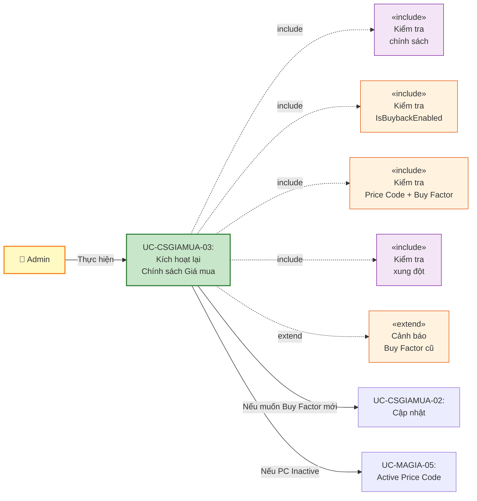
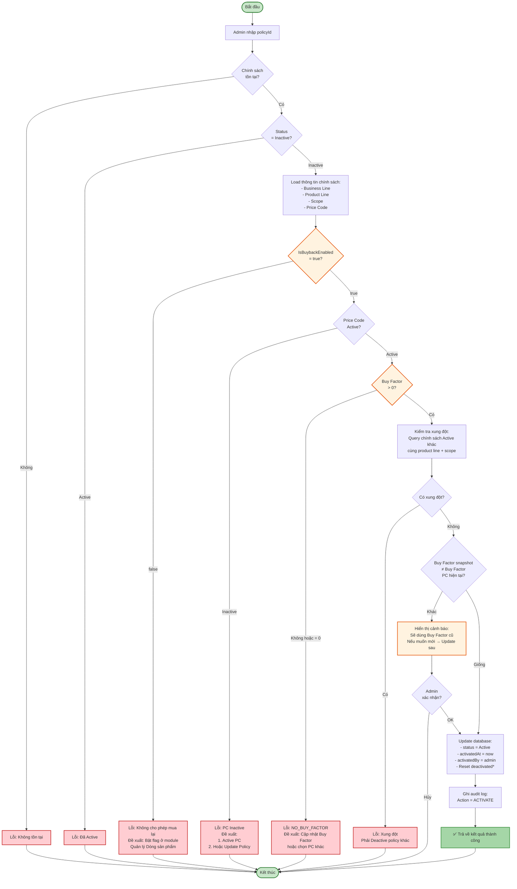
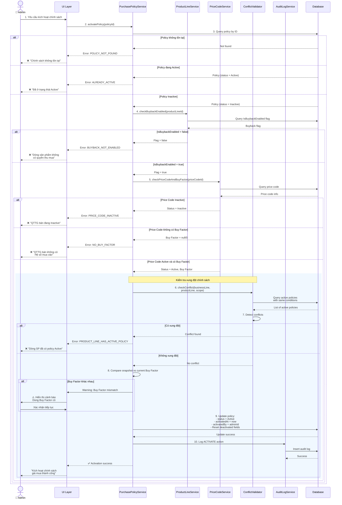
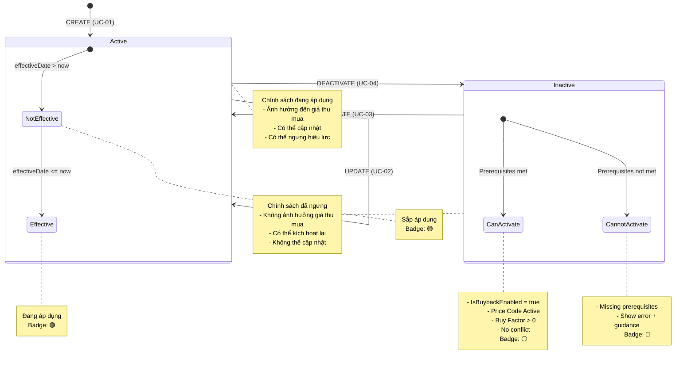
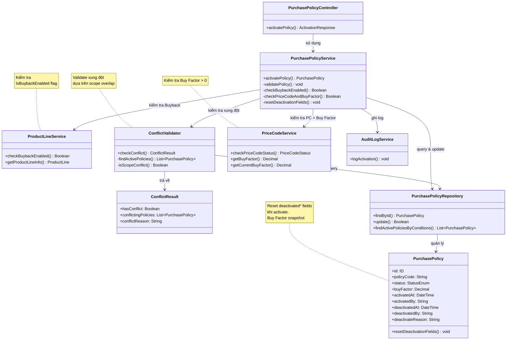

# Use Case UC-CSGIAMUA-03: Kích Hoạt Lại Chính Sách Giá Mua (Activate)

---

| **Use Case ID** | **UC-CSGIAMUA-03** |
|-----------------|---------------------|
| **Use Case Name** | Kích hoạt lại Chính sách Giá mua (Activate) |
| **Description** | Use Case "Kích hoạt lại Chính sách Giá mua" cho phép Admin kích hoạt lại chính sách đã bị ngưng hiệu lực (Inactive) để có thể áp dụng lại trong hệ thống thu mua. |
| **Actor(s)** | Admin |
| **Priority** | Must Have |
| **Trigger** | Admin yêu cầu kích hoạt lại một chính sách giá mua đang Inactive |

---

## Input

| Tên trường | Loại | Bắt buộc | Mô tả | Ràng buộc |
|------------|------|----------|-------|-----------|
| `policyId` | Số | Có | ID chính sách cần kích hoạt | Chính sách phải tồn tại và đang Inactive |

---

## Output

### Trường hợp thành công:

| Tên trường | Loại | Mô tả |
|------------|------|-------|
| `id` | Số | ID chính sách đã kích hoạt |
| `policyCode` | Văn bản | Mã quy tắc |
| `status` | Văn bản | Trạng thái mới = "Active" |
| `activatedAt` | Ngày giờ | Thời gian kích hoạt lại |
| `activatedBy` | Văn bản | Người kích hoạt |
| `message` | Văn bản | "Kích hoạt lại chính sách giá mua thành công" |

### Trường hợp lỗi:

| Mã lỗi | Thông báo | Mô tả |
|--------|-----------|-------|
| `POLICY_NOT_FOUND` | "Chính sách không tồn tại" | Không tìm thấy chính sách |
| `ALREADY_ACTIVE` | "Chính sách đã ở trạng thái Active" | Chính sách đang Active |
| `PRICE_CODE_INACTIVE` | "Không thể kích hoạt. QTTG bán đang Inactive" | Price Code tham chiếu đã bị ngưng hiệu lực |
| `NO_BUY_FACTOR` | "Không thể kích hoạt. QTTG bán không có Hệ số mua vào" | Price Code không có Buy Factor hoặc Buy Factor = 0 |
| `BUYBACK_NOT_ENABLED` | "Không thể kích hoạt. Dòng sản phẩm không có quyền thu mua" | Flag "Cho phép mua lại" = false |
| `PRODUCT_LINE_HAS_ACTIVE_POLICY` | "Dòng sản phẩm đã có chính sách Active khác" | Xung đột với chính sách khác cùng scope |

---

## Pre-Condition(s)

- Chính sách giá mua đã tồn tại trong hệ thống
- Chính sách đang có trạng thái Inactive
- Admin đã đăng nhập và có quyền kích hoạt chính sách
- QTTG bán (Price Code) được tham chiếu phải đang Active
- QTTG bán phải có Buy Factor > 0
- Dòng sản phẩm phải có flag "Cho phép mua lại" = true

---

## Post-Condition(s)

- Chính sách chuyển sang trạng thái Active
- Chính sách có thể được áp dụng trong hệ thống thu mua
- Hệ thống ghi nhận thông tin người kích hoạt và thời gian kích hoạt
- Audit log ghi nhận hành động ACTIVATE
- Các chi nhánh/khu vực trong phạm vi áp dụng sử dụng lại chính sách này

---

## Basic Flow

1. Admin yêu cầu kích hoạt lại một chính sách giá mua đang Inactive
2. Hệ thống kiểm tra tính hợp lệ:
   - Chính sách tồn tại
   - Chính sách đang Inactive
   - Dòng sản phẩm có flag "Cho phép mua lại" (IsBuybackEnabled) = true
   - QTTG bán (Price Code) tham chiếu đang Active
   - QTTG bán có Buy Factor và Buy Factor > 0
3. Hệ thống kiểm tra xung đột chính sách:
   - Với cùng dòng sản phẩm, mảng kinh doanh, và phạm vi áp dụng
   - Không có chính sách Active khác đang áp dụng
4. Hệ thống cập nhật:
   - Chuyển status từ Inactive → Active
   - Ghi nhận thời gian kích hoạt (activatedAt)
   - Ghi nhận người kích hoạt (activatedBy)
   - Xóa deactivatedAt, deactivatedBy, deactivateReason (reset)
5. Hệ thống ghi audit log với action = ACTIVATE
6. Hệ thống trả về kết quả thành công

Use case kết thúc.

---

## Alternative Flow

*Không có luồng thay thế*

---

## Exception Flow

### 2a. Chính sách không tồn tại

2a. Hệ thống không tìm thấy chính sách với ID được cung cấp

2a1. Hệ thống trả về lỗi: "Chính sách không tồn tại hoặc đã bị xóa."

2a2. Use case kết thúc

### 2b. Chính sách đã ở trạng thái Active

2b. Hệ thống phát hiện chính sách đang ở trạng thái Active

2b1. Hệ thống trả về lỗi: "Chính sách đã ở trạng thái Active. Không cần kích hoạt lại."

2b2. Use case kết thúc

### 2c. Dòng sản phẩm không cho phép mua lại

2c. Hệ thống phát hiện dòng sản phẩm có flag "Cho phép mua lại" (IsBuybackEnabled) = false

2c1. Hệ thống trả về lỗi: 
> "❌ KHÔNG THỂ KÍCH HOẠT
> 
> Dòng sản phẩm '[Tên dòng SP]' không có quyền thu mua.
> 
> Flag 'Cho phép mua lại' (IsBuybackEnabled) đã bị tắt.
> 
> Vui lòng bật flag này ở module Quản lý Dòng sản phẩm trước khi kích hoạt chính sách."

2c2. Use case kết thúc

### 2d. QTTG bán (Price Code) đang Inactive

2d. Hệ thống phát hiện Price Code được tham chiếu trong chính sách đang Inactive

2d1. Hệ thống trả về lỗi: "Không thể kích hoạt chính sách này. QTTG bán '[Mã Price Code]' đang Inactive. Vui lòng kích hoạt QTTG bán trước hoặc cập nhật chính sách với QTTG bán Active khác."

2d2. Use case kết thúc

### 2e. QTTG bán không có Buy Factor

2e. Hệ thống phát hiện Price Code không có Buy Factor hoặc Buy Factor = 0

2e1. Hệ thống trả về lỗi:
> "❌ KHÔNG THỂ KÍCH HOẠT
> 
> QTTG bán '[Mã Price Code]' không có Hệ số mua vào (Buy Factor) hoặc Buy Factor = 0.
> 
> Vui lòng:
> 1. Cập nhật Buy Factor cho QTTG bán này ở module Quản lý Mã giá, hoặc
> 2. Cập nhật chính sách với QTTG bán khác có Buy Factor hợp lệ"

2e2. Use case kết thúc

### 3a. Dòng sản phẩm đã có chính sách Active khác

3a. Hệ thống phát hiện đã có chính sách Active khác cho cùng dòng sản phẩm, mảng kinh doanh, và phạm vi áp dụng

3a1. Hệ thống trả về lỗi: "Không thể kích hoạt. Dòng sản phẩm '[Tên dòng SP]' tại '[Tên phạm vi]' đã có chính sách Active '[Mã chính sách khác]'. Vui lòng ngưng hiệu lực chính sách đó trước."

3a2. Use case kết thúc

---

## Business Rules

### BR-CSGIAMUA-09: Chỉ Admin được kích hoạt

- Chỉ Admin mới có quyền kích hoạt lại chính sách giá mua
- Nhân viên không có quyền này
- Lý do: Tránh thay đổi không kiểm soát ảnh hưởng đến giá thu mua toàn hệ thống

### BR-CSGIAMUA-10: Chỉ kích hoạt chính sách Inactive

- Chỉ có thể kích hoạt chính sách đang ở trạng thái **Inactive**
- Nếu chính sách đã Active → Từ chối thao tác
- Mục đích: Tránh thao tác không cần thiết, đảm bảo tính nhất quán

### BR-CSGIAMUA-11: Kiểm tra điều kiện mua lại (Buyback Flag)

**Dòng sản phẩm phải có flag "Cho phép mua lại":**
- Trước khi kích hoạt chính sách → Hệ thống kiểm tra flag IsBuybackEnabled của dòng sản phẩm
- Nếu flag = false → Từ chối kích hoạt
- Lý do: Không thể áp dụng chính sách giá mua cho sản phẩm không cho phép thu mua

**Giải pháp khi IsBuybackEnabled = false:**

**Option 1**: Bật flag "Cho phép mua lại" (nếu phù hợp)
- Navigate sang module Quản lý Dòng sản phẩm
- Bật flag IsBuybackEnabled = true cho dòng sản phẩm này
- Sau đó quay lại kích hoạt chính sách

**Option 2**: Không kích hoạt chính sách này
- Chính sách này sẽ giữ nguyên trạng thái Inactive
- Tạo chính sách mới cho dòng sản phẩm khác có quyền thu mua

**Ví dụ:**
```
Chính sách: PUR-2026-001 (Inactive)
Dòng sản phẩm: "Nhẫn đặt làm theo yêu cầu"
IsBuybackEnabled: false

→ Không thể Active PUR-2026-001
→ Phải bật IsBuybackEnabled hoặc chọn dòng sản phẩm khác
```

### BR-CSGIAMUA-12: Kiểm tra QTTG bán (Price Code) và Buy Factor

**QTTG bán phải đang Active và có Buy Factor:**
- Chính sách tham chiếu đến một Price Code cụ thể
- Trước khi kích hoạt chính sách → Hệ thống kiểm tra:
  1. Price Code có đang Active không
  2. Price Code có Buy Factor không
  3. Buy Factor > 0
- Nếu vi phạm bất kỳ điều kiện nào → Từ chối kích hoạt chính sách
- Lý do: Không thể áp dụng chính sách với Price Code đã ngưng hoạt động hoặc không có hệ số mua

**Giải pháp khi Price Code Inactive hoặc không có Buy Factor:**

**Option 1**: Kích hoạt lại Price Code (nếu phù hợp)
- Navigate sang module MA-GIA → UC-MAGIA-05: Active Price Code
- Sau đó quay lại kích hoạt chính sách này

**Option 2**: Cập nhật Buy Factor cho Price Code
- Navigate sang module MA-GIA → Cập nhật Buy Factor
- Đảm bảo Buy Factor > 0
- Sau đó quay lại kích hoạt chính sách

**Option 3**: Cập nhật chính sách với Price Code Active khác
- Navigate sang UC-CSGIAMUA-02: Cập nhật chính sách
- Chọn Price Code Active khác có Buy Factor hợp lệ
- Sau đó kích hoạt lại chính sách

**Ví dụ:**
```
Chính sách: PUR-2026-001 (Inactive)
QTTG bán: PC-100 (Inactive)
Buy Factor: 0.98

→ Không thể Active PUR-2026-001 khi PC-100 còn Inactive
→ Phải Active PC-100 hoặc cập nhật PUR-2026-001 dùng PC-200 (Active)

---

Chính sách: PUR-2026-002 (Inactive)
QTTG bán: PC-101 (Active)
Buy Factor: 0 (hoặc null)

→ Không thể Active PUR-2026-002 khi PC-101 không có Buy Factor
→ Phải cập nhật Buy Factor cho PC-101 hoặc chọn Price Code khác
```

### BR-CSGIAMUA-13: Ràng buộc một chính sách Active mỗi dòng sản phẩm tại một phạm vi

**Quy tắc chống xung đột:**
- Mỗi dòng sản phẩm tại một phạm vi cụ thể chỉ có thể có **duy nhất một chính sách Active** tại một thời điểm
- Trước khi kích hoạt chính sách → Hệ thống kiểm tra xung đột với các chính sách Active khác
- Nếu đã có chính sách Active cùng điều kiện → Từ chối kích hoạt

**Điều kiện xung đột:**

Hai chính sách xung đột khi:
1. Cùng mảng kinh doanh (businessLine)
2. Cùng dòng sản phẩm (productLine)
3. Cùng phạm vi áp dụng hoặc giao nhau:
   - ALL_SYSTEM xung đột với mọi phạm vi khác (cùng product line)
   - SPECIFIC_STORE xung đột với ALL_SYSTEM và cùng storeId
   - SPECIFIC_REGION xung đột với ALL_SYSTEM và cùng regionId

**Ví dụ xung đột:**

```
Chính sách hiện có: PUR-2026-005 (Active)
- Business Line: Vàng trang sức
- Product Line: Nhẫn vàng 24K
- Scope: Toàn hệ thống

Chính sách muốn kích hoạt: PUR-2026-010 (Inactive)
- Business Line: Vàng trang sức
- Product Line: Nhẫn vàng 24K
- Scope: Chi nhánh Hà Nội

→ XUNG ĐỘT vì PUR-2026-005 áp dụng toàn hệ thống (bao gồm cả HN)
→ Phải Deactive PUR-2026-005 trước hoặc tạo PUR-2026-005 chỉ áp dụng cho khu vực khác
```

**Ví dụ không xung đột:**

```
Chính sách 1: PUR-2026-005 (Active)
- Business Line: Vàng trang sức
- Product Line: Nhẫn vàng 24K
- Scope: Chi nhánh Hà Nội

Chính sách 2: PUR-2026-010 (Inactive)
- Business Line: Vàng trang sức
- Product Line: Nhẫn vàng 24K
- Scope: Chi nhánh Hồ Chí Minh

→ KHÔNG XUNG ĐỘT vì khác scope (2 chi nhánh khác nhau)
→ Có thể Active PUR-2026-010
```

### BR-CSGIAMUA-14: Ghi nhận audit log

Mỗi lần kích hoạt lại chính sách, hệ thống ghi nhận đầy đủ:
- Action: ACTIVATE
- Thời gian kích hoạt (activatedAt)
- Người kích hoạt (activatedBy)
- Trạng thái trước: Inactive
- Trạng thái sau: Active
- Metadata: Reset deactivatedAt, deactivatedBy, deactivateReason

Mục đích: Theo dõi lịch sử thay đổi trạng thái, hỗ trợ audit

### BR-CSGIAMUA-15: Chính sách kích hoạt với dữ liệu cũ

**Snapshot Buy Factor được giữ nguyên:**
- Khi kích hoạt lại chính sách, Buy Factor vẫn là snapshot cũ (tại thời điểm tạo)
- Không tự động cập nhật Buy Factor từ Price Code hiện tại
- Đảm bảo tính nhất quán với quyết định ban đầu

**Nếu muốn dùng Buy Factor mới:**
- Sau khi Active → Navigate UC-CSGIAMUA-02: Cập nhật chính sách
- Chọn lại Price Code (có thể là cùng hoặc khác)
- Hệ thống sẽ snapshot Buy Factor mới

**Cảnh báo khi Active:**
```
⚠️ LƯU Ý:

Chính sách này sẽ được kích hoạt với Hệ số mua vào (Buy Factor) đã snapshot từ [Ngày tạo].

Buy Factor hiện tại của QTTG bán '[Mã PC]':
  [Buy Factor mới từ Price Code] (VD: 0.99)

Buy Factor sẽ áp dụng (snapshot cũ):
  [Buy Factor trong chính sách] (VD: 0.98)

Công thức tính giá mua:
  Giá mua = Giá gốc × Buy Factor

Nếu bạn muốn dùng Buy Factor mới, vui lòng:
1. Kích hoạt chính sách này
2. Cập nhật chính sách (chọn lại cùng Price Code)
3. Buy Factor sẽ được snapshot lại
```

---

## Diagrams

### 1. Use Case Diagram - UC-CSGIAMUA-03: Kích hoạt lại



### 2. Activity Diagram - Luồng Kích hoạt lại



### 3. Sequence Diagram - Kích hoạt lại Chính sách



**Giải thích Sequence Diagram:**

Diagram tập trung vào **business logic đặc thù** của module Giá mua:

**Xử lý nghiệp vụ:**
- Kiểm tra chính sách tồn tại và ở trạng thái Inactive
- Kiểm tra IsBuybackEnabled flag của dòng sản phẩm (BR-CSGIAMUA-11)
- Kiểm tra Price Code Active và có Buy Factor > 0 (BR-CSGIAMUA-12)
- Kiểm tra xung đột với các chính sách Active khác (BR-CSGIAMUA-13)
- Cảnh báo nếu Buy Factor snapshot khác với Buy Factor hiện tại (BR-CSGIAMUA-15)

**Nhánh xử lý:**
- **Policy không tồn tại/Already Active**: Từ chối kích hoạt
- **IsBuybackEnabled = false**: Từ chối, yêu cầu bật flag
- **Price Code Inactive**: Từ chối, yêu cầu kích hoạt Price Code
- **Không có Buy Factor**: Từ chối, yêu cầu cập nhật Buy Factor
- **Có xung đột**: Từ chối, yêu cầu ngưng hiệu lực chính sách khác
- **Buy Factor khác nhau**: Hiển thị cảnh báo, cho phép tiếp tục
- **Thành công**: Cập nhật status, reset deactivated fields, ghi audit log

---

### 4. State Transition Diagram



### 5. Class Diagram



---

## Notes

**UI/UX Recommendations:**

1. **Confirmation Dialog:**
   - Hiển thị rõ thông tin chính sách sẽ kích hoạt:
     - Mã quy tắc
     - Dòng sản phẩm (hiển thị flag IsBuybackEnabled)
     - Phạm vi áp dụng
     - Ngày có hiệu lực
     - Buy Factor (snapshot)
   - Cảnh báo nếu Buy Factor snapshot khác với Buy Factor hiện tại của Price Code
   - Button: "Xác nhận kích hoạt" / "Hủy"

2. **Error Handling:**
   - **IsBuybackEnabled = false**: Cung cấp link trực tiếp đến module Quản lý Dòng sản phẩm để bật flag
   - **Price Code Inactive**: Cung cấp link trực tiếp đến UC-MAGIA-05 để kích hoạt PC
   - **No Buy Factor**: Cung cấp link đến module Quản lý Mã giá để cập nhật Buy Factor
   - **Conflict**: Hiển thị danh sách chính sách xung đột, link đến UC-CSGIAMUA-04 để ngưng hiệu lực
   - **Already Active**: Disable button "Kích hoạt" nếu đã Active

3. **Post-Activation Actions:**
   - Hiển thị thông báo thành công
   - Cung cấp quick actions:
     - "Xem chi tiết" → UC-CSGIAMUA-06
     - "Cập nhật" → UC-CSGIAMUA-02 (nếu muốn snapshot Buy Factor mới)
     - "Quay lại danh sách" → UC-CSGIAMUA-05

4. **Buy Factor Warning Display:**
   ```
   ⚠️ CẢNH BÁO VỀ HỆ SỐ MUA VÀO
   
   Buy Factor trong chính sách (snapshot 01/02/2026):
   ┌─────────────────────────────────────────┐
   │ Buy Factor: 0.98                        │
   │ Giá mua = Giá gốc × 0.98                │
   └─────────────────────────────────────────┘
   
   Buy Factor hiện tại của PC-100 (cập nhật 01/03/2026):
   ┌─────────────────────────────────────────┐
   │ Buy Factor: 0.99                        │
   │ Giá mua = Giá gốc × 0.99                │
   └─────────────────────────────────────────┘
   
   Bạn có muốn:
   [ ] Kích hoạt với Buy Factor cũ (0.98)
   [ ] Kích hoạt rồi cập nhật Buy Factor mới (0.99)
   ```

5. **Prerequisite Checklist Display:**
   ```
   📋 KIỂM TRA ĐIỀU KIỆN KÍCH HOẠT
   
   ✅ Dòng sản phẩm: Nhẫn vàng 24K
       IsBuybackEnabled: ✅ true (Cho phép thu mua)
   
   ✅ QTTG bán: PC-100
       Status: ✅ Active
       Buy Factor: ✅ 0.98 (hợp lệ)
   
   ✅ Xung đột: Không có chính sách Active khác
   
   → Có thể kích hoạt chính sách này
   ```

**Performance:**
- Cache danh sách Active policies để kiểm tra xung đột nhanh
- Index trên (businessLine, productLine, scopeType, scopeId, status)
- Eager load Price Code + Product Line info trong 1 query
- Cache IsBuybackEnabled flag của Product Lines

**Điểm khác biệt so với UC-CSGIABAN-03:**

| Khía cạnh | Giá bán | Giá mua |
|-----------|---------|---------|
| **Hệ số kiểm tra** | Sell Factor | Buy Factor |
| **Flag điều kiện** | Không có | IsBuybackEnabled = true |
| **Pre-condition** | Price Code Active | Price Code Active + Buy Factor > 0 + IsBuybackEnabled |
| **Error codes** | 4 errors | 6 errors (thêm BUYBACK_NOT_ENABLED, NO_BUY_FACTOR) |
| **Mã policy** | PP-YYYY-XXX | PUR-YYYY-XXX |

**Quan hệ với các use case khác:**
- UC-CSGIAMUA-02: Cập nhật → Nếu muốn snapshot Buy Factor mới
- UC-CSGIAMUA-04: Ngưng hiệu lực → Ngược lại của use case này
- UC-CSGIAMUA-05: Xem danh sách → Navigate từ đây
- UC-MAGIA-05: Active Price Code → Nếu PC đang Inactive
- Module Quản lý Dòng sản phẩm → Nếu IsBuybackEnabled = false

**Tham chiếu:**
- TONG-QUAN.md - Section 5: BR-CSGIAMUA-01 (IsBuybackEnabled), BR-CSGIAMUA-05 (Chính sách duy nhất)
- UC-CSGIAMUA-01-TAO-MOI.md - Snapshot mechanism, Buy Factor validation
- UC-CSGIAMUA-04-NGUNG-HIEU-LUC.md - Deactivation logic (reverse)
