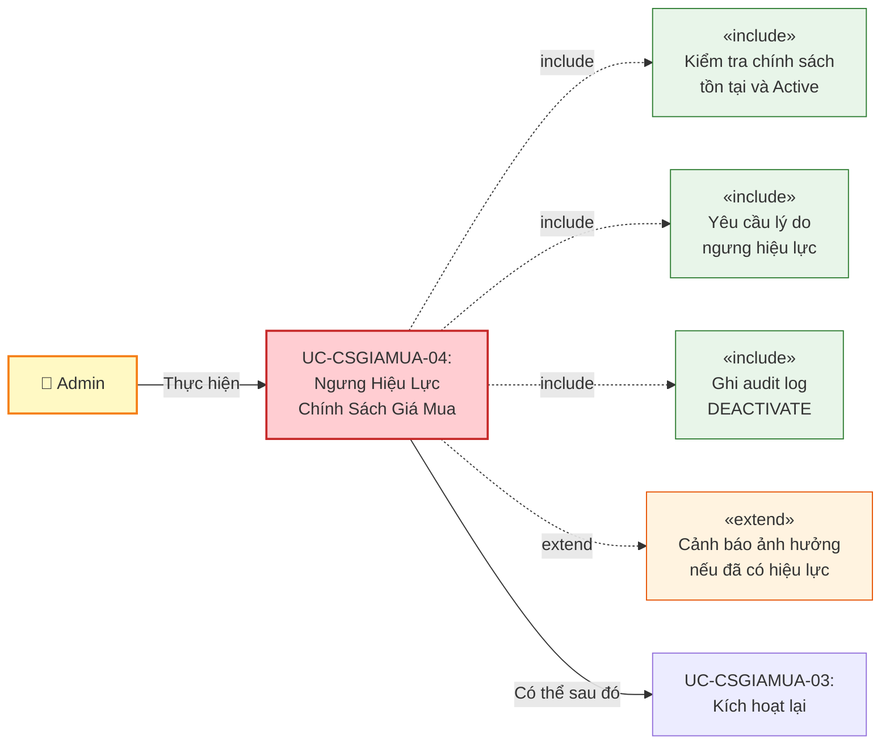
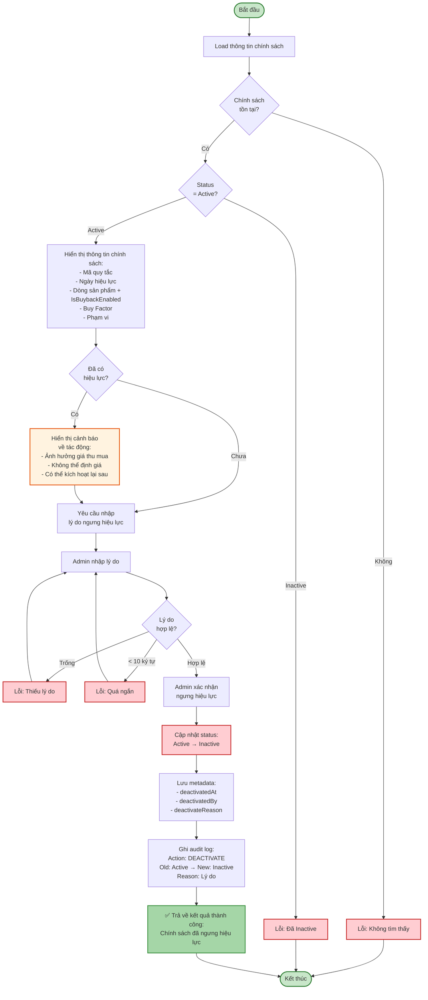
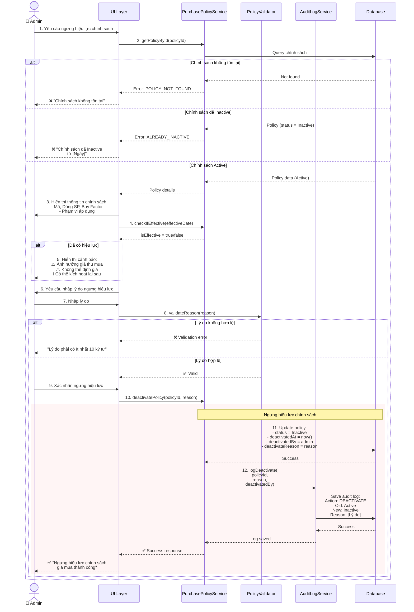
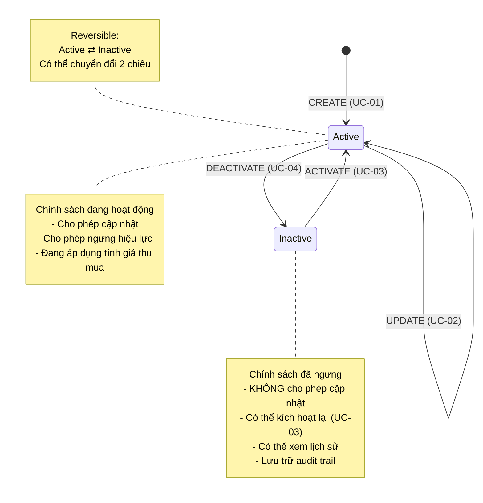
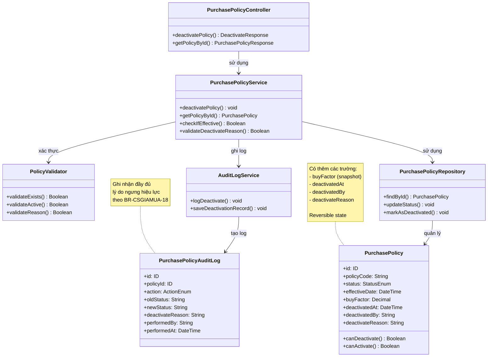

# Use Case UC-CSGIAMUA-04: Ngưng Hiệu Lực Chính Sách Giá Mua

---

| **Use Case ID** | **UC-CSGIAMUA-04** |
|-----------------|---------------------|
| **Use Case Name** | Ngưng Hiệu Lực Chính Sách Giá Mua |
| **Description** | Use Case "Ngưng Hiệu Lực Chính Sách Giá Mua" cho phép Admin ngưng hiệu lực (deactivate) một chính sách giá mua đang Active để ngừng áp dụng trong hệ thống thu mua. |
| **Actor(s)** | Admin |
| **Priority** | Must Have |
| **Trigger** | Admin yêu cầu ngưng hiệu lực một chính sách giá mua đang Active |

---

## Input

| Tên trường | Loại | Bắt buộc | Mô tả | Ràng buộc |
|------------|------|----------|-------|-----------|
| `policyId` | Số | Có | ID chính sách cần ngưng hiệu lực | Chính sách phải tồn tại và đang Active |
| `deactivateReason` | Văn bản | Có | Lý do ngưng hiệu lực | Min 10 ký tự, max 200 ký tự |

---

## Output

### Trường hợp thành công:

| Tên trường | Loại | Mô tả |
|------------|------|-------|
| `id` | Số | ID chính sách đã ngưng hiệu lực |
| `policyCode` | Văn bản | Mã quy tắc |
| `status` | Văn bản | Trạng thái mới = "Inactive" |
| `deactivatedAt` | Ngày giờ | Thời gian ngưng hiệu lực |
| `deactivatedBy` | Văn bản | Người ngưng hiệu lực |
| `deactivateReason` | Văn bản | Lý do ngưng hiệu lực |
| `message` | Văn bản | "Ngưng hiệu lực chính sách giá mua thành công" |

### Trường hợp lỗi:

| Mã lỗi | Thông báo | Mô tả |
|--------|-----------|-------|
| `POLICY_NOT_FOUND` | "Chính sách không tồn tại" | Không tìm thấy chính sách |
| `ALREADY_INACTIVE` | "Chính sách đã ở trạng thái Inactive" | Chính sách đã bị ngưng hiệu lực |
| `DEACTIVATE_REASON_REQUIRED` | "Vui lòng nhập lý do ngưng hiệu lực" | Thiếu lý do ngưng hiệu lực |
| `DEACTIVATE_REASON_TOO_SHORT` | "Lý do phải có ít nhất 10 ký tự" | Lý do quá ngắn |

---

## Pre-Condition(s)

- Chính sách giá mua đã tồn tại trong hệ thống
- Chính sách đang có trạng thái Active
- Admin đã đăng nhập và có quyền ngưng hiệu lực chính sách
- Admin đã chuẩn bị lý do ngưng hiệu lực hợp lý

---

## Post-Condition(s)

- Chính sách chuyển sang trạng thái Inactive
- Chính sách không còn được áp dụng để tính giá thu mua
- Chính sách có thể được kích hoạt lại bằng UC-CSGIAMUA-03
- Hệ thống ghi nhận thông tin người ngưng hiệu lực, thời gian và lý do
- Audit log ghi nhận hành động DEACTIVATE với đầy đủ thông tin
- Lưu trữ chính sách để tham khảo lịch sử

---

## Basic Flow

1. Admin yêu cầu ngưng hiệu lực một chính sách giá mua đang Active
2. Hệ thống kiểm tra chính sách tồn tại và đang Active
3. Hệ thống hiển thị thông tin chính sách:
   - Mã quy tắc
   - Ngày có hiệu lực
   - Dòng sản phẩm (hiển thị IsBuybackEnabled status)
   - Phạm vi áp dụng
   - Buy Factor (snapshot)
   - Trạng thái hiện tại
4. Hệ thống kiểm tra xem chính sách đã có hiệu lực chưa (effectiveDate <= ngày hiện tại)
5. Nếu chính sách đã có hiệu lực, hệ thống hiển thị cảnh báo:
   > "⚠️ CẢNH BÁO: Chính sách đã có hiệu lực
   > 
   > Chính sách này đã có hiệu lực từ [Ngày]. Việc ngưng hiệu lực sẽ ảnh hưởng đến giá thu mua hiện tại.
   > 
   > Vui lòng nhập lý do ngưng hiệu lực."
6. Admin nhập lý do ngưng hiệu lực (bắt buộc, min 10 ký tự)
7. Admin xác nhận ngưng hiệu lực
8. Hệ thống kiểm tra lý do ngưng hiệu lực (min 10 ký tự, max 200 ký tự)
9. Hệ thống cập nhật chính sách:
   - Chuyển status từ Active → Inactive
   - Ghi nhận thời gian ngưng hiệu lực (deactivatedAt)
   - Ghi nhận người ngưng hiệu lực (deactivatedBy)
   - Lưu lý do ngưng hiệu lực (deactivateReason)
10. Hệ thống ghi audit log với:
    - Action: DEACTIVATE
    - Old status: Active
    - New status: Inactive
    - Người thực hiện và thời gian
    - Lý do ngưng hiệu lực
11. Hệ thống trả về kết quả thành công với thông tin đã cập nhật

Use case kết thúc.

---

## Alternative Flow

### A1. Admin hủy bỏ ngưng hiệu lực

7a. Admin không muốn tiếp tục ngưng hiệu lực

7a1. Admin chọn "Hủy bỏ"

7a2. Hệ thống quay lại màn hình trước, không thực hiện thay đổi

Use case kết thúc.

---

## Exception Flow

### 2a. Chính sách không tồn tại

2a. Hệ thống không tìm thấy chính sách với ID được cung cấp

2a1. Hệ thống trả về lỗi: "Chính sách không tồn tại hoặc đã bị xóa."

2a2. Use case kết thúc

### 2b. Chính sách đã ở trạng thái Inactive

2b. Hệ thống phát hiện chính sách đang ở trạng thái Inactive

2b1. Hệ thống trả về lỗi: "Chính sách đã ở trạng thái Inactive từ [Ngày]. Không cần ngưng hiệu lực lại."

2b2. Use case kết thúc

### 6a. Không nhập lý do ngưng hiệu lực

6a. Admin không cung cấp lý do ngưng hiệu lực

6a1. Hệ thống trả về lỗi: "Vui lòng nhập lý do ngưng hiệu lực. Đây là thông tin bắt buộc và sẽ được lưu trong hồ sơ."

6a2. Use case quay lại bước 6

### 8a. Lý do ngưng hiệu lực quá ngắn

8a. Hệ thống phát hiện lý do ngưng hiệu lực có ít hơn 10 ký tự

8a1. Hệ thống trả về lỗi: "Lý do ngưng hiệu lực phải có ít nhất 10 ký tự. Vui lòng mô tả chi tiết hơn."

8a2. Use case quay lại bước 6

---

## Business Rules

### BR-CSGIAMUA-16: Chỉ Admin được ngưng hiệu lực

- Chỉ Admin mới có quyền ngưng hiệu lực chính sách giá mua
- Nhân viên không có quyền này
- Lý do: Tránh thay đổi không kiểm soát ảnh hưởng đến giá thu mua toàn hệ thống

### BR-CSGIAMUA-17: Chỉ ngưng hiệu lực chính sách Active

- Chỉ có thể ngưng hiệu lực chính sách đang ở trạng thái **Active**
- Nếu chính sách đã Inactive → Từ chối thao tác
- Mục đích: Tránh thao tác không cần thiết và nhầm lẫn

### BR-CSGIAMUA-18: Bắt buộc nhập lý do ngưng hiệu lực

**Yêu cầu:**
- Admin **PHẢI** nhập lý do ngưng hiệu lực (không được để trống)
- Lý do phải có **ít nhất 10 ký tự** (đảm bảo mô tả có ý nghĩa)
- Lý do **tối đa 200 ký tự**
- Lý do được lưu trữ trong audit log để tham khảo

**Mục đích:**
- Ghi nhận rõ ràng nguyên nhân ngưng hiệu lực
- Hỗ trợ audit và kiểm tra sau này
- Đảm bảo quyết định có cơ sở rõ ràng

**Ví dụ lý do hợp lệ:**
```
✅ "Điều chỉnh chính sách giá thu mua theo quyết định của Ban Giám đốc ngày 05/03/2026"
✅ "Thay thế bằng chính sách mới PUR-2026-015 do thay đổi hệ số mua vào"
✅ "Tạm ngừng thu mua dòng sản phẩm này tại khu vực"
✅ "Ngưng thu mua do biến động giá vàng thế giới"

❌ "Hủy" (quá ngắn, không rõ ý)
❌ "Không dùng" (không đủ thông tin)
❌ "Stop" (quá ngắn, không mô tả lý do)
```

### BR-CSGIAMUA-19: Cảnh báo khi ngưng chính sách đã có hiệu lực

Khi ngưng hiệu lực chính sách đã áp dụng (effectiveDate <= ngày hiện tại):

**Yêu cầu hiển thị cảnh báo:**
> "⚠️ CẢNH BÁO: Chính sách đã có hiệu lực
> 
> Chính sách này đã có hiệu lực từ [Ngày]. Việc ngưng hiệu lực sẽ ảnh hưởng đến giá thu mua hiện tại tại [Phạm vi].
> 
> Dòng sản phẩm: [Tên dòng sản phẩm]
> Phạm vi áp dụng: [Phạm vi]
> Buy Factor: [Hệ số mua vào]
> 
> ⚠️ LƯU Ý:
> - Chính sách sẽ NGỪNG áp dụng ngay lập tức
> - Hệ thống sẽ KHÔNG THỂ định giá thu mua cho dòng sản phẩm này tại phạm vi đã chọn
> - Có thể kích hoạt lại sau này nếu cần (UC-CSGIAMUA-03)
> - Nếu muốn áp dụng chính sách mới, vui lòng tạo chính sách mới
> 
> Vui lòng nhập lý do ngưng hiệu lực và xác nhận với phòng Kế toán/Kinh doanh."

**Mục đích:**
- Đảm bảo Admin hiểu rõ tác động
- Tránh hành động vô tình
- Yêu cầu xác nhận có ý thức
- Cảnh báo đặc biệt về nghiệp vụ thu mua

---

## Diagrams

### 1. Use Case Diagram - UC-CSGIAMUA-04: Ngưng Hiệu Lực Chính Sách



### 2. Activity Diagram - Luồng Ngưng Hiệu Lực Chính Sách



### 3. Sequence Diagram - Ngưng Hiệu Lực Chính Sách



**Giải thích Sequence Diagram:**

Diagram tập trung vào **business logic** của ngưng hiệu lực chính sách giá mua:

**Xử lý nghiệp vụ:**
- Kiểm tra chính sách tồn tại và đang Active
- Kiểm tra xem chính sách đã có hiệu lực chưa
- Yêu cầu lý do ngưng hiệu lực (bắt buộc)
- Validate lý do (min 10 ký tự)
- Cập nhật status, lưu metadata
- Ghi audit log đầy đủ

**Nhánh xử lý:**
- **Policy không tồn tại**: Từ chối
- **Policy đã Inactive**: Thông báo đã ngưng trước đó
- **Đã có hiệu lực**: Hiển thị cảnh báo đặc biệt về ảnh hưởng nghiệp vụ thu mua
- **Lý do không hợp lệ**: Yêu cầu nhập lại
- **Thành công**: Cập nhật status, ghi audit log

---

### 4. State Transition Diagram



### 5. Class Diagram



---

## Notes

**Điểm khác biệt với UC-CSGIAMUA-02 (Cập nhật):**

| Khía cạnh | UC-02: Cập nhật | UC-04: Ngưng hiệu lực |
|-----------|-----------------|------------------------|
| **Có thể hoàn tác?** | Có (cập nhật lại) | Có (UC-03: Kích hoạt lại) |
| **Lý do** | Chỉ khi đã có hiệu lực | Luôn luôn bắt buộc |
| **Cảnh báo** | Về thay đổi giá | Về ngưng áp dụng + không thể định giá |
| **Sau khi thực hiện** | Vẫn Active | Chuyển Inactive |
| **Ảnh hưởng** | Thay đổi cách tính giá thu mua | Ngừng áp dụng hoàn toàn |

**So sánh với UC-CSGIABAN-04 (Ngưng hiệu lực Giá bán):**

| Khía cạnh | Giá bán | Giá mua |
|-----------|---------|---------|
| **Ảnh hưởng nghiệp vụ** | Ngừng tính giá bán | Ngừng định giá thu mua |
| **Cảnh báo** | Ảnh hưởng giá bán | Ảnh hưởng + KHÔNG THỂ định giá |
| **Mã policy** | PP-YYYY-XXX | PUR-YYYY-XXX |
| **Hiển thị thêm** | Công thức giá bán | Buy Factor snapshot |
| **Business Rules** | BR-CSGIABAN-16 to 19 | BR-CSGIAMUA-16 to 19 |

**Quan hệ với các use case khác:**
- Sau khi UC-04 thực hiện → Chính sách không thể UC-02 (Cập nhật) nữa
- Có thể thực hiện UC-03 (Kích hoạt lại) để active lại chính sách
- Nếu muốn chính sách mới → Thực hiện UC-01 (Tạo mới)

**Lưu ý nghiệp vụ quan trọng:**
- Hành động ngưng hiệu lực **có thể** kích hoạt lại (BR-CSGIAMUA-09 trong UC-03)
- **Luôn** yêu cầu lý do, không phân biệt đã/chưa có hiệu lực (BR-CSGIAMUA-18)
- Hiển thị cảnh báo rõ ràng nếu chính sách đang áp dụng (BR-CSGIAMUA-19)
- Lưu trữ đầy đủ metadata để audit trail
- State transition: Active ⇄ Inactive (reversible, hai chiều)
- **Đặc biệt**: Ngưng chính sách giá mua → Hệ thống KHÔNG THỂ định giá cho phiếu thu mua mới

**UI/UX Recommendations:**

1. **Confirmation Dialog:**
   - Hiển thị rõ thông tin chính sách sẽ ngưng:
     - Mã quy tắc (VD: PUR-2026-001)
     - Dòng sản phẩm + IsBuybackEnabled status
     - Buy Factor (snapshot)
     - Phạm vi áp dụng
     - Ngày có hiệu lực
   - Cảnh báo tác động đến giá thu mua (nếu đã có hiệu lực)
   - Cảnh báo đặc biệt: "Không thể định giá cho phiếu thu mua mới"
   - Thông báo có thể kích hoạt lại sau
   - Textarea cho lý do ngưng hiệu lực (required, min 10 chars, max 200 chars)
   - Button: "Xác nhận ngưng hiệu lực" (danger) / "Hủy"

2. **Warning Display for Active Policy:**
   ```
   ⚠️ CẢNH BÁO: Ngưng hiệu lực chính sách đang áp dụng
   
   Chính sách: PUR-2026-001
   Dòng sản phẩm: Nhẫn vàng 24K
   Phạm vi: Toàn hệ thống
   Buy Factor: 0.98
   Hiệu lực từ: 01/03/2026
   
   Khi ngưng hiệu lực:
   ❌ Hệ thống sẽ KHÔNG THỂ định giá thu mua cho dòng sản phẩm này
   ❌ Các phiếu thu mua mới sẽ BỊ LỖI khi tính giá
   ✅ Có thể kích hoạt lại sau nếu cần
   ✅ Các phiếu đã lập trước đó vẫn giữ nguyên giá trị
   
   Lý do ngưng hiệu lực (bắt buộc, min 10 ký tự):
   ┌─────────────────────────────────────────┐
   │                                         │
   └─────────────────────────────────────────┘
   ```

3. **Post-Deactivation Actions:**
   - Hiển thị thông báo thành công
   - Cung cấp quick actions:
     - "Kích hoạt lại" → UC-CSGIAMUA-03 (nếu cần)
     - "Tạo chính sách mới" → UC-CSGIAMUA-01
     - "Xem chi tiết" → UC-CSGIAMUA-06
     - "Quay lại danh sách" → UC-CSGIAMUA-05

4. **Reason Validation Feedback:**
   - Real-time character count: "15/200 ký tự"
   - Visual indicator:
     - Red: < 10 chars (invalid)
     - Green: >= 10 chars (valid)
   - Helper text: "Mô tả chi tiết lý do ngưng hiệu lực để phục vụ kiểm tra sau này"

**Performance:**
- No complex validation needed (just check status)
- Lightweight transaction
- Index on `status` field for quick filtering

**Impact Analysis:**

Khi ngưng hiệu lực chính sách giá mua:

1. **Ảnh hưởng trực tiếp:**
   - Module Thu mua không thể định giá cho dòng sản phẩm này
   - API tính giá thu mua sẽ trả về lỗi: "NO_ACTIVE_PURCHASE_POLICY"

2. **Không ảnh hưởng:**
   - Các phiếu thu mua đã lập (đã snapshot Buy Factor)
   - Báo cáo lịch sử
   - Chính sách có thể kích hoạt lại

3. **Khuyến nghị:**
   - Nếu tạm thời: Sử dụng UC-03 để kích hoạt lại
   - Nếu thay đổi hệ số: Tạo chính sách mới với Buy Factor mới
   - Nếu ngừng thu mua dòng SP: Tắt flag IsBuybackEnabled ở Product Line

**Tham chiếu:**
- TONG-QUAN.md - Section 5: Business Rules
- UC-CSGIAMUA-01-TAO-MOI.md - Tạo chính sách mới
- UC-CSGIAMUA-02-CAP-NHAT.md - Cập nhật chính sách
- UC-CSGIAMUA-03-KICH-HOAT-LAI.md - Kích hoạt lại (reverse operation)
