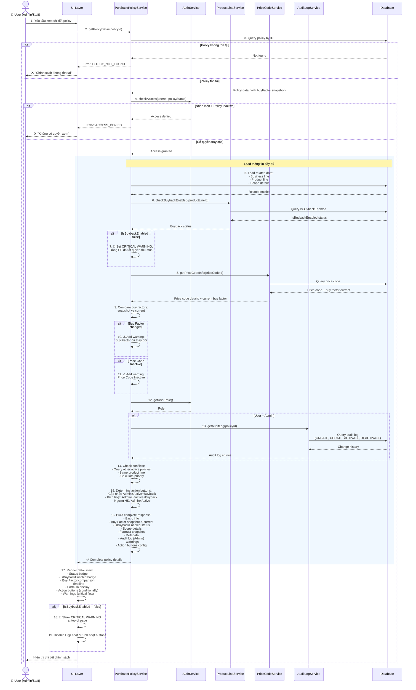

# Use Case UC-CSGIAMUA-06: Xem Chi Tiết Chính Sách Giá Mua

---

| **Use Case ID** | **UC-CSGIAMUA-06** |
|-----------------|---------------------|
| **Use Case Name** | Xem Chi Tiết Chính Sách Giá Mua |
| **Description** | Use Case "Xem Chi Tiết Chính Sách Giá Mua" cho phép Admin và Nhân viên xem thông tin đầy đủ của một chính sách giá mua, bao gồm Buy Factor, công thức tính giá, IsBuybackEnabled status, lịch sử áp dụng và audit log (Admin only). |
| **Actor(s)** | Admin, Nhân viên |
| **Priority** | Must Have |
| **Trigger** | User yêu cầu xem chi tiết một Chính sách giá mua cụ thể |

---

## Input

| Tên trường | Loại | Bắt buộc | Mô tả | Ràng buộc |
|------------|------|----------|-------|-----------|
| `policyId` | Số | Có | ID chính sách cần xem | Chính sách phải tồn tại |

**Lưu ý:**
- **Admin**: Có thể xem chi tiết tất cả chính sách (Active và Inactive)
- **Nhân viên**: Chỉ xem được chi tiết chính sách Active

---

## Output

### Trường hợp thành công:

**Thông tin cơ bản:**

| Tên trường | Loại | Mô tả |
|------------|------|-------|
| `id` | Số | ID chính sách |
| `policyCode` | Văn bản | Mã quy tắc (VD: PUR-2026-001) |
| `effectiveDate` | Ngày giờ | Ngày có hiệu lực |
| `status` | Văn bản | Trạng thái: "Active" hoặc "Inactive" |
| `isEffective` | Boolean | Đã có hiệu lực chưa (effectiveDate <= now) |
| `description` | Văn bản | Ghi chú/Mô tả |

**Thông tin mảng kinh doanh và dòng sản phẩm:**

| Tên trường | Loại | Mô tả |
|------------|------|-------|
| `businessLine` | Thông tin | Thông tin mảng kinh doanh (id, code, name) |
| `productLine` | Thông tin | Thông tin dòng sản phẩm (id, code, name, description) |
| `isBuybackEnabled` | Boolean | **Flag "Cho phép mua lại" của dòng sản phẩm** |
| `buybackEnabledStatus` | Văn bản | Trạng thái hiện tại: "Enabled" hoặc "Disabled" |
| `categoryPath` | Văn bản | Đường dẫn phân cấp dòng sản phẩm (VD: "Vàng > Nhẫn > Nhẫn 24K") |

**Thông tin phạm vi áp dụng:**

| Tên trường | Loại | Mô tả |
|------------|------|-------|
| `scopeType` | Văn bản | Loại phạm vi: ALL_SYSTEM, SPECIFIC_STORE, SPECIFIC_REGION |
| `scopeId` | Số | ID cửa hàng/khu vực (nếu áp dụng) |
| `scopeName` | Văn bản | Tên phạm vi áp dụng |
| `scopeDetails` | Thông tin | Chi tiết cửa hàng/khu vực (địa chỉ, mã, v.v.) |

**Thông tin QTTG bán và Buy Factor:**

| Tên trường | Loại | Mô tả |
|------------|------|-------|
| `priceCode` | Thông tin | Thông tin QTTG bán (id, code, name) |
| `priceCodeStatus` | Văn bản | Trạng thái hiện tại của Price Code |
| `buyFactor` | Số thập phân | **Hệ số mua vào (Buy Factor) đã snapshot** |
| `buyFactorCurrent` | Số thập phân | **Buy Factor hiện tại trong Price Code** (để so sánh) |
| `buyFactorChanged` | Boolean | **Buy Factor đã thay đổi so với snapshot** |
| `pricingFormula` | Văn bản | Công thức tính giá đã snapshot |
| `basePrice` | Thông tin | Thông tin giá cơ sở (nếu có) |

**Metadata:**

| Tên trường | Loại | Mô tả |
|------------|------|-------|
| `createdAt` | Ngày giờ | Thời gian tạo |
| `createdBy` | Văn bản | Người tạo |
| `updatedAt` | Ngày giờ | Thời gian cập nhật lần cuối (nếu có) |
| `updatedBy` | Văn bản | Người cập nhật lần cuối (nếu có) |
| `deactivatedAt` | Ngày giờ | Thời gian ngưng hiệu lực (nếu Inactive) |
| `deactivatedBy` | Văn bản | Người ngưng hiệu lực (nếu Inactive) |
| `deactivateReason` | Văn bản | Lý do ngưng hiệu lực (nếu Inactive) |

**Lịch sử thay đổi (chỉ Admin):**

| Tên trường | Loại | Mô tả |
|------------|------|-------|
| `auditLog` | Danh sách | Lịch sử các lần thay đổi |
| `auditLog[].timestamp` | Ngày giờ | Thời gian thay đổi |
| `auditLog[].performedBy` | Văn bản | Người thực hiện |
| `auditLog[].action` | Văn bản | Hành động: CREATE, UPDATE, ACTIVATE, DEACTIVATE |
| `auditLog[].changes` | Danh sách | Danh sách các trường đã thay đổi (old → new) |
| `auditLog[].reason` | Văn bản | Lý do thay đổi (nếu có) |

### Trường hợp lỗi:

| Mã lỗi | Thông báo | Mô tả |
|--------|-----------|-------|
| `POLICY_NOT_FOUND` | "Chính sách không tồn tại" | Không tìm thấy chính sách |
| `ACCESS_DENIED` | "Không có quyền xem chính sách này" | Nhân viên cố xem chính sách Inactive |

---

## Pre-Condition(s)

- Chính sách giá mua đã tồn tại trong hệ thống
- User đã đăng nhập
- **Admin**: Có quyền xem tất cả chính sách
- **Nhân viên**: Có quyền xem chính sách Active

---

## Post-Condition(s)

- Thông tin chi tiết chính sách được trả về đầy đủ
- Hệ thống kiểm tra và cảnh báo nếu IsBuybackEnabled = false
- Hệ thống so sánh Buy Factor snapshot vs current
- Hệ thống ghi nhận lịch sử truy cập (optional - cho audit)
- Không có thay đổi dữ liệu (read-only operation)

---

## Basic Flow

1. User yêu cầu xem chi tiết một chính sách giá mua cụ thể (từ danh sách hoặc tìm kiếm)
2. Hệ thống kiểm tra quyền truy cập:
   - Admin: Cho phép xem tất cả chính sách
   - Nhân viên: Chỉ cho phép xem chính sách Active
3. Hệ thống lấy thông tin chi tiết chính sách:
   - Thông tin cơ bản của chính sách (ID, mã, ngày hiệu lực, trạng thái)
   - Thông tin mảng kinh doanh và dòng sản phẩm (bao gồm **IsBuybackEnabled status**)
   - Thông tin phạm vi áp dụng (type, name, details)
   - Thông tin QTTG bán, **Buy Factor đã snapshot** và công thức tính giá
   - Metadata (người tạo, cập nhật, ngưng hiệu lực)
4. Hệ thống kiểm tra **IsBuybackEnabled** của dòng sản phẩm:
   - Nếu IsBuybackEnabled = false → Hiển thị cảnh báo nghiêm trọng
5. Hệ thống kiểm tra trạng thái hiện tại của Price Code:
   - Nếu Price Code đã Inactive → Hiển thị cảnh báo
6. Hệ thống so sánh **Buy Factor snapshot vs current**:
   - Lấy Buy Factor hiện tại từ Price Code
   - Nếu khác với snapshot → Hiển thị thông tin so sánh
7. Nếu User là Admin:
   - Hệ thống lấy thêm audit log (lịch sử thay đổi)
   - Hiển thị đầy đủ lý do cập nhật/kích hoạt/ngưng hiệu lực
8. Hệ thống trả về thông tin chi tiết đầy đủ:
   - Thông tin cơ bản và phạm vi
   - Công thức tính giá với Buy Factor
   - **Trạng thái IsBuybackEnabled** với cảnh báo (nếu cần)
   - So sánh Buy Factor snapshot vs current
   - Metadata đầy đủ
   - (Admin only) Audit log
9. User có thể thực hiện các thao tác:
   - **Cập nhật** → Chuyển sang UC-CSGIAMUA-02 (chỉ Admin, chỉ khi Active, chỉ khi IsBuybackEnabled = true)
   - **Kích hoạt lại** → Chuyển sang UC-CSGIAMUA-03 (chỉ Admin, chỉ khi Inactive, chỉ khi IsBuybackEnabled = true)
   - **Ngưng hiệu lực** → Chuyển sang UC-CSGIAMUA-04 (chỉ Admin, chỉ khi Active)
   - **Quay lại danh sách** → Quay lại UC-CSGIAMUA-05

Use case kết thúc.

---

## Alternative Flow

### 4a. IsBuybackEnabled = false (Cảnh báo nghiêm trọng)

4a. Dòng sản phẩm đã tắt flag "Cho phép mua lại"

4a1. Hệ thống hiển thị cảnh báo nghiêm trọng ở đầu trang:
> "🚫 CẢNH BÁO NGHIÊM TRỌNG  
> Dòng sản phẩm '[Tên dòng SP]' đã TẮT quyền thu mua (IsBuybackEnabled = false).  
> Chính sách này KHÔNG THỂ áp dụng cho việc định giá phiếu thu mua.  
>   
> **Khuyến nghị:**  
> - Bật lại flag IsBuybackEnabled ở module Quản lý Dòng sản phẩm  
> - Hoặc ngưng hiệu lực chính sách này nếu không còn sử dụng"

4a2. Hệ thống **disable** các action buttons:
- ❌ Cập nhật (disabled)
- ❌ Kích hoạt lại (disabled, nếu Inactive)
- ✅ Ngưng hiệu lực (enabled, nếu Active)
- ✅ Xem chi tiết (enabled)

4a3. Use case tiếp tục bước 5

### 6a. Buy Factor đã thay đổi

6a. Buy Factor hiện tại trong Price Code khác với Buy Factor đã snapshot

6a1. Hệ thống hiển thị thông tin so sánh:
> "⚠️ LƯU Ý: Buy Factor đã thay đổi  
>   
> **Buy Factor khi tạo chính sách** (snapshot): 0.98  
> **Buy Factor hiện tại** trong QTTG bán '[Mã Price Code]': 0.95  
>   
> Chính sách này sẽ sử dụng Buy Factor snapshot (0.98) để đảm bảo tính nhất quán.  
> Nếu muốn áp dụng Buy Factor mới (0.95), vui lòng cập nhật chính sách hoặc tạo chính sách mới."

6a2. Use case tiếp tục bước 7

### 5a. Price Code đã bị Inactive

5a. Price Code tham chiếu trong chính sách đã bị ngưng hiệu lực

5a1. Hệ thống hiển thị cảnh báo:
> "⚠️ LƯU Ý: QTTG bán '[Mã Price Code]' đã bị ngưng hiệu lực từ [Ngày].  
> Công thức tính giá và Buy Factor hiển thị dưới đây là phiên bản đã snapshot tại thời điểm tạo chính sách."

5a2. Use case tiếp tục bước 6

---

## Exception Flow

### 2a. Chính sách không tồn tại

2a. Hệ thống không tìm thấy chính sách với ID được cung cấp

2a1. Hệ thống trả về lỗi: "Chính sách không tồn tại hoặc đã bị xóa."

2a2. Use case kết thúc

### 2b. Nhân viên cố xem chính sách Inactive

2b. Nhân viên cố gắng xem chi tiết chính sách có trạng thái Inactive

2b1. Hệ thống trả về lỗi: "Không có quyền xem chính sách này."

2b2. Use case kết thúc

---

## Business Rules

### BR-CSGIAMUA-28: Phân quyền xem chi tiết

**Admin:**
- Xem được chi tiết tất cả chính sách (Active và Inactive)
- Xem được audit log đầy đủ (lịch sử thay đổi)
- Xem được lý do cập nhật, kích hoạt và lý do ngưng hiệu lực
- Có thể thực hiện thao tác: 
  * Cập nhật (Active only + IsBuybackEnabled = true)
  * Kích hoạt lại (Inactive only + IsBuybackEnabled = true)
  * Ngưng hiệu lực (Active only)

**Nhân viên:**
- Chỉ xem được chi tiết chính sách Active
- Không xem được audit log
- Không xem được lý do cập nhật nội bộ
- Chỉ có thể Quay lại danh sách (không sửa, không kích hoạt, không ngưng hiệu lực)

### BR-CSGIAMUA-29: Hiển thị Buy Factor và công thức tính giá

**Snapshot của Buy Factor và công thức:**
- Buy Factor được **snapshot** tại thời điểm tạo chính sách
- Buy Factor không thay đổi ngay cả khi Price Code bị cập nhật sau đó
- Đảm bảo tính nhất quán: Giá thu mua tính ra theo chính sách luôn đúng với quyết định ban đầu

**Hiển thị:**
- Công thức đầy đủ: **Giá mua = Giá gốc × Buy Factor**
- Buy Factor snapshot với giải thích
- So sánh Buy Factor snapshot vs current (nếu khác)
- Link tới Price Code (để xem thông tin hiện tại)
- Cảnh báo nếu Price Code đã Inactive
- **Cảnh báo nghiêm trọng nếu IsBuybackEnabled = false**

**Ví dụ:**
```
QTTG bán: PC-001 (Nhẫn vàng 24K)
Công thức tính giá mua (snapshot 01/03/2026):
  Giá mua = Giá vàng SJC × Trọng lượng × Buy Factor (0.98)

Buy Factor:
  - Buy Factor snapshot (01/03/2026): 0.98
  - Buy Factor hiện tại: 0.95 ⚠️ (Đã thay đổi)
  
⚠️ Lưu ý: Price Code này đã bị ngưng hiệu lực từ 03/03/2026

✅ IsBuybackEnabled: Đang bật (Cho phép mua lại)
```

**Ví dụ cảnh báo nghiêm trọng:**
```
🚫 CẢNH BÁO NGHIÊM TRỌNG
Dòng sản phẩm "Nhẫn đặt làm" đã TẮT quyền thu mua.
Chính sách này KHÔNG THỂ áp dụng cho việc định giá phiếu thu mua.

QTTG bán: PC-001 (Nhẫn vàng 24K)
Buy Factor snapshot: 0.98
❌ IsBuybackEnabled: Đã tắt (KHÔNG cho phép mua lại)
```

### BR-CSGIAMUA-30: Hiển thị phạm vi áp dụng chi tiết

**Phạm vi Toàn hệ thống:**
```
Phạm vi áp dụng: Toàn hệ thống
Áp dụng cho: Tất cả cửa hàng và khu vực (có dòng SP có IsBuybackEnabled = true)
```

**Phạm vi Cửa hàng cụ thể:**
```
Phạm vi áp dụng: Cửa hàng cụ thể
Cửa hàng: CN Hà Nội (Mã: HN-001)
Địa chỉ: 123 Đường ABC, Quận XYZ, Hà Nội
Số điện thoại: 024-xxx-xxxx
Quản lý: Nguyễn Văn A
```

**Phạm vi Khu vực:**
```
Phạm vi áp dụng: Khu vực cụ thể
Khu vực: Miền Bắc (Mã: MB)
Bao gồm: 15 cửa hàng tại Hà Nội, Hải Phòng, Quảng Ninh
```

### BR-CSGIAMUA-31: Audit Log (Lịch sử thay đổi)

**Chỉ hiển thị cho Admin:**

Audit log ghi nhận đầy đủ:
- Thời gian thực hiện
- Người thực hiện (username + full name)
- Hành động (CREATE, UPDATE, ACTIVATE, DEACTIVATE)
- Các trường đã thay đổi (old value → new value)
- Lý do thay đổi (đối với UPDATE, ACTIVATE, DEACTIVATE)
- IP address (optional, cho security audit)

**Đặc biệt cho module Giá Mua:**
- Ghi nhận thay đổi Buy Factor (snapshot)
- Ghi nhận thay đổi IsBuybackEnabled status (nếu có)
- Ghi nhận lý do kích hoạt lại (ACTIVATE action)

**Format hiển thị:**
```
[05/03/2026 14:30:00] - UPDATE - admin@company.com
Thay đổi:
  - effectiveDate: 05/03/2026 → 06/03/2026
  - priceCodeId: PC-001 → PC-002
  - buyFactor (snapshot): 0.98 → 0.95
  - pricingFormula: "Giá = X × 0.98" → "Giá = X × 0.95"
Lý do: "Điều chỉnh Buy Factor theo chính sách mới của công ty"

[03/03/2026 10:00:00] - ACTIVATE - admin@company.com
Kích hoạt lại chính sách PUR-2026-001
Lý do: "Dòng sản phẩm đã bật lại IsBuybackEnabled"
Kiểm tra:
  - IsBuybackEnabled: true ✅
  - Buy Factor hiện tại: 0.98 ✅
  - Price Code Active: true ✅

[01/03/2026 10:00:00] - CREATE - admin@company.com
Tạo mới chính sách PUR-2026-001
Buy Factor snapshot: 0.98
```

### BR-CSGIAMUA-32: Hiển thị trạng thái và thời gian

**Status Badge và Timeline:**

| Trạng thái | Timeline | Hiển thị |
|------------|----------|----------|
| Active + Chưa hiệu lực | effectiveDate > now | 🟡 Sắp áp dụng từ [Ngày]<br/>Còn [X] ngày nữa |
| Active + Đã hiệu lực | effectiveDate <= now | 🟢 Đang áp dụng<br/>Hiệu lực từ [Ngày] ([X] ngày trước) |
| Inactive | status = Inactive | 🔴 Đã ngưng hiệu lực<br/>Ngưng từ [Ngày]<br/>Lý do: [Reason] |

**Thêm badge cho IsBuybackEnabled:**
- ✅ **Cho phép mua lại** (màu xanh) - IsBuybackEnabled = true
- 🚫 **KHÔNG cho phép mua lại** (màu đỏ) - IsBuybackEnabled = false

**Ví dụ:**
```
Status: 🟢 Đang áp dụng
IsBuybackEnabled: ✅ Cho phép mua lại
Ngày có hiệu lực: 01/03/2026 (4 ngày trước)
Buy Factor snapshot: 0.98
Tạo bởi: admin@company.com vào 28/02/2026
Cập nhật lần cuối: manager@company.com vào 03/03/2026
```

**Ví dụ cảnh báo:**
```
Status: 🟢 Đang áp dụng
IsBuybackEnabled: 🚫 KHÔNG cho phép mua lại ⚠️
Ngày có hiệu lực: 01/03/2026 (4 ngày trước)
Buy Factor snapshot: 0.98

⚠️ Chính sách này không thể áp dụng vì dòng sản phẩm đã tắt quyền thu mua
```

### BR-CSGIAMUA-33: Cảnh báo xung đột và ưu tiên

Nếu có nhiều chính sách cùng áp dụng cho dòng sản phẩm này:

**Hiển thị thông tin ưu tiên:**
```
⚠️ LƯU Ý VỀ ƯU TIÊN ÁP DỤNG

Chính sách này: PUR-2026-005 - Toàn hệ thống
Buy Factor: 0.98
Ưu tiên: THẤP

Có chính sách khác với ưu tiên cao hơn:
  - PUR-2026-010: Chi nhánh Hà Nội
    Buy Factor: 0.96
    Ưu tiên: CAO
  → Tại Chi nhánh Hà Nội, PUR-2026-010 sẽ được áp dụng thay vì PUR-2026-005

Chính sách này áp dụng tại:
  - Tất cả cửa hàng NGOẠI TRỪ: Chi nhánh Hà Nội
```

### BR-CSGIAMUA-34: Kiểm tra điều kiện cho Action Buttons

**Điều kiện để hiển thị/enable các action buttons:**

1. **Nút "Cập nhật":**
   - User phải là Admin
   - Status = Active
   - **IsBuybackEnabled = true**
   - Nếu thiếu 1 trong 3 điều kiện → Disable + tooltip giải thích

2. **Nút "Kích hoạt lại":**
   - User phải là Admin
   - Status = Inactive
   - **IsBuybackEnabled = true** (kiểm tra hiện tại)
   - **Buy Factor hiện tại > 0**
   - **Price Code đang Active**
   - Nếu thiếu điều kiện → Disable + tooltip giải thích lý do cụ thể

3. **Nút "Ngưng hiệu lực":**
   - User phải là Admin
   - Status = Active
   - (Không phụ thuộc IsBuybackEnabled - vẫn có thể ngưng HĐ)

4. **Nút "Quay lại":**
   - Luôn enable cho tất cả user

**Tooltip examples:**
```
"Cập nhật" button disabled:
- "Chỉ Admin mới có quyền cập nhật"
- "Chỉ có thể cập nhật chính sách Active"
- "Không thể cập nhật: Dòng SP đã tắt IsBuybackEnabled"

"Kích hoạt lại" button disabled:
- "Chỉ Admin mới có quyền kích hoạt"
- "Chỉ có thể kích hoạt chính sách Inactive"
- "Không thể kích hoạt: Dòng SP đã tắt IsBuybackEnabled"
- "Không thể kích hoạt: Buy Factor hiện tại = 0"
- "Không thể kích hoạt: Price Code đã Inactive"
```

---

## Diagrams

### 1. Use Case Diagram - UC-CSGIAMUA-06: Xem Chi Tiết

```mermaid
graph LR
    Admin["👤 Admin"]
    Staff["👤 Nhân viên"]
    
    UC["UC-CSGIAMUA-06:<br/>Xem Chi Tiết<br/>Chính Sách Giá Mua"]
    
    Include1["«include»<br/>Load thông tin<br/>chính sách"]
    Include2["«include»<br/>Load phạm vi<br/>áp dụng"]
    Include3["«include»<br/>Load Buy Factor<br/>và công thức"]
    Include4["«include»<br/>Kiểm tra<br/>IsBuybackEnabled"]
    Include5["«include»<br/>So sánh<br/>Buy Factor"]
    
    Extend1["«extend»<br/>Load audit log<br/>(chỉ Admin)"]
    Extend2["«extend»<br/>Cảnh báo Price Code<br/>Inactive"]
    Extend3["«extend»<br/>Cảnh báo<br/>IsBuybackEnabled = false"]
    Extend4["«extend»<br/>Cảnh báo<br/>Buy Factor thay đổi"]
    
    UC01["UC-CSGIAMUA-02:<br/>Cập nhật"]
    UC02["UC-CSGIAMUA-03:<br/>Kích hoạt lại"]
    UC03["UC-CSGIAMUA-04:<br/>Ngưng hiệu lực"]
    
    Admin -->|Thực hiện| UC
    Staff -->|Thực hiện| UC
    
    UC -.->|include| Include1
    UC -.->|include| Include2
    UC -.->|include| Include3
    UC -.->|include| Include4
    UC -.->|include| Include5
    UC -.->|extend| Extend1
    UC -.->|extend| Extend2
    UC -.->|extend| Extend3
    UC -.->|extend| Extend4
    
    UC -->|Cập nhật<br/>(Admin, Active, Buyback)| UC01
    UC -->|Kích hoạt<br/>(Admin, Inactive, Buyback)| UC02
    UC -->|Ngưng hiệu lực<br/>(Admin, Active)| UC03
    
    style UC fill:#e8f5e9,stroke:#2e7d32,stroke-width:2px
    style Admin fill:#fff9c4,stroke:#f57f17,stroke-width:2px
    style Staff fill:#e1f5ff,stroke:#01579b,stroke-width:2px
    style Include1 fill:#f3e5f5,stroke:#7b1fa2,stroke-width:1px
    style Include2 fill:#f3e5f5,stroke:#7b1fa2,stroke-width:1px
    style Include3 fill:#f3e5f5,stroke:#7b1fa2,stroke-width:1px
    style Include4 fill:#fff3e0,stroke:#e65100,stroke-width:1px
    style Include5 fill:#fff3e0,stroke:#e65100,stroke-width:1px
    style Extend1 fill:#bbdefb,stroke:#1976d2,stroke-width:1px
    style Extend2 fill:#fff3e0,stroke:#e65100,stroke-width:1px
    style Extend3 fill:#ffcdd2,stroke:#c62828,stroke-width:2px
    style Extend4 fill:#fff3e0,stroke:#e65100,stroke-width:1px
```

### 2. Activity Diagram - Luồng Xem Chi Tiết

```mermaid
flowchart TD
    Start([Bắt đầu]) --> CheckRole{Kiểm tra<br/>vai trò}
    
    CheckRole -->|Admin| AllowAll[Cho phép xem tất cả]
    CheckRole -->|Nhân viên| CheckStatus{Status<br/>= Active?}
    
    CheckStatus -->|Inactive| AccessDenied[Lỗi: Không có quyền]
    AccessDenied --> End([Kết thúc])
    
    CheckStatus -->|Active| AllowActive[Cho phép xem]
    
    AllowAll --> LoadBasic[Load thông tin cơ bản:<br/>- Policy data<br/>- Status, dates<br/>- Description]
    AllowActive --> LoadBasic
    
    LoadBasic --> LoadBusiness[Load mảng KD & dòng SP:<br/>- Business line<br/>- Product line<br/>- IsBuybackEnabled status<br/>- Category path]
    
    LoadBusiness --> CheckBuyback{IsBuybackEnabled<br/>= true?}
    
    CheckBuyback -->|false| SetCriticalWarning[⚠️ Đặt cảnh báo nghiêm trọng:<br/>Dòng SP đã tắt quyền thu mua]
    CheckBuyback -->|true| LoadScope
    
    SetCriticalWarning --> LoadScope[Load phạm vi áp dụng:<br/>- Scope type<br/>- Scope details<br/>- Store/Region info]
    
    LoadScope --> LoadPriceCode[Load QTTG bán & Buy Factor:<br/>- Price code info<br/>- Buy Factor snapshot<br/>- Pricing formula]
    
    LoadPriceCode --> GetCurrentBF[Lấy Buy Factor hiện tại<br/>từ Price Code]
    
    GetCurrentBF --> CompareBF{Buy Factor<br/>snapshot = current?}
    
    CompareBF -->|Khác| SetBFWarning[⚠️ Đặt cảnh báo:<br/>Buy Factor đã thay đổi]
    CompareBF -->|Giống| CheckPCStatus
    
    SetBFWarning --> CheckPCStatus{Price Code<br/>Active?}
    
    CheckPCStatus -->|Inactive| ShowPCWarning[⚠️ Hiển thị cảnh báo:<br/>Price Code đã Inactive]
    CheckPCStatus -->|Active| LoadMeta
    
    ShowPCWarning --> LoadMeta[Load metadata:<br/>- Created/Updated by<br/>- Timestamps<br/>- Deactivate reason nếu có]
    
    LoadMeta --> IsAdmin{User<br/>= Admin?}
    
    IsAdmin -->|Có| LoadAudit[Load audit log:<br/>- CREATE, UPDATE,<br/>ACTIVATE, DEACTIVATE<br/>- Change history<br/>- Reasons]
    IsAdmin -->|Không| BuildResponse
    
    LoadAudit --> BuildResponse[Build response<br/>với tất cả thông tin]
    
    BuildResponse --> CheckConflict[Kiểm tra xung đột<br/>chính sách khác]
    
    CheckConflict --> HasConflict{Có xung đột<br/>ưu tiên?}
    
    HasConflict -->|Có| AddPriorityWarning[Thêm cảnh báo<br/>về ưu tiên áp dụng]
    HasConflict -->|Không| SetActionButtons
    
    AddPriorityWarning --> SetActionButtons[Thiết lập Action Buttons:<br/>- Cập nhật Admin+Active+Buyback<br/>- Kích hoạt Admin+Inactive+Buyback<br/>- Ngưng HĐ Admin+Active<br/>- Quay lại Always]
    
    SetActionButtons --> Display[Hiển thị chi tiết<br/>chính sách đầy đủ<br/>+ Warnings<br/>+ Buy Factor comparison<br/>+ Action buttons]
    
    Display --> UserAction{Hành động<br/>của User?}
    
    UserAction -->|Cập nhật Admin| CanUpdate{IsBuybackEnabled<br/>= true?}
    CanUpdate -->|true| UpdatePolicy[UC-CSGIAMUA-02:<br/>Cập nhật]
    CanUpdate -->|false| ShowError1[Lỗi: Không thể cập nhật<br/>khi IsBuybackEnabled = false]
    ShowError1 --> Display
    
    UserAction -->|Kích hoạt lại Admin| CanActivate{IsBuybackEnabled<br/>= true?}
    CanActivate -->|true| ActivatePolicy[UC-CSGIAMUA-03:<br/>Kích hoạt lại]
    CanActivate -->|false| ShowError2[Lỗi: Không thể kích hoạt<br/>khi IsBuybackEnabled = false]
    ShowError2 --> Display
    
    UserAction -->|Ngưng hiệu lực Admin| DeactivatePolicy[UC-CSGIAMUA-04:<br/>Ngưng hiệu lực]
    UserAction -->|Quay lại| BackToList[UC-CSGIAMUA-05:<br/>Danh sách]
    UserAction -->|Kết thúc| End
    
    UpdatePolicy --> End
    ActivatePolicy --> End
    DeactivatePolicy --> End
    BackToList --> End
    
    style Start fill:#c8e6c9,stroke:#2e7d32,stroke-width:2px
    style End fill:#c8e6c9,stroke:#2e7d32,stroke-width:2px
    style Display fill:#a5d6a7,stroke:#388e3c,stroke-width:2px
    style AccessDenied fill:#ffcdd2,stroke:#c62828,stroke-width:2px
    style SetCriticalWarning fill:#ffcdd2,stroke:#c62828,stroke-width:2px
    style SetBFWarning fill:#fff3e0,stroke:#e65100,stroke-width:2px
    style ShowPCWarning fill:#fff3e0,stroke:#e65100,stroke-width:2px
    style AddPriorityWarning fill:#fff3e0,stroke:#e65100,stroke-width:2px
    style LoadAudit fill:#bbdefb,stroke:#1976d2,stroke-width:2px
    style ShowError1 fill:#ffcdd2,stroke:#c62828,stroke-width:2px
    style ShowError2 fill:#ffcdd2,stroke:#c62828,stroke-width:2px
```



### 3. Sequence Diagram - Xem Chi Tiết Chính Sách Giá Mua



**Giải thích Sequence Diagram:**

**Xử lý nghiệp vụ đặc biệt cho module Giá Mua:**
- **Kiểm tra IsBuybackEnabled**: Gọi ProductLineService để check flag
- **So sánh Buy Factor**: Snapshot (lưu trong policy) vs Current (từ Price Code)
- **Cảnh báo nghiêm trọng**: Nếu IsBuybackEnabled = false
- **Conditional action buttons**: Cập nhật/Kích hoạt chỉ enabled khi IsBuybackEnabled = true
- **Audit log đặc biệt**: Ghi nhận cả ACTIVATE action (khác với module Giá Bán)

**Nhánh xử lý:**
- **Policy không tồn tại**: Trả về lỗi
- **Nhân viên + Inactive**: Access denied
- **IsBuybackEnabled = false**: Critical warning + disable buttons
- **Buy Factor changed**: Warning với so sánh
- **Price Code Inactive**: Warning
- **Admin**: Load thêm audit log

**Optimization:**
- Eager load related entities (BusinessLine, ProductLine, Scope) trong 1 query
- Lấy Buy Factor current khi load Price Code (avoid extra query)
- Check conflicts song song với load data

---

### 4. Class Diagram

```mermaid
classDiagram
    class PurchasePolicyController {
        +getPolicyDetail() PolicyDetailResponse
    }
    
    class PurchasePolicyService {
        +getPolicyDetail() PurchasePolicyDetail
        +loadRelatedEntities() void
        +checkBuybackEnabled() Boolean
        +checkPriceCodeStatus() Boolean
        +compareBuyFactors() BuyFactorComparison
        +checkPolicyConflicts() ConflictInfo
        +determineActionButtons() ActionButtonsConfig
    }
    
    class PurchasePolicyDetail {
        +basicInfo: PolicyBasicInfo
        +businessLine: BusinessLineInfo
        +productLine: ProductLineInfo
        +buybackInfo: BuybackInfo
        +scope: ScopeInfo
        +priceCode: PriceCodeInfo
        +buyFactorSnapshot: Decimal
        +buyFactorCurrent: Decimal
        +buyFactorComparison: BuyFactorComparison
        +pricingFormula: String
        +metadata: PolicyMetadata
        +auditLog: List~AuditEntry~ [Admin only]
        +warnings: List~Warning~
        +actionButtons: ActionButtonsConfig
        +conflictInfo: ConflictInfo [if exists]
    }
    
    class PolicyBasicInfo {
        +id: ID
        +policyCode: String
        +effectiveDate: DateTime
        +status: StatusEnum
        +isEffective: Boolean
        +description: String
        +getStatusBadge() String
        +getDaysEffective() Integer
    }
    
    class BuybackInfo {
        +isBuybackEnabled: Boolean
        +buybackEnabledStatus: String
        +hasCriticalWarning: Boolean
        +warningMessage: String
        +getBadge() String
    }
    
    class BuyFactorComparison {
        +snapshot: Decimal
        +current: Decimal
        +hasChanged: Boolean
        +percentageDiff: Decimal
        +getComparisonMessage() String
    }
    
    class ScopeInfo {
        +scopeType: ScopeTypeEnum
        +scopeId: ID
        +scopeName: String
        +scopeDetails: Object
        +formatDisplay() String
    }
    
    class PriceCodeInfo {
        +id: ID
        +code: String
        +name: String
        +status: StatusEnum
        +formula: String
        +buyFactorCurrent: Decimal
        +isActive() Boolean
    }
    
    class PolicyMetadata {
        +createdAt: DateTime
        +createdBy: String
        +updatedAt: DateTime
        +updatedBy: String
        +deactivatedAt: DateTime
        +deactivatedBy: String
        +deactivateReason: String
    }
    
    class AuditEntry {
        +timestamp: DateTime
        +performedBy: String
        +action: ActionEnum
        +changes: Map~String, Change~
        +reason: String
        +ipAddress: String
    }
    
    class ActionButtonsConfig {
        +canUpdate: Boolean
        +canActivate: Boolean
        +canDeactivate: Boolean
        +updateDisabledReason: String
        +activateDisabledReason: String
        +deactivateDisabledReason: String
    }
    
    class Warning {
        +level: WarnLevel
        +message: String
        +details: String
        +isCritical: Boolean
    }
    
    class ConflictInfo {
        +hasConflict: Boolean
        +conflictingPolicies: List~PolicySummary~
        +priorityLevel: Integer
        +applicableStores: List~String~
    }
    
    class ProductLineService {
        +checkBuybackEnabled() Boolean
        +getBuybackInfo() BuybackInfo
    }
    
    class AuthService {
        +checkAccess() Boolean
        +getUserRole() Role
    }
    
    class AuditLogService {
        +getAuditLog() List~AuditEntry~
    }
    
    class PurchasePolicyRepository {
        +findById() PurchasePolicy
        +findConflicting() List~PurchasePolicy~
    }
    
    PurchasePolicyController --> PurchasePolicyService : sử dụng
    PurchasePolicyService --> ProductLineService : check buyback
    PurchasePolicyService --> AuthService : kiểm tra quyền
    PurchasePolicyService --> AuditLogService : load log
    PurchasePolicyService --> PurchasePolicyRepository : query
    PurchasePolicyService --> PurchasePolicyDetail : tạo
    PurchasePolicyDetail --> PolicyBasicInfo : chứa
    PurchasePolicyDetail --> BuybackInfo : chứa
    PurchasePolicyDetail --> BuyFactorComparison : chứa
    PurchasePolicyDetail --> ScopeInfo : chứa
    PurchasePolicyDetail --> PriceCodeInfo : chứa
    PurchasePolicyDetail --> PolicyMetadata : chứa
    PurchasePolicyDetail --> AuditEntry : chứa
    PurchasePolicyDetail --> ActionButtonsConfig : chứa
    PurchasePolicyDetail --> Warning : chứa
    PurchasePolicyDetail --> ConflictInfo : chứa
    
    note for BuybackInfo "Thông tin đặc biệt<br/>cho module Giá Mua:<br/>IsBuybackEnabled status<br/>+ Critical warning"
    note for BuyFactorComparison "So sánh Buy Factor<br/>snapshot vs current<br/>để cảnh báo thay đổi"
    note for ActionButtonsConfig "Điều kiện enable/disable<br/>dựa trên:<br/>Role + Status + IsBuybackEnabled"
    note for AuditEntry "Ghi nhận cả ACTIVATE<br/>(đặc biệt cho Giá Mua)"
```



---

## Notes

**UI/UX Recommendations:**

1. **Layout Structure:**
   - **Top Alert Bar** (nếu có cảnh báo nghiêm trọng): IsBuybackEnabled = false
   - **Left Panel**: Thông tin cơ bản (mã, ngày, status, phạm vi)
   - **Center Panel**: Chi tiết dòng sản phẩm, Buy Factor, công thức tính giá
   - **Right Panel**: Timeline, metadata, IsBuybackEnabled badge
   - **Bottom Section** (Admin only): Audit log với filter/search

2. **Status Display:**
   - Badge lớn, rõ ràng ở đầu trang (Status + IsBuybackEnabled)
   - Timeline trực quan (created → updated → activated → deactivated)
   - Highlight thời gian quan trọng

3. **Buy Factor Display:**
   - **Snapshot** (bold, màu xanh): "Buy Factor khi tạo: 0.98"
   - **Current** (màu xám): "Buy Factor hiện tại: 0.95"
   - **Comparison** (nếu khác): "⚠️ Đã giảm 3.06%"
   - Visual indicator: Progress bar hoặc chart

4. **IsBuybackEnabled Warning (Critical):**
   ```
   +-----------------------------------------------+
   | 🚫 CẢNH BÁO NGHIÊM TRỌNG                     |
   |                                               |
   | Dòng sản phẩm đã TẮT quyền thu mua           |
   | Chính sách này KHÔNG THỂ áp dụng             |
   |                                               |
   | [Bật lại IsBuybackEnabled] [Ngưng hiệu lực]  |
   +-----------------------------------------------+
   ```

5. **Formula Display:**
   - Syntax highlighting cho công thức
   - **Giá mua = Giá gốc × Buy Factor (0.98)**
   - Expand/Collapse cho công thức phức tạp
   - Tooltip giải thích từng thành phần

6. **Action Buttons:**
   - Fixed bottom bar hoặc sticky header
   - Disable buttons với tooltip giải thích:
     * "Không thể cập nhật: Dòng SP đã tắt quyền thu mua"
     * "Không thể kích hoạt: IsBuybackEnabled = false"
   - Confirmation dialog trước khi action

7. **Warnings & Alerts Hierarchy:**
   - **Critical** (đỏ): IsBuybackEnabled = false
   - **Warning** (vàng): Buy Factor changed, Price Code Inactive
   - **Info** (xanh): Conflict info, priority note

**Performance:**
- Eager load tất cả related entities trong 1 query phức tạp (JOIN ProductLine, BusinessLine, Scope, PriceCode)
- Load Buy Factor current trong cùng query với Price Code
- Lazy load audit log (chỉ khi user click xem)
- Cache BuybackEnabled status (ít thay đổi)

**So sánh với UC-CSGIABAN-06 (Xem Chi Tiết Giá bán):**

| Khía cạnh | Giá bán | Giá mua |
|-----------|---------|---------|
| **Hệ số hiển thị** | Sell Factor | Buy Factor |
| **Kiểm tra đặc biệt** | Không | IsBuybackEnabled |
| **Cảnh báo nghiêm trọng** | Không | IsBuybackEnabled = false |
| **So sánh hệ số** | Có (optional) | Có (bắt buộc) |
| **Action ACTIVATE** | Không có | Có (UC-CSGIAMUA-03) |
| **Audit log actions** | CREATE, UPDATE, DEACTIVATE | CREATE, UPDATE, ACTIVATE, DEACTIVATE |
| **Action buttons điều kiện** | Role + Status | Role + Status + IsBuybackEnabled |
| **Mã policy** | PP-YYYY-XXX | PUR-YYYY-XXX |

**Quan hệ với các use case khác:**
- UC-CSGIAMUA-05: Danh sách → Click item → Navigate đến đây
- UC-CSGIAMUA-02: Cập nhật → Từ đây navigate qua (nếu Admin + Active + IsBuybackEnabled = true)
- UC-CSGIAMUA-03: Kích hoạt lại → Từ đây trigger (nếu Admin + Inactive + IsBuybackEnabled = true)
- UC-CSGIAMUA-04: Ngưng hiệu lực → Từ đây trigger (nếu Admin + Active)

**Edge Cases:**

1. **IsBuybackEnabled = false sau khi tạo chính sách:**
   - Hiển thị critical warning
   - Disable Cập nhật và Kích hoạt
   - Chỉ cho phép Ngưng hiệu lực
   - Gợi ý bật lại flag hoặc ngưng chính sách

2. **Buy Factor = 0 trong Price Code:**
   - Cảnh báo: "Buy Factor hiện tại = 0, không thể kích hoạt lại"
   - Disable nút Kích hoạt lại
   - Gợi ý cập nhật Price Code

3. **Price Code Inactive + Buy Factor changed:**
   - Hiển thị cả 2 cảnh báo
   - Ưu tiên hiển thị Price Code Inactive trước

4. **Admin xem policy của dòng SP đã xóa:**
   - Load được data (soft delete)
   - Hiển thị badge: "❌ Dòng SP đã bị xóa"
   - Disable tất cả action buttons

**Tham chiếu:**
- TONG-QUAN.md - Section 2: Tác nhân (phân quyền)
- TONG-QUAN.md - Section 5: Business Rules
- UC-CSGIAMUA-01-TAO-MOI.md - IsBuybackEnabled validation, Buy Factor snapshot
- UC-CSGIAMUA-02-CAP-NHAT.md - Buy Factor snapshot update
- UC-CSGIAMUA-03-KICH-HOAT-LAI.md - Activation prerequisites
- UC-CSGIAMUA-04-NGUNG-HIEU-LUC.md - Deactivation flow
