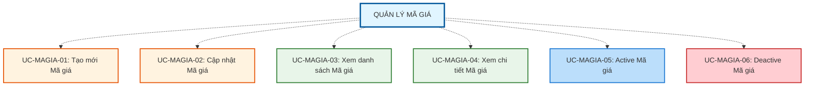

# QUẢN LÝ MÃ GIÁ (PRICE CODE MANAGEMENT)

## Tổng quan Module

Chức năng "Quản lý Mã Giá" cung cấp khả năng thiết lập và quản lý các mã giá - thực thể trung gian xác định cách tính giá mua/bán cho các nhóm hàng hóa trong hệ thống POS.

---

## 1. MÔ TẢ CHỨC NĂNG

### 1.1. Mục tiêu
- **Tạo lập hệ thống mã giá linh hoạt**: Hỗ trợ cơ chế kế thừa nhiều cấp để tái sử dụng cấu hình giá
- **Đảm bảo tính toàn vẹn dữ liệu**: Ngăn chặn các tình huống vi phạm ràng buộc nghiệp vụ (vòng lặp kế thừa, xung đột cấu trúc nhóm hàng)
- **Quản lý vòng đời mã giá**: Theo dõi trạng thái và lịch sử sử dụng của từng mã giá
- **Kiểm soát ảnh hưởng thay đổi**: Đảm bảo thay đổi hệ số chỉ áp dụng cho bảng giá mới, không ảnh hưởng bảng giá đã kích hoạt

### 1.2. Phạm vi áp dụng
- **Đối tượng quản lý**: Tất cả các mã giá trong hệ thống POS
- **Ràng buộc nghiệp vụ**: Mã giá phải liên kết với nhóm hàng nhỏ nhất (nhóm không có nhóm con)
- **Phạm vi tác động**: Ảnh hưởng đến quá trình tạo bảng giá, định giá sản phẩm, và cấu trúc nhóm hàng

### 1.3. Định nghĩa
**Mã giá** là thực thể trung gian dùng để xác định cách tính giá mua vào và bán ra cho các nhóm hàng hóa. Mã giá được liên kết với nhóm hàng nhỏ nhất trong cấu trúc nhóm hàng hóa cha - con nhằm đảm bảo việc tra cứu giá có thể thực hiện bằng khóa xác định duy nhất.

**Cấu trúc Mã giá** bao gồm:
- Mã giá (chọn từ danh sách nhóm hàng)
- Mã giá gốc (có thể null - dùng cho kế thừa)
- Nhóm hàng nhỏ nhất
- Hàm lượng vàng (nếu áp dụng)
- Thương hiệu (nếu áp dụng)
- Hệ số mua vào
- Hệ số bán ra
- Trạng thái (Active / Inactive)

**Quan hệ kế thừa giá** (Price Code Hierarchy):
- **Mã giá độc lập**: Không kế thừa từ mã giá khác
- **Mã giá kế thừa**: Kế thừa từ mã giá khác
- Hỗ trợ kế thừa nhiều cấp (A → B → C)

---

## 2. TÁC NHÂN (ACTORS)

| Tác nhân | Vai trò | Quyền hạn |
|----------|---------|-----------|
| **Admin** | Người quản lý toàn bộ hệ thống mã giá | - Tạo, cập nhật mã giá - Thiết lập quan hệ kế thừa - Active/Deactive mã giá - Điều chỉnh hệ số mua/bán - Xem danh sách và chi tiết mã giá |
| **Nhân viên** | Người xử lý định giá và tạo bảng giá | - Xem danh sách mã giá Active - Xem chi tiết mã giá - Sử dụng mã giá để tạo bảng giá |

### 2.1. Ma trận Phân quyền Actor

| Use Case | Admin | Nhân viên | Ghi chú |
|----------|:-----:|:---------:|---------|
| **UC-MAGIA-01: Tạo mới Mã giá** | ✅ | ❌ | Chỉ Admin có quyền tạo mã giá mới |
| **UC-MAGIA-02: Cập nhật Mã giá** | ✅ | ❌ | Chỉ Admin có quyền cập nhật thông tin và hệ số |
| **UC-MAGIA-03: Xem danh sách Mã giá** | ✅ | ✅* | *Nhân viên chỉ xem được mã giá Active |
| **UC-MAGIA-04: Xem chi tiết Mã giá** | ✅ | ✅ | Cả hai có quyền xem chi tiết |
| **UC-MAGIA-05: Active Mã giá** | ✅ | ❌ | Chỉ Admin có quyền kích hoạt mã giá |
| **UC-MAGIA-06: Deactive Mã giá** | ✅ | ❌ | Chỉ Admin có quyền vô hiệu hóa mã giá |

**Chú thích:**
- ✅ = Có quyền thực hiện
- ❌ = Không có quyền thực hiện
- ✅* = Có quyền với giới hạn (xem ghi chú)

---

## 3. DANH SÁCH USE CASE

### 3.1. Tổng quan Use Case

---

## 4. CẤU TRÚC TÀI LIỆU

### Use Cases (Tính năng nghiệp vụ)
- **UC-MAGIA-01: Tạo mới Mã giá** - Tạo mã giá độc lập hoặc mã giá kế thừa từ mã giá khác
- **UC-MAGIA-02: Cập nhật Mã giá** - Cập nhật thông tin và hệ số định giá
- **UC-MAGIA-03: Xem danh sách Mã giá** - Lọc, tìm kiếm và hiển thị danh sách mã giá
- **UC-MAGIA-04: Xem chi tiết Mã giá** - Xem thông tin đầy đủ của một mã giá
- **UC-MAGIA-05: Active Mã giá** - Kích hoạt mã giá để sử dụng
- **UC-MAGIA-06: Deactive Mã giá** - Vô hiệu hóa mã giá, không cho phép sử dụng

---

## 5. BUSINESS RULE (Quy tắc nghiệp vụ)

### ⭐ Cơ chế hỗ trợ nghiệp vụ
- ✅ **Kế thừa nhiều cấp**: A → B → C (không giới hạn mức)
- ✅ **Phát hiện vòng lặp tự động**: Ngăn chặn A → B → A
- ✅ **Snapshot mechanism**: Thay đổi hệ số không ảnh hưởng bảng giá đã Active
- ✅ **Audit log đầy đủ**: Theo dõi toàn bộ lịch sử thay đổi
- ✅ **Smart UI**: Hiển thị all leaf nhưng disable những leaf đã được gán mã giá

### 🔒 Ràng buộc quan trọng
- ❌ Mã giá chỉ gắn với **nhóm hàng nhỏ nhất** (nhóm hàng không có nhóm con)
- ❌ Một nhóm hàng chỉ có **tối đa 1 mã giá**
- ❌ Nếu nhóm hàng đã có mã giá, **không được phép thêm nhóm con**
- ❌ **Không vòng lặp kế thừa** (A → B → C → A)
- ⚠️ Thay đổi hệ số **chỉ áp dụng cho bảng giá mới**
- ⚠️ Mã giá Inactive **vẫn được lưu trữ để tra cứu lịch sử**

### 📋 Cảnh báo Hệ thống
Khi user cố thay đổi cấu trúc nhóm hàng đã có mã giá:

> "Category này đang được gắn với Mã Giá XXX.  
> Vui lòng xóa hoặc Inactive Mã Giá trước khi thay đổi cấu trúc."

Hệ thống sẽ **không cho phép lưu thay đổi** cấu trúc nếu Mã Giá chưa được xử lý.