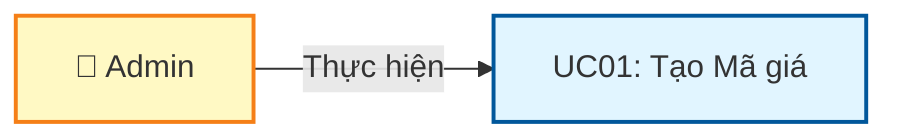
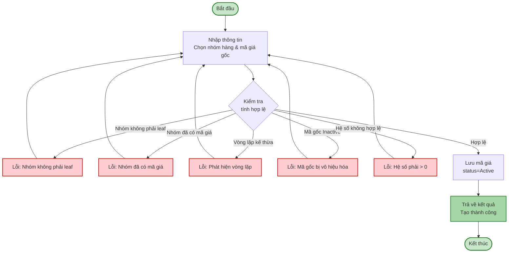
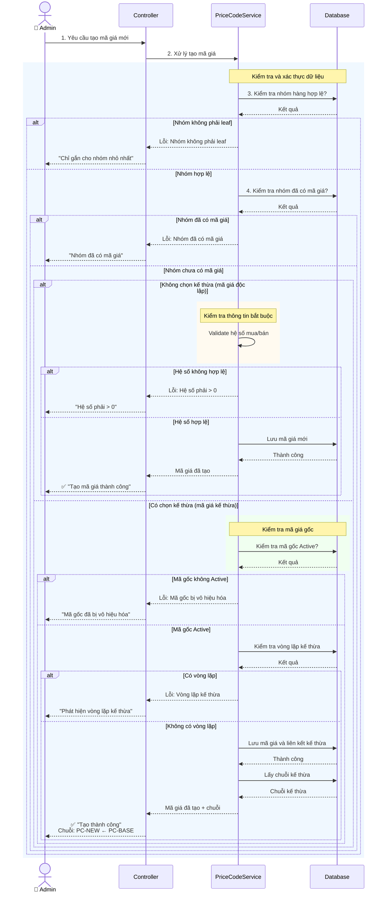
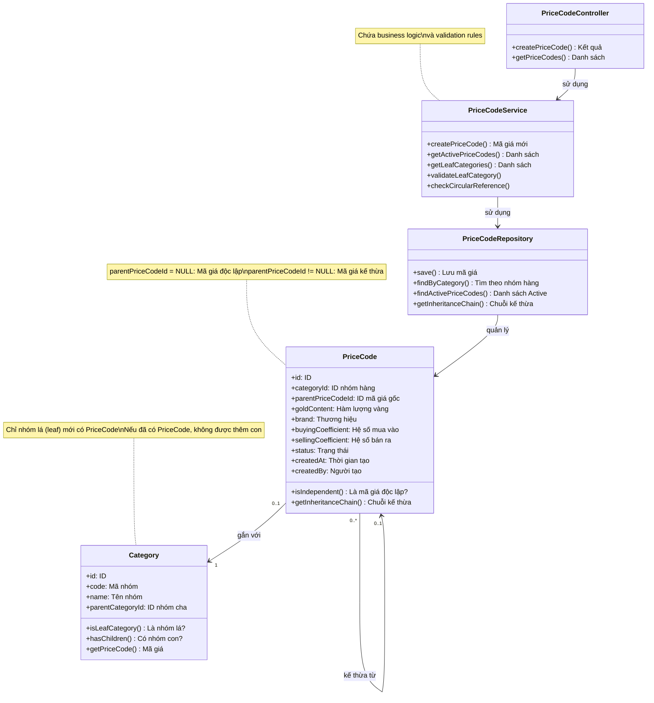

# Use Case UC-MAGIA-01: Tạo Mã giá

---

| **Use Case ID** | **UC-MAGIA-01** |
|-----------------|-----------------||
| **Use Case Name** | Tạo Mã giá |
| **Description** | Use Case "Tạo Mã giá" cho phép Admin tạo mới mã giá cho nhóm hàng. Mã giá có thể tạo độc lập hoặc kế thừa từ mã giá khác. |
| **Actor(s)** | Admin |
| **Priority** | Must Have |
| **Trigger** | Admin chọn chức năng "Tạo mã giá mới" |

---

## Input

| Tên trường | Loại | Bắt buộc | Mô tả | Ràng buộc |
|------------|------|----------|-------|-----------|
| `categoryId` | Số | Có | Nhóm hàng nhỏ nhất | Phải là nhóm hàng không có nhóm con, chưa được gán mã giá |
| `parentPriceCodeId` | Số | Không | Mã giá gốc kế thừa | Phải là mã giá Active, để trống nếu tạo mã giá độc lập |
| `goldContent` | Văn bản | Có (nếu áp dụng) | Hàm lượng vàng | Max 20 ký tự, có thể NULL |
| `brand` | Văn bản | Có (nếu áp dụng) | Thương hiệu | Max 50 ký tự, có thể NULL |
| `buyingCoefficient` | Số thập phân | Có | Hệ số mua vào | > 0 |
| `sellingCoefficient` | Số thập phân | Có | Hệ số bán ra | > 0 |

**Quy tắc về kế thừa:**
- **Mã giá độc lập** (không chọn kế thừa): Tất cả thông tin phải được nhập đầy đủ
- **Mã giá kế thừa** (chọn mã giá gốc): Có thể kế thừa hoặc ghi đè các thuộc tính từ mã giá gốc

---

## Output

### Trường hợp thành công:

| Tên trường | Loại | Mô tả |
|------------|------|-------|
| `id` | Số | ID mã giá mới được tạo |
| `category` | Thông tin | Thông tin nhóm hàng (id, code, name) |
| `parentPriceCode` | Thông tin | Thông tin mã giá gốc (nếu có kế thừa) |
| `inheritanceChain` | Văn bản | Chuỗi kế thừa (VD: "PC-C ← PC-B ← PC-A") |
| `goldContent` | Văn bản | Hàm lượng vàng |
| `brand` | Văn bản | Thương hiệu |
| `buyingCoefficient` | Số thập phân | Hệ số mua vào |
| `sellingCoefficient` | Số thập phân | Hệ số bán ra |
| `status` | Văn bản | Trạng thái = "Active" |
| `createdAt` | Ngày giờ | Thời gian tạo |
| `createdBy` | Văn bản | Người tạo |

### Trường hợp lỗi:

| Mã lỗi | Thông báo | Mô tả |
|--------|-----------|-------|
| `CATEGORY_NOT_LEAF` | "Chỉ được gắn mã giá cho nhóm hàng nhỏ nhất" | Nhóm hàng còn có nhóm con |
| `CATEGORY_HAS_PRICE_CODE` | "Nhóm hàng đã được gắn mã giá" | Nhóm hàng đã có mã giá khác |
| `INACTIVE_PARENT` | "Mã giá gốc đã bị vô hiệu hóa" | Mã giá kế thừa không Active |
| `CIRCULAR_REFERENCE` | "Phát hiện vòng lặp kế thừa" | Tạo vòng lặp trong chuỗi kế thừa |
| `INVALID_COEFFICIENT` | "Hệ số phải lớn hơn 0" | Hệ số mua/bán không hợp lệ |

---

## Pre-Condition(s)

- Nhóm hàng leaf (không có nhóm con) đã tồn tại trong hệ thống
- Nhóm hàng chưa có mã giá nào được gắn
- (Nếu chọn kế thừa) Mã giá gốc phải có trạng thái Active
- Admin đã đăng nhập và có quyền tạo mã giá

---

## Post-Condition(s)

- Mã giá mới được tạo thành công với trạng thái Active
- Mã giá được gắn với nhóm hàng đã chọn
- Hệ thống ghi nhận thông tin người tạo và thời gian tạo
- (Nếu có chọn kế thừa) Liên kết kế thừa được thiết lập với mã giá gốc

---

## Basic Flow

1. Admin yêu cầu tạo mã giá mới
2. Hệ thống yêu cầu Admin cung cấp thông tin:
   - Nhóm hàng (bắt buộc, phải là nhóm hàng không có nhóm con, chưa có mã giá)
   - Mã giá gốc (tùy chọn, phải là mã giá Active)
   - Hàm lượng vàng (tùy chọn, max 20 ký tự)
   - Thương hiệu (tùy chọn, max 50 ký tự)
   - Hệ số mua vào (bắt buộc, > 0)
   - Hệ số bán ra (bắt buộc, > 0)
3. Admin cung cấp đầy đủ thông tin
4. Hệ thống kiểm tra tính hợp lệ của dữ liệu:
   - Nhóm hàng không có nhóm con
   - Nhóm hàng chưa được gắn mã giá khác
   - (Nếu có chọn kế thừa) Mã giá gốc đang Active và không tạo vòng lặp kế thừa
   - Hệ số mua vào > 0 và hệ số bán ra > 0
5. Hệ thống lưu mã giá mới với trạng thái Active và thông tin người tạo
6. Hệ thống trả về kết quả thành công với thông tin:
   - Nhóm hàng và Tên nhóm hàng
   - (Nếu có kế thừa) Chuỗi kế thừa (VD: PC-NEW ← PC-BASE)
   - Các thông số: Hàm lượng vàng, Thương hiệu, Hệ số mua vào, Hệ số bán ra
   - Trạng thái: Active
   - Thời gian tạo và Người tạo

Use case kết thúc.

---

## Alternative Flow

*Không có luồng thay thế - việc có chọn kế thừa hay không đã được xử lý trong Basic Flow thông qua field optional "Mã giá gốc"*

---

## Exception Flow

**Lưu ý:** Các exception flows được mô tả chi tiết trong **Sequence Diagram** (các nhánh `alt` cho error cases)

### 4a. Nhóm hàng còn có nhóm con

4a. Hệ thống phát hiện nhóm hàng không phải là nhóm cuối cùng (có nhóm con)

4a1. Hệ thống trả về lỗi: "Chỉ được gắn mã giá cho nhóm hàng nhỏ nhất (không có nhóm con). Nhóm hàng '[Tên nhóm]' có [N] nhóm con."

4a2. Use case quay lại bước 3

### 4b. Nhóm hàng đã có mã giá

4b. Hệ thống phát hiện nhóm hàng đã được gắn mã giá khác

4b1. Hệ thống trả về lỗi: "Nhóm hàng '[Tên nhóm]' đã được gắn mã giá '[Mã giá cũ]'. Mỗi nhóm hàng chỉ có thể có một mã giá."

4b2. Use case quay lại bước 3

### 4c. Phát hiện vòng lặp kế thừa (Circular Reference)

*(Chỉ xảy ra khi có chọn kế thừa từ mã giá khác)*

4c. Trong quá trình kiểm tra tính hợp lệ, hệ thống phát hiện việc tạo mã giá mới sẽ tạo ra vòng lặp kế thừa

4c1. Hệ thống thực hiện thuật toán kiểm tra vòng lặp:
- Duyệt ngược chuỗi kế thừa từ mã giá được chọn
- Kiểm tra xem nhóm hàng hiện tại đã xuất hiện trong chuỗi kế thừa hay không
- Nếu phát hiện trùng lặp → Từ chối tạo mã giá

4c2. Hệ thống trả về lỗi: "Không thể tạo mã giá. Phát hiện vòng lặp kế thừa: [Chuỗi kế thừa]"
- Ví dụ: "PC-A → PC-B → PC-C → PC-A"

4c3. Use case quay lại bước 3

### 4d. Mã giá gốc bị Inactive

*(Chỉ xảy ra khi có chọn kế thừa từ mã giá khác)*

4d. Hệ thống phát hiện mã giá được chọn để kế thừa đã bị vô hiệu hóa (status = Inactive)

4d1. Hệ thống trả về lỗi: "Mã giá gốc '[Mã giá gốc]' đã bị vô hiệu hóa. Vui lòng chọn mã giá Active khác."

4d2. Use case quay lại bước 3

### 4e. Hệ số không hợp lệ

4e. Hệ thống phát hiện hệ số mua vào hoặc hệ số bán ra <= 0

4e1. Hệ thống trả về lỗi: "Hệ số mua vào và hệ số bán ra phải lớn hơn 0."

4e2. Use case quay lại bước 3

---

## Business Rules

### BR-MAGIA-001: Quy tắc về loại mã giá

Hệ thống hỗ trợ 2 loại mã giá:

1. **Mã giá độc lập**: Mã giá không kế thừa từ mã giá khác
   - Không chọn mã giá gốc
   - Tất cả các thông số phải được nhập đầy đủ

2. **Mã giá kế thừa**: Mã giá kế thừa từ một mã giá khác
   - Chọn mã giá gốc để kế thừa
   - Có thể kế thừa (để trống) hoặc ghi đè (nhập giá trị cụ thể) các thông số
   - Phải tránh vòng lặp kế thừa (Circular Reference)

### BR-MAGIA-002: Ràng buộc một mã giá cho một nhóm hàng

- Mỗi nhóm hàng chỉ có thể được gắn **duy nhất một mã giá**
- Nếu muốn thay đổi, cần xóa hoặc vô hiệu hóa (Inactive) mã giá cũ trước
- Ràng buộc này đảm bảo tính nhất quán trong việc tính giá sản phẩm
- Ràng buộc: `UNIQUE CONSTRAINT ON price_code_table.category_id`

### BR-MAGIA-003: Chỉ gắn mã giá cho nhóm hàng nhỏ nhất

- Mã giá chỉ có thể được gắn cho **nhóm hàng nhỏ nhất** (nhóm không có nhóm con)
- Nhóm hàng cha (parent category) không được phép gắn mã giá
- Mục đích: Đảm bảo mã giá được áp dụng ở cấp độ chi tiết nhất
- Nếu nhóm hàng đã có mã giá, không được phép thêm nhóm con vào nhóm đó

### BR-MAGIA-004: Kiểm tra vòng lặp kế thừa (Circular Reference Detection)

Khi tạo mã giá có chọn kế thừa, hệ thống phải thực hiện kiểm tra vòng lặp kế thừa:

**Thuật toán kiểm tra:**
1. Bắt đầu từ mã giá được chọn để kế thừa
2. Duyệt ngược chuỗi kế thừa theo quan hệ `parentPriceCodeId`
3. Kiểm tra xem nhóm hàng hiện tại có xuất hiện trong chuỗi kế thừa hay không
4. Nếu phát hiện trùng lặp → Từ chối tạo mã giá

**Ví dụ vòng lặp không hợp lệ:**
- PC-A kế thừa từ PC-B
- PC-B kế thừa từ PC-C
- PC-C kế thừa từ PC-A ❌ (Tạo vòng lặp: A → B → C → A)

### BR-MAGIA-005: Chỉ kế thừa từ mã giá Active

- Mã giá kế thừa chỉ có thể được tạo từ mã giá có trạng thái **Active**
- Mã giá Inactive không được phép làm nguồn cho việc kế thừa
- Mục đích: Đảm bảo tính hợp lệ và khả dụng của chuỗi kế thừa

### BR-MAGIA-006: Quy tắc kế thừa và ghi đè hệ số

Đối với mã giá kế thừa:
- **Kế thừa (Inherit)**: Để trống trường (NULL) → Sử dụng giá trị từ mã giá gốc
- **Ghi đè (Override)**: Nhập giá trị cụ thể → Sử dụng giá trị mới, không lấy từ mã giá gốc

Các trường có thể kế thừa/ghi đè:
- Hàm lượng vàng
- Thương hiệu
- Hệ số mua vào
- Hệ số bán ra

**Ví dụ:**
```
Mã giá PC-BASE (gắn với Nhóm A):
- Hệ số mua vào: 0.98
- Hệ số bán ra: 1.035

Mã giá PC-NEW kế thừa từ PC-BASE (gắn với Nhóm B):
- Hệ số mua vào: Để trống → Kế thừa 0.98 từ PC-BASE
- Hệ số bán ra: 1.050 → Ghi đè, sử dụng 1.050 thay vì 1.035
```

### BR-MAGIA-007: Trạng thái mặc định khi tạo mới

- Mã giá mới được tạo sẽ có trạng thái mặc định là **Active**
- Người tạo và thời gian tạo được tự động ghi nhận
- Trạng thái có thể thay đổi sau đó thông qua UC03 (Thay đổi trạng thái)

---

## Diagrams

### 1. Use Case Diagram - UC01: Tạo Mã giá



### 2. Activity Diagram - Luồng tạo Mã giá



### 3. Sequence Diagram - Tạo Mã giá



**Giải thích Sequence Diagram:**

Diagram tập trung vào **business logic** và **luồng xử lý nghiệp vụ**:

**Xử lý nghiệp vụ (Bước 1-4):**
- Admin yêu cầu tạo mã giá mới và cung cấp thông tin
- Hệ thống kiểm tra tuần tự các business rules:
  1. **Nhóm hàng phải là leaf** (không có nhóm con)
  2. **Nhóm hàng chưa có mã giá** nào khác

**Nhánh xử lý:**

- **Mã giá độc lập (không chọn kế thừa):**
  - Kiểm tra hệ số mua vào và bán ra > 0
  - Lưu mã giá độc lập
  - Thông báo thành công

- **Mã giá kế thừa (có chọn kế thừa):**
  - Kiểm tra mã gốc đang hoạt động (Active)
  - Kiểm tra không có vòng lặp kế thừa
  - Lưu mã giá với liên kết kế thừa
  - Lấy và hiển thị chuỗi kế thừa cho user

**Xử lý lỗi:**
- Mỗi bước kiểm tra có 2 nhánh: Hợp lệ (tiếp tục) hoặc Lỗi (thông báo và dừng)
- User nhận thông báo lỗi rõ ràng và có thể sửa lại dữ liệu

---

### 4. Class Diagram


