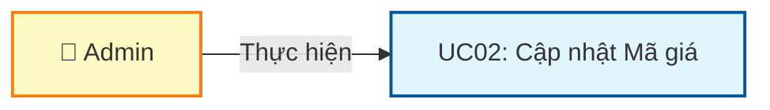
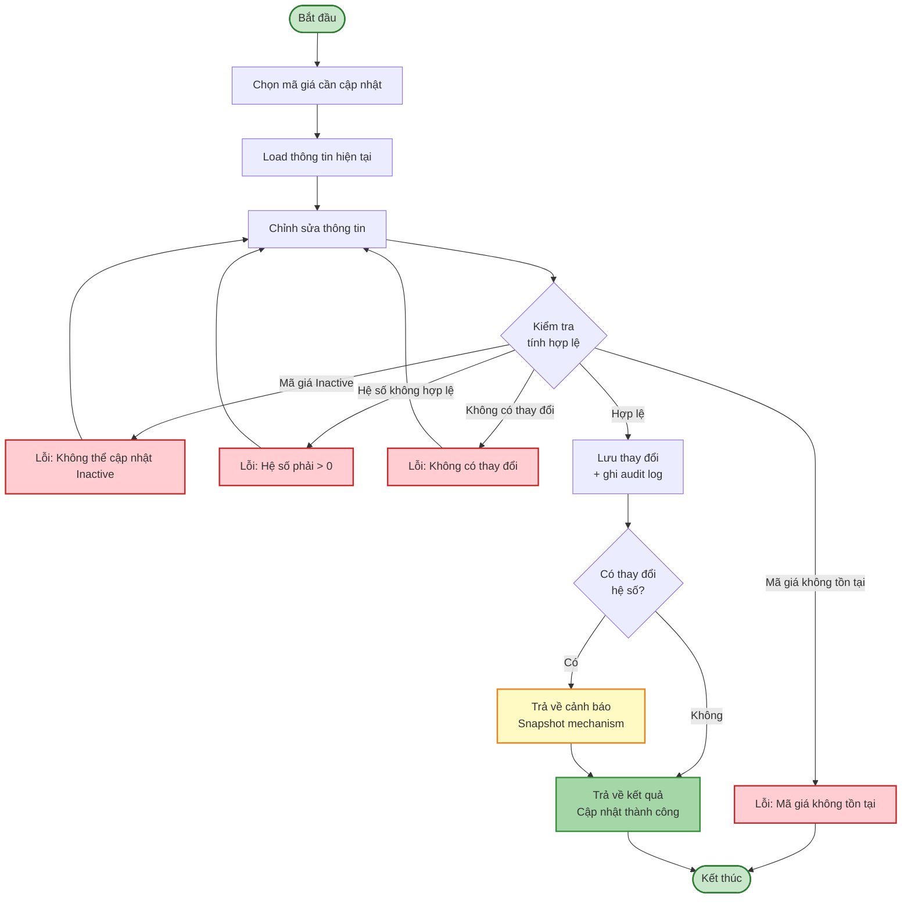
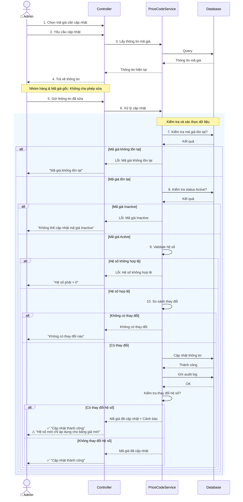
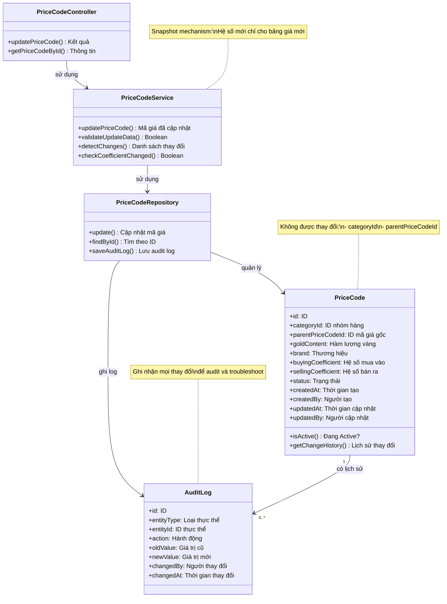

# Use Case UC-MAGIA-02: Cập nhật Mã giá

---

| **Use Case ID** | **UC-MAGIA-02** |
|-----------------|-----------------||
| **Use Case Name** | Cập nhật Mã giá |
| **Description** | Use Case "Cập nhật Mã giá" cho phép Admin cập nhật thông tin và hệ số của mã giá đã tồn tại. Lưu ý: Thay đổi hệ số chỉ áp dụng cho bảng giá mới, không ảnh hưởng đến bảng giá đã Active. |
| **Actor(s)** | Admin |
| **Priority** | Must Have |
| **Trigger** | Admin chọn chức năng "Cập nhật mã giá" từ danh sách hoặc chi tiết mã giá |

---

## Input

| Tên trường | Loại | Bắt buộc | Mô tả | Ràng buộc |
|------------|------|----------|-------|-----------|
| `priceCodeId` | Số | Có | ID mã giá cần cập nhật | Mã giá phải tồn tại |
| `goldContent` | Văn bản | Không | Hàm lượng vàng | Max 20 ký tự, có thể NULL |
| `brand` | Văn bản | Không | Thương hiệu | Max 50 ký tự, có thể NULL |
| `buyingCoefficient` | Số thập phân | Không | Hệ số mua vào | > 0 nếu có thay đổi |
| `sellingCoefficient` | Số thập phân | Không | Hệ số bán ra | > 0 nếu có thay đổi |

**Lưu ý:**
- **Không được phép thay đổi**: Nhóm hàng (`categoryId`) và mã giá gốc kế thừa (`parentPriceCodeId`)
- **Snapshot mechanism**: Thay đổi hệ số mua/bán chỉ áp dụng cho bảng giá được tạo sau thời điểm cập nhật

---

## Output

### Trường hợp thành công:

| Tên trường | Loại | Mô tả |
|------------|------|-------|
| `id` | Số | ID mã giá đã cập nhật |
| `category` | Thông tin | Thông tin nhóm hàng (không đổi) |
| `parentPriceCode` | Thông tin | Thông tin mã giá gốc (không đổi) |
| `inheritanceChain` | Văn bản | Chuỗi kế thừa (không đổi) |
| `goldContent` | Văn bản | Hàm lượng vàng (giá trị mới) |
| `brand` | Văn bản | Thương hiệu (giá trị mới) |
| `buyingCoefficient` | Số thập phân | Hệ số mua vào (giá trị mới) |
| `sellingCoefficient` | Số thập phân | Hệ số bán ra (giá trị mới) |
| `status` | Văn bản | Trạng thái hiện tại |
| `updatedAt` | Ngày giờ | Thời gian cập nhật |
| `updatedBy` | Văn bản | Người cập nhật |

### Trường hợp lỗi:

| Mã lỗi | Thông báo | Mô tả |
|--------|-----------|-------|
| `PRICE_CODE_NOT_FOUND` | "Mã giá không tồn tại" | Không tìm thấy mã giá |
| `PRICE_CODE_INACTIVE` | "Không thể cập nhật mã giá đã bị vô hiệu hóa" | Mã giá có status = Inactive |
| `INVALID_COEFFICIENT` | "Hệ số phải lớn hơn 0" | Hệ số mua/bán không hợp lệ |
| `NO_CHANGES_DETECTED` | "Không có thay đổi nào" | Không có trường nào được thay đổi |

---

## Pre-Condition(s)

- Mã giá đã tồn tại trong hệ thống
- Mã giá có trạng thái Active
- Admin đã đăng nhập và có quyền cập nhật mã giá

---

## Post-Condition(s)

- Mã giá được cập nhật thành công với thông tin mới
- Hệ thống ghi nhận thông tin người cập nhật và thời gian cập nhật
- Các bảng giá đã Active không bị ảnh hưởng (snapshot mechanism)
- Các bảng giá mới sẽ sử dụng hệ số mới

---

## Basic Flow

1. Admin chọn mã giá cần cập nhật (từ danh sách hoặc chi tiết)
2. Admin yêu cầu cập nhật
3. Hệ thống trả về thông tin hiện tại:
   - **Nhóm hàng** (không cho phép sửa)
   - **Mã giá gốc** (không cho phép sửa)
   - Hàm lượng vàng (có thể sửa, max 20 ký tự)
   - Thương hiệu (có thể sửa, max 50 ký tự)
   - Hệ số mua vào (có thể sửa, > 0)
   - Hệ số bán ra (có thể sửa, > 0)
   - **Trạng thái**: Active
4. Admin chỉnh sửa thông tin cần thiết và gửi yêu cầu lưu
5. Hệ thống kiểm tra tính hợp lệ của dữ liệu:
   - Mã giá tồn tại và đang Active
   - Hệ số mua vào > 0 (nếu có thay đổi)
   - Hệ số bán ra > 0 (nếu có thay đổi)
   - Có ít nhất một trường được thay đổi
6. Hệ thống lưu thông tin mới và ghi nhận người cập nhật, thời gian cập nhật
7. Hệ thống trả về kết quả thành công với thông tin:
   - Các trường đã được thay đổi
   - Thời gian cập nhật và Người cập nhật
   - **Cảnh báo** (nếu có thay đổi hệ số): "Hệ số mới chỉ áp dụng cho bảng giá được tầo sau [Thời gian cập nhật]"

Use case kết thúc.

---

## Alternative Flow

*Không có luồng thay thế*

---

## Exception Flow

### 5a. Mã giá không tồn tại

5a. Hệ thống phát hiện mã giá không tồn tại trong hệ thống

5a1. Hệ thống trả về lỗi: "Mã giá không tồn tại hoặc đã bị xóa."

5a2. Use case kết thúc

### 5b. Mã giá đã bị vô hiệu hóa

5b. Hệ thống phát hiện mã giá có trạng thái Inactive

5b1. Hệ thống trả về lỗi: "Không thể cập nhật mã giá đã bị vô hiệu hóa. Vui lòng kích hoạt lại mã giá trước khi cập nhật."

5b2. Use case quay lại bước 4

### 5c. Hệ số không hợp lệ

5c. Hệ thống phát hiện hệ số mua vào hoặc hệ số bán ra <= 0

5c1. Hệ thống trả về lỗi: "Hệ số mua vào và hệ số bán ra phải lớn hơn 0."

5c2. Use case quay lại bước 4

### 5d. Không có thay đổi nào

5d. Hệ thống phát hiện không có trường nào được thay đổi

5d1. Hệ thống trả về: "Không có thay đổi nào được phát hiện."

5d2. Use case quay lại bước 4

---

## Business Rules

### BR-MAGIA-008: Không được thay đổi nhóm hàng

- Sau khi mã giá được tạo, **không được phép thay đổi nhóm hàng** (`categoryId`)
- Lý do: Mỗi nhóm hàng chỉ có một mã giá, việc thay đổi nhóm hàng sẽ gây xung đột
- Nếu cần thay đổi nhóm hàng: Vô hiệu hóa mã giá hiện tại và tạo mã giá mới cho nhóm hàng mới

### BR-MAGIA-009: Không được thay đổi quan hệ kế thừa

- Sau khi mã giá được tạo, **không được phép thay đổi mã giá gốc kế thừa** (`parentPriceCodeId`)
- Lý do: Thay đổi quan hệ kế thừa sẽ làm thay đổi cấu trúc chuỗi kế thừa, có thể tạo vòng lặp
- Nếu cần thay đổi quan hệ kế thừa: Tạo mã giá mới với quan hệ kế thừa mong muốn

### BR-MAGIA-010: Snapshot Mechanism - Hệ số không ảnh hưởng bảng giá cũ

Khi Admin thay đổi hệ số mua vào hoặc hệ số bán ra:
- **Không ảnh hưởng** đến các bảng giá đã có trạng thái Active
- **Chỉ áp dụng** cho các bảng giá được tạo sau thời điểm cập nhật
- Mục đích: Đảm bảo tính ổn định của giá đã công bố

**Ví dụ:**
```
Thời điểm T1:
- Mã giá PC-001: Hệ số bán ra = 1.035
- Bảng giá BG-001 (Active): Sử dụng hệ số 1.035

Thời điểm T2: Admin cập nhật
- Mã giá PC-001: Hệ số bán ra = 1.050

Kết quả:
- Bảng giá BG-001: Vẫn giữ hệ số 1.035 (không đổi)
- Bảng giá BG-002 (tạo sau T2): Sử dụng hệ số 1.050
```

### BR-MAGIA-011: Chỉ cập nhật mã giá Active

- Chỉ được phép cập nhật mã giá có trạng thái **Active**
- Mã giá Inactive không được phép cập nhật
- Nếu cần cập nhật mã giá Inactive: Phải kích hoạt lại (Active) trước

### BR-MAGIA-012: Xác thực hệ số

- Hệ số mua vào phải > 0
- Hệ số bán ra phải > 0
- Các trường văn bản (goldContent, brand) tối đa theo ràng buộc

### BR-MAGIA-013: Audit log

- Hệ thống ghi nhận đầy đủ thông tin cập nhật:
  - Người cập nhật (`updatedBy`)
  - Thời gian cập nhật (`updatedAt`)
  - Các trường đã thay đổi (old value → new value)
- Mục đích: Theo dõi lịch sử thay đổi, hỗ trợ audit và troubleshooting

---

## Diagrams

### 1. Use Case Diagram - UC02: Cập nhật Mã giá



### 2. Activity Diagram - Luồng cập nhật Mã giá



### 3. Sequence Diagram - Cập nhật Mã giá



**Giải thích Sequence Diagram:**

Diagram tập trung vào **business logic** và **luồng xử lý nghiệp vụ**:

**Xử lý nghiệp vụ (Bước 1-10):**
- Admin chọn mã giá và cung cấp thông tin sửa đổi
- Hệ thống kiểm tra tuần tự:
  1. **Mã giá tồn tại** trong hệ thống
  2. **Mã giá đang Active** (không phải Inactive)
  3. **Hệ số hợp lệ** (> 0)
  4. **Có thay đổi** (so sánh với giá trị cũ)

**Xử lý đặc biệt:**
- Nếu có thay đổi hệ số → Hiển thị cảnh báo về snapshot mechanism
- Ghi audit log đầy đủ các thay đổi

**Xử lý lỗi:**
- Mỗi bước kiểm tra có 2 nhánh: Hợp lệ (tiếp tục) hoặc Lỗi (thông báo và dừng)

---

### 4. Class Diagram


