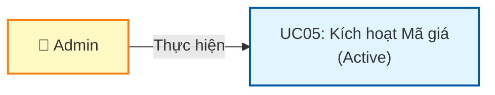
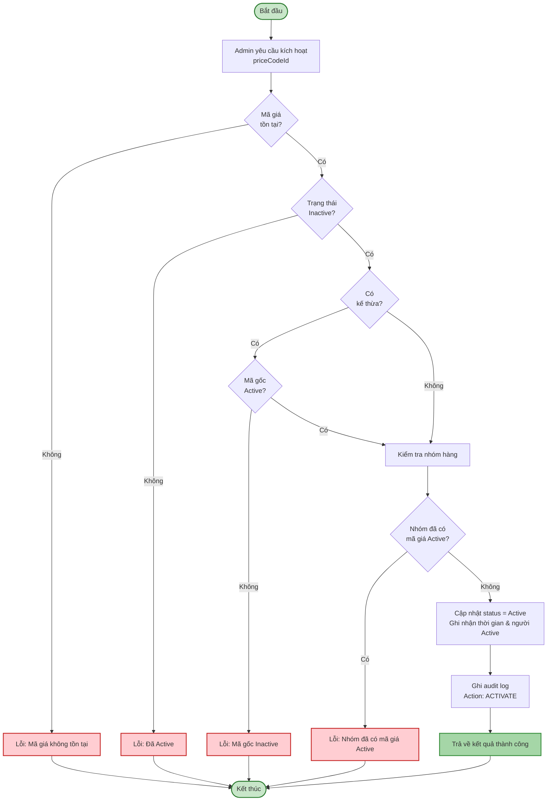
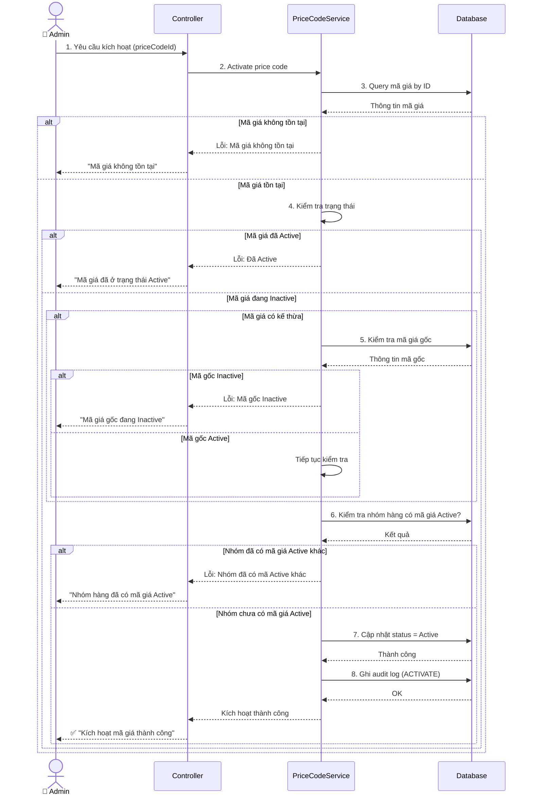
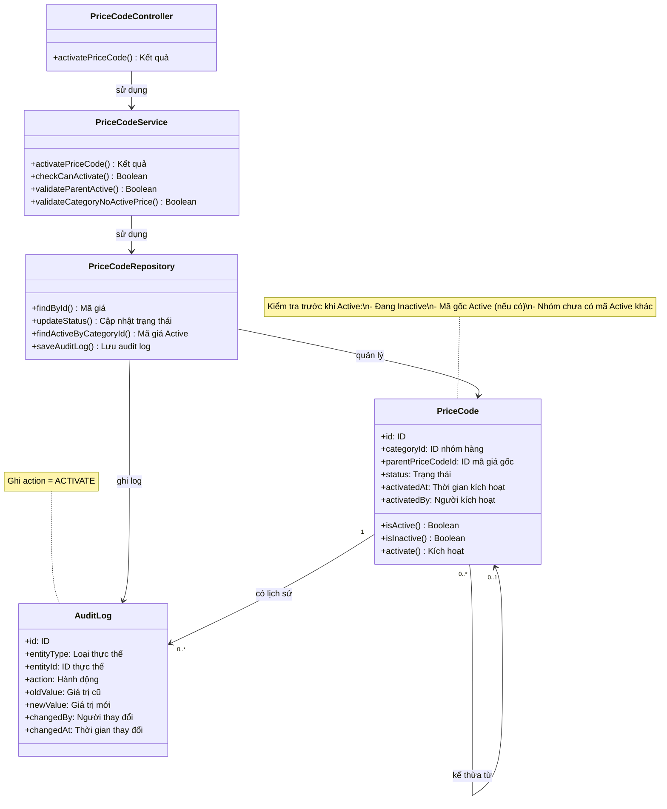

# Use Case UC-MAGIA-05: Kích hoạt Mã giá (Active)

---

| **Use Case ID** | **UC-MAGIA-05** |
|-----------------|-----------------||
| **Use Case Name** | Kích hoạt Mã giá (Active) |
| **Description** | Use Case "Kích hoạt Mã giá" cho phép Admin kích hoạt lại mã giá đã bị vô hiệu hóa (Inactive) để có thể sử dụng trong hệ thống. |
| **Actor(s)** | Admin |
| **Priority** | Must Have |
| **Trigger** | Admin yêu cầu kích hoạt lại một Mã giá đang Inactive |

---

## Input

| Tên trường | Loại | Bắt buộc | Mô tả | Ràng buộc |
|------------|------|----------|-------|-----------|
| `priceCodeId` | Số | Có | ID mã giá cần kích hoạt | Mã giá phải tồn tại và đang Inactive |

---

## Output

### Trường hợp thành công:

| Tên trường | Loại | Mô tả |
|------------|------|-------|
| `id` | Số | ID mã giá đã kích hoạt |
| `status` | Văn bản | Trạng thái mới = "Active" |
| `activatedAt` | Ngày giờ | Thời gian kích hoạt |
| `activatedBy` | Văn bản | Người kích hoạt |
| `message` | Văn bản | "Kích hoạt mã giá thành công" |

### Trường hợp lỗi:

| Mã lỗi | Thông báo | Mô tả |
|--------|-----------|-------|
| `PRICE_CODE_NOT_FOUND` | "Mã giá không tồn tại" | Không tìm thấy mã giá |
| `ALREADY_ACTIVE` | "Mã giá đã ở trạng thái Active" | Mã giá đang Active |
| `PARENT_INACTIVE` | "Không thể kích hoạt. Mã giá gốc đang Inactive" | Mã giá kế thừa từ mã giá Inactive |
| `CATEGORY_HAS_ACTIVE_PRICE_CODE` | "Nhóm hàng đã có mã giá Active khác" | Nhóm hàng đã có mã giá Active |

---

## Pre-Condition(s)

- Mã giá đã tồn tại trong hệ thống
- Mã giá đang có trạng thái Inactive
- Admin đã đăng nhập và có quyền kích hoạt mã giá
- (Nếu mã giá có kế thừa) Mã giá gốc phải đang Active

---

## Post-Condition(s)

- Mã giá chuyển sang trạng thái Active
- Mã giá có thể được sử dụng trong hệ thống
- Hệ thống ghi nhận thông tin người kích hoạt và thời gian kích hoạt
- Audit log ghi nhận hành động ACTIVATE

---

## Basic Flow

1. Admin yêu cầu kích hoạt một mã giá đang Inactive
2. Hệ thống kiểm tra tính hợp lệ:
   - Mã giá tồn tại
   - Mã giá đang Inactive
   - (Nếu có kế thừa) Mã giá gốc đang Active
   - Nhóm hàng chưa có mã giá Active khác
3. Hệ thống cập nhật:
   - Chuyển status từ Inactive → Active
   - Ghi nhận thời gian kích hoạt (activatedAt)
   - Ghi nhận người kích hoạt (activatedBy)
4. Hệ thống ghi audit log với action = ACTIVATE
5. Hệ thống trả về kết quả thành công

Use case kết thúc.

---

## Alternative Flow

*Không có luồng thay thế*

---

## Exception Flow

### 2a. Mã giá không tồn tại

2a. Hệ thống không tìm thấy mã giá với ID được cung cấp

2a1. Hệ thống trả về lỗi: "Mã giá không tồn tại hoặc đã bị xóa."

2a2. Use case kết thúc

### 2b. Mã giá đã ở trạng thái Active

2b. Hệ thống phát hiện mã giá đang ở trạng thái Active

2b1. Hệ thống trả về lỗi: "Mã giá đã ở trạng thái Active. Không cần kích hoạt lại."

2b2. Use case kết thúc

### 2c. Mã giá gốc đang Inactive

*(Chỉ xảy ra với mã giá có kế thừa)*

2c. Hệ thống phát hiện mã giá gốc (parent) đang Inactive

2c1. Hệ thống trả về lỗi: "Không thể kích hoạt mã giá này. Mã giá gốc '[Tên mã giá gốc]' đang Inactive. Vui lòng kích hoạt mã giá gốc trước."

2c2. Use case kết thúc

### 2d. Nhóm hàng đã có mã giá Active khác

2d. Hệ thống phát hiện nhóm hàng của mã giá này đã có mã giá Active khác

2d1. Hệ thống trả về lỗi: "Không thể kích hoạt. Nhóm hàng '[Tên nhóm]' đã có mã giá Active '[Mã giá khác]'. Vui lòng vô hiệu hóa mã giá đó trước."

2d2. Use case kết thúc

---

## Business Rules

### BR-MAGIA-027: Chỉ Admin được kích hoạt

- Chỉ Admin mới có quyền kích hoạt mã giá
- Nhân viên không có quyền này
- Lý do: Tránh thay đổi không kiểm soát ảnh hưởng đến toàn hệ thống

### BR-MAGIA-028: Chỉ kích hoạt mã giá Inactive

- Chỉ có thể kích hoạt mã giá đang ở trạng thái **Inactive**
- Nếu mã giá đã Active → Từ chối thao tác
- Mục đích: Tránh thao tác không cần thiết

### BR-MAGIA-029: Kiểm tra mã giá gốc (Parent)

Đối với mã giá có kế thừa (có parentPriceCodeId):
- **Mã giá gốc phải đang Active** mới được phép kích hoạt
- Nếu mã giá gốc Inactive → Từ chối kích hoạt
- Lý do: Đảm bảo tính toàn vẹn của chuỗi kế thừa

**Ví dụ:**
```
PC-001 (gốc): Inactive
PC-002 (kế thừa từ PC-001): Inactive

→ Không thể Active PC-002 khi PC-001 còn Inactive
→ Phải Active PC-001 trước, sau đó mới Active PC-002
```

### BR-MAGIA-030: Ràng buộc một mã giá Active mỗi nhóm hàng

- Mỗi nhóm hàng chỉ có thể có **duy nhất một mã giá Active** tại một thời điểm
- Trước khi kích hoạt mã giá mới cho nhóm hàng → Phải kiểm tra nhóm hàng đó đã có mã giá Active chưa
- Nếu đã có mã giá Active khác → Từ chối kích hoạt
- Admin phải vô hiệu hóa (Deactive) mã giá cũ trước, sau đó mới kích hoạt mã giá mới

**Ví dụ:**
```
Nhóm hàng: "Nhẫn vàng 24K"
- PC-100: Active
- PC-200: Inactive

→ Không thể Active PC-200 khi PC-100 còn Active
→ Phải Deactive PC-100 trước, sau đó mới Active PC-200
```

### BR-MAGIA-031: Ghi nhận audit log

Mỗi lần kích hoạt mã giá, hệ thống ghi nhận đầy đủ:
- Action: ACTIVATE
- Thời gian kích hoạt (activatedAt)
- Người kích hoạt (activatedBy)
- Trạng thái trước: Inactive
- Trạng thái sau: Active

Mục đích: Theo dõi lịch sử thay đổi trạng thái

### BR-MAGIA-032: Không ảnh hưởng bảng giá

Việc kích hoạt mã giá **không ảnh hưởng** đến các bảng giá đã tồn tại:
- Các bảng giá đã tạo trước khi mã giá bị Deactive → Vẫn giữ nguyên
- Chỉ các bảng giá tạo mới sau khi Active → Mới có thể sử dụng mã giá này

---

## Diagrams

### 1. Use Case Diagram - UC05: Kích hoạt Mã giá



### 2. Activity Diagram - Luồng kích hoạt Mã giá



### 3. Sequence Diagram - Kích hoạt Mã giá



**Giải thích Sequence Diagram:**

**Kiểm tra tồn tại (Bước 1-3):**
- Admin yêu cầu kích hoạt với priceCodeId
- Hệ thống query mã giá từ database
- Nếu không tồn tại → Trả về lỗi

**Kiểm tra trạng thái (Bước 4):**
- Kiểm tra mã giá đang Inactive
- Nếu đã Active → Trả về lỗi

**Kiểm tra mã giá gốc (Bước 5):**
- Nếu mã giá có kế thừa → Kiểm tra mã gốc phải Active
- Nếu mã gốc Inactive → Trả về lỗi

**Kiểm tra nhóm hàng (Bước 6):**
- Kiểm tra nhóm hàng chưa có mã giá Active khác
- Nếu đã có → Trả về lỗi

**Kích hoạt (Bước 7-8):**
- Cập nhật status = Active
- Ghi audit log
- Trả về thành công

---

### 4. Class Diagram


