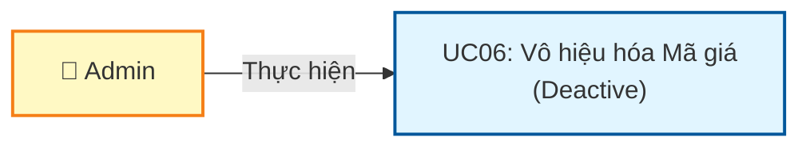
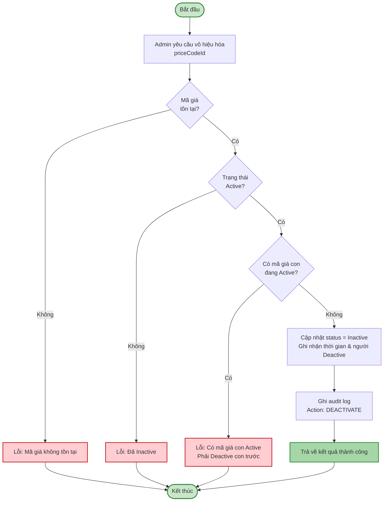
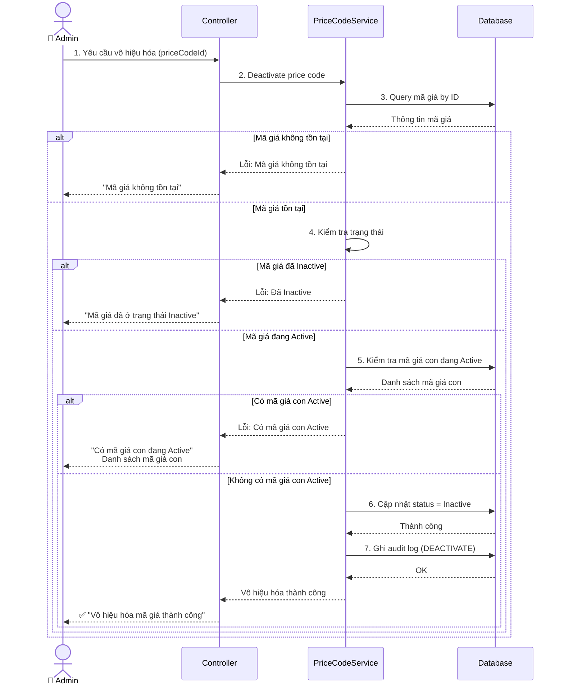
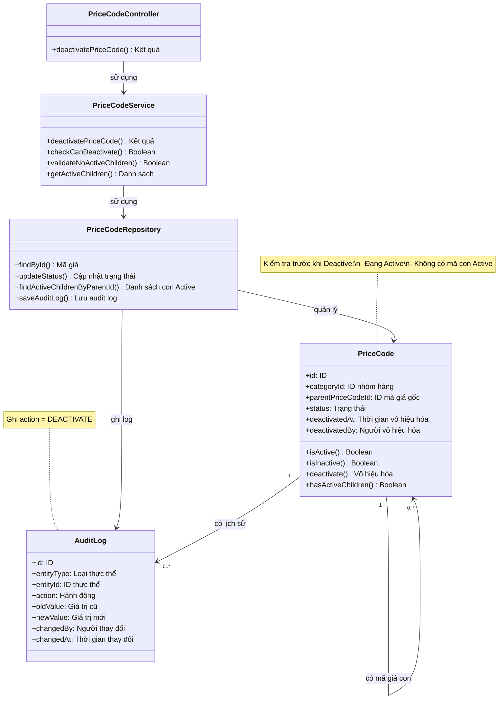

# Use Case UC-MAGIA-06: Vô hiệu hóa Mã giá (Deactive)

---

| **Use Case ID** | **UC-MAGIA-06** |
|-----------------|-----------------||
| **Use Case Name** | Vô hiệu hóa Mã giá (Deactive) |
| **Description** | Use Case "Vô hiệu hóa Mã giá" cho phép Admin vô hiệu hóa mã giá đang Active để ngừng sử dụng trong hệ thống. |
| **Actor(s)** | Admin |
| **Priority** | Must Have |
| **Trigger** | Admin yêu cầu vô hiệu hóa một Mã giá đang Active |

---

## Input

| Tên trường | Loại | Bắt buộc | Mô tả | Ràng buộc |
|------------|------|----------|-------|-----------|
| `priceCodeId` | Số | Có | ID mã giá cần vô hiệu hóa | Mã giá phải tồn tại và đang Active |

---

## Output

### Trường hợp thành công:

| Tên trường | Loại | Mô tả |
|------------|------|-------|
| `id` | Số | ID mã giá đã vô hiệu hóa |
| `status` | Văn bản | Trạng thái mới = "Inactive" |
| `deactivatedAt` | Ngày giờ | Thời gian vô hiệu hóa |
| `deactivatedBy` | Văn bản | Người vô hiệu hóa |
| `message` | Văn bản | "Vô hiệu hóa mã giá thành công" |

### Trường hợp lỗi:

| Mã lỗi | Thông báo | Mô tả |
|--------|-----------|-------|
| `PRICE_CODE_NOT_FOUND` | "Mã giá không tồn tại" | Không tìm thấy mã giá |
| `ALREADY_INACTIVE` | "Mã giá đã ở trạng thái Inactive" | Mã giá đang Inactive |
| `HAS_ACTIVE_CHILDREN` | "Không thể vô hiệu hóa. Có mã giá con đang Active" | Có mã giá kế thừa từ mã giá này đang Active |

---

## Pre-Condition(s)

- Mã giá đã tồn tại trong hệ thống
- Mã giá đang có trạng thái Active
- Admin đã đăng nhập và có quyền vô hiệu hóa mã giá
- Không có mã giá con (child) nào đang Active

---

## Post-Condition(s)

- Mã giá chuyển sang trạng thái Inactive
- Mã giá không thể sử dụng cho bảng giá mới
- Hệ thống ghi nhận thông tin người vô hiệu hóa và thời gian vô hiệu hóa
- Audit log ghi nhận hành động DEACTIVATE
- Các bảng giá đã tồn tại không bị ảnh hưởng

---

## Basic Flow

1. Admin yêu cầu vô hiệu hóa một mã giá đang Active
2. Hệ thống kiểm tra tính hợp lệ:
   - Mã giá tồn tại
   - Mã giá đang Active
   - Không có mã giá con (children) nào đang Active
3. Hệ thống cập nhật:
   - Chuyển status từ Active → Inactive
   - Ghi nhận thời gian vô hiệu hóa (deactivatedAt)
   - Ghi nhận người vô hiệu hóa (deactivatedBy)
4. Hệ thống ghi audit log với action = DEACTIVATE
5. Hệ thống trả về kết quả thành công

Use case kết thúc.

---

## Alternative Flow

*Không có luồng thay thế*

---

## Exception Flow

### 2a. Mã giá không tồn tại

2a. Hệ thống không tìm thấy mã giá với ID được cung cấp

2a1. Hệ thống trả về lỗi: "Mã giá không tồn tại hoặc đã bị xóa."

2a2. Use case kết thúc

### 2b. Mã giá đã ở trạng thái Inactive

2b. Hệ thống phát hiện mã giá đang ở trạng thái Inactive

2b1. Hệ thống trả về lỗi: "Mã giá đã ở trạng thái Inactive. Không cần vô hiệu hóa lại."

2b2. Use case kết thúc

### 2c. Có mã giá con đang Active

2c. Hệ thống phát hiện có mã giá khác đang Active kế thừa từ mã giá này

2c1. Hệ thống lấy danh sách các mã giá con đang Active

2c2. Hệ thống trả về lỗi: "Không thể vô hiệu hóa mã giá này. Có [N] mã giá con đang Active kế thừa từ mã giá này: [Danh sách]. Vui lòng vô hiệu hóa các mã giá con trước."

2c3. Use case kết thúc

---

## Business Rules

### BR-MAGIA-033: Chỉ Admin được vô hiệu hóa

- Chỉ Admin mới có quyền vô hiệu hóa mã giá
- Nhân viên không có quyền này
- Lý do: Tránh thay đổi không kiểm soát ảnh hưởng đến toàn hệ thống

### BR-MAGIA-034: Chỉ vô hiệu hóa mã giá Active

- Chỉ có thể vô hiệu hóa mã giá đang ở trạng thái **Active**
- Nếu mã giá đã Inactive → Từ chối thao tác
- Mục đích: Tránh thao tác không cần thiết

### BR-MAGIA-035: Kiểm tra mã giá con (Children)

Trước khi vô hiệu hóa mã giá:
- **Phải kiểm tra không có mã giá con nào đang Active**
- Nếu có mã giá con Active → Từ chối vô hiệu hóa
- Lý do: Đảm bảo tính toàn vẹn của chuỗi kế thừa

**Quy trình vô hiệu hóa đúng đắn:**
```
PC-001 (gốc): Active
  ├─ PC-002 (con): Active
      └─ PC-003 (cháu): Active

Muốn Deactive PC-001:
1. Deactive PC-003 trước (cháu)
2. Deactive PC-002 sau (con)
3. Deactive PC-001 cuối cùng (gốc)

→ Vô hiệu hóa từ lá (leaf) lên gốc (root)
```

### BR-MAGIA-036: Không ảnh hưởng bảng giá đã tồn tại

Việc vô hiệu hóa mã giá **không ảnh hưởng** đến các bảng giá đã tồn tại:
- Các bảng giá đã Active trước khi mã giá bị Deactive → Vẫn hoạt động bình thường
- Chỉ các bảng giá tạo mới sau khi Deactive → Không thể sử dụng mã giá này

**Ví dụ:**
```
Thời điểm T1:
- Mã giá PC-001: Active
- Bảng giá BG-001 (sử dụng PC-001): Active

Thời điểm T2: Admin Deactive PC-001
- Mã giá PC-001: Inactive
- Bảng giá BG-001: Vẫn Active và hoạt động bình thường

Thời điểm T3: Tạo bảng giá mới
- Không thể chọn PC-001 (đã Inactive)
- Phải chọn mã giá Active khác
```

### BR-MAGIA-037: Ghi nhận audit log

Mỗi lần vô hiệu hóa mã giá, hệ thống ghi nhận đầy đủ:
- Action: DEACTIVATE
- Thời gian vô hiệu hóa (deactivatedAt)
- Người vô hiệu hóa (deactivatedBy)
- Trạng thái trước: Active
- Trạng thái sau: Inactive
- Lý do vô hiệu hóa (optional)

Mục đích: Theo dõi lịch sử thay đổi trạng thái

### BR-MAGIA-038: Có thể kích hoạt lại

- Mã giá đã bị Deactive có thể được kích hoạt lại thông qua UC05
- Dữ liệu mã giá được giữ nguyên, chỉ thay đổi status
- Không xóa mã giá khỏi hệ thống

---

## Diagrams

### 1. Use Case Diagram - UC06: Vô hiệu hóa Mã giá



### 2. Activity Diagram - Luồng vô hiệu hóa Mã giá



### 3. Sequence Diagram - Vô hiệu hóa Mã giá



**Giải thích Sequence Diagram:**

**Kiểm tra tồn tại (Bước 1-3):**
- Admin yêu cầu vô hiệu hóa với priceCodeId
- Hệ thống query mã giá từ database
- Nếu không tồn tại → Trả về lỗi

**Kiểm tra trạng thái (Bước 4):**
- Kiểm tra mã giá đang Active
- Nếu đã Inactive → Trả về lỗi

**Kiểm tra mã giá con (Bước 5):**
- Query các mã giá kế thừa từ mã giá này
- Kiểm tra có mã giá con nào đang Active không
- Nếu có → Trả về lỗi với danh sách mã giá con

**Vô hiệu hóa (Bước 6-7):**
- Cập nhật status = Inactive
- Ghi audit log
- Trả về thành công

---

### 4. Class Diagram

