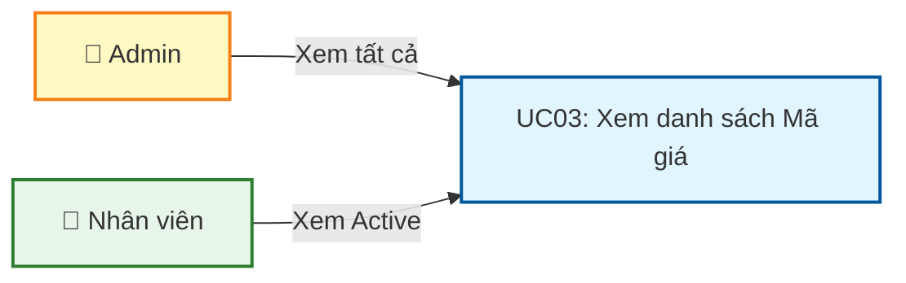
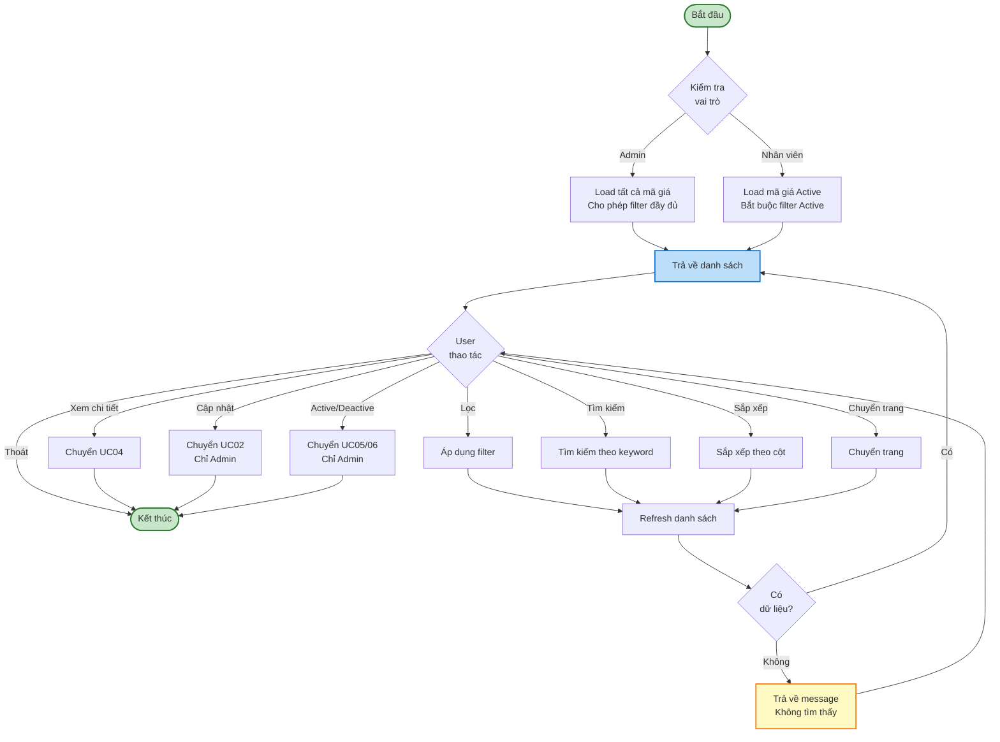
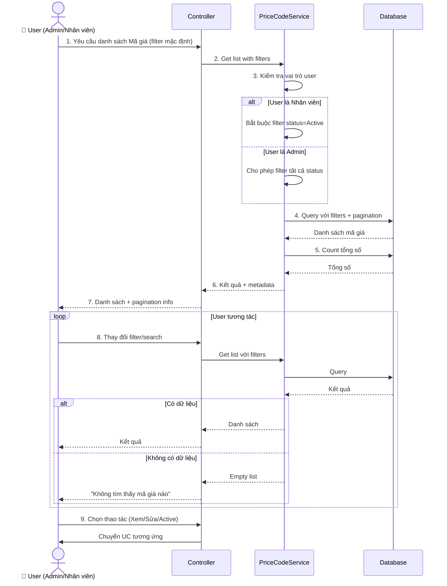

# Use Case UC-3: Xem danh sách Mã giá

---

| **Use Case ID** | **UC-3** |
|-----------------|----------|
| **Use Case Name** | Xem danh sách Mã giá |
| **Description** | Use Case "Xem danh sách Mã giá" cho phép Admin và Nhân viên xem danh sách các mã giá trong hệ thống với khả năng lọc, tìm kiếm và phân trang. |
| **Actor(s)** | Admin, Nhân viên |
| **Priority** | Must Have |
| **Trigger** | User yêu cầu xem danh sách Mã giá |

---

## Input

| Tên trường | Loại | Bắt buộc | Mô tả | Ràng buộc |
|------------|------|----------|-------|-----------|
| `status` | Văn bản | Không | Lọc theo trạng thái | "Active", "Inactive", hoặc "All" (mặc định) |
| `categoryId` | Số | Không | Lọc theo nhóm hàng | ID nhóm hàng hợp lệ |
| `hasParent` | Boolean | Không | Lọc theo loại mã giá | true: Có kế thừa, false: Độc lập, null: Tất cả |
| `searchKeyword` | Văn bản | Không | Tìm kiếm | Tìm theo tên nhóm hàng, hàm lượng, thương hiệu |
| `page` | Số | Không | Trang hiện tại | >= 1, mặc định = 1 |
| `pageSize` | Số | Không | Số bản ghi mỗi trang | 10, 20, 50, 100 (mặc định = 20) |
| `sortBy` | Văn bản | Không | Sắp xếp theo trường | "category", "createdAt", "updatedAt" |
| `sortOrder` | Văn bản | Không | Thứ tự sắp xếp | "asc" hoặc "desc" (mặc định) |

**Lưu ý:**
- **Admin**: Có thể xem tất cả mã giá (Active và Inactive)
- **Nhân viên**: Chỉ xem được mã giá Active

---

## Output

### Trường hợp thành công:

| Tên trường | Loại | Mô tả |
|------------|------|-------|
| `items` | Danh sách | Danh sách mã giá theo điều kiện lọc |
| `totalItems` | Số | Tổng số mã giá |
| `totalPages` | Số | Tổng số trang |
| `currentPage` | Số | Trang hiện tại |
| `pageSize` | Số | Số bản ghi mỗi trang |

**Cấu trúc mỗi item trong danh sách:**

| Tên trường | Loại | Mô tả |
|------------|------|-------|
| `id` | Số | ID mã giá |
| `categoryCode` | Văn bản | Mã nhóm hàng |
| `categoryName` | Văn bản | Tên nhóm hàng |
| `parentPriceCode` | Văn bản | Mã giá gốc (nếu có kế thừa) |
| `goldContent` | Văn bản | Hàm lượng vàng |
| `brand` | Văn bản | Thương hiệu |
| `buyingCoefficient` | Số thập phân | Hệ số mua vào |
| `sellingCoefficient` | Số thập phân | Hệ số bán ra |
| `status` | Văn bản | Trạng thái: "Active" hoặc "Inactive" |
| `createdAt` | Ngày giờ | Thời gian tạo |
| `updatedAt` | Ngày giờ | Thời gian cập nhật lần cuối |

### Trường hợp không có dữ liệu:

| Tên trường | Loại | Mô tả |
|------------|------|-------|
| `items` | Danh sách | Danh sách rỗng [] |
| `totalItems` | Số | 0 |
| `message` | Văn bản | "Không tìm thấy mã giá nào" |

---

## Pre-Condition(s)

- User đã đăng nhập vào hệ thống
- **Admin**: Có quyền xem tất cả mã giá
- **Nhân viên**: Có quyền xem mã giá Active

---

## Post-Condition(s)

- Danh sách mã giá được hiển thị theo điều kiện lọc
- Trạng thái filter và search được lưu trong session (để quay lại giữ nguyên)
- Hệ thống ghi nhận lịch sử truy cập (optional - cho audit)

---

## Basic Flow

1. User yêu cầu xem danh sách Mã giá
2. Hệ thống trả về danh sách mã giá với các thông tin:
   - Danh sách mã giá theo điều kiện lọc
   - Thông tin phân trang (tổng số, trang hiện tại)
   - Các trường dữ liệu: Nhóm hàng, Mã giá gốc, Hàm lượng, Thương hiệu, Hệ số mua/bán, Trạng thái
3. User có thể:
   - **Lọc** theo trạng thái, nhóm hàng, loại mã giá
   - **Tìm kiếm** theo từ khóa
   - **Sắp xếp** theo các trường
   - **Chuyển trang**
   - **Thay đổi số bản ghi mỗi trang** (10, 20, 50, 100)
4. Khi User thay đổi bộ lọc hoặc tìm kiếm:
   - Hệ thống áp dụng điều kiện mới
   - Hệ thống trả về danh sách mã giá phù hợp
   - Cập nhật thông tin phân trang
5. User có thể chọn các thao tác trên từng mã giá:
   - **Xem chi tiết** → Chuyển sang UC04
   - **Cập nhật** → Chuyển sang UC02 (chỉ Admin)
   - **Active/Deactive** → Chuyển sang UC05/UC06 (chỉ Admin)

Use case tiếp tục (không kết thúc cho đến khi User kết thúc phiên làm việc).

---

## Alternative Flow

### 2a. Nhân viên chỉ xem được mã giá Active

2a. Nếu User là Nhân viên (không phải Admin)

2a1. Hệ thống tự động:
- Bắt buộc lọc trạng thái Active
- Không cho phép thao tác Active/Deactive
- Không cho phép thao tác Cập nhật

2a2. Nhân viên chỉ có thể:
- Xem danh sách mã giá Active
- Lọc theo nhóm hàng, loại mã giá
- Tìm kiếm
- Xem chi tiết

Use case quay lại bước 3

---

## Exception Flow

### 4a. Không tìm thấy mã giá nào

4a. Hệ thống không tìm thấy mã giá nào phù hợp với điều kiện lọc

4a1. Hệ thống trả về:
- Danh sách rỗng
- Message: "Không tìm thấy mã giá nào phù hợp với điều kiện lọc"

4a2. User có thể:
- Thay đổi điều kiện lọc
- Xóa bộ lọc (Reset)
- Kết thúc

### 4b. Lỗi kết nối hoặc server

4b. Hệ thống gặp lỗi khi tải dữ liệu

4b1. Hệ thống trả về thông báo lỗi: "Không thể tải danh sách mã giá. Vui lòng thử lại."

4b2. User có thể thử lại

4b3. Nếu User thử lại → Hệ thống thực hiện lại request

---

## Business Rules

### BR-UC03-001: Phân quyền xem danh sách

**Admin:**
- Xem được tất cả mã giá (Active và Inactive)
- Có thể lọc theo trạng thái
- Có thể thực hiện các thao tác: Xem, Cập nhật, Active, Deactive

**Nhân viên:**
- Chỉ xem được mã giá Active
- Không có filter trạng thái
- Chỉ có thể Xem chi tiết (không sửa, không đổi trạng thái)

### BR-UC03-002: Mặc định

Khi lần đầu thực hiện:
- Trả về tất cả mã giá Active (Admin) hoặc chỉ Active (Nhân viên)
- Sắp xếp theo thời gian tạo mới nhất (createdAt DESC)
- 20 bản ghi mỗi trang
- Trang đầu tiên (page = 1)

### BR-UC03-003: Tìm kiếm

Tìm kiếm theo từ khóa (case-insensitive) trong các trường:
- Mã nhóm hàng (`categoryCode`)
- Tên nhóm hàng (`categoryName`)
- Hàm lượng vàng (`goldContent`)
- Thương hiệu (`brand`)

**Ví dụ:**
```
Từ khóa: "9999"
→ Tìm thấy:
  - Nhóm hàng: "NH-9999-001"
  - Hàm lượng: "99.99%"
```

### BR-UC03-004: Lọc kết hợp

User có thể lọc đồng thời nhiều điều kiện:
- Trạng thái = Active
- Nhóm hàng = "Nhẫn vàng"
- Loại = "Kế thừa"
- Tìm kiếm = "SJC"

→ Hệ thống áp dụng **AND** cho tất cả điều kiện

### BR-UC03-005: Phân trang

- Mặc định: 20 bản ghi/trang
- Các lựa chọn: 10, 20, 50, 100
- Nếu tổng số < pageSize → Trả về tất cả trong 1 trang
- Khi thay đổi pageSize → Quay về trang 1

### BR-UC03-006: Sắp xếp

**Các trường có thể sắp xếp:**
- Nhóm hàng (categoryName): A-Z hoặc Z-A
- Thời gian tạo (createdAt): Mới nhất hoặc Cũ nhất
- Thời gian cập nhật (updatedAt): Mới nhất hoặc Cũ nhất

**Mặc định:** Sắp xếp theo `createdAt DESC` (mới nhất lên đầu)

### BR-UC03-007: Lưu trạng thái filter

Hệ thống lưu trạng thái filter/search trong session của user:
- Khi User chuyển sang UC04 (Xem chi tiết) rồi quay lại → Giữ nguyên filter
- Khi User kết thúc phiên làm việc → Xóa filter (reset về mặc định)

Mục đích: User không phải lọc lại nhiều lần

---

## Diagrams

### 1. Use Case Diagram - UC03: Xem danh sách Mã giá



### 2. Activity Diagram - Luồng xem danh sách Mã giá



### 3. Sequence Diagram - Xem danh sách Mã giá



**Giải thích Sequence Diagram:**

**Khởi tạo (Bước 1-7):**
- Kiểm tra vai trò user (Admin/Nhân viên)
- Load danh sách với filter mặc định
- Nhân viên: Bắt buộc lọc Active
- Admin: Cho phép lọc tất cả

**Loop tương tác (Bước 8):**
- User thay đổi filter, search, sort, pagination
- Hệ thống query lại database
- Trả về kết quả hoặc message "Không tìm thấy"

**Chuyển UC (Bước 9):**
- User chọn thao tác → Chuyển sang UC tương ứng
- Lưu trạng thái filter để quay lại
