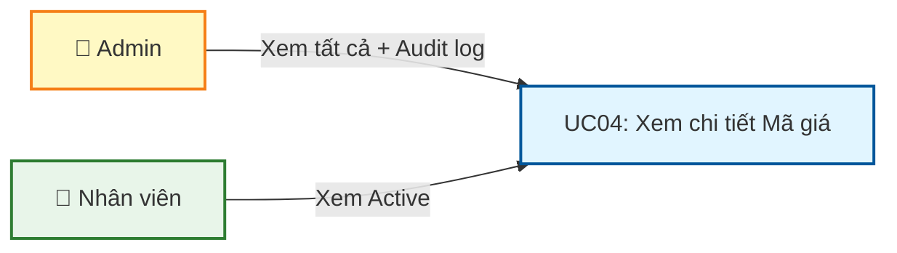
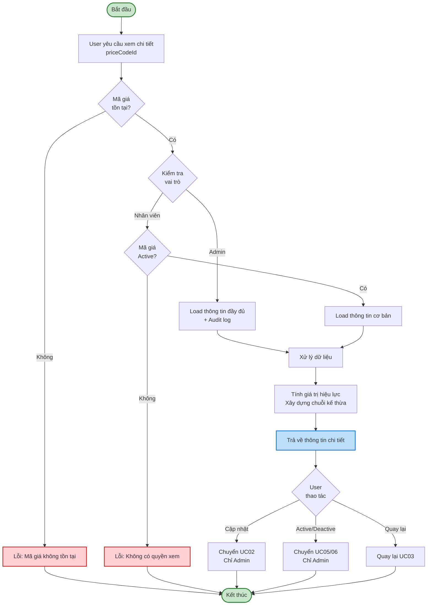
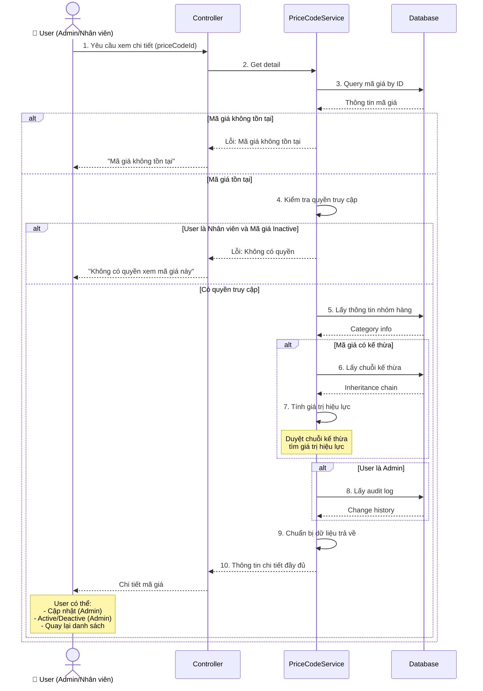
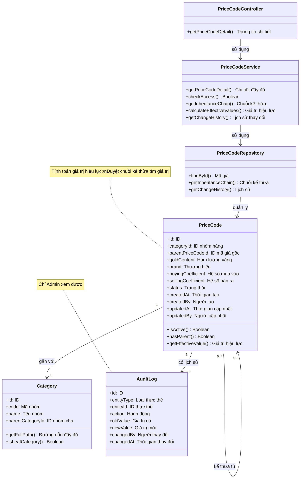

# Use Case UC-4: Xem chi tiết Mã giá

---

| **Use Case ID** | **UC-4** |
|-----------------|----------|
| **Use Case Name** | Xem chi tiết Mã giá |
| **Description** | Use Case "Xem chi tiết Mã giá" cho phép Admin và Nhân viên xem thông tin đầy đủ của một mã giá, bao gồm chuỗi kế thừa và lịch sử thay đổi. |
| **Actor(s)** | Admin, Nhân viên |
| **Priority** | Must Have |
| **Trigger** | User yêu cầu xem chi tiết một Mã giá cụ thể |

---

## Input

| Tên trường | Loại | Bắt buộc | Mô tả | Ràng buộc |
|------------|------|----------|-------|-----------|
| `priceCodeId` | Số | Có | ID mã giá cần xem | Mã giá phải tồn tại |

**Lưu ý:**
- **Admin**: Có thể xem chi tiết tất cả mã giá (Active và Inactive)
- **Nhân viên**: Chỉ xem được chi tiết mã giá Active

---

## Output

### Trường hợp thành công:

**Thông tin cơ bản:**

| Tên trường | Loại | Mô tả |
|------------|------|-------|
| `id` | Số | ID mã giá |
| `category` | Thông tin | Thông tin nhóm hàng (id, code, name, path) |
| `parentPriceCode` | Thông tin | Thông tin mã giá gốc (nếu có kế thừa) |
| `inheritanceChain` | Văn bản | Chuỗi kế thừa đầy đủ (VD: "PC-C ← PC-B ← PC-A") |
| `inheritanceLevel` | Số | Cấp độ kế thừa (0: độc lập, 1+: kế thừa) |
| `goldContent` | Văn bản | Hàm lượng vàng |
| `brand` | Văn bản | Thương hiệu |
| `buyingCoefficient` | Số thập phân | Hệ số mua vào |
| `sellingCoefficient` | Số thập phân | Hệ số bán ra |
| `status` | Văn bản | Trạng thái: "Active" hoặc "Inactive" |
| `createdAt` | Ngày giờ | Thời gian tạo |
| `createdBy` | Văn bản | Người tạo |
| `updatedAt` | Ngày giờ | Thời gian cập nhật lần cuối |
| `updatedBy` | Văn bản | Người cập nhật lần cuối |

**Thông tin kế thừa (nếu có):**

| Tên trường | Loại | Mô tả |
|------------|------|-------|
| `effectiveGoldContent` | Văn bản | Hàm lượng vàng hiệu lực (kế thừa hoặc ghi đè) |
| `effectiveBrand` | Văn bản | Thương hiệu hiệu lực |
| `effectiveBuyingCoefficient` | Số thập phân | Hệ số mua vào hiệu lực |
| `effectiveSellingCoefficient` | Số thập phân | Hệ số bán ra hiệu lực |
| `inheritedFrom` | Thông tin | Thông tin các trường được kế thừa từ đâu |

**Lịch sử thay đổi (chỉ Admin):**

| Tên trường | Loại | Mô tả |
|------------|------|-------|
| `changeHistory` | Danh sách | Lịch sử các lần thay đổi |
| `changeHistory[].changedAt` | Ngày giờ | Thời gian thay đổi |
| `changeHistory[].changedBy` | Văn bản | Người thay đổi |
| `changeHistory[].action` | Văn bản | Hành động: CREATE, UPDATE, ACTIVATE, DEACTIVATE |
| `changeHistory[].changes` | Danh sách | Danh sách các trường đã thay đổi |

### Trường hợp lỗi:

| Mã lỗi | Thông báo | Mô tả |
|--------|-----------|-------|
| `PRICE_CODE_NOT_FOUND` | "Mã giá không tồn tại" | Không tìm thấy mã giá |
| `ACCESS_DENIED` | "Không có quyền xem mã giá này" | Nhân viên cố xem mã giá Inactive |

---

## Pre-Condition(s)

- Mã giá đã tồn tại trong hệ thống
- User đã đăng nhập
- **Admin**: Có quyền xem tất cả mã giá
- **Nhân viên**: Có quyền xem mã giá Active

---

## Post-Condition(s)

- Thông tin chi tiết mã giá được trả về
- Hệ thống ghi nhận lịch sử truy cập (optional - cho audit)
- Không có thay đổi dữ liệu (read-only operation)

---

## Basic Flow

1. User yêu cầu xem chi tiết một mã giá cụ thể (từ danh sách hoặc tìm kiếm)
2. Hệ thống kiểm tra quyền truy cập:
   - Admin: Cho phép xem tất cả
   - Nhân viên: Chỉ cho phép xem mã giá Active
3. Hệ thống lấy thông tin chi tiết mã giá:
   - Thông tin cơ bản của mã giá
   - Thông tin nhóm hàng (code, name, path đầy đủ)
   - Chuỗi kế thừa (nếu có)
   - Tính toán các giá trị hiệu lực (effective values)
4. Nếu User là Admin:
   - Hệ thống lấy thêm lịch sử thay đổi (audit log)
5. Hệ thống trả về thông tin chi tiết đầy đủ:
   - Thông tin cơ bản
   - Chuỗi kế thừa và giá trị hiệu lực
   - (Admin only) Lịch sử thay đổi
6. User có thể thực hiện các thao tác:
   - **Cập nhật** → Chuyển sang UC02 (chỉ Admin, chỉ khi Active)
   - **Active/Deactive** → Chuyển sang UC05/UC06 (chỉ Admin)
   - **Quay lại danh sách** → Quay lại UC03

Use case kết thúc.

---

## Alternative Flow

*Không có luồng thay thế*

---

## Exception Flow

### 2a. Mã giá không tồn tại

2a. Hệ thống không tìm thấy mã giá với ID được cung cấp

2a1. Hệ thống trả về lỗi: "Mã giá không tồn tại hoặc đã bị xóa."

2a2. Use case kết thúc

### 2b. Nhân viên cố xem mã giá Inactive

2b. Nhân viên cố gắng xem chi tiết mã giá có trạng thái Inactive

2b1. Hệ thống trả về lỗi: "Không có quyền xem mã giá này."

2b2. Use case kết thúc

---

## Business Rules

### BR-UC04-001: Phân quyền xem chi tiết

**Admin:**
- Xem được chi tiết tất cả mã giá (Active và Inactive)
- Xem được lịch sử thay đổi (audit log)
- Có thể thực hiện thao tác: Cập nhật, Active, Deactive

**Nhân viên:**
- Chỉ xem được chi tiết mã giá Active
- Không xem được lịch sử thay đổi
- Chỉ có thể Quay lại danh sách (không sửa, không đổi trạng thái)

### BR-UC04-002: Hiển thị chuỗi kế thừa

Đối với mã giá có kế thừa:
- Hiển thị chuỗi kế thừa đầy đủ theo format: `PC-C ← PC-B ← PC-A`
- Hiển thị cấp độ kế thừa (inheritance level)
- Link tới từng mã giá trong chuỗi (để user có thể xem chi tiết mã giá cha)

**Ví dụ:**
```
Mã giá: PC-003 (Dây chuyền SJC)
Chuỗi kế thừa: PC-003 ← PC-002 ← PC-001
  - PC-001: Mã giá gốc (Nhẫn vàng cơ bản)
  - PC-002: Kế thừa từ PC-001 (Nhẫn vàng SJC)
  - PC-003: Kế thừa từ PC-002 (Dây chuyền SJC)
```

### BR-UC04-003: Giá trị hiệu lực (Effective Values)

Hệ thống tính toán và hiển thị **giá trị hiệu lực** cho các trường có thể kế thừa:

**Quy tắc tính toán:**
- Nếu mã giá có giá trị riêng (ghi đè) → Sử dụng giá trị đó
- Nếu mã giá không có giá trị (NULL) → Tìm ngược chuỗi kế thừa đến mã giá đầu tiên có giá trị

**Hiển thị:**
- Giá trị hiện tại của mã giá
- Giá trị hiệu lực (nếu khác với giá trị hiện tại)
- Nguồn kế thừa (inherited from)

**Ví dụ:**
```
Mã giá PC-003:
- Hàm lượng vàng: NULL → Hiệu lực: "99.99%" (kế thừa từ PC-001)
- Thương hiệu: "SJC" → Hiệu lực: "SJC" (ghi đè tại PC-002)
- Hệ số mua: 0.98 → Hiệu lực: 0.98 (ghi đề tại PC-003)
- Hệ số bán: NULL → Hiệu lực: 1.035 (kế thừa từ PC-001)
```

### BR-UC04-004: Lịch sử thay đổi (Audit Log)

Chỉ Admin mới xem được lịch sử thay đổi:

**Các loại hành động được ghi nhận:**
- `CREATE`: Tạo mã giá mới
- `UPDATE`: Cập nhật thông tin
- `ACTIVATE`: Kích hoạt mã giá
- `DEACTIVATE`: Vô hiệu hóa mã giá

**Thông tin mỗi lần thay đổi:**
- Thời gian thay đổi
- Người thay đổi
- Hành động
- Danh sách các trường đã thay đổi (old value → new value)

**Sắp xếp:** Thời gian mới nhất lên đầu

### BR-UC04-005: Thông tin nhóm hàng đầy đủ

Hiển thị thông tin nhóm hàng đầy đủ bao gồm:
- Mã nhóm hàng (`categoryCode`)
- Tên nhóm hàng (`categoryName`)
- Đường dẫn đầy đủ (`categoryPath`): "Trang sức > Nhẫn > Nhẫn vàng 24K"
- Xác nhận là leaf category (nhóm lá)

### BR-UC04-006: Ghi nhận truy cập (Optional)

Hệ thống có thể ghi nhận lịch sử truy cập để audit:
- User nào đã xem mã giá nào
- Thời gian xem
- Mục đích: Theo dõi hoạt động, phát hiện truy cập bất thường

---

## Diagrams

### 1. Use Case Diagram - UC04: Xem chi tiết Mã giá



### 2. Activity Diagram - Luồng xem chi tiết Mã giá



### 3. Sequence Diagram - Xem chi tiết Mã giá



**Giải thích Sequence Diagram:**

**Kiểm tra tồn tại (Bước 1-3):**
- User yêu cầu xem chi tiết với priceCodeId
- Hệ thống query mã giá từ database
- Nếu không tồn tại → Trả về lỗi và kết thúc

**Kiểm tra quyền (Bước 4):**
- Admin: Cho phép xem tất cả
- Nhân viên: Chỉ cho phép xem Active
- Nếu không có quyền → Trả về lỗi và kết thúc

**Lấy thông tin (Bước 5-8):**
- Lấy thông tin nhóm hàng (category)
- Nếu có kế thừa: Lấy chuỗi kế thừa và tính giá trị hiệu lực
- Nếu Admin: Lấy thêm audit log

**Trả về kết quả (Bước 9-10):**
- Chuẩn bị dữ liệu đầy đủ
- Trả về cho User

---

### 4. Class Diagram


