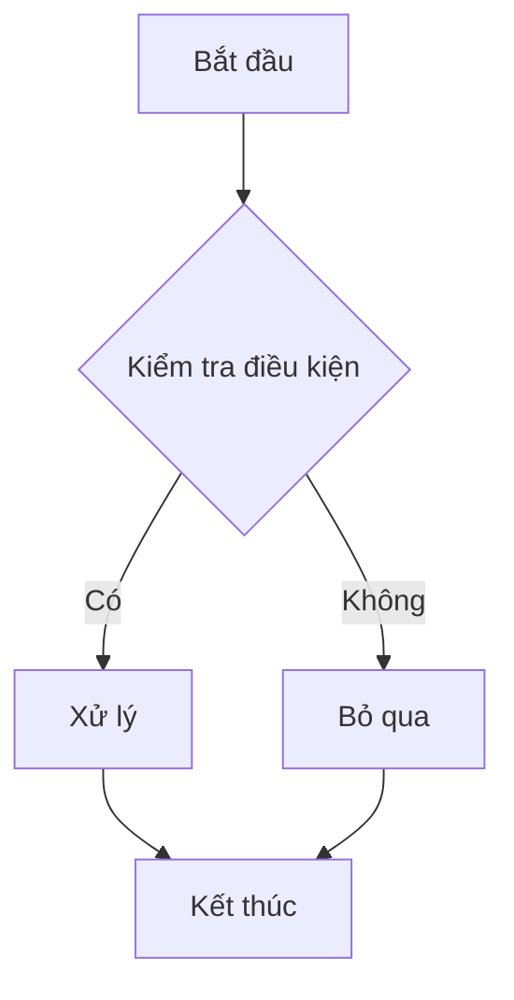
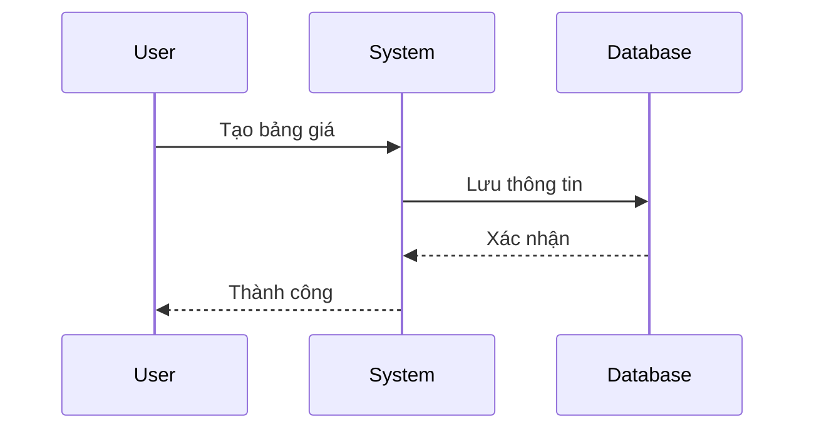
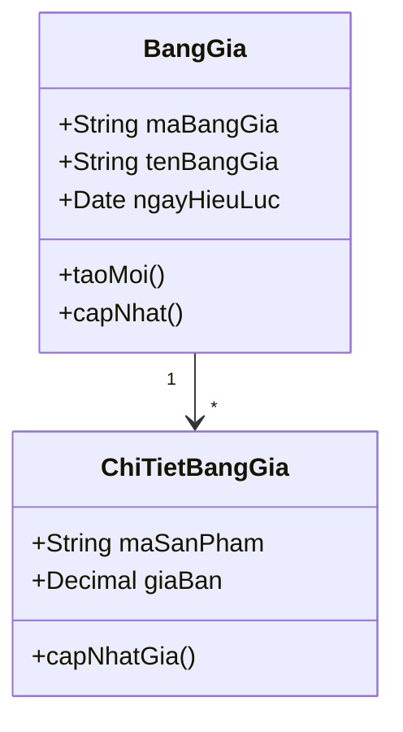
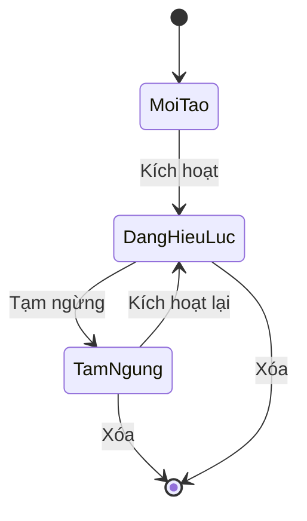

# Demo Mermaid Diagrams

## Flowchart Example

```mermaid
graph TD
    A[Bắt đầu] --> B{Kiểm tra điều kiện}
    B -->|Có| C[Xử lý]
    B -->|Không| D[Bỏ qua]
    C --> E[Kết thúc]
    D --> E
```

## Sequence Diagram Example

```mermaid
sequenceDiagram
    participant User
    participant System
    participant Database
    
    User->>System: Tạo bảng giá
    System->>Database: Lưu thông tin
    Database-->>System: Xác nhận
    System-->>User: Thành công
```

## Class Diagram Example

```mermaid
classDiagram
    class BangGia {
        +String maBangGia
        +String tenBangGia
        +Date ngayHieuLuc
        +taoMoi()
        +capNhat()
    }
    
    class ChiTietBangGia {
        +String maSanPham
        +Decimal giaBan
        +capNhatGia()
    }
    
    BangGia "1" --> "*" ChiTietBangGia
```

## State Diagram Example

```mermaid
stateDiagram-v2
    [*] --> MoiTao
    MoiTao --> DangHieuLuc: Kích hoạt
    DangHieuLuc --> TamNgung: Tạm ngừng
    TamNgung --> DangHieuLuc: Kích hoạt lại
    TamNgung --> [*]: Xóa
    DangHieuLuc --> [*]: Xóa
```
