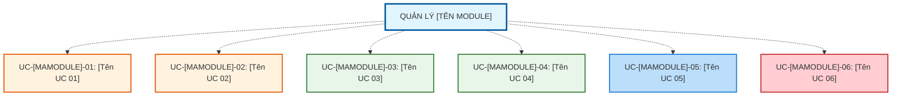

# QUẢN LÝ [TÊN MODULE] ([ENGLISH NAME])

## Tổng quan Module

Chức năng "[Tên Module]" cung cấp khả năng [mô tả ngắn gọn chức năng chính của module].

---

## 1. MÔ TẢ CHỨC NĂNG

### 1.1. Mục tiêu
- **[Mục tiêu 1]**: [Mô tả chi tiết mục tiêu 1]
- **[Mục tiêu 2]**: [Mô tả chi tiết mục tiêu 2]
- **[Mục tiêu 3]**: [Mô tả chi tiết mục tiêu 3]
- **[Mục tiêu 4]**: [Mô tả chi tiết mục tiêu 4]

### 1.2. Phạm vi áp dụng
- **Đối tượng quản lý**: [Mô tả đối tượng được quản lý]
- **Ràng buộc nghiệp vụ**: [Các ràng buộc nghiệp vụ quan trọng]
- **Phạm vi tác động**: [Ảnh hưởng đến các module/chức năng khác]

### 1.3. Định nghĩa
**[Tên thực thể chính]** là [định nghĩa chi tiết về thực thể].

**Cấu trúc [Tên thực thể]** bao gồm:
- [Thuộc tính 1]
- [Thuộc tính 2]
- [Thuộc tính 3]
- [Thuộc tính 4]
- [Thuộc tính 5]
- [Thuộc tính 6]
- [Thuộc tính 7]
- [Thuộc tính 8]

**[Quan hệ/Khái niệm đặc biệt]** (nếu có):
- **[Loại 1]**: [Mô tả loại 1]
- **[Loại 2]**: [Mô tả loại 2]
- [Các mô tả bổ sung]

---

## 2. TÁC NHÂN (ACTORS)

| Tác nhân | Vai trò | Quyền hạn |
|----------|---------|-----------|
| **Admin** | [Vai trò của Admin] | - [Quyền 1] - [Quyền 2] - [Quyền 3] - [Quyền 4] - [Quyền 5] |
| **Nhân viên** | [Vai trò của Nhân viên] | - [Quyền 1] - [Quyền 2] - [Quyền 3] - [Quyền 4] |

### 2.1. Ma trận Phân quyền Actor

| Use Case | Admin | Nhân viên | Ghi chú |
|----------|:-----:|:---------:|---------|
| **UC-[MAMODULE]-01: [Tên UC 01]** | ✅ | ❌ | [Ghi chú nếu có] |
| **UC-[MAMODULE]-02: [Tên UC 02]** | ✅ | ❌ | [Ghi chú nếu có] |
| **UC-[MAMODULE]-03: [Tên UC 03]** | ✅ | ✅* | [Ghi chú nếu có] |
| **UC-[MAMODULE]-04: [Tên UC 04]** | ✅ | ✅ | [Ghi chú nếu có] |
| **UC-[MAMODULE]-05: [Tên UC 05]** | ✅ | ❌ | [Ghi chú nếu có] |
| **UC-[MAMODULE]-06: [Tên UC 06]** | ✅ | ❌ | [Ghi chú nếu có] |

**Chú thích:**
- ✅ = Có quyền thực hiện
- ❌ = Không có quyền thực hiện
- ✅* = Có quyền với giới hạn (xem ghi chú)

---

## 3. DANH SÁCH USE CASE

### 3.1. Tổng quan Use Case

---

## 4. CẤU TRÚC TÀI LIỆU

### Use Cases (Tính năng nghiệp vụ)
- **UC-[MAMODULE]-01: [Tên UC 01]** - [Mô tả ngắn gọn chức năng]
- **UC-[MAMODULE]-02: [Tên UC 02]** - [Mô tả ngắn gọn chức năng]
- **UC-[MAMODULE]-03: [Tên UC 03]** - [Mô tả ngắn gọn chức năng]
- **UC-[MAMODULE]-04: [Tên UC 04]** - [Mô tả ngắn gọn chức năng]
- **UC-[MAMODULE]-05: [Tên UC 05]** - [Mô tả ngắn gọn chức năng]
- **UC-[MAMODULE]-06: [Tên UC 06]** - [Mô tả ngắn gọn chức năng]

---

## 5. BUSINESS RULE (Quy tắc nghiệp vụ)

### ⭐ Cơ chế hỗ trợ nghiệp vụ
- ✅ **[Cơ chế 1]**: [Mô tả cơ chế 1]
- ✅ **[Cơ chế 2]**: [Mô tả cơ chế 2]
- ✅ **[Cơ chế 3]**: [Mô tả cơ chế 3]
- ✅ **[Cơ chế 4]**: [Mô tả cơ chế 4]
- ✅ **[Cơ chế 5]**: [Mô tả cơ chế 5]

### 🔒 Ràng buộc quan trọng
- ❌ [Ràng buộc 1]
- ❌ [Ràng buộc 2]
- ❌ [Ràng buộc 3]
- ❌ [Ràng buộc 4]
- ⚠️ [Cảnh báo 1]
- ⚠️ [Cảnh báo 2]

### 📋 Cảnh báo Hệ thống
Khi [điều kiện kích hoạt cảnh báo]:

> "[Nội dung thông báo cảnh báo chính]
> [Hướng dẫn xử lý]"

Hệ thống sẽ **[hành động của hệ thống khi có cảnh báo]**.
