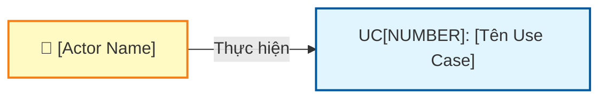
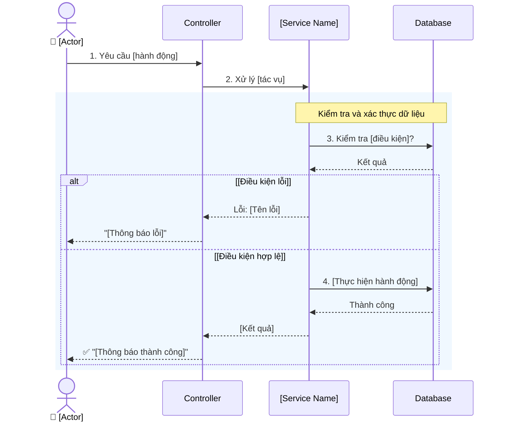

# Use Case UC-[MODULE]-[NUMBER]: [Tên Use Case]

---

| **Use Case ID** | **UC-[MODULE]-[NUMBER]** |
|-----------------|--------------------------|
| **Use Case Name** | [Tên Use Case] |
| **Description** | [Mô tả chi tiết về mục đích và chức năng của use case] |
| **Actor(s)** | [Vai trò người dùng] |
| **Priority** | [Must Have / Should Have / Nice to Have] |
| **Trigger** | [Hành động kích hoạt use case] |

---

## Input

| Tên trường | Loại | Bắt buộc | Mô tả | Ràng buộc |
|------------|------|----------|-------|-----------|
| `fieldName1` | [Loại dữ liệu] | [Có/Không] | [Mô tả] | [Ràng buộc dữ liệu] |
| `fieldName2` | [Loại dữ liệu] | [Có/Không] | [Mô tả] | [Ràng buộc dữ liệu] |

**Quy tắc đầu vào:**
- [Quy tắc 1]
- [Quy tắc 2]

---

## Output

### Trường hợp thành công:

| Tên trường | Loại | Mô tả |
|------------|------|-------|
| `fieldName1` | [Loại dữ liệu] | [Mô tả] |
| `fieldName2` | [Loại dữ liệu] | [Mô tả] |

### Trường hợp lỗi:

| Mã lỗi | Thông báo | Mô tả |
|--------|-----------|-------|
| `ERROR_CODE_1` | "[Thông báo lỗi]" | [Mô tả tình huống lỗi] |
| `ERROR_CODE_2` | "[Thông báo lỗi]" | [Mô tả tình huống lỗi] |

---

## Pre-Condition(s)

- [Điều kiện tiên quyết 1]
- [Điều kiện tiên quyết 2]
- [Điều kiện tiên quyết 3]

---

## Post-Condition(s)

- [Kết quả sau khi thực hiện thành công 1]
- [Kết quả sau khi thực hiện thành công 2]
- [Kết quả sau khi thực hiện thành công 3]

---

## Basic Flow

1. [Actor] yêu cầu [hành động chính]
2. Hệ thống yêu cầu [Actor] cung cấp thông tin:
   - [Thông tin 1]
   - [Thông tin 2]
   - [Thông tin 3]
3. [Actor] cung cấp đầy đủ thông tin
4. Hệ thống kiểm tra tính hợp lệ của dữ liệu:
   - [Kiểm tra 1]
   - [Kiểm tra 2]
   - [Kiểm tra 3]
5. Hệ thống [thực hiện hành động chính]
6. Hệ thống trả về kết quả thành công với thông tin:
   - [Thông tin kết quả 1]
   - [Thông tin kết quả 2]
   - [Thông tin kết quả 3]

Use case kết thúc.

---

## Alternative Flow

### [Tên luồng thay thế]

[Số bước]a. [Mô tả điều kiện kích hoạt luồng thay thế]

[Số bước]a1. [Hành động thay thế]

[Số bước]a2. Use case [tiếp tục/quay lại/kết thúc]

---

## Exception Flow

**Lưu ý:** Các exception flows được mô tả chi tiết trong **Sequence Diagram** (các nhánh `alt` cho error cases)

### [Số bước]a. [Tên exception]

[Số bước]a. Hệ thống phát hiện [điều kiện lỗi]

[Số bước]a1. Hệ thống trả về lỗi: "[Thông báo lỗi chi tiết]"

[Số bước]a2. Use case quay lại bước [số bước]

### [Số bước]b. [Tên exception khác]

[Số bước]b. Hệ thống phát hiện [điều kiện lỗi khác]

[Số bước]b1. Hệ thống trả về lỗi: "[Thông báo lỗi chi tiết]"

[Số bước]b2. Use case quay lại bước [số bước]

---

## Business Rules

### BR-[MODULE]-001: [Tên quy tắc nghiệp vụ]

[Mô tả chi tiết quy tắc nghiệp vụ]

**Ví dụ:**
```
[Ví dụ minh họa quy tắc]
```

### BR-[MODULE]-002: [Tên quy tắc nghiệp vụ khác]

[Mô tả chi tiết quy tắc nghiệp vụ]

- [Chi tiết 1]
- [Chi tiết 2]

---

## Diagrams

### 1. Use Case Diagram - UC[NUMBER]: [Tên Use Case]



### 2. Activity Diagram - Luồng [Tên Use Case]

```mermaid
flowchart TD
    Start([Bắt đầu]) --> Input[Nhập thông tin<br/>[Mô tả input]]
    
    Input --> Validate{Kiểm tra<br/>tính hợp lệ}
    
    Validate -->|[Điều kiện lỗi 1]| Error1[Lỗi: [Tên lỗi 1]]
    Validate -->|[Điều kiện lỗi 2]| Error2[Lỗi: [Tên lỗi 2]]
    Validate -->|Hợp lệ| Save[Thực hiện<br/>[Hành động chính]]
    
    Error1 --> Input
    Error2 --> Input
    
    Save --> Success[Trả về kết quả<br/>[Mô tả kết quả]]
    
    Success --> End([Kết thúc])
    
    style Start fill:#c8e6c9,stroke:#2e7d32,stroke-width:2px
    style End fill:#c8e6c9,stroke:#2e7d32,stroke-width:2px
    style Success fill:#a5d6a7,stroke:#388e3c,stroke-width:2px
    style Error1 fill:#ffcdd2,stroke:#c62828,stroke-width:2px
    style Error2 fill:#ffcdd2,stroke:#c62828,stroke-width:2px
```

### 3. Sequence Diagram - [Tên Use Case]



**Giải thích Sequence Diagram:**

Diagram tập trung vào **business logic** và **luồng xử lý nghiệp vụ**:

**Xử lý nghiệp vụ:**
- [Mô tả các bước xử lý chính]
- [Mô tả kiểm tra nghiệp vụ]

**Nhánh xử lý:**
- [Mô tả các nhánh xử lý khác nhau]

**Xử lý lỗi:**
- [Mô tả cách xử lý lỗi]

---

### 4. Class Diagram

```mermaid
classDiagram
    class [Entity]Controller {
        +[method1]() [Return Type]
        +[method2]() [Return Type]
    }
    
    class [Entity]Service {
        +[method1]() [Return Type]
        +[method2]() [Return Type]
        +[validateMethod]()
    }
    
    class [Entity] {
        +id: ID
        +field1: [Type]
        +field2: [Type]
        +field3: [Type]
        +status: Trạng thái
        +createdAt: Thời gian tạo
        +createdBy: Người tạo
        +[method1]() [Return Type]
    }
    
    class [Entity]Repository {
        +save() [Return Type]
        +findById() [Return Type]
        +findAll() [Return Type]
    }
    
    [Entity]Controller --> [Entity]Service : sử dụng
    [Entity]Service --> [Entity]Repository : sử dụng
    [Entity]Repository --> [Entity] : quản lý
    
    note for [Entity] "[Ghi chú về entity]"
    note for [Entity]Service "[Ghi chú về business logic]"
```

---

## Notes

[Các ghi chú bổ sung, lưu ý đặc biệt hoặc tham chiếu đến tài liệu khác]
